# พื้นฐานการใช้ Maven Command Line 

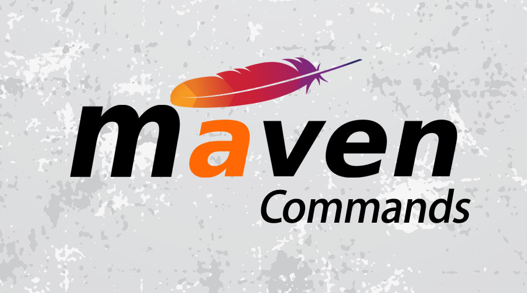

*Image from [https://www.educba.com/maven-commands/](https://www.educba.com/maven-commands/)*

# Maven คืออะไร 

ผมเขียนอธิบายอย่างละเอียดไว้ในบทความนี้แล้ว  

- [รู้จักกับ Apache Maven](/blog/what-is-apache-maven/)

# Prerequisites

- ต้องติดตั้ง Maven เป็นที่เรียบร้อยแล้ว 

# Commands

เมื่อเราติดตั้ง Maven แล้ว ลองทดสอบง่าย ๆ ว่า คำสั่ง maven สามารถใช้งานได้รึเปล่า โดยการพิมพ์คำสั่ง `mvn` ดู ดังนี้ 

```sh
$ mvn
```

ถ้าใช้งานได้ จะมี Error ขึ้นประมาณนี้

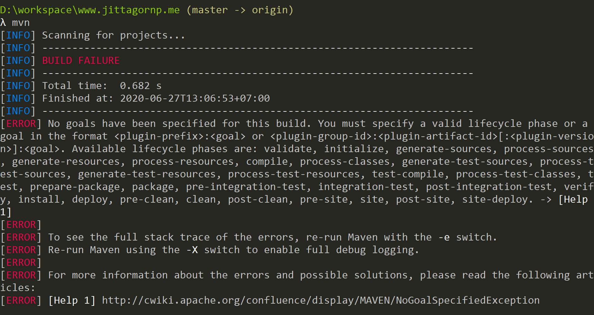

ถ้าไม่ได้ ลองหาทาง set `MAVEN_HOME` ดูครับ 

> ก่อนที่จะใช้งานคำสั่งใด ๆ ต่อไปนี้ ให้เรา `cd` (Change Directory) ไปที่ root ของ Maven Project นั้น ๆ ก่อน 

# 1. mvn -h 

เพื่อดูว่า maven ใช้งานยังไง (Help)

```sh
$ mvn -h 
```


จากภาพด้านบน ทำให้เรารู้ว่า ถ้าจะใช้งานคำสั่ง `mvn` จะต้องพิมพ์คำสั่งใน Format นี้

```sh
$ mvn [options] [<goal(s)>] [<phase(s)>]
```

# 2. mvn -v

`-v` เป็น **Option** ใช้สำหรับตรวจสอบ Version ของ maven ที่เรากำลังใช้งานอยู่

```sh
$ mvn -v
```

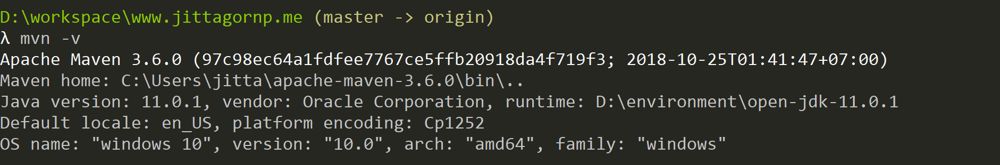

# 3. mvn clean 

เป็น **Goal** ใช้สำหรับลบโฟล์เดอร์ `target` (Compiled Code) ออกจาก Project 


# 4. mvn compiler:compile

ใช้สำหรับการ Compile (**Source Code**) `.java` ในโฟลเดอร์ **/src/main/java** ไปเป็น `.class` ในโฟลเดอร์ **/target/classes/** (**ไม่มีการ** Copy Resources ใน **/src/main/resources/** ไปด้วย)

```sh
$ mvn compiler:compile
```

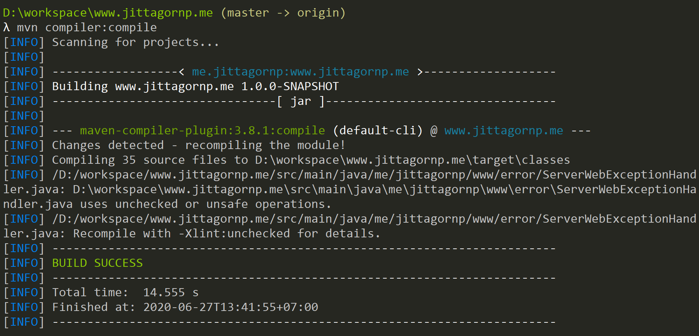

# 5. mvn compile

ใช้สำหรับการ Compile (**Source Code**) `.java` ในโฟลเดอร์ **/src/main/java/** ไปเป็น `.class` ในโฟลเดอร์ **/target/classes/** (**รวมทั้ง** Copy Resources ใน **/src/main/resources/** ไปด้วย)

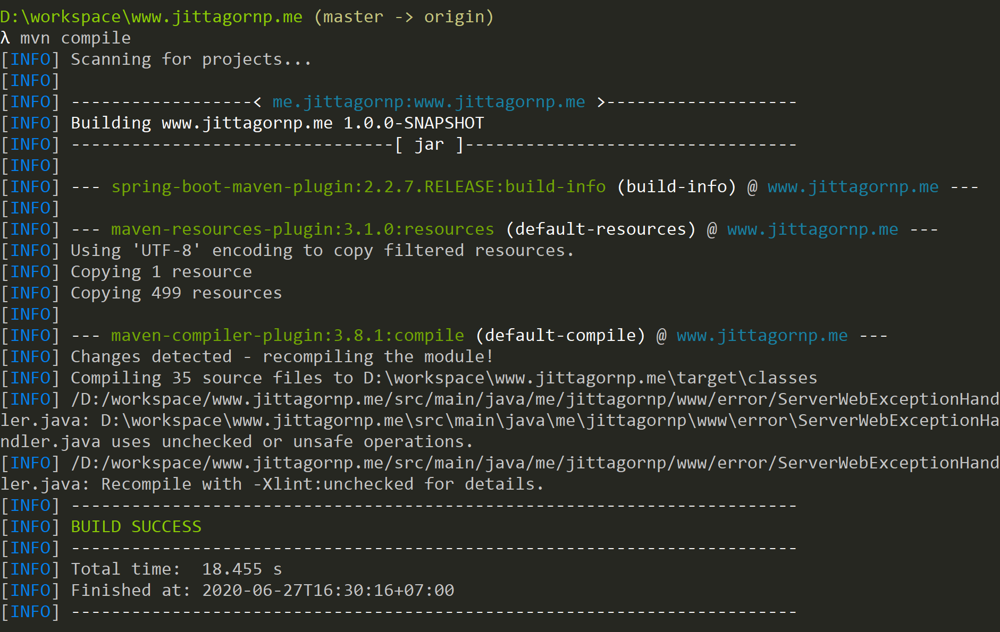

# 6. mvn compiler:testCompile 

ใช้สำหรับการ Compile (**Test Code**) `.java` ในโฟลเดอร์ **/src/test/java/** ไปเป็น `.class` ในโฟลเดอร์ **/target/test-classes/** (**ไม่มีการ** Copy Resources ใน **/src/test/resources/** ไปด้วย)

```sh
$ mvn compiler:testCompile
```

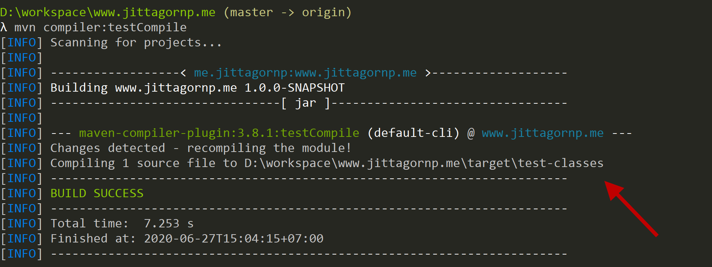

# 7. mvn package 

ใช้สำหรับการ 

- Compile Source Code 
- Copy Resources 
- Run Test 
- Build (Pack Code) ไปเป็น `.jar` หรือ `.war` ตามที่ Config ไว้ใน `pom.xml` 

แล้วนำไปเก็บไปไว้ที่โฟลเดอร์ **/target/**  

```sh
$ mvn package  
```

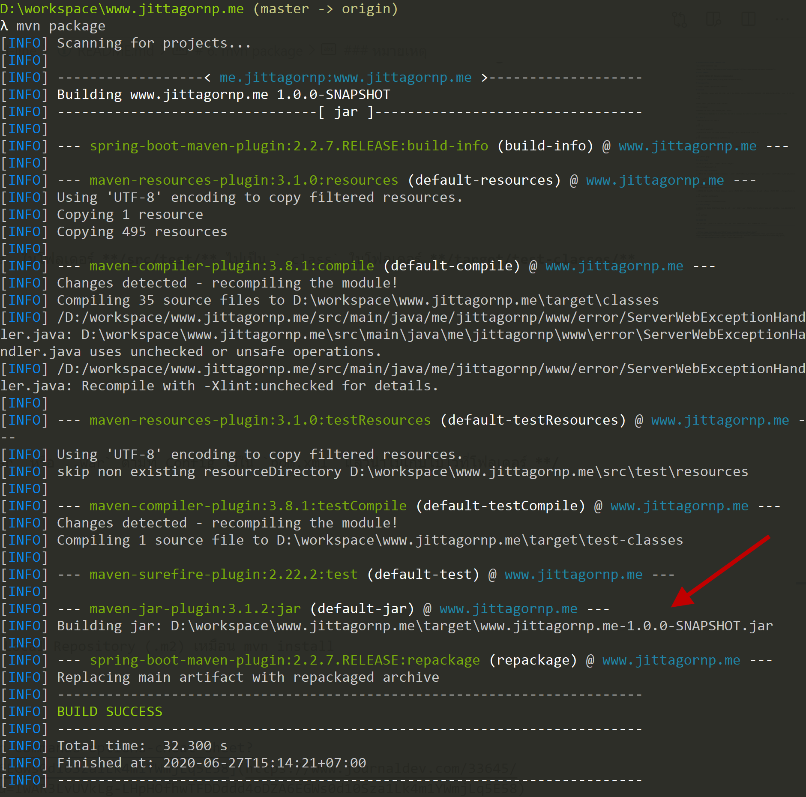

ลอง ls ดู 

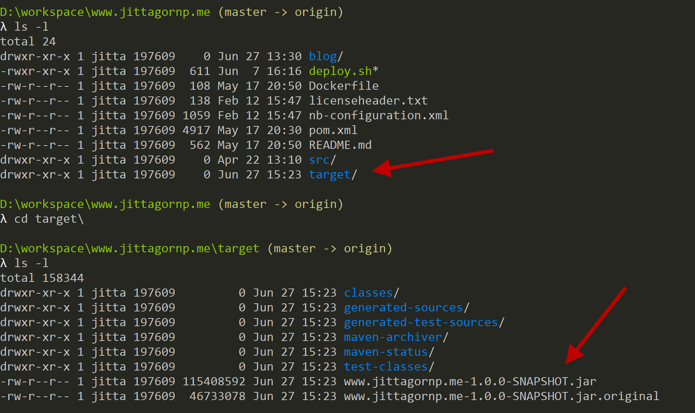

### หมายเหตุ 

`mvn package` จะไม่ทำการ Install Artifact + Jar ลงใน Local Repository (~/.m2) 

# 8. mvn install 

`mvn install` จะทำงานเหมือน `mvn package` แต่จะเพิ่มการทำงาน คือ ทำการ Install Artifact + Jar ลงใน Local Repository (~/.m2) ด้วย 

```sh
$ mvn install 
```

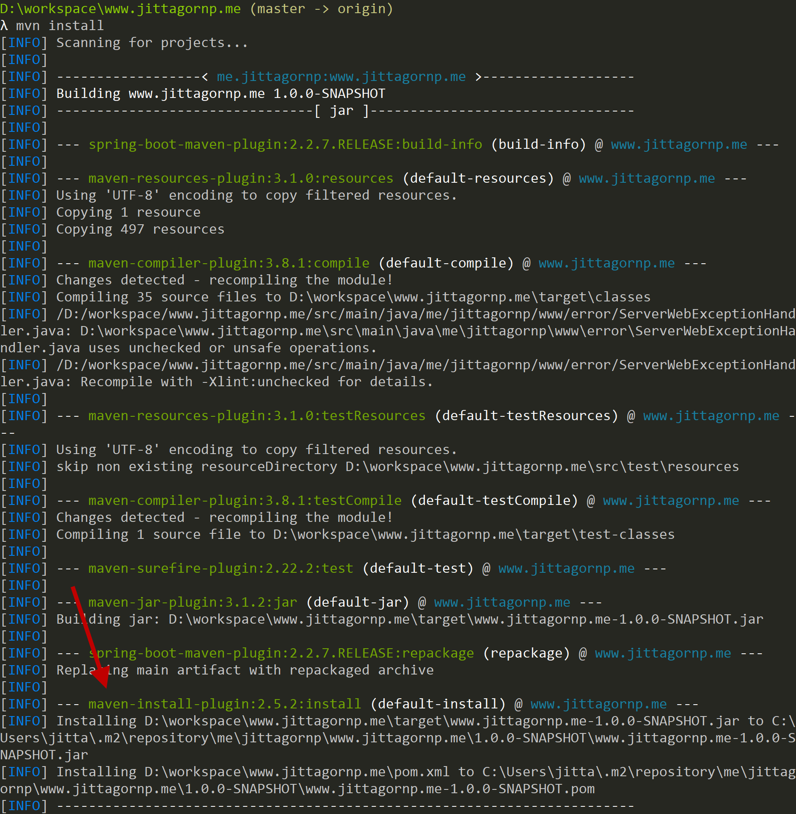

# 9. mvn test

ใช้สำหรับ Run Test (ทำ Unit Test) Code ในโฟลเดอร์ **/src/test/** 

```sh
$ mvn test 
```

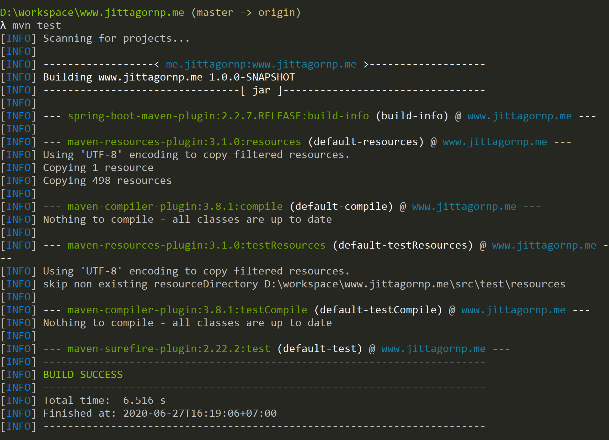

# 10. mvn validate

ใช้สำหรับตรวจสอบ (Validate) โครงสร้างของ Maven Project ว่าถูกต้องหรือไม่ 

```sh
$ mvn validate
```

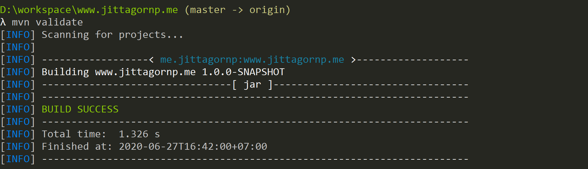

# 11. Option -f 

เป็นการชี้ไปยังไฟล์ `pom.xml` อื่น ๆ ที่ไม่ได้อยู่ใน Current Path เช่น 

```sh
$ mvn clean -f d:/workspace/www.jittagornp.me/pom.xml
```

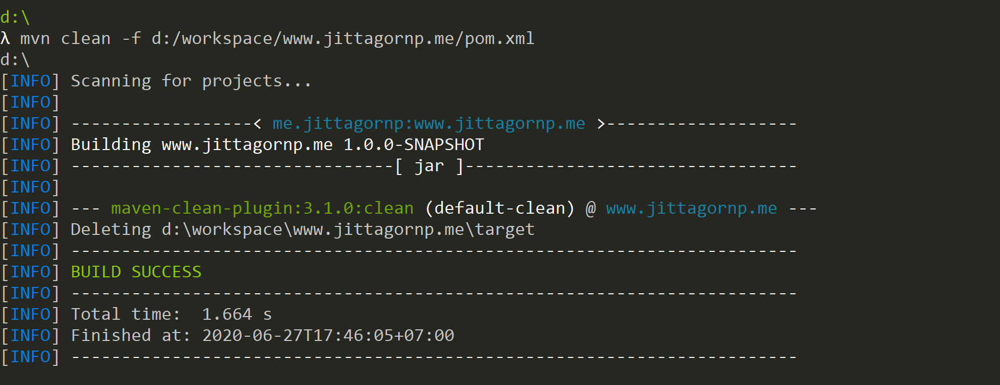

# 12. Option -DskipTests=true

เป็นการบอกให้ maven ไม่ต้องทำ Unit Test ของ Code ใน **/src/test/** เช่น

```sh
$ mvn -DskipTests=true package
```

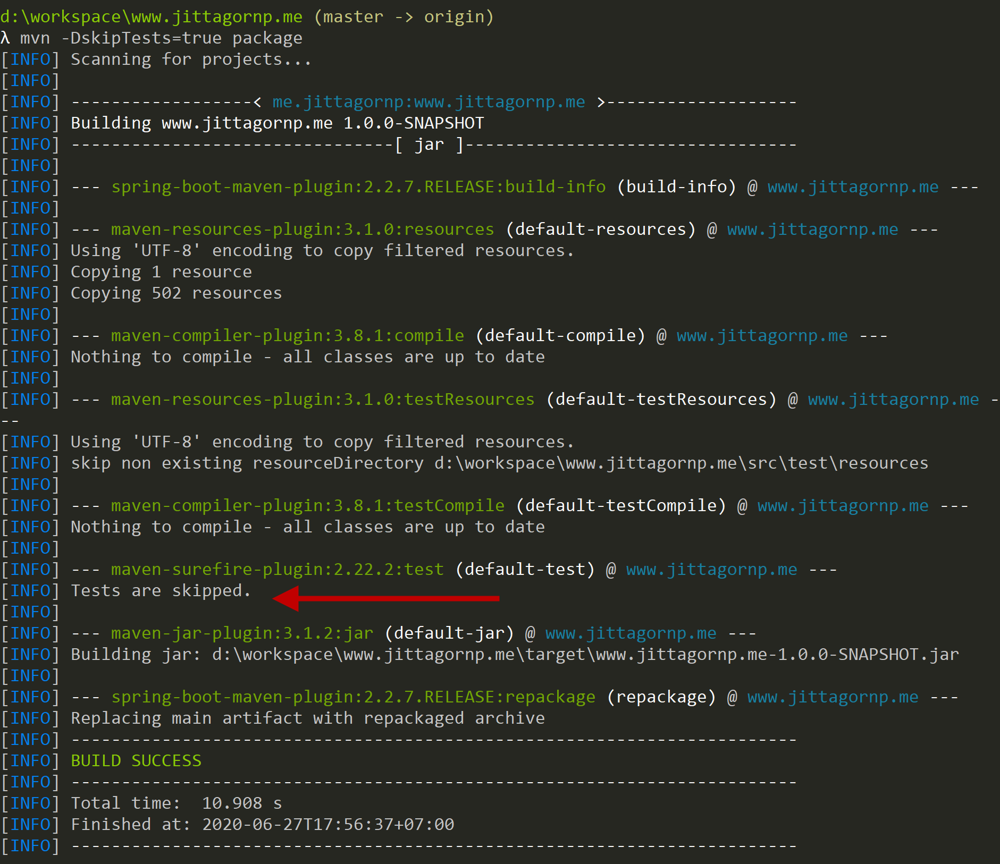

# 13. Run Multiple Goals 

เราสามารถพิมพ์คำสั่ง mvn ให้ใช้งานหลาย goals พร้อมกันได้ดังนี้

ทำ clean + install พร้อมกัน 
```sh
$ mvn clean install
```

ทำ clean + package พร้อมกัน 
```sh
$ mvn clean package
```

เป็นต้น 

ซึ่งจะทำงาน **goal 1** แล้วก็ **goal 2** ตามลำดับ 

# Reference

- [https://www.journaldev.com/33645/maven-commands-options-cheat-sheet?fbclid=IwAR3LvUVkLg-LHpHOfhwTFDDddd4oDZA6EGWs0d10Sza1Lk4m1YWmjLq5E58](https://www.journaldev.com/33645/maven-commands-options-cheat-sheet?fbclid=IwAR3LvUVkLg-LHpHOfhwTFDDddd4oDZA6EGWs0d10Sza1Lk4m1YWmjLq5E58)
- [https://maven.apache.org/](https://maven.apache.org/)