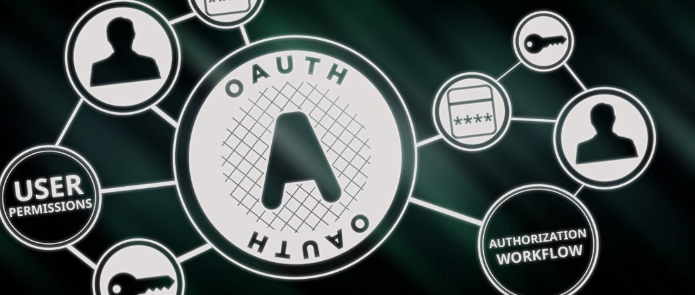
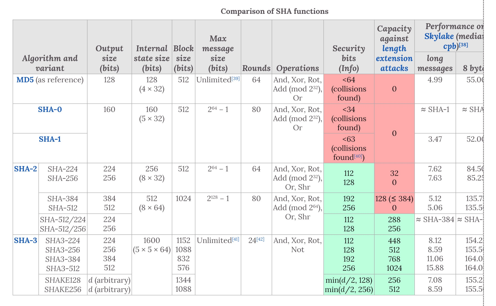
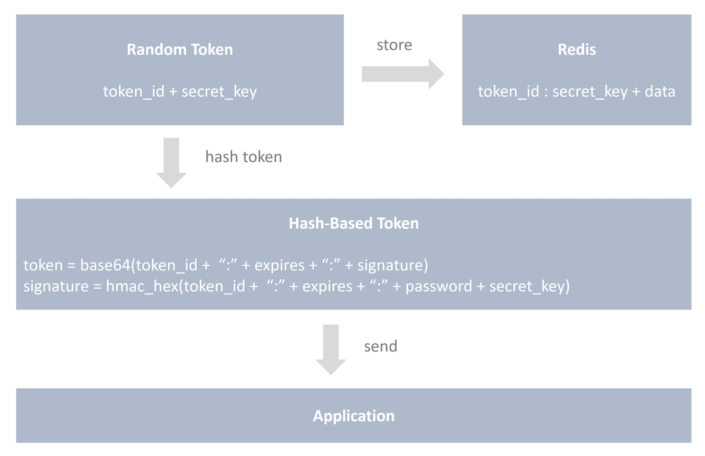
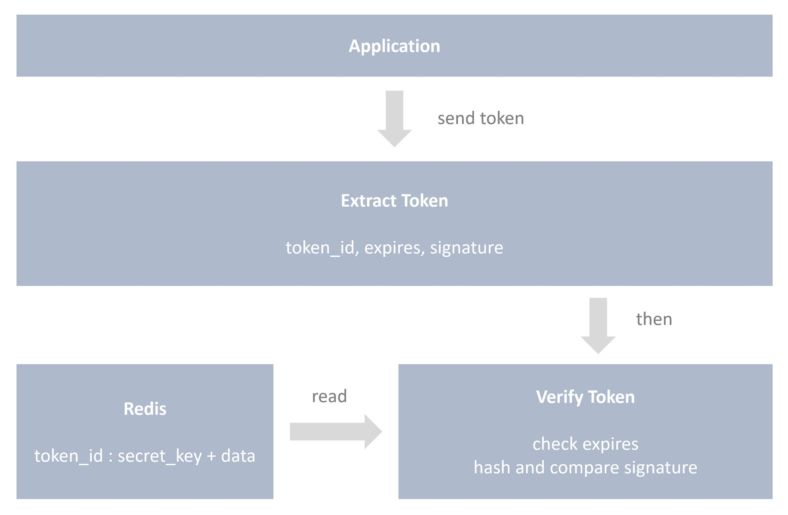

# แนวทางปฏิบัติที่ดี ในการทำ OAuth 2.0 Access Token & Refresh Token เพื่อความปลอดภัย

บทความนี้ผมเขียนขึ้นมาเพราะ เห็นหลายๆ คน implement token กันผิดๆ จริงๆ อาจจะไม่ผิดก็ได้ แต่บางอย่างมันทำให้เอะใจ ว่า

> การ design token แบบนี้ มันทำให้สูญเสียคุณสมบัติบางอย่างทางด้านความปลอดภัย (security)ไปรึเปล่า ?

ลองมาดูกันครับว่า คุณสมบัติของ token ที่ว่ามีอะไรกันบ้าง

### หมายเหตุ

ก่อนจะไปอ่านข้างล่าง สำหรับคนที่ยังไม่รู้ว่า OAuth 2.0 คืออะไร ลองหาข้อมูลอ่านกันก่อนน่ะครับ ซึ่งผมจะไม่ได้เขียนอธิบายไว้ในบทความนี้

- [OAuth 2.0 คืออะไร ทำงานยังไง แบบ Step by Step](https://docs.google.com/presentation/d/1GefptamJEHczcnkNo1Gjsv2DFO2ctFjGvc7AYEf35Gg/edit?usp=sharing) 
- [Digital Ocean](https://www.digitalocean.com/community/tutorials/an-introduction-to-oauth-2)
- [OAuth.net](https://oauth.net/2/)
- ต้นฉบับอยู่ที่ [RFC6749 โดย IETF (Internet Engineering Task Force)](https://tools.ietf.org/html/rfc6749)

โอเค งั้นมาเริ่มกันเลย!



# คุณสมบัติของ Token ที่ควรมี (เพื่อความปลอดภัย)

1. Unique ไม่ควรซ้ำกันในแต่ละครั้งที่ Generate
2. ป้องกันการแก้ไขได้
3. ควรมีอายุสั้นๆ
4. ยากต่อการสุ่มเดา
5. ใช้ได้ครั้งเดียว
6. ต้องสามารถเพิกถอน (Revoke) จาก Back-end ได้
7. ไม่ควรมีข้อมูลสำคัญที่สามารถ Decrypt หรือ Decode ออกมาจาก Token ได้
8. ควรใช้ Algorithm ที่ Encrypt หรือ Hash ในทิศทางเดียว (One-Way Hashing) ไม่สามารถ Decrypt กลับมาได้
9. เมื่อ Token ถูกขโมย ต้องมีวิธีที่สามารถสั่งเพิกถอน (Revoke) Token นั้นทิ้งได้
10. ต้องจำกัดสิทธิ์การใช้งานได้
11. เร็ว (อันนี้ไม่เกี่ยวกับความปลอดภัยเท่าไหร่ แต่เป็นเรื่องของความคุ้มค่า)

# 1. Unique ไม่ควรซ้ำกันในแต่ละครั้งที่ Generate

เพราะถ้า token ซ้ำกัน อาจทำให้ user 2 คน ได้สิทธิ์ของอีกคนนึงไป (ถ้า token เหมือนกันแสดงว่าจะทำให้ได้สิทธิ์เดียวกันด้วยรึเปล่า ?)

> token ที่ดีต้องห้ามได้ค่าที่ซ้ำกัน

# 2. ป้องกันการแก้ไขได้

สมมติว่า token นั้นมีวันหมดอายุแนบมากับ token ด้วย แต่ token ดันเปิดช่องโหว่ให้สามารถแก้ไขได้ จะเกิดอะไรขึ้น?
  
แล้วถ้า token นี้ถูกขโมยไปล่ะ แสดงว่าคนที่ขโมย token ไปก็สามารถใช้ token นี้ได้ตลอดชีพ?
  
ยิ่งถ้าดันเก็บ user id หรือสิทธิ์ (authority) ไว้ใน token แล้วสามารถแก้ได้ นั่นหมายความว่า เราสามารถเข้าถึงระบบด้วยสิทธิ์ หรือบัญชีผู้ใช้ของใครก็ได้    
  
> token ที่ดี ต้องห้ามแก้ไขได้ (ต่อให้แก้ไขได้ ก็ต้องไม่ valid)  

### ข้อเสนอแนะ

อาจจะ encrypt หรือ hash ค่าแล้วเอามา compare กันก็ได้
  
อ้อ! ตรงนี้สำคัญครับ `การ compare token แนะนำให้ป้องกัน Timing Attacks ด้วย` คือให้ใช้วิธีการ compare string ที่มัน secure กว่าการ == หรือ .equals ลองอ่านบทความนี้ดู

- [https://thisdata.com/blog/timing-attacks-against-string-comparison/](https://thisdata.com/blog/timing-attacks-against-string-comparison/)    
- [https://codahale.com/a-lesson-in-timing-attacks/](https://codahale.com/a-lesson-in-timing-attacks/)

# 3. ควรมีอายุสั้นๆ

เมื่อป้องกันการแก้ไขแล้ว แต่ token นั้นดันมีอายุนานมากๆ เช่น 1 เดือน 3 เดือน 6 เดือน หรือ 1 ปี จะเกิดอะไรขึ้นถ้า token นั้นถูกขโมยไป?
  
คนที่ได้ token ไปก็จะสามารถใช้งาน token ด้วยสิทธิ์ของเราไปได้ตลอด จนกว่า token นั้นจะหมดอายุ  

### ข้อเสนอแนะ

- access token อาจมีอายุ 15 นาที 30 นาที หรือ 1 ชม. ไม่เกินนี้ (ขึ้นอยู่กับระบบนั้นว่าเคร่งครัดแค่ไหน)
- refresh token อาจมีอายุเป็น 2 สัปดาห์ หรือน้อยกว่า

# 4. ยากต่อการสุ่มเดา

อย่าใช้วิธี generate token ที่ง่ายเกินไป จนทำให้สามารถคาดเดาค่า token ได้ ให้คิดว่ามีโอกาสเป็นไปได้เสมอที่อาจจะมีคนฟลุกเดา token ในระบบเราได้
  
เช่น ถ้าใช้ uuid เป็น token แน่นอนว่า uuid มันยากมากที่จะสุ่มเดาถูก แต่ถ้าระบบเรามีคนใช้งานเยอะเป็นหมื่น เป็นแสน เป็นล้าน หรือหลายล้านคน มันก็มีโอกาส ต่อให้เป็น 0.000001 % มันก็คือโอกาสที่จะสามารถเดาได้

อ้างอิง uuid ขนาด 128 bit length
  
- [https://www.wikiwand.com/en/Universally_unique_identifier](https://www.wikiwand.com/en/Universally_unique_identifier)

### ข้อเสนอแนะ

จะใช้ uuid ก็ได้ แต่ถ้าสุ่มได้ค่าเดิมให้สุ่มใหม่ และควรมีการทำ hashing เข้าไปด้วย เพื่อป้องกันการแก้ไข และการ hash ให้เพิ่ม `private key และ secret key` เข้าไปด้วย โดย

- private key จะเหมือนกันทั้งระบบ
- แต่ secret key จะใช้สำหรับแต่ละ token

เพื่อให้ค่า hash ที่ออกมาไม่ได้ค่าเดิมเหมือนกันทุกครั้ง ทำให้ยากต่อการสุ่มเดา และกรณีที่ token ถูกขโมย ถ้าเราสั่งเปลี่ยน private key ก็จะทำให้ token ทั้งหมด invalid ตามไปด้วย
  
`ในกรณีที่ฟลุ๊กสุ่มได้ค่าเดียวกันจริงๆ (ถ้าระบบไม่ได้กันไว้) secret key นี้แหล่ะที่จะป้องกันได้ครับ` ผมอธิบายไว้ข้างล่างแล้ว

# 5. ใช้ได้ครั้งเดียว

เพราะถ้ามีการเปลี่ยน (revoke) token แล้วยังสามารถใช้งาน token เก่าได้ จะเกิดอะไรขึ้น ถ้า token เก่าถูกขโมยไป นั่นหมายความว่าคนที่ได้ token นั้นไป ก็จะมีสิทธิ์เทียบเท่ากับเราซึ่งเป็นเจ้าของ token จริงๆ

### ข้อเสนอแนะ

token ควรเป็น stateful ครับ คือ แนะนำให้เก็บลง database (ในทางปฏิบัติอาจจะเก็บลง redis (key/value data store) หรืออะไรที่มัน read/write ได้เร็วๆ) ต่อให้เราตั้งวันหมดอายุให้ token แต่ถ้า token นั้นมันยัง valid อยู่ มันก็จะใช้งานได้ตลอดไปจนกว่ามันจะหมดอายุ
  
case นี้ access token จะไม่ค่อยเห็นภาพสักเท่าไหร่ เพราะอายุมันสั้น ลองนึกถึงว่า ถ้า refresh token ถูกขโมยไปล่ะ จะเกิดอะไรขึ้น?  
  
เพราะฉะนั้น แนวทางปฏิบัติที่ดี `เมื่อเลิกใช้ token นึงแล้วควร revoke token นั้นทิ้งไปเลยครับ` (เพื่อกันคนอื่นเอาไปใช้งานต่อ)  
  
ทั้ง access token และ refresh token แนะนำให้ใช้งานได้ `ครั้งต่อครั้ง` ถ้ามีการขอ token ใหม่ token เดิมต้อง invalidate (revoke)ไปทันที  

# 6. ต้องสามารถเพิกถอน (Revoke) จาก Back-end ได้

กรณีเลวร้าย token ของ users ในระบบเราถูกขโมยไปจำนวนมาก เพราะระบบเรามีช่องโหว่ รูรั่ว บางจุด เราก็ควรจะมีช่องทางให้สามารถเพิกถอน token บางส่วน หรือทั้งหมดของระบบได้
  
และข้อดีอีกอย่างนึงของข้อนี้คือ มันทำ logout ได้ ซึ่งมันเป็นการ logout จริงๆ ไม่ใช่แค่การเพิกถอน token จาก Front-end เท่านั้น  

### เพิ่มเติม

ถ้าเพิกถอน refresh token หรือ regenerate refresh token แล้ว `ให้ revoke คู่ access token มันทิ้งไปด้วย`

# 7. ไม่ควรมีข้อมูลสำคัญที่สามารถ Decrypt หรือ Decode ออกมาจาก Token ได้

อย่าเอาข้อมูลสำคัญ เช่น password หรือข้อมูลสำคัญทางการเงิน มาเก็บไว้ใน token เด็ดขาด เพราะถ้าโดนขโมย token ไปนี่จบเลย

# 8. ควรใช้ Algorithm ที่ Encrypt หรือ Hash ในทิศทางเดียว (One-Way Hashing) ไม่สามารถ Decrypt กลับมาได้

เพราะถ้ามีโอกาส hash หรือ decrypt ออกมาได้ นั่นหมายความว่า เราสามารถที่จะสร้าง token ขึ้นมาใช้งานเองได้ โดยไม่ผ่านระบบ และการที่สร้าง token ขึ้นมาเองได้ แสดงว่าจะใส่สิทธิ์อะไรลงไปก็ได้ 

# 9. เมื่อ Token ถูกขโมย ต้องมีวิธีที่สามารถสั่งเพิกถอน token นั้นทิ้งได้

ข้อนี้จะคล้ายๆ กับข้อ 6 แต่ไม่เหมือนกันซ่ะทีเดียว คุณเคยได้ยินประโยคนี้มั้ย

> ถ้าบัญชี Facebook หรือ Twitter โดน Hack ให้ทำการเปลี่ยน password ซ่ะ

เมื่อทำตามที่แนะนำก็ปรากฏว่าบัญชีนั้นกลับมาเป็นของเราเหมือนเดิม
  
แล้วเค้าทำยังไง?  

### ข้อสังเกต

> password มีความเกี่ยวข้องอะไรกับ token รึเปล่า ทำไมเปลี่ยน password แล้วได้บัญชีกลับคืน ?

แน่นอนครับ คือ `เราจะเอา password เราเข้าไป hash ค่ารวมเป็นส่วนหนึ่งใน token ด้วย` (แต่เป็น password ที่ถูก hash มาแล้วน่ะ ไม่ใช่ raw password)
  
เพราะถ้า เราเปลี่ยน password ก็จะทำให้ค่า hash ที่ได้ใหม่ กับค่า hash เดิมที่เคยอยู่ใน token นั้นไม่ตรงกัน ทำให้ token นั้นๆ invalid ตามไปด้วย token ที่ถูกขโมยไปก็จะถูกเพิกถอนไปเองโดยอัตโนมัติ  
  
ถ้าใครเขียน Java Spring Framework ลอง search คำว่า `Hash-Based Token` ดูครับว่าเค้าทำกันยังไง ซึ่งในตัวอย่างจะเป็นการใช้ใน remember me แต่เราจะเอามาประยุกต์ใช้ในส่วน refresh token ครับ  
  
และ Spring fixed hashing algorithm ไว้เป็น MD5 แต่เราจะ implement ใหม่เป็นเป็น hashing อย่างอื่นแทน ซึ่งอาจใช้ SHA384 หรือ hash algorithm อื่นๆ ที่สูงกว่าก็ได้ (เช่น HMACSHA384) `โดยยกเว้น hashing ดังต่อไปนี้`

- MD5
- SHA1
- SHA256
- SHA512
- RipeMD
- WHIRLPOOL
- SHA3  

อ้างอิง [https://crackstation.net/hashing-security.htm](https://crackstation.net/hashing-security.htm)
  
จะใช้ hashing อะไรให้ดูตามนี้ครับ สีแดงคือไม่ปลอดภัย



# 10. ต้องจำกัดสิทธิ์การใช้งานได้

token ที่ดีควรจำกัดสิทธิ์การเข้าถึงได้ คือเมื่อเอา token ดังกล่าวไปใช้ ระบบต้องรู้ว่า token นั้นมีสิทธิ์แค่ไหนและทำได้แค่ไหน

### ข้อเสนอแนะ 

ตามความคิดเห็นส่วนตัว ไม่ควรเอาสิทธิ์ (role หรือ authority) เก็บไว้ใน token ครับ เพราะจะทำให้แก้ไขสิทธิ์แบบ realtime ไม่ได้ ควรจะเอาสิทธิ์ไว้ใน database หรือ cache ไว้ใน redis แล้วไปอ่านค่ามาจาก API แทน

แต่ถ้าเป็นระบบที่ไม่ได้เคร่ง หรือซีเรียสอะไรมาก จะเก็บไว้ใน token ก็ได้ แต่ผมไม่แนะนำครับ จากเหตุผลด้านบน (เวลาใช้งานไป จะเจอปัญหาคือแก้สิทธิ์ user แบบ real time ไม่ได้)

# 11. เร็ว

ถ้าเรา design ระบบที่เป็น Stateless และใช้ Token-Based Authentication แทน Session สิ่งหนึ่งที่ต้องกังวล คือ คอขวดส่วนนึงมันจะมาอยู่ที่ระบบ authentication ของเรา เพราะฉะนั้นก่อนจะติดสันใจใช้ encryption หรือ hashing ตััวใดในการเอาเข้ามาช่วยในการ sign token แล้ว ให้คิดถึงความเหมาะสมด้วยครับ ว่ามันเหมาะมั้ย จะทำให้ระบบมันช้าไปรึเปล่า
  
encryption บางอย่างมันปลอดภัยจริงๆ แต่มันทำให้ระบบช้ามากๆ มันคุ้มมั้ยที่เราจะเอามาใช้ กับถ้าเราเลือก encryption ขนาดกลางๆ แต่ใช้วิธีเปลี่ยน key หรือมีอย่างอื่นเสริมเข้ามาเพื่อทำให้มัน secure ขึ้น มันจะดีกว่ามั้ย อันนี้ต้องช่างน้ำหนักกันเอาเองน่ะครับ  

### เพิ่มเติมทาง Technical

การ implement OAuth 2.0 คุณเคยรู้มั้ยว่าตอนที่ Grant authorize (กรณี response_type=code) มันมี parameter ชื่อ `state` ด้วย
  
parameter ตัวนี้ใช้สำหรับป้องกัน CSRF (Cross Site Request Forgery) ดังนั้นเพื่อความปลอดภัยมากยิ่งขึ้น ให้กำหนดค่าให้มันด้วยเสมอ ลองอ่านจาก spec มันดูครับ

- [https://tools.ietf.org/html/rfc6749#section-4.1.1](https://tools.ietf.org/html/rfc6749#section-4.1.1)

# ความคิดเห็นส่วนตัว

### JWT เหมาะกับการเอามาทำ access token & refresh token มั้ย ?

น่าจะเป็นคำถามที่หลายๆ คนอยากรู้ 
  
สำหรับผมมันเหมาะกับการเอามาใช้เพื่อป้องกันการแก้ไขข้อมูลครับ เพราะมันเป็น digital signature ดีๆ นี่เอง  
  
แต่ผมเห็นหลายๆ คนเอา jwt มาใช้ แค่ sign/verify token ธรรมดาๆ แล้วก็ยอมรับว่า token มัน valid แต่ไม่ได้มีการ check ว่า token นั้นถูก revoke ทิ้งไปแล้วหรือยัง ซึ่งการทำแบบนี้ ทำให้เป็นผลเสียมากกว่าผลดีครับ คือใช้ jwt แล้วก็ควรมีการ sync token กับ database หรือ data store หลังบ้านด้วย เพื่อ check ว่ามันถูก revoke ไปแล้วรึเปล่า

เพราะด้วย คุณสมบัติของ jwt เอง มันจะยัง valid เสมอจนกว่าจะ expires ไป ทำให้หลายๆ คนคิดว่าแค่นี้มันก็โอเคแล้ว    

> ถ้าแค่ sign/verify jwt token ก็ยังไม่พอที่จะเอามาใช้งานครับ เพราะทำให้ขาดคุณสมบัติข้อ 5. (ใช้ได้ครั้งเดียว) และข้อ 6. (ต้องสามารถเพิกถอน (Revoke) จาก Back-end ได้)

ลองอ่านเหตุผลนี้ดูครับ

### Stop using JWT for sessions

Part 1
- [http://cryto.net/~joepie91/blog/2016/06/13/stop-using-jwt-for-sessions/](http://cryto.net/~joepie91/blog/2016/06/13/stop-using-jwt-for-sessions/)

Part 2
- [http://cryto.net/~joepie91/blog/2016/06/19/stop-using-jwt-for-sessions-part-2-why-your-solution-doesnt-work/](http://cryto.net/~joepie91/blog/2016/06/19/stop-using-jwt-for-sessions-part-2-why-your-solution-doesnt-work/)

ถ้าจะใช้ jwt ด้วยคุณสมบัติแค่ sign/verify token ธรรมดาๆ โดย ไม่ sync ลง database มันควรเป็นการใช้งาน token ที่ระยะเวลาสั้นๆ คือใช้แล้วทิ้ง อันนี้จะเหมาะกว่าครับ เช่นเอามาใช้กับ authorization_code ตอน grant authorize (เพราะใช้ในระยะเวลาสั้นๆ และใช้แล้วทิ้งเลย)

### แล้วถ้าเอา jwt มาใช้ และทำครบตามด้านบนทั้งหมดล่ะ

ถ้าทำตามด้านบนทั้งหมดที่ผมเขียนไว้ โดยใช้ jwt กับคุณสมบัติข้อ 2. (ป้องกันการแก้ไขได้) ก็ถือว่าดีครับ เพราะทำให้มัน ปลอดภัยจริงๆ
  
แต่ผมก็ยังไม่ได้ใช้ jwt เป็น access token & refresh token เนื่องจากมันต้องเขียน logic อะไรเพิ่มเติมไปอีกมาก ถ้าต้องการคุณสมบัติทุกข้อตามที่กล่าวมาครับ เลยไม่ได้ใช้ (เคยลองใช้แล้วแต่เปลี่ยนใจ)  

> ถ้าจะใช้ JWT มันต้องเหมาะสมกับงานนั้นๆ จริงๆ
ผมถึงจะใช้

ลองอ่านบทความนี้ดูครับ ว่าผมใช้ jwt ในส่วนไหน

- [การออกแบบ ระบบ Authentication ของ Micro Service](/blog/design-authentication-for-micro-service/?series=oauth)

### ถ้าไม่ได้ใช้ jwt แล้วใช้อะไร?

ผมใช้การ generate token ที่ชื่อว่า Hash-Based Token ครับ หน้าตาของ token จะเป็นแบบนี้

```plaintext
token = base64(token_id + ":" + expires + ":" + signature)
```

จริงๆ มันก็คล้ายๆ กับ jwt แหล่ะ เพียงแต่ว่าตรง signature เรา custom ค่า hash เอง ซึ่ง jwt จะทำไม่ได้ เพราะ jwt จะใช้เฉพาะ data ที่อยู่ใน header + payload เท่านั้นมาหาค่า signature
  
แต่ signature เราจะเท่ากับ  

```plaintext
signature = hash_hex(token_id + ":" + expires + ":" + encrypted_password + ":" + private_key)
```  

### หมายเหตุ

ตรง private_key ไม่ต้องมีก็ได้ ถ้า hashing ที่เราใช้เป็น HMAC เพราะ private_key จะอยู่ที่ [HMAC](https://www.wikiwand.com/en/HMAC) อยู่แล้ว
  
ตรง encrypted_password ทำให้ผู้ใช้ สามารถ revoke token ได้เอง โดยการเปลี่ยน password ตามข้อ 9. (เมื่อ Token ถูกขโมย ต้องมีวิธีที่สามารถสั่งเพิกถอน token นั้นทิ้งได้)  
  
ลองดู Code จากตัวอย่างนี้ (ภาษา Java)  

- [https://github.com/pamarin-tech/commons/blob/master/commons/src/main/java/com/pamarin/commons/security/DefaultHashBasedToken.java](https://github.com/pamarin-tech/commons/blob/master/commons/src/main/java/com/pamarin/commons/security/DefaultHashBasedToken.java)

### หมายเหตุ

> เพื่อความปลอดภัยยิ่งขึ้น ทุกครั้งที่ generate token ให้ random Secret Key (One-Time Secret) ต่อ token นั้นขึ้นมา แล้วเอาไป hash รวมกับข้อมูลที่จะใช้ generate token ด้วย

คือมันทำให้ปลอดภัยยิ่งขึ้น และ สมมติถ้าเกิดว่าระบบ random token (ด้วย uuid) ขึ้นมาเป็นค่าเดียวกัน `จะทำให้มี token แค่อันเดียวเท่านั้นที่ valid เพราะค่า Secret Key นี้` (hash ใครถูกต้อง คนนั้นก็ถือว่า valid ไป)

```plaintext
Random Token
token_id=d93d9672-e3a4-11e7-80c1-9a214cf093ae
secret_key=D6aQskgf
```

- [https://github.com/pamarin-tech/commons/blob/master/oauth2/src/main/java/com/pamarin/oauth2/AccessTokenGeneratorImpl.java#L77](https://github.com/pamarin-tech/commons/blob/master/oauth2/src/main/java/com/pamarin/oauth2/AccessTokenGeneratorImpl.java#L77)
  
หน้าตาของ token
  
```plaintext
ZTY3MDU4OWYtY2E2Zi00M2U0LTgwMmEtZWZlODliNjg1YzQ2OjE1MTI2NDEwMjg2NDM6M2ExMGQwN2JjMGQ2OTE1N2Y5ZmZjMGNkYTc4OWMzNzNhZjIwYjlkZGNkNWZlOTU1MWVhYzMwMDhhZDA0MDI2MTZhYjNmNmExYzI1M2VhNDRiNmUzYjgyY2ZjMmM1ZjYy
```  

เมื่อ decode ด้วย base64 จะได้เป็น

```plaintext
e670589f-ca6f-43e4-802a-efe89b685c46:1512641028643:3a10d07bc0d69157f9ffc0cda789c373af20b9ddcd5fe9551eac3008ad0402616ab3f6a1c253ea44b6e3b82cfc2c5f62
```

### ตัวอย่างการใช้ Hash-Based Token

Generate Token



Verify Token



# สรุป

การออกแบบ token จริงๆ แล้วมันไม่ได้มีอะไรตายตัวครับ ว่าจะต้องเป็น 1 2 3 แบบนี้ๆ มันขึ้นอยู่กับความเหมาะสมของการใช้งานในแต่ละประเภทมากกว่า ว่าเราจะใช้ token นี้ทำอะไร ใน scenario ไหน การออกแบบ token ก็ควรที่จะเหมาะสมกับ scenario นั้นๆ
  
เหมือนอย่างที่เห็นหลายๆ คนใช้ jwt ในการทำ access_token ซึ่งจริงๆ แล้ว jwt ถือเป็นเครื่องมือที่ดี เหมาะกับการนำเอามาใช้ทำอะไรหลายๆ อย่าง แต่เมื่อลองคิดหลายๆ ตลบดูแล้ว ก็เจอข้อจำกัดของมันอยู่หลายจุด ที่จะเอามาใช้เป็น access_token & refresh token (ให้ดีจริงๆ) โดยประสบการณ์ ผมเองก็อยู่กับ jwt มาประมาณ 2 ปีกว่า เกือบ 3 ปีได้ ใช้มันจนชิน จนเห็นว่ามันยังไม่ใช่ (ยังไม่ดีที่สุดใน case นี้) เลยเลือกที่จะเปลี่ยนเครื่องมือไปใช้ตัวอื่นที่มันเหมาะสมกว่าแทนครับ

อันนี้เป็นบทความ jwt ที่ผมเคยเขียนไว้ตั้งแต่งต้นปี 58 จำได้ว่าตอนนั้นการใช้งาน jwt ในไทยยังไม่ได้เป็นที่แพร่หลายเหมือนในตอนนี้    

- [ทำความรู้จักกับ JWT (Json Web Token)](/blog/what-is-jwt/)

> เครื่องมือทุกเครื่องมือจะมีทั้งข้อดีและข้อเสียอยู่ในตัวของมัน ถ้าเราเลือกใช้ให้ถูกจุด ให้เหมาะสมกับงานหรือสถานการณ์ เราก็จะสามารถดึงประสิทธิภาพของมันออกมาได้อย่างเต็มที่

คิดว่าน่าจะมีประโยชน์ และน่าจะเป็นแนวทางที่ดีให้คนที่กำลังหาข้อมูลเกี่ยวกับเรื่องนี้อยู่น่ะครับ
  
ว่างๆ หลังเสร็จงานในแต่ละวัน ผมเอาเวลาทั้งหมดไปศึกษา OAuth2 + Web Security อย่างจริงจัง ถ้าใครสนใจ ก็มา Join กันได้ครับ  
  
ผมเขียน Java Spring boot ไว้ที่  

- [https://github.com/pamarin-tech/commons](https://github.com/pamarin-tech/commons)

# หมายเหตุ

เป็นบทความที่ถูกย้ายมาจาก [https://medium.com/@jittagornp/best-practice-ในการทำ-oauth2-access-token-refresh-token-457ae3bee4b7](https://medium.com/@jittagornp/best-practice-ในการทำ-oauth2-access-token-refresh-token-457ae3bee4b7) ซึ่งผู้เขียน เขียนไว้เมื่อ Dec 6, 2017
