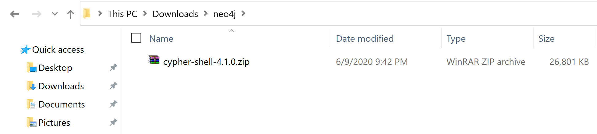
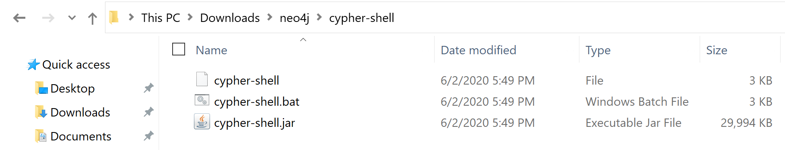
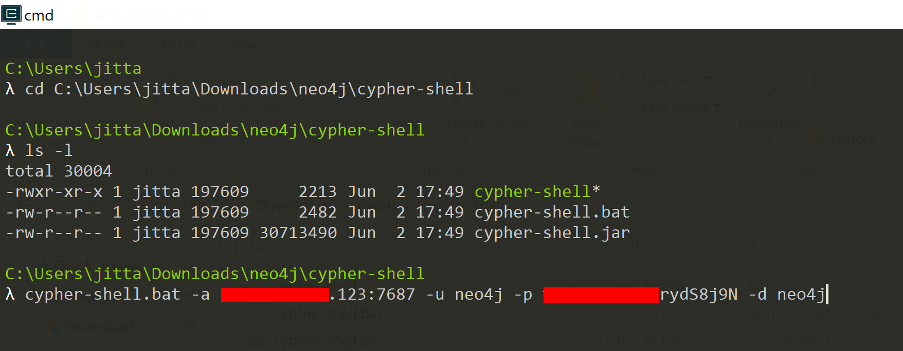
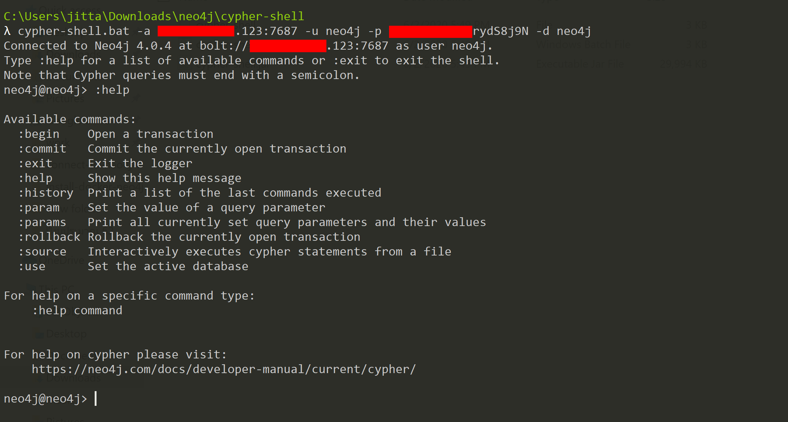
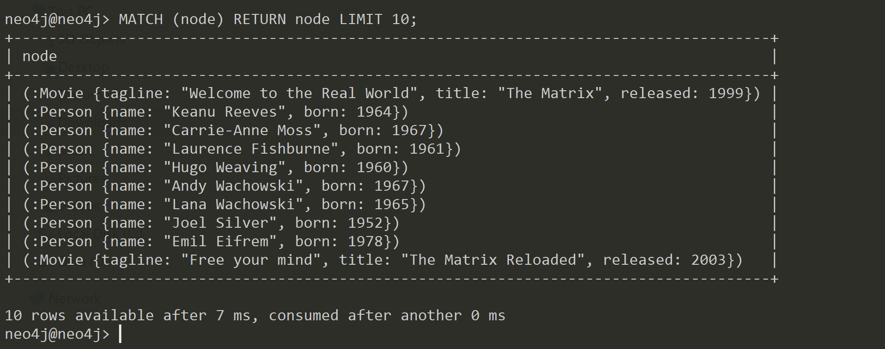
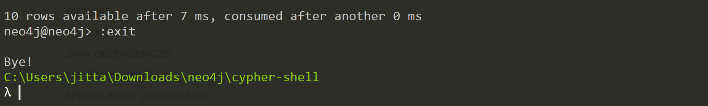

# เชื่อมต่อ Neo4j Graph Database ด้วย Cypher Shell บน Windows 


> Cypher Shell เป็น CLI (Command-line interface) Tool ตัวนึง ใช้สำหรับ Query Data จาก Neo4j Graph Database

# Prerequisites

ถ้าใครยังไม่มี Database สามารถติดตั้งได้ตามบทความนี้ 

- [ติดตั้ง Neo4j Graph Database ด้วย Docker บน Ubuntu 18.04](/blog/install-docker-neo4j-graph-database-on-ubuntu-18.04/)

# 1. ดาวน์โหลด Cypher Shell

สามารถดาวน์โหลดได้ที่ 

- [https://neo4j.com/download-center/#cyphershell](https://neo4j.com/download-center/#cyphershell)



# 2. ทำการ Unzip 



# 3. Connect ไปที่ Neo4j 

ไปที่ Folder ที่ unzip ไว้ จากนั้น Run `cypher-shell.bat` 

```sh
> cypher-shell.bat -a <DATABASE_SERVER_IP>:7687 -u <DATABASE_USERNAME> -p <DATABASE_PASSWORD> -d <DATABASE_NAME>
```



# 4. ลองพิมพ์คำสั่ง :help ดู ว่ามีคำสั่งอะไรใช้ได้บ้าง 

```sh
neo4j@neo4j> :help
```



# 5. ลอง Query ดู 

```plaintext
neo4j@neo4j> MATCH (node) RETURN node LIMIT 10;
```

อย่าลืม Semicolon (;)  จากนั้น กด Enter 



### หมายเหตุ

ถ้าเรา Query ผ่าน Neo4j Browser มันจะออกแบบนี้ (ผลลัพธ์อันเดียวกัน)


# 6. พิมพ์ :exit เพื่อออก 

```sh
neo4j@neo4j> :exit 
```

ไม่ต้องมี Semicolon (;)



# Rererence 

- [https://neo4j.com/docs/operations-manual/current/tools/cypher-shell/](https://neo4j.com/docs/operations-manual/current/tools/cypher-shell/)
