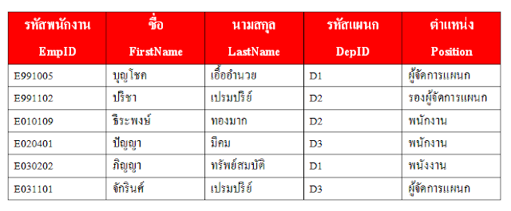
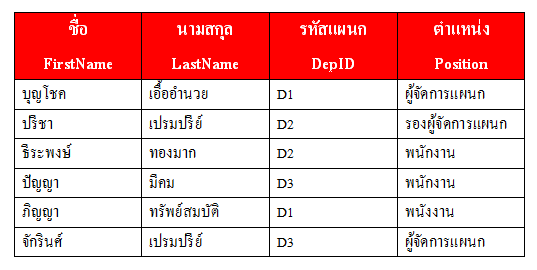
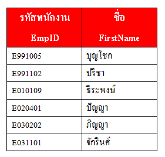
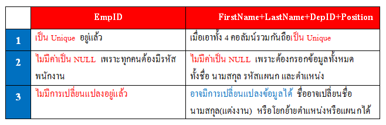
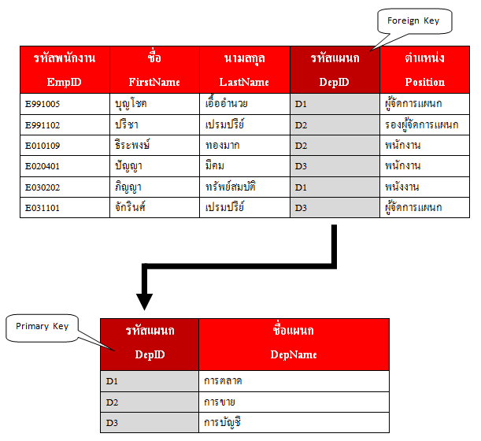

# ความหมายของคีย์ (Keys) ชนิดต่าง ๆ ใน Database

# Keys 

หมายถึง   
- ฟิลด์ (Field) แอตทริบิวต์ (Attribute) หรือ คอลัมน์ (Column) จำนวน 1 คอลัมน์ หรือ อาจเป็น หลาย ๆ คอลัมน์ มาประกอบกันก็ได้
- มีค่า `ไม่ซ้ำกัน` ในแต่ละแถว มีคุณสมบัติที่เป็นเอกลักษณ์ (Unique)
- สามารถใช้คอลัมนั้นในการระบุถึงคอลัมน์อื่น ๆ ในแถว (Row) เรคอร์ด (Record) หรือ ทูเพิล (Tuple) นั้นได้
 
# Super Key

หมายถึง
- คอลัมน์ หรือ กลุ่มของคอลัมน์  ที่สามารถใช้จำแนกความแตกต่างของแต่ละแถวได้
- หากมีคอลัมน์หรือกลุ่มของคอลัมน์ใด  ที่ไม่มีโอกาสมีค่าซ้ำกันเลยในแต่ละแถว (Unique)  ก็จัดได้ว่าคอลัมน์นั้น หรือ กลุ่มของคอลัมน์นั้น  เป็น `Super Key`     

เช่น  
  
Table : Employees

 เมื่อเราพิจารณาคำจำกัดความแล้ว  เราอาจพิจารณาได้ว่ามี Super Key ใน Table Employees ทั้งหมดดังนี้
1. EmpID
2. EmpID + FirstName
3. EmpID + LastName
4. EmpID + DepID
5. EmpID + Position
6. EmpID + FirstName + LastName
7. EmpID + FirstName + DepID
8. EmpID + FirsttName + Position
9. EmpID + LastName + DepID
10. EmpID + LastName + Position
11. EmpID + DepID + Position
12. FirstName + LastName + DepID + Position

# Composite Key 

หมายถึง Key ที่ประกอบกัน  หรือ มีมากกว่า 1 Key เช่น
- EmpID + FirstName
- EmpID + LastName
- EmpID + FirstName + LastName
- FirstName + LastName + DepID + Position

แต่  EmpID  ไม่ใช่  Composite Key  เนื่องจากเป็นเพียงแค่ Key เดียว

# Candidate Key  

หมายถึง  
- Super Key ที่มีคอลัมน์เดียว หรือ  
- Super Key ที่มีหลายคอลัมน์ `แต่` ไม่มีบางส่วนของ Key เป็น Unique Subset

> `Unique Subset` คือ มีค่าไม่ซ้ำกันในแต่ละแถว

จาก Table Employees เราจะได้ Candidate Key ทั้งหมดเป็นดังนี้

1. EmpID    ตรงตามเงื่อนไขแรก  คือ  เป็น Super Key ที่มีคอลัมน์เดียว
2. FirstName + LastName + DepID + Position   ตรงตามเงื่อนไขที่สอง  คือ  ไม่มีบางส่วนเป็น Unique Subset

ส่วน Super Key อื่น ๆ ถือว่าผิดเงื่อนไขที่สอง คือ มี Unique Subset เกิดขึ้น  
  
เช่น  Super Key ในข้อ 2 EmpID + FirstName มี Unique Subset เกิดขึ้น

EmpID + FirstName ถือเป็น Composite Key คือเป็น Key ประกอบ    
  
และหนึ่งใน Key ประกอบมีความเป็น Unique Subset เกิดขึ้น นั่นคือ EmpID เป็น Unique  ทำให้ไม่เป็น Candidate Key

# Primary Key  

หมายถึง Key  ที่ถูกเลือกมาจาก  Candidate Key โดยมีหลักเกณฑ์ดังนี้

- ต้องไม่มีค่าซ้ำกันในแต่ละแถว
- ต้องไม่มีค่าเป็น `NULL` (ค่าว่าง)
- Primary Key  จะถูกเปลี่ยนแปลงค่าไม่ได้
  
พิจารณา Candidate Key ที่เรามีอยู่ 

ฉะนั้นจึงเลือก EmpID เป็น Primary Key

# Alternate Key  

หมายถึง Key ที่ไม่ได้ถูกเลือกให้เป็น Primary Key    
นั่นก็คือ  FirstName + LastName + DepID + Position 

# Foreign Key  

หมายถึง Key ที่อ้างไปยัง Primary Key ของ Table หนึ่ง  
เช่น ใน Table Employees DepID ถือเป็น Foreign Key เพราะ  DepID ได้อ้างไปยัง Primary Key ของอีก Table หนึ่ง 

# หมายเหตุ

เป็นบทความที่ถูกย้ายมาจาก [https://na5cent.blogspot.com/2011/12/keys-database.html](https://na5cent.blogspot.com/2011/12/keys-database.html) ซึ่งผู้เขียน เขียนไว้เมื่อ วันศุกร์ที่ 16 ธันวาคม พ.ศ. 2554
