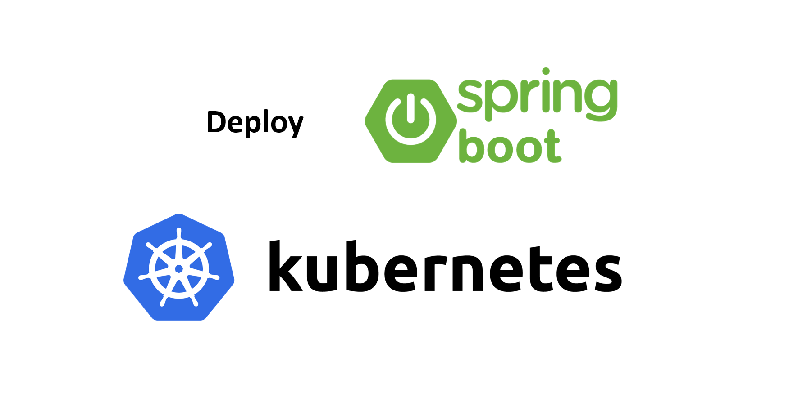

# การ Deploy Java Spring-boot ไปยัง Kubernetes (K8S)



# Prerequisites

ก่อนที่จะทำการ Deploy ได้ ให้เราเตรียม Environment และ Setup ระบบต่าง ๆ ขึ้นมาดังนี้ก่อน         

- มี Docker Registry ที่พร้อมใช้งานแล้ว หรืออาจจะ [ทำการติดตั้ง Docker Registry ขึ้นมาใช้งานเอง](/blog/install-docker-registry/?series=devops)  
- [เขียน Java Spring-boot Application](https://github.com/jittagornp/spring-boot-webflux-example/tree/master/spring-boot-webflux-dockerfile) จากนั้น Build Image แล้ว Push ขึ้นไปเก็บไว้ที่ Docker Registry  
- [ติดตั้ง Kubernetes](/blog/install-kubernetes-on-ubuntu-18.04/?series=k8s)  

### หมายเหตุ

Dockerfile ของ Spring-boot ให้เขียนเป็นดังนี้

```plaintext
# Use official base image of Java Runtim
FROM openjdk:11-jdk

# Set volume point to /tmp
VOLUME /tmp

# Make port 8080 available to the world outside container
EXPOSE 8080

# Set application's JAR file
ARG JAR_FILE=target/*.jar

# Add the application's JAR file to the container
ADD ${JAR_FILE} app.jar

# Run the JAR file
ENTRYPOINT java $JAVA_OPTS -jar /app.jar
```


# สมมติ 

- เรามีการสร้าง Application ชื่อว่า `oauth`
- มี Docker Registry Url เป็น `registry.mywebsite.com`

### หมายเหตุ 

จากนี้ไป ทุกอย่างทำบน Master Node ของ Kubernetes 

# 1. สร้าง Secret  

สำหรับเก็บ `username` และ `password` ของ Docker Registry

Format
```sh
$ kubectl create secret docker-registry <DOCKER_REGISTRY_ID> \
--docker-server=<DOCKER_REGISTRY_URL> \
--docker-username=<DOCKER_REGISTRY_USERNAME> \
--docker-password=<DOCKER_REGISTRY_PASSWORD> \
--docker-email=<DOCKER_REGISTRY_EMAIL>
```
Run Command  
```sh
$ kubectl create secret docker-registry my-docker-registry \
--docker-server=http://registry.mywebsite.com \
--docker-username=my_docker_account \
--docker-password=WGTSU5V22cEYW9f \
--docker-email=myemail@gmail.com
```

# 2. สร้าง ConfigMap 

สำหรับเก็บ Configuration ของ Application     

2.1 สร้าง `.env` file  
  
oauth.env  
```properties
JAVA_OPTS=-Djava.security.egd=file:/dev/./urandom -Dserver.port=8080 -Dspring.redis.url=redis://.....
```

2.2 Run Command สำหรับสร้าง ConfigMap จาก `.env` file 

```sh
$ kubectl create configmap oauth-config --from-env-file=/deploy/oauth.env
```

2.3 ทดสอบแสดง ConfigMap ในรูปแบบ `.yaml`  
```sh
$ kubectl get configmap oauth-config -o yaml
```

### หมายเหตุ

`.yaml` หรือ `.yml` คือ File ชนิดเดียวกัน

# 3. เขียน File `.yml` เพื่อเตรียม Deploy 

3.1 เขียน Deployment file 

deployment.yml
```yaml
apiVersion: apps/v1
kind: Deployment
metadata:
  labels:
    app.kubernetes.io/name: oauth
  name: oauth
spec:
  replicas: 2
  selector:
    matchLabels:
      app.kubernetes.io/name: oauth
  template:
    metadata:
      labels:
        app.kubernetes.io/name: oauth
    spec:
      containers:
      - name: oauth
        image: registry.mywebsite.com/oauth:latest 
        imagePullPolicy: Always  
        envFrom:
          - configMapRef:
              name: oauth-config
        ports:
        - containerPort: 8080
        volumeMounts:
        - mountPath: /logs
          name: log-volume
      imagePullSecrets:
      - name: my-docker-registry    
      volumes:
      - name: log-volume
        hostPath:
          path: /logs
          type: DirectoryOrCreate 

```

3.2 เขียน Service file

service.yml
```yaml
apiVersion: v1
kind: Service
metadata:
  name: oauth
  labels:
    app.kubernetes.io/name: oauth
spec:
  type: NodePort
  ports:
    - port: 8080
      nodePort: 30001
      name: http
  selector:
    app.kubernetes.io/name: oauth
```

# 4. Deploy

Run Command นี้เพื่อ Deploy 
```sh
$ kubectl apply -f deployment.yml  
$ kubectl apply -f service.yml  
```

# 5. ตรวจสอบสถานะการ Deploy

ตรวจสอบ Pods
```sh
$ kubectl get pods 
```

ตรวจสอบ Service
```sh
$ kubectl get services
```

# 6. ทดสอบเข้าใช้งาน Application 

> http://`<MASTER_NODE_IP>`:30001

Port 30001 มาจากที่เรากำหนดไว้ใน `service.yml`  
