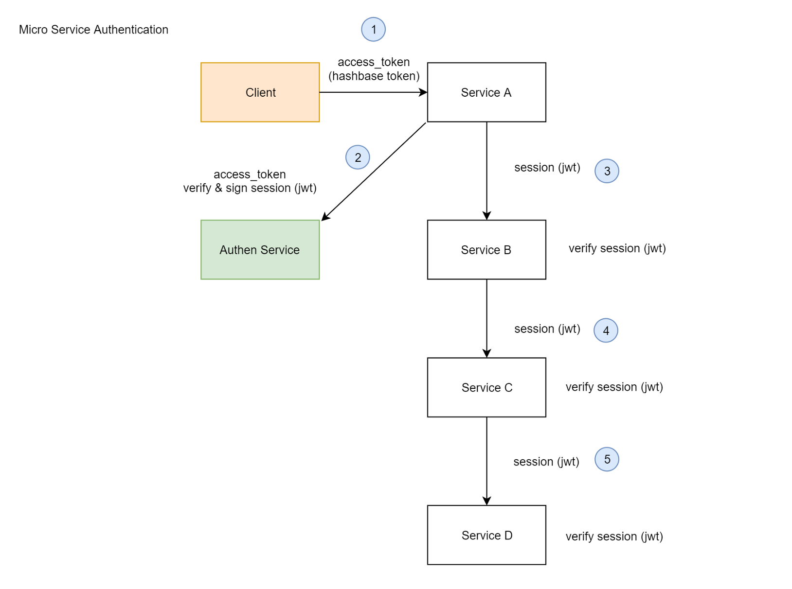
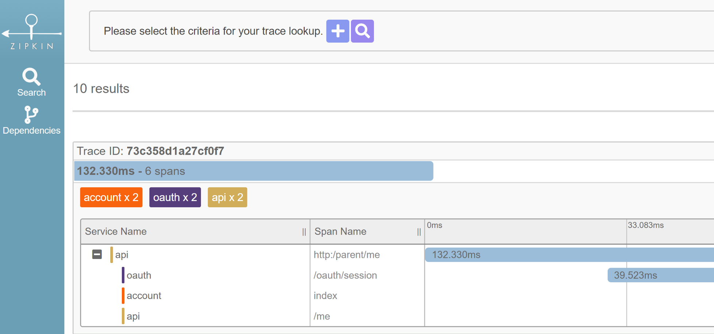

# การออกแบบ ระบบ Authentication ของ Micro Service

ลองเปลี่ยนการ authen ด้วย oauth  
กรณีที่ backend หรือ micro service คุยกันเอง
   
จากแต่เดิมที่แต่ละ service ต้องทำการ authen แบบ stateful  
คือ วิ่งไปเช็คที่ authen server ทุกครั้งที่มีการ call service เข้ามา   
  
มาเป็น authen ด้วย jwt แทน  
โดยใช้วิธีแบบ pki (public key infrastructure)  
คือ authen server sign ด้วย private key ส่วน micro service verify ด้วย public key

พบว่าลด load ไปได้เยอะมาก    
  
เร็วขึ้นจาก 230 ms เหลือ 140 ms (2 services)  
ลด hop ต่าง ๆ จากที่ต้องวิ่ง  
เท่ากับจำนวน service x 2 (ตัว service + authen ทุกครั้ง)  
  
มาเป็น จำนวน service + 1  
คือ วิ่งไปเช็คที่ authen server แค่ครั้งแรก ครั้งเดียว  
ที่เหลือคุยกันผ่าน jwt แทน  
  
ลองคิดดูว่า ถ้ามีการ call service ต่อ ๆ กัน 4 service  

แบบเดิมจะเป็น

> hop = 4 x 2 = 8

ส่วนแบบใหม่จะเป็น

> hop = 4 + 1 = 5

ยิ่งมีจำนวน service เยอะขึ้น ยิ่งเห็นภาพว่า ทำให้ย่นระยะเวลาในการ call ลงไปได้เยอะมาก
  
การออกแบบของเราตอนนี้  

> client <-> service เป็นแบบ stateful  
service <-> service เป็นแบบ stateless

ปล. ยังไง client <-> service ก็ต้องเป็นแบบ stateful น่ะ เพราะมันทำ single sign-on กับ single sign-out ได้  
  
ตอนนี้ใช้แบบ Hash-based Token อยู่ครับ  

- [แนวทางปฏิบัติที่ดี ในการทำ OAuth 2.0 Access Token & Refresh Token เพื่อความปลอดภัย](/blog/best-practice-to-design-oauth-token/?series=oauth)

จากบทความก่อนหน้านี้ที่เราไม่เห็นด้วยกับการเอา jwt มาใช้ทำ access_token และ refresh_token ก็พบว่า jwt มันเหมาะ กับกรณีที่นำมาใช้ใน scenario นี้ครับ คือ

> backend service <-> backend service

เพราะมันช่วยลด network latency ได้เยอะมาก
  
ท่าที่ใช้ตอนนี้  

ระบบจริง ๆ วิ่งผ่าน gateway (kong) น่ะครับ แต่ลบรูปออกเพื่อให้ diagram มันกระชับ
  
ผลลัพธ์ที่ได้ (จาก zipkin : distribute tracing system)  

จะเห็นว่ามีการ call oauth แค่ครั้งแรก ครั้งเดียวเท่านั้น ที่เหลือเป็น jwt คุยกันแทน
  
ปล. จริงๆ การ authen เราสามารถทำผ่าน api gateway ได้น่ะ  
  
แต่ในที่นี้เรา custom ตัว authen (oauth) ขึ้นมาเอง เลยไม่ได้ทำผ่าน api gateway ครับ  

