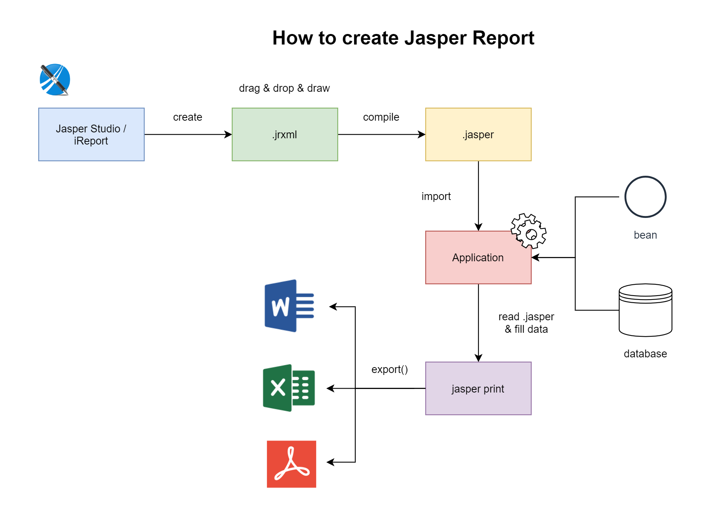

# ขั้นตอนการสร้างและใช้งาน Jasper Report

# การสร้าง Report
1. ใช้โปรแกรม GUI สักตัวในการสร้าง Jasper Report เช่น **Jaspersoft® Studio** หรือ **iReport** เป็นต้น 
2. สร้าง Report เป็นไฟล์ `.jrxml` จากนั้น Drag & Drop & Draw Report ได้ตามใจชอบ 
3. ทำการ Compile ไฟล์ `.jrxml` ไปเป็นไฟล์ `.jasper` ซึ่งเป็น Binary Report ที่พร้อมนำไปใช้งาน 

### หมายเหตุ

> แต่ก่อนผมใช้ iReport ตอนนี้เปลี่ยนมาใช้ Jaspersoft Studio ล่ะ เพราะ iReport BUG มันเยอะ (จากที่ใช้มา 5-6 ปีน่ะ)

# การนำ Report ไปใช้งาน
4. นำไฟล์ `.jasper` ไปใช้งานกับ Application 
5. เขียน Code เพื่ออ่านไฟล์ `.jasper` ขึ้นมา (โดยใช้ Lib ของ Jasper) จากนั้นเติม (Fill) ข้อมูลลงไปใน Report ซึ่งข้อมูลอาจจะเป็น 
   - Bean ซึ่งเป็นข้อมูล Object ที่ส่งจาก Application เข้าไปใน Report โดยตรง หรือ 
   - Database Connection เพื่อส่งเข้าไปใน Report เพื่อให้ Report ใช้สำหรับ Query Data ขึ้นมา
6. จากนั้นเราจะได้เป็นไฟล์ jasper print (อาจจะตั้งนามสกุลไฟล์เป็น `.jasperPrint` ก็ได้) ซึ่งเป็นไฟล์ Report ที่มีข้อมูลเรียบร้อยแล้ว รอการ Export ไปเป็นไฟล์ format ต่าง ๆ      
7. ทำการ **Export** jasper print ไปเป็นไฟล์รูปแบบต่าง ๆ ตามที่เราต้องการ เช่น word, pdf, excel, csv, html etc.    
8. นำ word, pdf, excel ไปใช้งาน

### หมายเหตุ

> ขั้นตอนที่ 6. กับ 7. บางทีอาจจะรวบเป็นขั้นตอนเดียวเลยก็ได้ คือ ไม่มี jasper print ให้เห็น (ถ้าไม่ได้ใช้)

# เพิ่มเติม

- Jaspersoft® Studio สามารถดาวน์โหลดได้ที่ [https://community.jaspersoft.com/project/jaspersoft-studio/releases](https://community.jaspersoft.com/project/jaspersoft-studio/releases)
