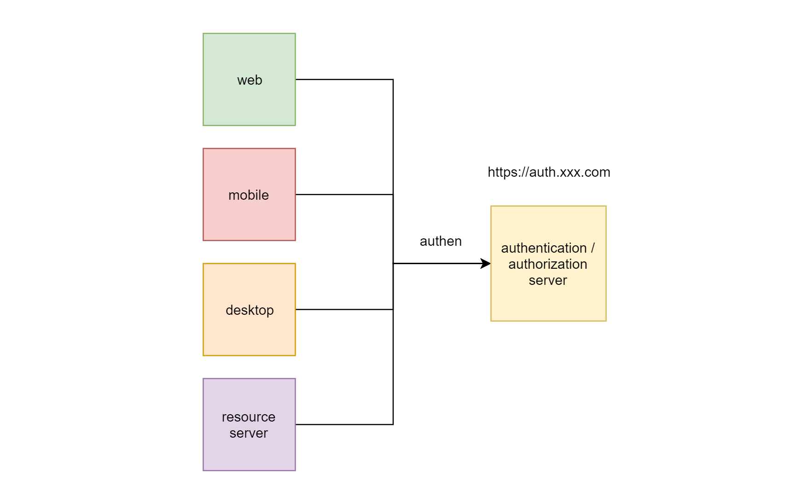
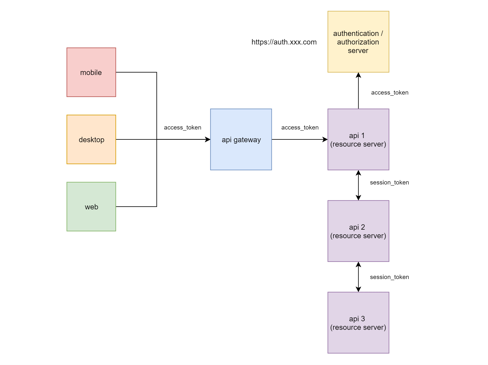
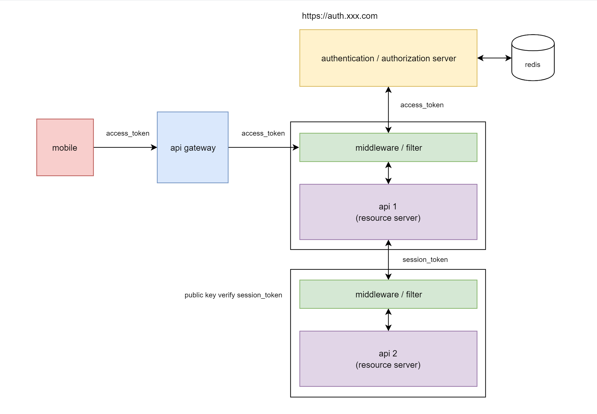

# Design ระบบ Authentication ยังไงให้รองรับทั้ง Desktop, Web, Mobile, Single Page Aplication และ Micro Service


*Image from [https://images7.alphacoders.com/490/thumb-1920-490302.jpg](https://images7.alphacoders.com/490/thumb-1920-490302.jpg)*

ไม่ว่าคุณจะเป็นโปรแกรมเมอร์ที่เขียนโปรแกรม ด้วยภาษาโปรแกรมมิ่งอะไรก็ตาม ผมคิดว่าทุกคนน่าจะเคยเจอปัญหานี้
  
ตัวผมเองก็เป็น 1 ในนั้น ที่พยายามแก้ไขปัญหานี้มาตลอดระยะเวลาที่เป็นโปรแกรมเมอร์

จนวันนึงผมก็ได้รับคำตอบ ว่าควรจะ design มันยังไง ได้ลองผิด ลองถูก ลองพิสูจน์ อยู่กับมันมาสักระยะนึงแล้ว ว่าวิธีนี้มันค่อนข้าง work    

> บทความนี้ เป็นบทความที่นำเสนอวิธีการที่ผมและทีมใช้ ซึ่งถ้าใครมีวิธีการที่ดีกว่า ก็สามารถเสนอแนะได้ครับ  

ตอบแบบสั้น ๆ ว่า ทีมผมใช้

# OAuth 2.0

> ซึ่งมีการ Custom เพิ่มเติมให้ทำงานแบบ **Single Sign-On**

# หมายเหตุ ****

- มีบางคนเข้าใจผิด คิดว่า OAuth 2.0 คือ ชื่อของเครื่องมือ หรือ tool ตัวนึง ย้ำว่ามันไม่ใช่ tool ครับ มันเป็น **standard flow** ที่ถูกคิดค้นขึ้นมาสำหรับการทำ authorization เพื่อยกสิทธิ์เราให้ application ใด ๆ สามารถที่จะเข้าถึงข้อมูลของเรา จากผู้ให้บริการข้อมูลได้ เมื่อมันเป็น standard มันเลยมีคนเอาไปใช้ เอาไปทำ เอาไป implement ตาม กันเยอะแยะมากมาย มันไม่ได้ fixed ว่าต้องทำ ต้องเขียนด้วยภาษาโปรแกรมมิ่งนี้เท่านั้น (เขียนด้วยภาษาโปรแกรมมิ่งอะไรก็ได้ตามที่ตัวเองถนัด)
- แนะนำให้ตามอ่านบทความต่าง ๆ ตามลิงค์ที่แปะไว้ให้ เพื่อช่วยให้เข้าใจรายละเอียดต่าง ๆ ที่อาจจะไม่ได้เขียนอธิบายไว้ในบทความนี้ ได้ดียิ่งขึ้น (flow อย่างละเอียดผมมีแปะไว้ให้ในลิ้งค์ครับ) *****

ยาวไป…

เหตุผลที่ใช้ เพราะ

<blockquote class="ui-blockquote-heading">
   <h1>มันเป็น Standard ที่ใครๆ ก็สามารเรียนรู้ และเข้าใจได้เหมือนกัน</h1>
</blockquote>

ถ้าพูดถึง OAuth 2.0 เราจะต้องว่าด้วยเรื่องของ **Roles** หรือ **Factors** 4 ตัว ดังต่อไปนี้

### Resource Owner

คือ ตัวเรา ซึ่งเป็นเจ้าของ resources ต่าง ๆ ในระบบ

### Resource Server

คือ server ที่ทำหน้าที่ในการให้บริการข้อมูล เช่น server ที่ทำหน้าที่เป็น api server หรือ file server ที่เก็บข้อมูลของเราไว้

### Client

คือ application ตัวนึง หรือ third-party application ที่ต้องการ access ข้อมูลของเรา เช่น web server, single page application, mobile, desktop ฯลฯ

### Authorization Server

คือ server ที่ทำหน้าที่ในการ grant authorize (ยก/อนุญาต สิทธิ์เรา) ให้ client หรือ application ใด ๆ สามารถที่จะ acccess ข้อมูลของเราได้ ตาม scope ที่เรากำหนด
  
ระบบ authentication ที่พูดถึงในบทความนี้ คือการทำ **Authorization Server**
  
ในโลกความเป็นจริง เรามี authorization server ต่าง ๆ มากมายที่พร้อมให้เราใช้งานได้อยู่แล้ว โดยไม่ต้องสร้างขึ้นมาเอง เช่น authorization server ของ Facebook, ของ Google, ของ Twitter ของ GitHub ฯลฯ
  
เราสามารถใช้ authorization server เหล่านี้ในการขอ grant สิทธิ์จาก application นั้น ๆ เพื่อขอข้อมูลของ user (resource owner) ตามที่เราต้องการได้ พูดแบบบ้าน ๆ ก็คือ การทำระบบของเราให้สามารถ Login ผ่าน Google, Facebook, Twitter ฯลฯ ได้นั่นเอง  
  
แต่ในบางครั้ง บางงาน บาง project ก็มีเหตุผลที่เราต้องทำ authorization server ขึ้นมาเอง เพื่อให้รองรับกับงาน กับ flow การทำงาน หรือนโยบาย (policy) การรักษาความลับข้อมูลของลูกค้า  
  
รวมทั้งหากเราเป็นคนที่เขียน api ต่าง ๆ ขึ้นมาเอง ก็คงหนีไม่พ้น เรื่องของการทำ authentication สำหรับ api และระบบต่าง ๆ ให้ เชื่อมโยงกันได้อย่างแน่นอน  
  
ในบทความนี้ผมจะพูดถึงแนวคิด และวิธีการในการทำ authorization server รวมถึง flow ที่ใช้ในการทำ authentication / authorization ที่ทีมผมเลือกใช้ครับ

---

อีกเรื่องที่ไม่พูดถึงไม่ได้ คือ เรื่องของ **Grant Type** ซึ่งเป็นวิธีการที่ใช้ในการยกสิทธิ์เรา ให้กับ application ต่าง ๆ ประกอบไปด้วย ท่าดังต่อไปนี้

### Authorization Code

เป็นการ grant authorize ด้วยการ return authorization_code ผ่านทาง query string url เพื่อให้ application ปลายทาง นำ authorization_code นั้นไปขอ access_token จาก authorization server ต่อไป

- [https://oauth.net/2/grant-types/authorization-code/](https://oauth.net/2/grant-types/authorization-code/)

### Client Credentials

ใช้ client_id และ client_secret ในการขอ access_token ตรง ๆ จาก authorization server วิธีการนี้ อยู่นอกเหนือบริบทของ user คือ user ไม่ได้เป็นคน grant authorize ด้วยตัวเอง (หลังบ้านเป็นคนทำเอง)

- [https://oauth.net/2/grant-types/client-credentials/](https://oauth.net/2/grant-types/client-credentials/)

### Device Code

เป็นการ grant authorize ให้กับอุปกรณ์บางประเภท ที่ต้องการ access ข้อมูลของ user ผ่านการใช้ device_code เช่น smart TV, smart radio

- [https://oauth.net/2/grant-types/device-code/](https://oauth.net/2/grant-types/device-code/)

### Refresh Token

เป็นการใช้ refresh_token ที่ได้มาคู่กับตอนขอ access_token ในการขอ access_token ใหม่ กรณีที่ access_token เดิมหมดอายุ

- [https://oauth.net/2/grant-types/refresh-token/](https://oauth.net/2/grant-types/refresh-token/)

ที่เลิกใช้ไปแล้ว หรือ **ไม่แนะนำให้ใช้** เพราะไม่ปลอดภัย ประกอบไปด้วย

### Implicit Flow

เป็นการ return access_token ตรง ๆ ผ่านทาง fragment (#) ของ url

- [https://oauth.net/2/grant-types/implicit/](https://oauth.net/2/grant-types/implicit/)

### Password Grant

ใช้ username/password ในการขอ access_token ตรง ๆ ผ่านทาง client หรือ third-party application

- [https://oauth.net/2/grant-types/password/](https://oauth.net/2/grant-types/password/)

ในบทความนี้จะใช้วิธีการ grant authorize สำหรับ user grant แค่ 2 แบบ คือ แบบ

- Authorization Code และ
- Refresh Token

OAuth 2.0 สามารถอ่านรายละเอียดเพิ่มเติมได้จากลิงค์นี้

- [OAuth 2.0 คืออะไร ทำงานยังไง แบบ Step by Step](https://docs.google.com/presentation/d/1GefptamJEHczcnkNo1Gjsv2DFO2ctFjGvc7AYEf35Gg/edit?usp=sharing)  
- [https://tools.ietf.org/html/rfc6749](https://tools.ietf.org/html/rfc6749)
- [https://oauth.net/](https://oauth.net/)
- [https://www.oauth.com/](https://www.oauth.com/)

แนะนำให้อ่านและเข้าใจ OAuth 2.0 ในระดับนึงก่อนน่ะครับ จะทำให้อ่านบทความนี้เข้าใจได้ง่ายขึ้น

---

# การวางระบบ



### ทำการแยกระบบ Authentication ออกมาเป็น 1 ระบบ

- เพื่อให้เป็น centralized authentication/authorization
- ทุก client จะ login ผ่านระบบนี้
- มีหน้าจอ login เดียว ทุกระบบใช้หน้าจอ login เดียวกัน *****
- ทำการ custom หน้าจอให้รองรับกับอุปกรณ์ทุกประเภท (พยายาม เขียน css responsive ให้รองรับทุกอุปกรณ์)
- เพื่อให้การทำ security ทำได้ง่าย เพราะเราจะ focus security ไปที่ระบบนี้เป็นระบบหลัก
- เพื่อให้การ scale ทำได้ง่าย เมื่อระบบรับ load หนัก ๆ เราสามารถ scale เฉพาะส่วนนี้ได้

### กำหนด Domain Name สำหรับการทำ Authentication โดยเฉพาะ

ซึ่งอาจจะเป็น sub domain name เช่น [https://auth.xxx.com](https://auth.xxx.com) เพราะเรื่องของความปลอดภัย คือ user session cookie จะไม่หลุดไปยัง module อื่น ๆ ที่ไม่เกี่ยวข้องกับเรื่องของ authentication + authorization

### เก็บ User Session ไว้ที่เดียว

ทำระบบให้เป็น stateless และมี user session เก็บอยู่ที่เดียว คือ ระบบ authentication ส่วน module อื่น ๆ domain อื่น ๆ จะใช้ access_token และ refresh_token ในการขอข้อมูลแทน

### แยก Database ออกมา

เรื่องนี้ **ไม่ได้ required** แต่ถ้าทำได้ก็จะดี คือ ข้อมูล credentials ต่าง ๆ จะไม่หลุดไปยังระบบอื่น ๆ แต่ถ้าไม่ได้ก็ไม่เป็นไร วิธีนี้เหมาะกับระบบที่มีขนาดค่อนข้างใหญ่ และมี modules เยอะ เช่น ระบบขององค์กรนึงที่มีระบบย่อย ๆ มากมาย แต่ใช้ระบบ authentication กลางครับ

---

# User Session

> ย้าย user session ออกจาก application server นำไปเก็บไว้ที่ใดที่นึง เช่น redis


ทีมผมทำการ custom user session เอง เก็บลงทั้ง redis และ mongodb เพื่อให้สามารถ scale ระบบได้

- redis เก็บเพื่อให้ access ได้เร็ว และมีการ sync ข้อมูลลง mongodb เป็นระยะ ๆ
- mongodb เก็บเพื่อป้องกันไม่ให้ข้อมูลเกิดการสูญหาย หรือเมื่อต้องการ clear cache (redis) ก็จะมาอ่านที่ mongodb ขึ้นไปเก็บใน redis อีกครั้ง อีกทั้งเก็บเพื่อเอาไว้ทำ query หรือเรียกดูข้อมูลที่มีความซับซ้อน ซึ่ง redis จะไม่เหมาะกับการทำแบบนี้

---

# Token

หน้าตาของ token จากการ request **access_token** เป็นดังนี้

```json
{
    "access_token" : "MjMwZDk5NTAtYzZY2EzNGJlN...",
    "token_type" : "bearer",
    "expries_in" : 1800,
    "refresh_token" : "MjMwZDk5NTAtYzZkZC00NGJlNW...",
    "session_token" : "eyJ0eXAiOiJKV1QiLCJhb1NiJ9.aW9IuO.."     
}
```

ที่เพิ่มเติมเข้ามาจาก OAuth 2.0 ปกติ คือ session_token
  
**session_token** ใช้ jwt (json web token) เป็นข้อมูล user session มีลักษณะคล้ายกับ **id_token** ของ **Open ID Connect (OIDC)** เพียงแต่ว่า attribute ต่าง ๆ ไม่เท่ากัน ที่อยากได้ (เมื่อ verify token แล้ว) จะหน้าตาประมาณนี้  

```json
{
   "exp":1565889888,
   
   "id":"96a067fc-e504-468e-a479-e7f8258ea339",
   "issuedAt":1565889827552,   
   "expiresAt":1565891627552,   
   "user_id":"5d401080cc26c76dbe8814c9",
   "user_username":"hunter@example.com", 
   "user_name":"Mr. Hunter Test",
   "user_photoUrl":"https://......jpg",
   "user_authorities":[  
      "ADMIN"
   ],
   "client_id":"5d346258c4404e24344c233d",  
   "client_name":"OAuth Client for Test",   
   "client_scopes":[  
      "user:public_profile"
   ]
}
```

เราสามารถใช้ข้อมูลนี้ในการตรวจสอบสิทธิ์ หรือเป็นข้อมูลสำหรับ user login ได้เลย โดยไม่ต้อง query ข้อมูลจาก database ใหม่ทุกรอบ
  
token ที่ใช้ในระบบมีทั้งแบบที่เป็น statelful และ แบบที่เป็น stateless  

### Stateful

- sync กับ redis ตลอดจะประกอบไปด้วย authorization_code, access_token, refresh_token และ user_session
- สามารถ revoke จากทางฝั่ง backend ได้
- วัตถุประสงค์ เพื่อการทำ single sign-on / single sign-out

### Stateless

- ไม่ได้ sync กับ redis เป็น jwt (json web token)
- ใช้วิธีการ sign ด้วย private key (จากฝั่ง authorization server) และ verify ด้วย public key (ที่ฝั่ง client หรือ resource server) ประกอบด้วย session_token
- วัตถุประสงค์ เพื่อลด network latency และความเร็วในการใช้งาน

1 user_session สามารถมีได้หลาย access_token และ refresh_token

เมื่อ revoke user_session ทิ้ง token ทั้งหมดที่ผูกอยู่กับ user_session จะต้องถูก revoke ทิ้งด้วย

### การใช้งาน Token



- client คุยกับ server จะใช้ token แบบ stateful คุยกัน
- server คุยกับ server (หรือ micro service คุยกันเอง) จะใช้ token แบบ stateless คุยกัน อ่านปัญหาและที่มาได้จากบทความนี้ [การออกแบบ ระบบ Authentication ของ Micro Service](/blog/design-authentication-for-micro-service/?series=oauth)

---

# Authorization Server

จะใช้ library ต่าง ๆ ที่มีอยู่มาทำ แล้ว custom เพิ่มเติมเอง หรือ จะเขียนขึ้นมาเองก็ได้ ซึ่งทีมผมได้ทำการเขียน Authorization Server ขึ้นมาเอง ไม่ได้มีการใช้ library สำเร็จรูปจากที่ไหน แต่ implement ตาม spec [RFC 6749](https://tools.ietf.org/html/rfc6749) มีเหตุผล ดังนี้

1. ต้องการ custom ให้รองรับการทำงานแบบ Single Sign-On / Single Sign-Out คือ เรารู้อยู่แล้วว่า OAuth 2.0 ไม่ไช่ Single Sign-On มันเป็นเพียง standard flow, standard authorization framework ([RFC 6749](https://tools.ietf.org/html/rfc6749)) ที่ใช้สำหรับการ grant สิทธิ์เราให้กับ application อื่น ๆ ที่ต้องการจะใช้ข้อมูลเรา (resource owner) access_token แต่ละ application แต่ละอุปกรณ์ (user agent) ไม่ได้มีความสัมพันธ์กันกับ user session การที่เรา logout ออกจาก application หลัก หรือ application อื่น ๆ ที่ขอ grant สิทธิ์ ก็ไม่ทำให้ application อื่น ๆ logout ออกไปด้วย มันขาดคุณสมบัติ Single Sign-Out อย่างเห็นได้ชัด สิ่งที่ผมทำคือ custom ให้ access_token และ refresh_token ผูกกับ session ของ user เวลาเรา signout ก็ให้ลบ token ทั้งหมดที่ผูกกับ user session ทิ้งไปด้วย

2. ต้องการให้ token มีทั้งแบบ stateful และแบบ stateless ลองอ่านจากบทความนี้ดูครับ [การออกแบบ ระบบ Authentication ของ Micro Service](/blog/design-authentication-for-micro-service/?series=oauth) ที่ design แบบนี้เพราะเหตุผล คือ ข้อ (1) ต้องการให้เป็น Single Sign-Out กับเรื่องของ Performance ต้องการความเร็วในกรณีที่หลังบ้าน หรือ Micro Service คุยกันเอง

3. เผื่อ custom เรื่องอื่น ๆ ให้รองรับกับ business ที่ต้องเจอในอนาคต เช่น user ต้องการให้เราดัก event อะไรบางอย่างก่อนที่จะ redirect ไปยัง application ปลายทาง เช่น ต่ออายุ certificate, บังคับให้เปลี่ยน password ทุก xxx เดือน, custom ให้ login ผ่าน LDAP เป็นต้น

4. เรื่อง performance ผมทำ caching ลง redis เกือบทุกจุด ซึ่งเรารู้อยู่แล้วว่า redis มันไวกว่าการไปอ่านข้อมูลจาก database หลายเท่า แต่ข้อเสียของ redis คือ ข้อมูลมันไม่คงทนถาวร เมื่อไฟฟ้าดับ หรือเกิดการ reboot เครื่อง ข้อมูลก็จะหายไป ซึ่งผมก็ได้แก้ปัญหาตรงจุดนี้ โดยการทำให้มัน sync ข้อมูลลง mongodb เป็นระยะ ๆ เมื่อมีการ request access_token เข้ามาใหม่ ถ้าไม่เจอข้อมูลใน redis มันก็จะไปอ่านจาก mongodb ขึ้นมา แล้ว cache ใน redis ใหม่ครับ ซึ่งเราสามารถการันตีได้ว่า user session หรือ access_token ของ user จะไม่มีทางหาย จนกว่า user จะ signout ออกจากระบบไปเอง

5. เรื่อง performance อีกข้อ เนื่องจากตัวผมเองเป็น java programmer library oauth 2.0 ของภาษา java ที่มีอยู่ส่วนมาก มักจะทำงานแบบ Blocking I/O ซึ่งทำให้รองรับ request ได้ไม่ดีนัก ผมจึงตัดสินใจเขียนเองด้วย Non-Blocking I/O framework อย่าง Spring-boot Reactive (WebFlux) เพราะตัว OAuth ที่เราจะใช้นั้น ถือเป็น core ของระบบเลยก็ว่าได้ ถ้าเราทำไว้ไม่ดีตั้งแต่แรก ก็จะทำให้เกิดปัญหาต่าง ๆ ตามมาอีกมากมาย

6. Security ผม custom token ต่าง ๆ ตามบทความนี้ครับ [แนวทางปฏิบัติที่ดี ในการทำ OAuth 2.0 Access Token & Refresh Token เพื่อความปลอดภัย](/blog/best-practice-to-design-oauth-token/?series=oauth) นอกจากเรื่อง token แล้วก็ยังมีการทำ security อื่น ๆ เพิ่มเติม ตามเอกสาร OWASP

---

# Middleware หรือ Filter



ทำหน้าที่ในการกรอง request ต่าง ๆ เพื่อทำ authenication ให้กับ client หรือ application
  
ผมทำการเขียน library ที่เป็น middleware หรือ filter สำหรับ filter request ขึ้นมาเอง เนื่องจาก  

1. ต้องการให้นำไปใช้งานได้ทั้ง (1) client (application) ที่ทำงานทางฝั่ง web server และ (2) client ที่ทำหน้าที่เป็น resource server (ผู้ให้บริการข้อมูล หรือ api)

2. ต้องการให้รองรับ token แบบ stateful และ stateless

3. ต้องการ design flow บางอย่างเพิ่มเติมเอง

4. ต้องการให้ support กับ framework ที่ใช้งานอยู่ นั่นคือ java spring-boot reactive + spring security

สามารถดูตัวอย่าง code ได้ที่

- [https://github.com/pamarin-official/oauth-client](https://github.com/pamarin-official/oauth-client)

---

# Flow ที่ใช้ในการ Grant Authorize

ใช้แค่ flow เดียวของ OAuth 2.0 คือ

> grant_type = **authorization_code**

เพราะเชื่อว่า flow นี้เป็น flow เดียวที่มีความปลอดภัยมากที่สุด ดังนี้

1. username & password ไม่หลุดไปยัง application อื่น ๆ เวลาที่ application หรือ client ใด ๆ ต้องการที่จะ login จะต้องทำการ redirect มาที่หน้า login ของ authorization server **เท่านั้น** *****

2. user session เกิดขึ้นที่ตรงกลาง (authorization server ที่เดียว) เราสามารถ control สิทธิ์ หรือการเข้าถึงต่าง ๆ ที่จุดนี้ได้

3. การทำ security, การทำ UI/UX, การทำอะไรต่าง ๆ ง่าย เนื่องจากทำที่ authorization server ที่เดียว

### การ grant authorize สำหรับ grant_type = authorization_code ที่ใช้ แบ่งออกเป็น 2 ประเภท ได้แก่

- Authorization Code (for Web Backend)
- Authorization Code แบบ PKCE ( Proof Key for Code Exchange)

หมายเหตุ *****

มีการทำงานควบคู่กับ **grant_type = refresh_token** ด้วย

# Authorization Code (for Web Backend)

> ใช้สำหรับ client หรือ application ที่ run แบบมี backend (web) server

ตอน grant authorize (**/oauth/authorize**)จะมี parameters ดังนี้

- response_type=code
- client_id
- redirect_uri
- scope
- state (optional)

ตอน get access_token (**/oauth/token**) จะมี parameters ดังนี้

- grant_type=authorization_code
- code
- client_id
- **client_secret** *****
- redirect_uri

ตอน refresh token (**/oauth/token**) จะมี parameters ดังนี้

- grant_type=refresh_token
- refresh_token
- client_id
- **client_secret** *****

วิธีนี้จะเหมาะกับ web ที่มี backend server ข้อดี คือ

- จัดการ token ง่าย ทั้งการ grant authorize และ refresh token ส่วนของหน้าบ้าน (frontend) แทบจะไม่ต้องทำอะไรเลย
- ปลอดภัย (เนื่องจากมีการใช้ client_secret ในการขอ access_token)
- ใช้ได้ทั้ง client แบบมี backend server และ resource server (กรณีที่เราเขียน web นั้นเป็น api)

### การเก็บ access_token & refresh_token

วิธีนี้ผมจะเก็บ access_token และ refresh_token ไว้ใน cookie ครับ (write cookie จาก backend) เป็นแบบ **http only** คือ javascript ไม่สามารถอ่าน token ได้ ถ้าต้องการส่ง token ให้ javascript จะต้องส่งผ่านตัวแปรจากการทำ server side rendering (html) เท่านั้น

สามารถดูตัวอย่าง flow **อย่างละเอียด**ได้จากลิงค์นี้

- [https://developer.pamarin.com/document/authentication/](https://developer.pamarin.com/document/authentication/)

# Authorization Code แบบ PKCE ( Proof Key for Code Exchange)

> ใช้สำหรับ client หรือ application ที่เป็น Single Page Application (SPA), Desktop หรือ Mobile

เนื่องจาก application ประเภทนี้ เราไม่สามารถที่จะฝัง **client_secret** ลงไปใน application ได้ เพราะ application ประเภทนี้ จะ load หรือถูกติดตั้งไว้ที่เครื่องของ user จึงได้มีการคิดค้นวิธีแก้การปัญหาของ authorization_code แบบปกติ ขึ้นมา เรียกว่า PKCE ดังนี้

ตอน grant authorize (**/oauth/authorize**)จะมี parameters ดังนี้

- response_type=code
- client_id
- redirect_uri
- scope
- state (optional)
- **code_challence** *****
- **code_challence_method**=S256 *****

สังเกตว่าจะเหมือนกับวิธีการ grant authorize ที่ผ่าน แต่มีการเพิ่ม parameters **code_challence** และ **code_challence_method** เข้าไป เพื่อใช้เป็น secret แทนการใช้ client_secret ในการขอ access_token

### หมายเหตุ

code_challence_method FIXED ค่าไว้เป็น **S256** (SHA256) เนื่องจาก spec oauth ปัจจุบันรองรับแค่ hashing นี้ ซึ่งถือว่าปลอดภัยแล้ว แต่อนาคตอาจมีการเพิ่ม hashing ประเภทอื่น ๆ เข้าไปอีกก็ได้

### code_challence ได้มายังไง ?

วิธีการได้มาซึ่ง code_challence ทำดังนี้

```js
//1. สุ่มและจัดเก็บไว้ (ให้ secure) 
code_verifier = randomAndStore();

//2. hash ค่าด้วย algorithm แบบ sha256
code_verifier_hashed = sha256(code_verifier);

//3. encode ด้วย base64 url
code_challence = base64EncodeURL(code_verifier_hashed);
```

ทำตามนี้ [https://auth0.com/docs/api-auth/tutorials/authorization-code-grant-pkce](https://auth0.com/docs/api-auth/tutorials/authorization-code-grant-pkce)

code_verifier และ code_challence จะสัมพันธ์กันเสมอ

ตอน get access_token (**/oauth/token**) จะมี parameters ดังนี้

- grant_type=authorization_code
- code
- client_id
- **code_verifier** *****
- redirect_uri

การขอ access_token ใช้ code_verifier แทน client_secret *****

ตอน refresh token (**/oauth/token**) จะมี parameters ดังนี้

- grant_type=refresh_token
- refresh_token
- client_id
- **code_verifier** *****

### การเก็บ access_token & refresh_token

### Single Page Application

วิธีนี้ผมจะเก็บ access_token และ refresh_token ไว้ใน local storage ครับ ***** แต่ตอนนี้ใช้สำหรับ development mode เท่านั้น ไม่ได้ใช้สำหรับ production mode
  
production mode จะไม่ได้ใช้ท่า PKCE เพราะทำ middleware หรือ filter สำหรับ web backend ไว้ดีแล้ว  
  
ที่ต้องใช้ PKCE สำหรับ development mode เพราะตอน dev frontend ใช้ vuejs run ด้วย node ([http://localhost:3000](http://localhost:3000)) ซึ่งทำให้ หน้าจอกับ api อยู่คนละส่วนกัน ทำให้ dev ง่ายครับ  
  
ถ้าจะใช้ PKCE สำหรับ production อย่าลืมทำ http **Content-Security-Policy** ด้วยครับ สามารถอ่านได้จากลิงค์นี้  

- [https://developer.mozilla.org/en-US/docs/Web/HTTP/Headers/Content-Security-Policy](https://developer.mozilla.org/en-US/docs/Web/HTTP/Headers/Content-Security-Policy)

### Mobile

TODO (ยังไม่ได้เขียน)

### Desktop

TODO (ยังไม่ได้เขียน)

---

# ทำไมไม่ใช้ OIDC (Open ID Connect) ?

เพราะ attribute **id_token** (ซึ่งเป็น jwt เก็บข้อมูล user login) ใน open id connect ไม่ตอบโจทย์ที่ตัวเองต้องการจะทำครับ id_token มี spec คร่าว ๆ ว่าต้องประกอบไปด้วย attributes อะไรบ้าง แต่ผมดูแล้วไม่ตอบโจทย์ที่ต้องการ เลยไม่ใช้ (เหตุผลมีแค่นี้)

- [https://openid.net/specs/openid-connect-core-1_0.html#StandardClaims](https://openid.net/specs/openid-connect-core-1_0.html#StandardClaims)

# หมายเหตุ

เป็นบทความที่ถูกย้ายมาจาก [https://medium.com/@jittagornp/design-ระบบ-authentication-ยังไงให้รองรับทั้ง-desktop-web-mobile-single-page-aplication-และ-396395060fa8](https://medium.com/@jittagornp/design-ระบบ-authentication-ยังไงให้รองรับทั้ง-desktop-web-mobile-single-page-aplication-และ-396395060fa8) ซึ่งผู้เขียน เขียนไว้เมื่อ Jan 3, 2020  
