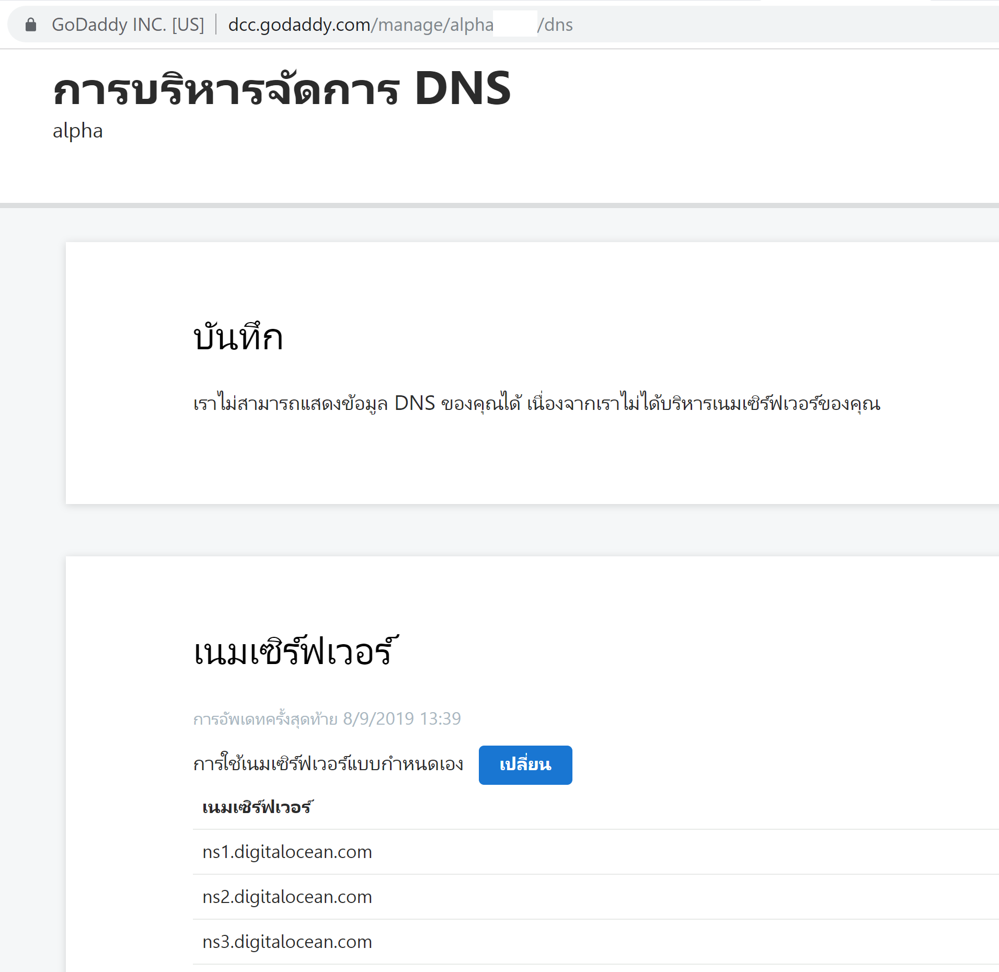
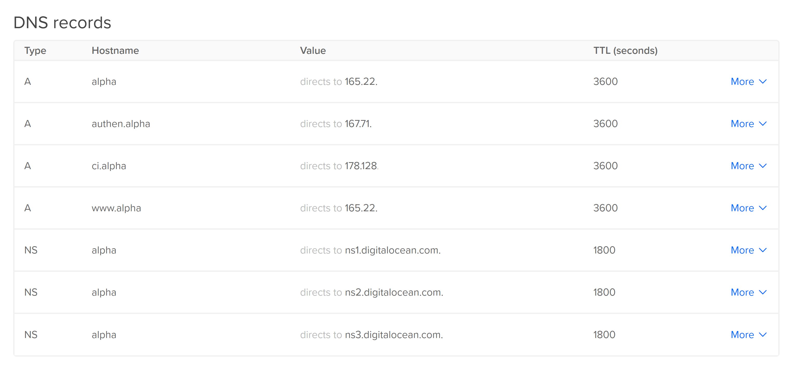

# การ Setup DNS Records บน DigitalOcean 

สมมติเราจด Domain Name ไว้ที่ Go Daddy และ Host เราอยู่ที่ Digital Ocean ให้ทำการ Set Up DNS Records ดังนี้  

# 1. ที่ Godaddy 
หรือ DNS Provider ต้นทาง    

ให้เรา point `Name Server` ไปยัง Host ปลายทาง หรือ Digital Ocean ของเรา ดังนี้  

# 2. ที่ Digital Ocean 

ให้ Create Domain Name / DNS จากนั้น Add `DNS Records` ดังนี้  

อยากได้ Sub Domain Name อะไร ก็ให้เรา Add DNS Record Type `A` เป็นชื่อ Sub Domain Name แล้วก็กำหนด IP ปลายทาง  
  
หากต้องการให้ add root Domain Name ให้ Add DNS Record Type `A` ชื่อ Sub Domain Name เป็น `@` แล้วก็กำหนด IP ปลายทางเข้าไป  

  