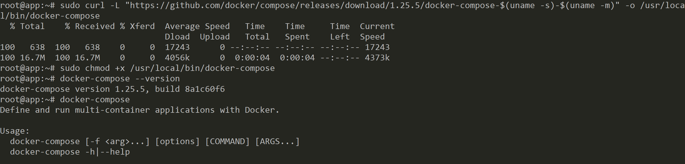

# ติดตั้ง Docker Compose บน Ubuntu 18.04 


# Prerequisites

- [ติดตั้ง Docker ตามนี้ก่อน](/blog/install-docker-on-ubuntu-18.04/)

# เช็ค Version ก่อนติดตั้ง 

- [https://github.com/docker/compose/releases](https://github.com/docker/compose/releases)


# ติดตั้ง



1. Download Compose 

```sh
$ sudo curl -L "https://github.com/docker/compose/releases/download/1.25.5/docker-compose-$(uname -s)-$(uname -m)" -o /usr/local/bin/docker-compose
```

2. กำหนดสิทธิ์ (Permission)

```sh
$ sudo chmod +x /usr/local/bin/docker-compose
```

3. เช็ค Compose Version

```sh
$ docker-compose --version
```

# Reference

- [https://docs.docker.com/compose/install/](https://docs.docker.com/compose/install/)
