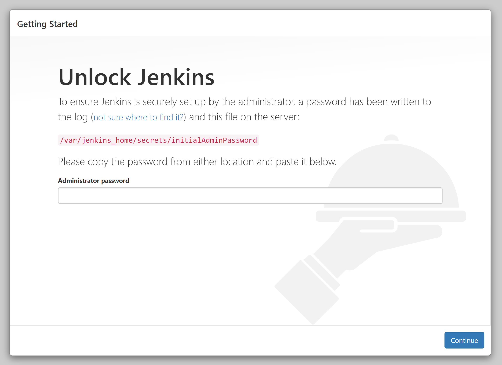
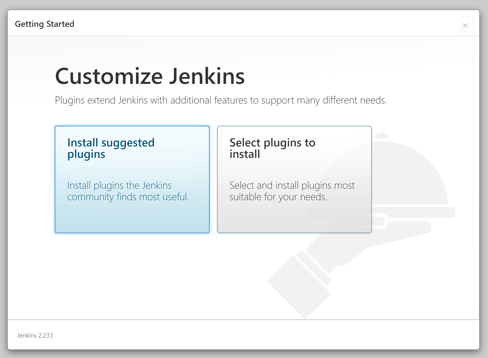
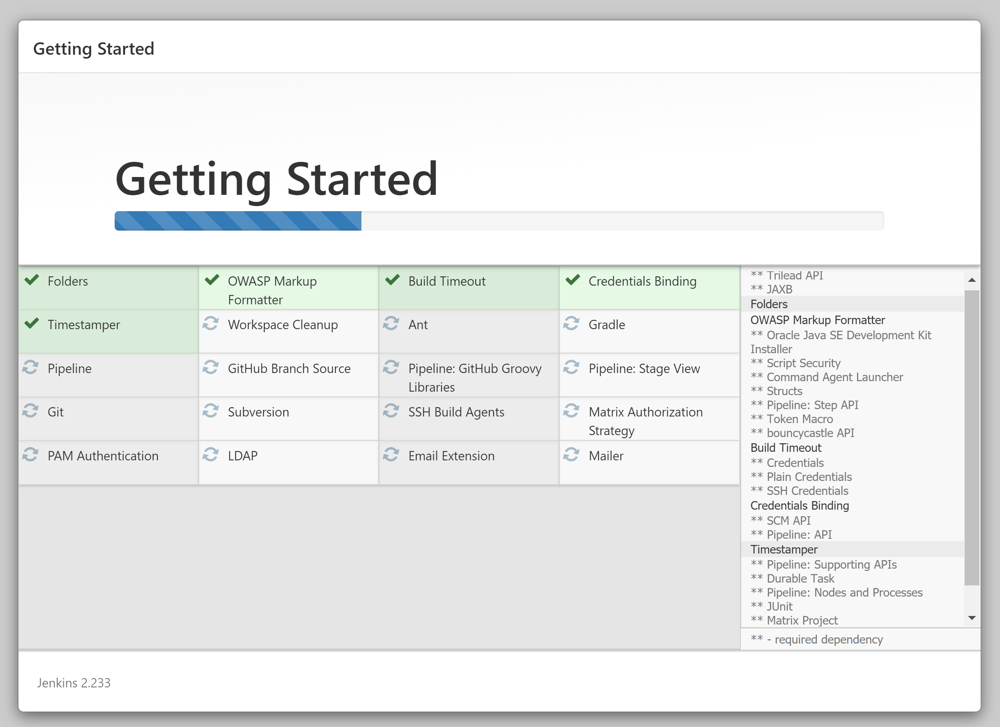
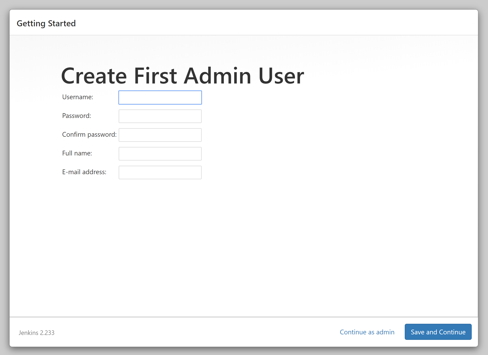
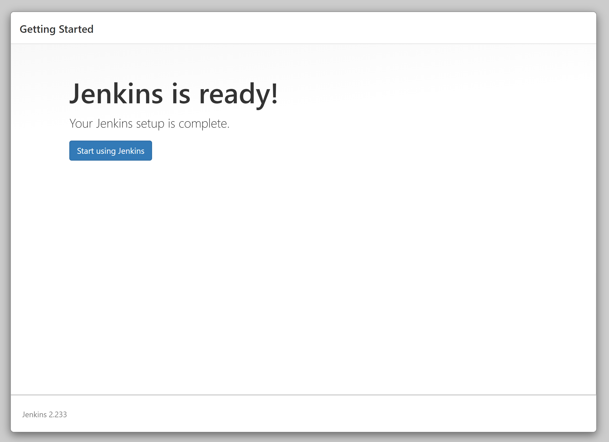
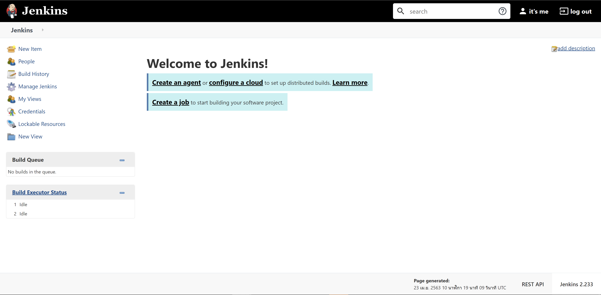

# ติดตั้ง Jenkins JDK 11 ด้วย Docker บน Ubuntu 18.04  


# Prerequisites  

- 1 vCPU  
- RAM 2 GB   
- Docker (สามารถติดตั้งได้ตามนี้ [ติดตั้ง Docker บน Ubuntu 18.04](/blog/install-docker-on-ubuntu-18.04/))

# ติดตั้ง 

1. สร้าง Directory `jenkins_home` เพื่อเอาไว้เก็บข้อมูล Jenkins  
```sh  
$ mkdir -p /var/jenkins_home
```

2. กำหนดสิทธิ์การเข้าถึง Directory (เบื้องต้น Set เป็น 777 เพื่อให้ง่ายต่อการทดสอบ)
```sh
$ chmod 777 /var/jenkins_home
```

3. Run Docker เพื่อติดตั้ง Jenkins   
```sh  
$ docker run -d \
  --name jenkins \ 
  --restart=always \ 
  -p 80:8080 \
  -p 50000:50000 \
  -v /var/jenkins_home:/var/jenkins_home \
  -v /var/run/docker.sock:/var/run/docker.sock \
  -v $(which docker):/usr/bin/docker \  
  jenkins/jenkins:jdk11
  ```
  
# ปัญหา  
  
ถ้าเจอ error แบบนี้
```sh
....
....docker.sock: connect: permission denied
...
```
วิธีการ Fixed ปัญหาแบบเร็ว ๆ (แต่ยังไม่ปลอดภัย) ให้ทำดังนี้ 
```sh
$ sudo chmod 777 /var/run/docker.sock
```

# เข้าหน้า Jenkins เพิ่มเริ่มติดตั้ง

> http:<HOST_NAME or IP>



Copy Password นี้ไปใส่  
```sh
$ cat /var/jenkins_home/secrets/initialAdminPassword
```

คลิก Continue > เลือก **Install suggested plugins** 



รอให้ระบบทำการติดตั้งจนเสร็จ 



กรอก Username / Password สำหรับ Admin และข้อมูลต่าง ๆ > คลิก Save and Continue 



กำหนด Jenkins URL หรือ Domain Name ที่จะเข้าใช้ > คลิก Save and Finish 


คลิก Start using Jenkins 



Jenkins พร้อมใช้งาน 



# กำหนดสิทธิ์ภายใน Workspace

```sh
$ chmod -R 777 /var/jenkins_home/workspace/
```
