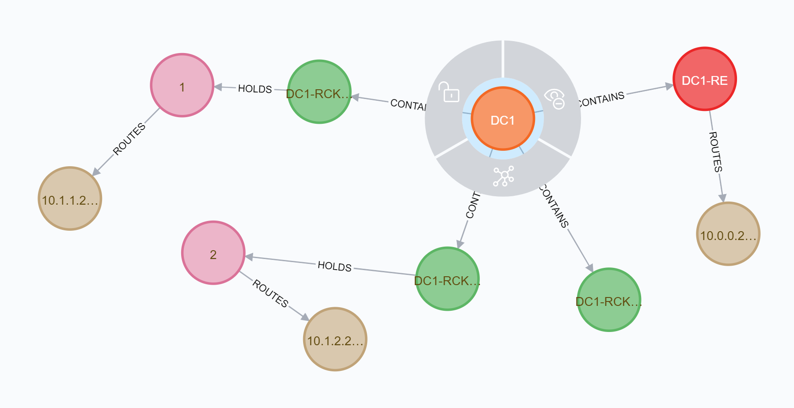
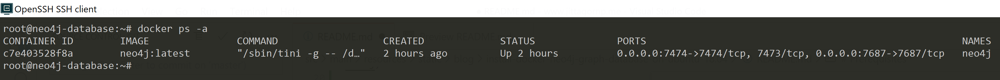
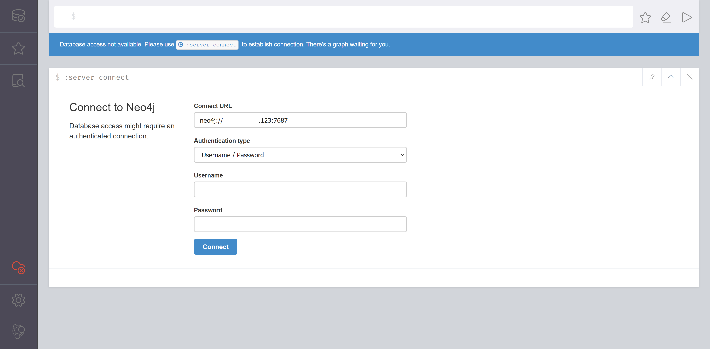
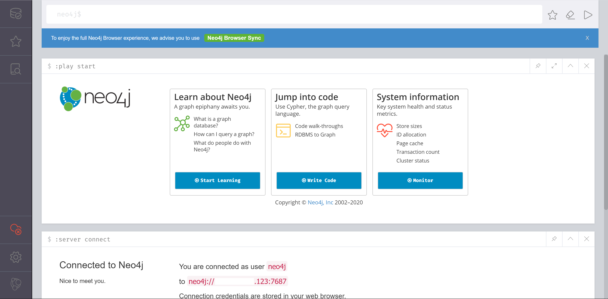
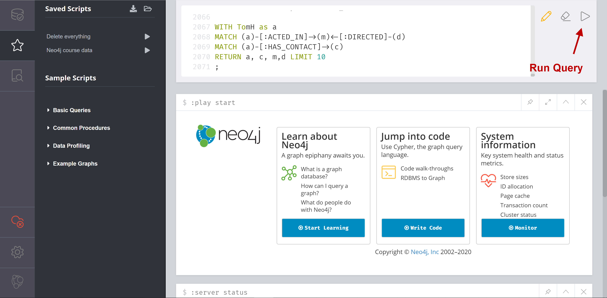
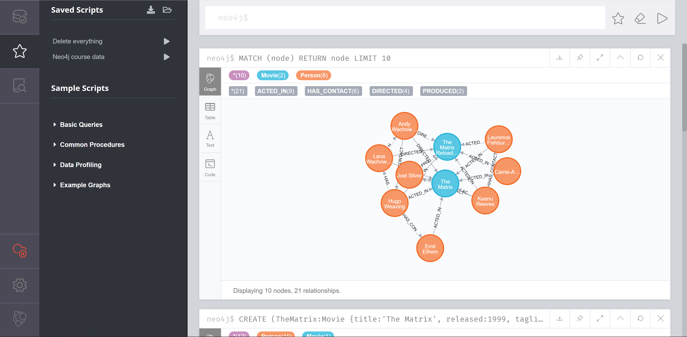

# ติดตั้ง Neo4j Graph Database ด้วย Docker บน Ubuntu 18.04


# ทำความรู้จักกับ Neo4j 

Neo4j เป็น Graph Database ยี่ห้อนึง 



ที่มีทั้งแบบ Free และแบบเสียตังค์ 
- แบบ Free เราจะเรียกว่า Community Edition 
- แบบ เสียตังค์ เราจะเรียกว่า Enterprise Edition 

ต่างกันที่ 
- แบบ Free จะมีการจำกัดจำนวนของ Nodes, Relations, Properties และ Features บางอย่าง ให้ใช้งานได้อย่างจำกัด  
- แต่แบบเสียตังค์ จะเป็น Ulimited พร้อม Feaure อื่น ๆ  

การติดตั้งด้วย Docker ในบทความนี้ เราจะใช้ Image จาก Official [https://hub.docker.com/_/neo4j](https://hub.docker.com/_/neo4j)  
  
แบบ Free และแบบเสียตังค์ จะต่างกันตรง Image Tag 
  
> ถ้าแบบเสียตังค์ Image Tag จะมี `-enterprise` หรือ `enterprise` ต่อท้าย

ซึ่งในบทความนี้ เราจะติดตั้งกันเป็นแบบ Free ด้วย Image `neo4j:latest`

# Prerequisites

- Linux Ubuntu 18.04 LTS
  - CPU : 1 vCPUs
  - RAM : 1 GB 
- Docker (สามารถติดตั้งได้ตามนี้ : [ติดตั้ง Docker บน Ubuntu 18.04](/blog/install-docker-on-ubuntu-18.04/))

# ติดตั้ง
```sh
$ docker run -d \
--name neo4j \
-p 7474:7474 -p 7687:7687 \
-v $HOME/neo4j/data:/data \
-v $HOME/neo4j/logs:/logs \
-v $HOME/neo4j/import:/var/lib/neo4j/import \
-v $HOME/neo4j/plugins:/plugins \
--env NEO4J_AUTH=<DATA_BASE_USERNAME>/<DATA_BASE_PASSWORD> \
--env NEO4J_dbms_connector_https_advertised__address="<SERVER_IP>:7473" \
--env NEO4J_dbms_connector_http_advertised__address="<SERVER_IP>:7474" \
--env NEO4J_dbms_connector_bolt_advertised__address="<SERVER_IP>:7687" \
neo4j:latest

```

ดูผลลัพธ์

```sh
$ docker ps -a
```



# อธิบาย

### 1. Expose Ports
เวลาติดตั้ง Neo4j เราจะต้อง Expose Port อย่างน้อย 2 Ports จากทั้งหมด 3 Ports เพื่อ Remote Access คือ 

- `7474` for HTTP (สำหรับเข้าสู่หน้า Neo4j Browser แบบ Http)
- `7473` for HTTPS (สำหรับเข้าสู่หน้า Neo4j Browser แบบ Https)
- `7687` for Bolt (สำหรับ Neo4j Database Connection)

จาก Script เรา Expose แค่ 2 Ports เนื่องจาก เราไม่ได้เปิด Https    

> ถ้าจะทำ Https เราต้องทำเพิ่มเติมเอง ซึ่งตาม Default แล้ว Docker Image นี้ไม่ได้มี Https มาให้ 

### 2. Mount Volumes

- $HOME/neo4j/data:/data (สำหรับเก็บ Data ออกมาไว้นอก Container)
- $HOME/neo4j/logs:/logs (สำหรับเก็บ Log ไว้นอก Container)
- $HOME/neo4j/import:/var/lib/neo4j/import (สำหรับเก็บพวก CSV file หรือ Script ต่าง ๆ ที่เราต้องการนำไป import เข้า Database)
- $HOME/neo4j/plugins:/plugins (สำหรับเก็บ Plugins ต่าง ๆ)

### 3. กำหนด Env Config 

กำหนด Default Username/Password สำหรับ Login เข้า Database
```plaintext
--env NEO4J_AUTH=<DATA_BASE_USERNAME>/<DATA_BASE_PASSWORD>
```
ถ้าไม่ต้องการให้มี Username/Password ก็ให้กำหนดเป็น
```plaintext
--env NEO4J_AUTH=none
```

กำหนด Configuration ต่าง ๆ สำหรับ Neo4j Browser (เป็น Tool สำหรับ Query Data บน Browser คล้าย ๆ `phpMyAdmin`)
```plaintext
--env NEO4J_dbms_connector_https_advertised__address="<SERVER_IP>:7473"
--env NEO4J_dbms_connector_http_advertised__address="<SERVER_IP>:7474"
--env NEO4J_dbms_connector_bolt_advertised__address="<SERVER_IP>:7687"
```

ถ้าเราไม่กำหนด เวลาเปิด Neo4j Browser ด้วย IP อื่น ๆ จะทำให้ ไม่สามารถ Login หรือ Query data จาก Database ได้ เนื่องจาก Connection จะ Default เป็น `localhost`  

### หมายเหตุ 

ถ้าใครใช้งาน Docker ไม่คล่อง สามารถอ่านเพิ่มเติมได้จาก [พื้นฐาน Docker](https://docs.google.com/presentation/d/1NXArkIDFIJMmcvXY63cc5z7jIsbx8SDZqt76RqeuGwU/edit?usp=sharing)

# เปิด Neo4j Browser

เมื่อ Run Container เสร็จ ลองเข้าไปที่ 

> http://<SERVER_IP>:7474 

จากนั้น Connect ด้วย Username/Password ตามที่กำหนดไว้ 



เข้าใช้งานได้ปกติ 



# ลอง Run Data

ใช้ Data จากลิงค์นี้ 

- [Create Data](./data/create-data.txt)
- [Clear Data](./data/delete-data.txt)

ลอง Run ดู (อย่าลืม Bookmark ตรงรูปดาวไว้ด้วย)

 

# ลอง Query ข้อมูลด้วยภาษา Cypher ดู

```plaintext
MATCH (node) 
RETURN node 
LIMIT 10
```

ผลลัพธ์



# ลองเขียน Code ต่อ Database ดู

- [ตัวอย่าง Spring-boot Reactive Neo4j Graph Database](https://github.com/jittagornp/spring-boot-reactive-neo4j-example)

# เพิ่มเติม

ถ้าใครอยากลองเล่น Neo4j แบบไม่ต้องติดตั้ง สามารถเข้าไปลองเล่นได้ที่ [https://sandbox.neo4j.com/](https://sandbox.neo4j.com/) 

# Reference 

- [https://neo4j.com/developer/get-started/](https://neo4j.com/developer/get-started/)
- [https://neo4j.com/developer/docker-run-neo4j/](https://neo4j.com/developer/docker-run-neo4j/)
