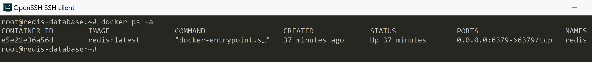
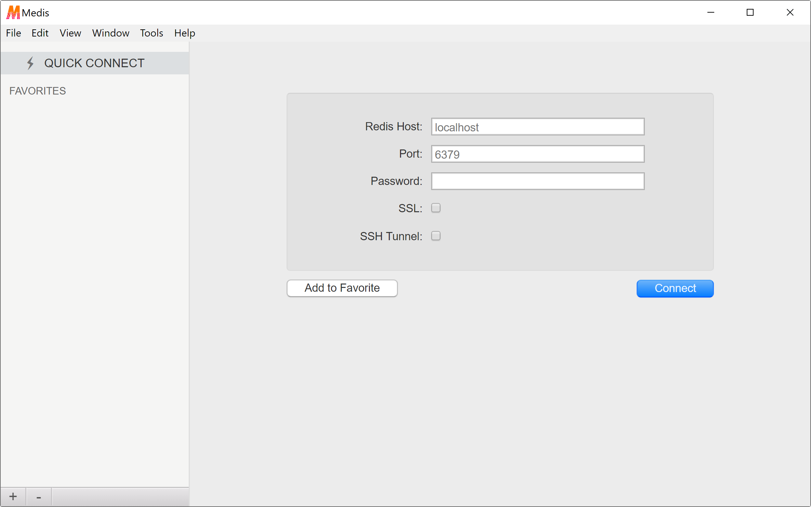
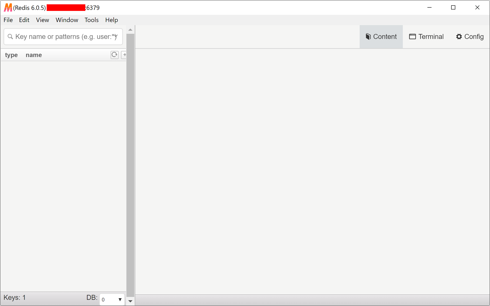
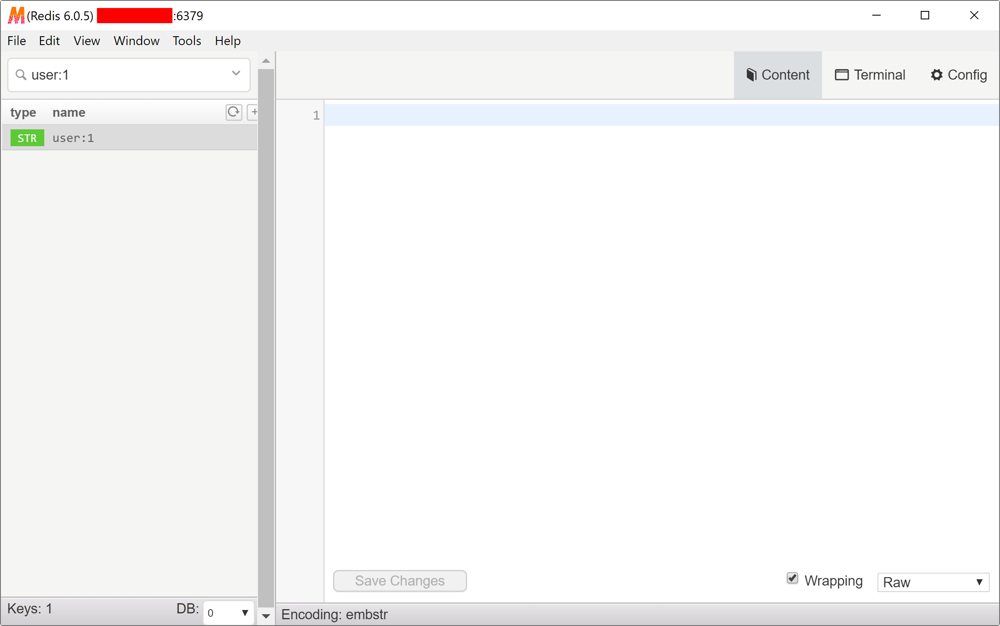
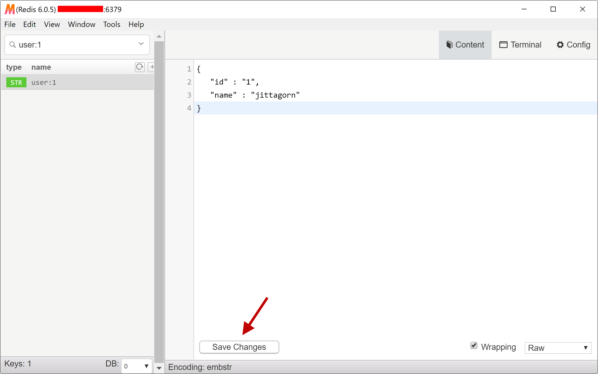
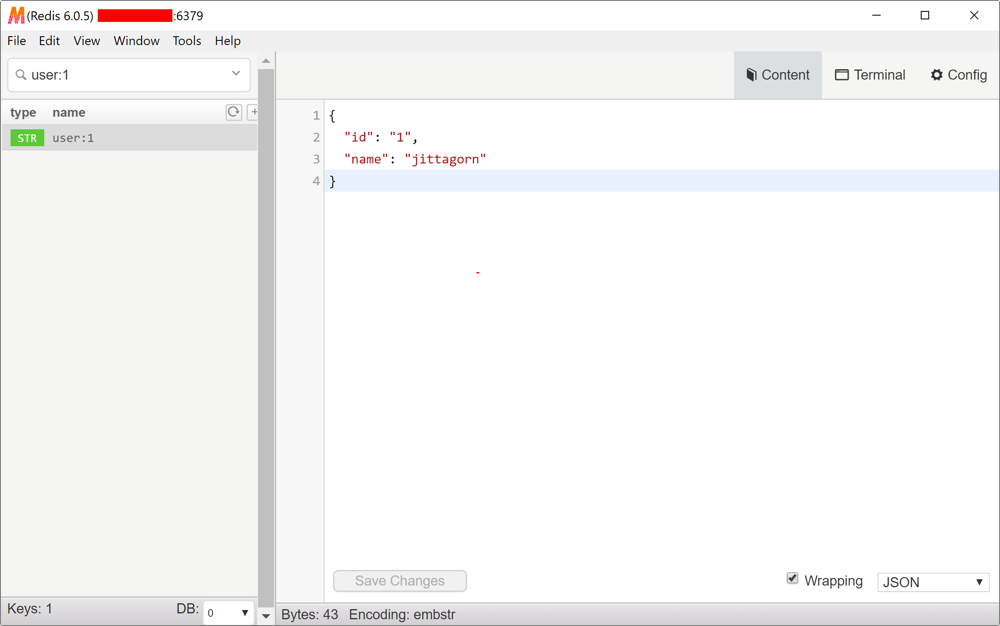
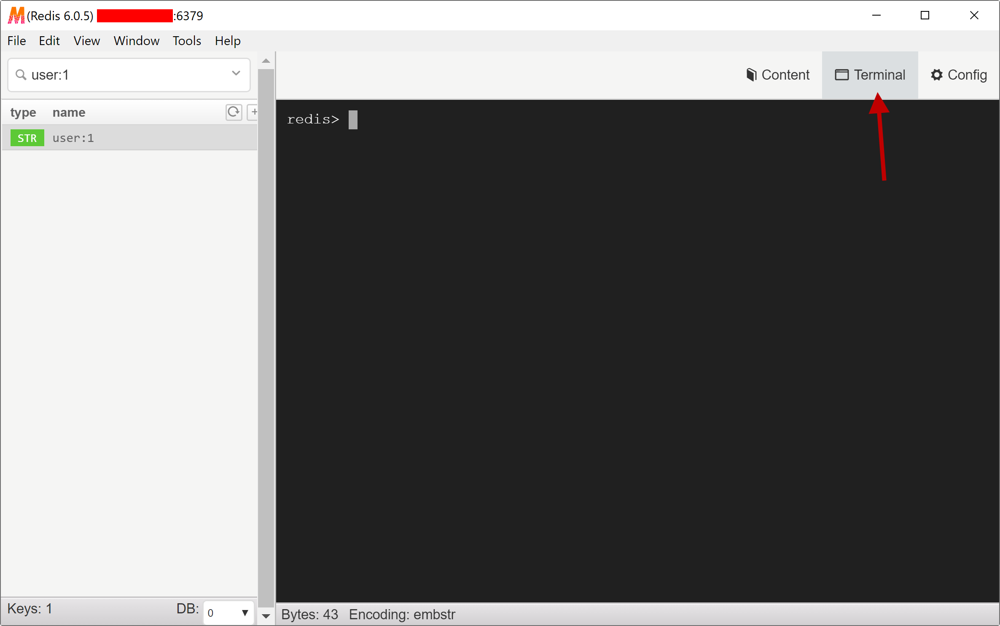
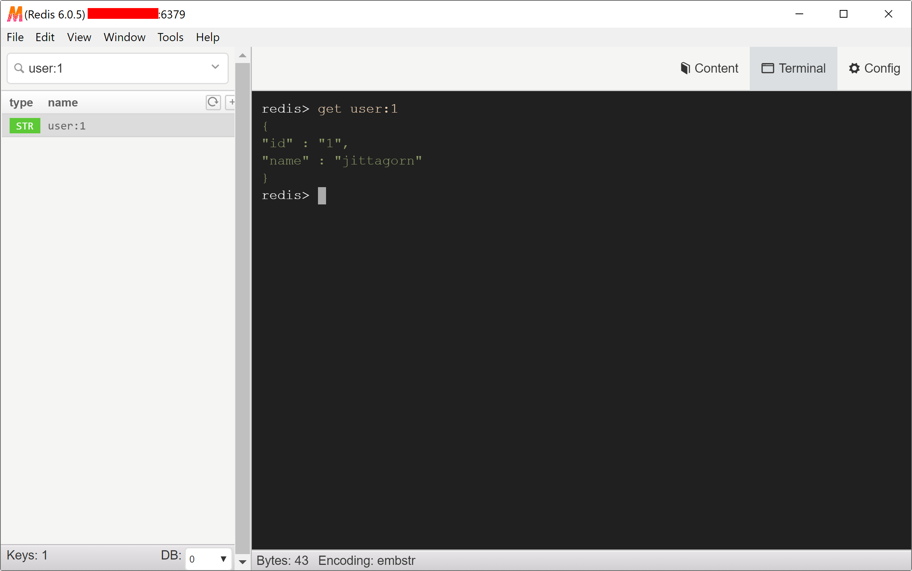

# ติดตั้ง Redis ด้วย Docker บน Ubuntu 18.04


> Redis เป็น Open Source Key/Value Database ตัวนึง เหมาะสำหรับการเอามาทำ Caching เพราะเก็บ Data ไว้บน Memory ทำให้ Access ได้เร็วกว่า Database ประเภทอื่น ๆ มี Feature ต่าง ๆ ให้ใช้มากมาย รวมทั้งยังสามาถทำการ Scale Out ในรูปแบบของ Cluster ได้ 

- [https://redis.io/](https://redis.io/)

# Prerequisites

- Linux Ubuntu 18.04 LTS
  - CPU : 1 vCPUs
  - RAM : 1 GB
- Docker (สามารถติดตั้งได้ตามนี้ : [ติดตั้ง Docker บน Ubuntu 18.04](/blog/install-docker-on-ubuntu-18.04/))

# ติดตั้ง Redis Server 

ในที่นี้เราจะใช้ Docker Image จาก Official [https://hub.docker.com/_/redis/](https://hub.docker.com/_/redis/)

### แบบ Simple 

```sh
$ docker run -d \
-p 6379:6379 \
-v /root/redis/data:/data \
--name redis \
--restart=always \
redis:latest \
--requirepass <DATABASE_PASSWORD>
```

### แบบกำหนด redis.conf เอง 

```sh
$ docker run -d \
-p 6379:6379 \
-v /root/redis/data:/data \
-v /root/redis/redis.conf:/usr/local/etc/redis/redis.conf \
--name redis \
--restart=always \
redis:latest \
redis-server /usr/local/etc/redis/redis.conf \
--requirepass <DATABASE_PASSWORD>
```

ดูผลลัพธ์

```sh
$ docker ps -a
```



# อธิบาย

### 1. Expose Port

กำหนด Port เป็น 6379 (Default Port ของ Redis)

### 2. Mount Volumes

อันนี้ Mount เผื่อไว้ ในกรณีที่เรามีการ Config ให้ Redis เก็บ Data ลง Storage (Disk) ด้วย 

```sh
-v /root/redis/data:/data \
```

อันนี้กำหนดให้ Redis ใช้ Configuration ของเราแทน Default Configuration 

```sh
-v /root/redis/redis.conf:/usr/local/etc/redis/redis.conf \
```
  
Redis Configuration สามารถเรียนรู้ได้จาก 

- [https://redis.io/topics/config](https://redis.io/topics/config)

### 3. กำหนด Password 

อย่าลืมกำหนด `DATABASE_PASSWORD` ด้วย

```sh
--requirepass <DATABASE_PASSWORD>
```

# ติดตั้งโปรแกรม Medis 

Medis เป็น GUI Tool สำหรับเชื่อมต่อและ Query ดูข้อมูลบน Redis Server ที่เราได้ติดตั้งไว้
  
โปรแกรม Medis สามารถ Download ได้ที่ 

 - [https://github.com/luin/medis/releases](https://github.com/luin/medis/releases)

 

 ระบุ Redis Server IP, Port, และ Password เพื่อ Login   

 

# ลอง Create Data

Create Key


ได้ Key มา 1 Key



พิมพ์ String Data ลงไป จากนั้นกด Save 



เราก็จะได้ Key/Value มา 1 ค่า



# ลอง Query ผ่าน Terminal 



ลอง Query ดู

```sh
redis > get user:1
```



# การทำ Cluster 

สามารถทำตามตัวอย่างนี้ได้ 

- [https://github.com/jittagornp/redis-cluster-example](https://github.com/jittagornp/redis-cluster-example)

# Reference

- [https://hub.docker.com/_/redis/](https://hub.docker.com/_/redis/)
- [https://redis.io/documentation](https://redis.io/documentation)