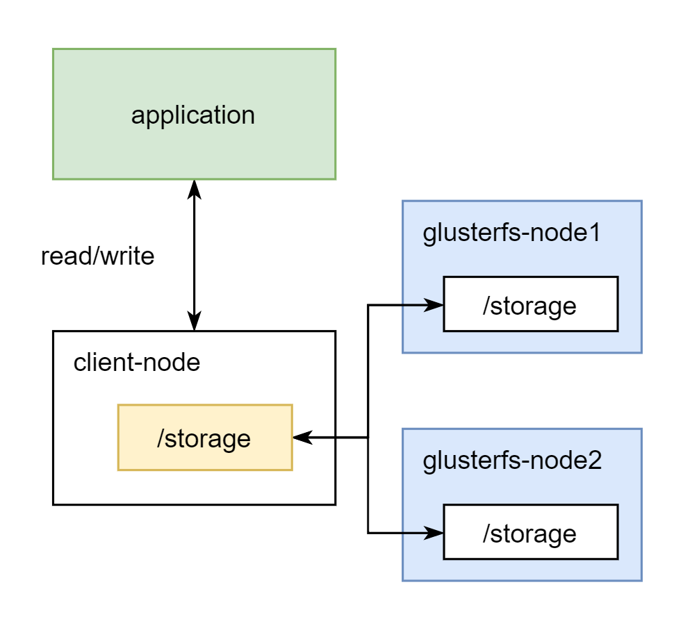

# Install GlusterFS (Distribute Storage) on Ubuntu 18.04 



# Environments

- Linux Ubuntu 18.04    
- Nodes  
```plaintext
1. client-node : xxxxx  
2. glusterfs-node1 : 10.130.15.87
3. glusterfs-node2 : 10.130.117.8    
```

# Steps
1. Install `glusterfs-server` on Storage Server
2. Create Mount Point on Storage Server  
3. Set Storage Pool 
4. Create Volume
5. Install `glusterfs-client` 
6. Create Mount Point on Client
7. Bind Mount Point from Client to Storage Volume 

# On glusterfs-node1 & glusterfs-node2 

1) edit hosts (map ip & hostname) 
```sh
$ vi /etc/hosts
```
add configs
```
10.130.15.87 glusterfs-node1
10.130.117.8 glusterfs-node2
```
2) install software-properties-common  
```sh
$ sudo apt install software-properties-common -y
```
3)  download glusterfs public-key  
see version on [https://download.gluster.org/pub/gluster/glusterfs/](https://download.gluster.org/pub/gluster/glusterfs/)
```sh
$ wget -O- https://download.gluster.org/pub/gluster/glusterfs/6/rsa.pub | apt-key add -  
```
4) add repository
```sh
$ sudo add-apt-repository ppa:gluster/glusterfs-6  
```
5) install glusterfs 
```sh
$ sudo apt install glusterfs-server -y
```
6) start glusterfs service
```sh
$ sudo systemctl start glusterd
```
7) enabled run everytime at system boot 
```sh
$ sudo systemctl enable glusterd
```
8) show glusterfs status
```sh
$ systemctl status glusterd
```
9) show glusterfs version
```sh
$ glusterfsd --version
```
10) create directory for share in cluster 
```sh
$ mkdir -p /storage
```
# Only glusterfs-node1
  
1) add server to glusterfs storage pool
```sh
$ gluster peer probe glusterfs-node2  
```
2) check status
```sh
$ gluster peer status
```
3) show list 
```sh
$ gluster pool list  
```
4) create volume (select 4.1 or 4.2)   
  
4.1) replica 
```sh
$ gluster volume create volume-01 replica 2 transport tcp \
glusterfs-node1:/storage \
glusterfs-node2:/storage \
force
```
4.2) distribute  
```sh
$ gluster volume create volume-01 transport tcp \
glusterfs-node1:/storage \
glusterfs-node2:/storage \
force
```
> `volume-01` is name of volume   

5) start volume 
```sh
$ gluster volume start volume-01  
```
6) show volume info  
```sh
$ gluster volume info volume-01   
```

# On client-node

1) edit hosts (map ip & hostname) 
```sh
$ vi /etc/hosts
```
add configs
```
10.130.15.87 glusterfs-node1
10.130.117.8 glusterfs-node2
```
2)  download glusterfs public-key  
see version on [https://download.gluster.org/pub/gluster/glusterfs/](https://download.gluster.org/pub/gluster/glusterfs/)
```sh
$ wget -O- https://download.gluster.org/pub/gluster/glusterfs/6/rsa.pub | apt-key add -  
```
3) add repository
```sh
$ sudo add-apt-repository ppa:gluster/glusterfs-6  
```
4) install glusterfs client 
```sh
$ sudo apt install glusterfs-client -y
```
5) create mount directory 
```sh
$ mkdir -p /storage  
``` 
6) mount to volumn (glusterfs-node1:/volume-01)
```sh
$ sudo mount -t glusterfs glusterfs-node1:/volume-01 /storage  
```
> `/storage` is directory on `client-node`   

7) check available volume
```sh
$ df -h /storage  
```
> `/storage` is directory on `client-node`   

8) set permanent mount 
```sh
$ vim /etc/fstab
```
add configuration
```plaintext
glusterfs-node1:/volume-01 /storage glusterfs defaults,_netdev 0 0  
```

# Test On Client-node

try create empty file file01, file02, file03  
```sh
$ cd /storage
$ touch file01 file02 file03  
```

# On glusterfs-node1 & glusterfs-node2
show file on glusterfs node
```sh
$ cd /storage
$ ll
```

# Reference  

[https://www.howtoforge.com/tutorial/high-availability-storage-with-glusterfs-on-ubuntu-1804/](https://www.howtoforge.com/tutorial/high-availability-storage-with-glusterfs-on-ubuntu-1804/)
