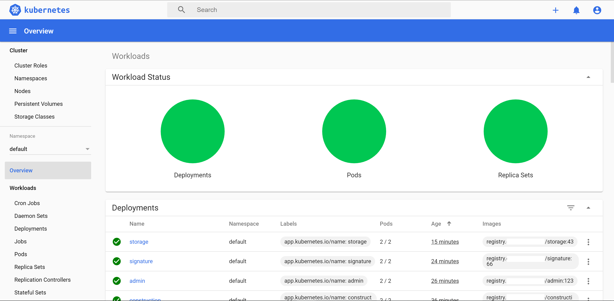
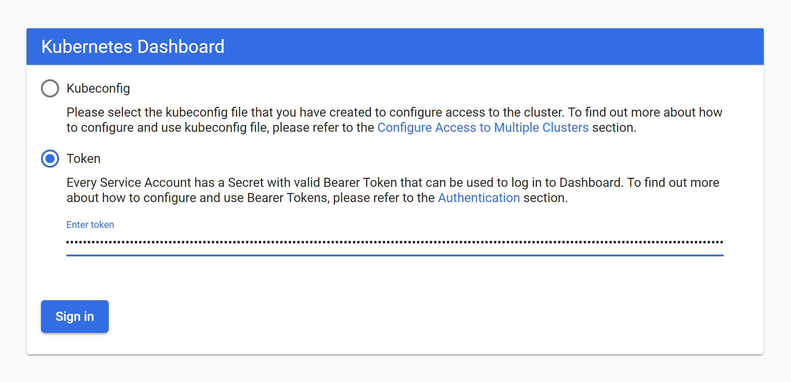
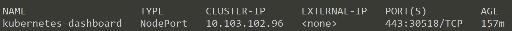

# ติดตั้ง Kubernetes Dashboard (Web GUI) สำหรับ Monitor Kubernetes Cluster 



# Prerequisites

- จะต้องติดตั้ง Kubernetes เป็นที่เรียบร้อยแล้ว สามารถเรียนรู้และติดตั้งได้จาก [ติดตั้ง Kubernetes บน Ubuntu 18.04](/blog/install-kubernetes-on-ubuntu-18.04/?series=k8s)

# Steps

1. ติดตั้ง (`apply`) Dashboard บน Master Node  
2. Create User สำหรับเข้าใช้งาน Dashboard  
3. ดู Token ของ User 
4. Expose Dashboard Service 
5. ทดสอบเข้าใช้งาน Dashboard 

# 1. ติดตั้ง (apply) Dashboard บน Master Node

Kubernetes Dashboard จะมีการออก version เรื่อย ๆ ให้เราเข้าไปดูที่ **GitHub** ของ Kubernetes ว่า Dashboard version ปัจจุบันเป็น version อะไร ที่หน้าจอนี้

- [https://github.com/kubernetes/dashboard/releases](https://github.com/kubernetes/dashboard/releases)

กรณีที่ Master Node เคยลง Dashboard ไว้แล้ว ให้ทำการลบ Dashboard เก่าออกก่อนด้วยคำสั่ง 

```sh
$ kubectl delete ns kubernetes-dashboard  
```

จากนั้น ก็ติดตั้ง Dashboard version ที่ต้องการลงไป   
  
ณ ตอนนี้ Dashboard เป็น version `v2.0.0-rc5` ให้ทำการติดตั้งบน Master Node ดังนี้  

```sh
$ kubectl apply -f https://raw.githubusercontent.com/kubernetes/dashboard/v2.0.0-rc5/aio/deploy/recommended.yaml
```

# 2. Create User สำหรับเข้าใช้งาน Dashboard 

การ Create User จะเป็นการ Create Kubernetes Kind  

- `ServiceAccount` และ 
- `ClusterRoleBinding` 

ทำการเขียน File `.yml` ขึ้นมา โดยอาจจะตั้งชื่อ File ว่า `dashboard-user.yml` ดังนี้  
  
dashboard-user.yml
```yml 
apiVersion: v1
kind: ServiceAccount
metadata:
  name: admin-user
  namespace: kubernetes-dashboard
---
apiVersion: rbac.authorization.k8s.io/v1
kind: ClusterRoleBinding
metadata:
  name: admin-user
roleRef:
  apiGroup: rbac.authorization.k8s.io
  kind: ClusterRole
  name: cluster-admin
subjects:
- kind: ServiceAccount
  name: admin-user
  namespace: kubernetes-dashboard
```

ทำการ apply dashboard-user.yml ดังนี้  

```sh
$ kubectl apply -f ./dashboard-user.yml
```
output
```plaintext
serviceaccount/admin-user created
clusterrolebinding.rbac.authorization.k8s.io/admin-user created
```

ตอนนี้ User ได้ถูกสร้างขึ้นมาแล้ว  

# 3. ดู Token ของ User



เมื่อเราติดตั้งทุกอย่างเสร็จ และต้องการเข้าใช้งาน Dashboard เราสามารถ Login เข้าใช้งานได้ 2 วิธี คือ 

1. การใช้ Kubernetes Config File (.yml) หรือ Kubernetes Kind `Config` กับ
2. การใช้ Token 

ในบทความนี้ เราจะใช้ Token ในการ Login เข้าใช้งานกัน   
  
ให้พิมพ์คำสั่งต่อไปนี้ เพื่อดูข้อมูล Token ของ User ที่เราพึ่งสร้างไปในข้อ 2  

```sh
$ kubectl -n kubernetes-dashboard describe secret $(kubectl -n kubernet es-dashboard get secret | grep admin-user | awk '{print $1}')
```

มันจะแสดงข้อมูลแบบนี้

```plaintext
Name:         admin-user-token-t2bsx
Namespace:    kubernetes-dashboard
Labels:       <none>
Annotations:  kubernetes.io/service-account.name: admin-user
              kubernetes.io/service-account.uid: 80cec2ee-2d68-4eec-8b2a-2c3c0686b1ef

Type:  kubernetes.io/service-account-token

Data
====
ca.crt:     1025 bytes
namespace:  20 bytes
token:      eyJhbGciOiJSUzI1NiIsImtpZCI6Ilk0....
```

ให้เรา Copy Token เก็บไว้   

# 4. Expose Dashboard Service
 
ปกติตาม Tutorial ต่าง ๆ หรือ Tutorial ของ Kubernetes เอง ถ้าเราจะเข้าใช้งาน Dashboard เลย เราจะ run Command ดังนี้  

```sh
$ kubectl proxy  
```

ก็จะสามารถเข้าใช้งาน Dashboard ผ่าน Url นี้ได้เลย    

[http://localhost:8001/api/v1/namespaces/kubernetes-dashboard/services/https:kubernetes-dashboard:/proxy/](http://localhost:8001/api/v1/namespaces/kubernetes-dashboard/services/https:kubernetes-dashboard:/proxy/)
   
แต่วิธีนี้ จะใช้ได้ ก็ต่อเมื่อ เรากำลังอยู่บนเครื่อง Master Node เท่านั้น เพราะมันเป็น `localhost` เราเลยจะเข้าใช้งานด้วยวิธีนี้จาก External Network ไม่ได้

ถ้าอยากให้เข้าใช้งาน Dashboard จาก External Network ได้ ให้ทำดังนี้  
  
แก้ Kubernetes Dashboard Service ให้เปลี่ยนจาก type **ClusterIP** ไปเป็น **NodePort** เพื่อทำการ Expose Service ออกข้างนอก ให้เราสามารถ Access จากที่ใด ๆ ก็ได้ 

```sh
$ kubectl -n kubernetes-dashboard edit service kubernetes-dashboard  
```

output
```yml
# Please edit the object below. Lines beginning with a '#' will be ignored,
# and an empty file will abort the edit. If an error occurs while saving this file will be
# reopened with the relevant failures.
#
apiVersion: v1
...
  name: kubernetes-dashboard
  namespace: kubernetes-dashboard
  resourceVersion: "343478"
  selfLink: /api/v1/namespaces/kubernetes-dashboard/services/kubernetes-dashboard
  uid: 8e48f478-993d-11e7-87e0-901b0e532516
spec:
  clusterIP: 10.100.124.90
  externalTrafficPolicy: Cluster
  ports:
  - port: 443
    protocol: TCP
    targetPort: 8443
  selector:
    k8s-app: kubernetes-dashboard
  sessionAffinity: None
  type: ClusterIP
status:
  loadBalancer: {}
```

แก้ตรง `type: ClusterIP` ไปเป็น `type: NodePort`   
จากนั้น save เก็บไว้เหมือนเดิม
   
### หมายเหตุ

ระบบเป็น vi editor แก้เสร็จให้กด `Esc` แล้วพิมพ์ `:wq` แล้ว Enter เพื่อ save
  
จากนั้นลอง show Service ดูว่าที่แก้ไป ค่าเปลี่ยนจริงมั้ย  

```sh
$  kubectl -n kubernetes-dashboard get service kubernetes-dashboard
```
output



อ่านเพิ่มเติมที่หน้านี้

- [https://github.com/kubernetes/dashboard/blob/master/docs/user/accessing-dashboard/1.7.x-and-above.md](https://github.com/kubernetes/dashboard/blob/master/docs/user/accessing-dashboard/1.7.x-and-above.md)

# 5. ทดสอบเข้าใช้งาน Dashboard 

เข้าใช้งานดังนี้

> https://`<MASTER_NODE_IP>`:30518


Port `30518` ระบบ Generate ขึ้นมาให้เอง (แต่ละคนไม่เหมือนกัน) ให้ดูจากข้อด้านบน  ตอน show Service  
  
จากนั้น Copy Token จากข้อ 3 มา Login เข้า Dashboard ก็เป็นอันเสร็จสิ้นขั้นตอนทั้งหมด     

# Reference

- [https://kubernetes.io/docs/tasks/access-application-cluster/web-ui-dashboard/](https://kubernetes.io/docs/tasks/access-application-cluster/web-ui-dashboard/)
- [https://github.com/kubernetes/dashboard](https://github.com/kubernetes/dashboard)
