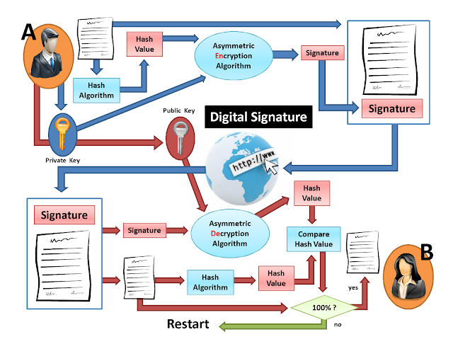
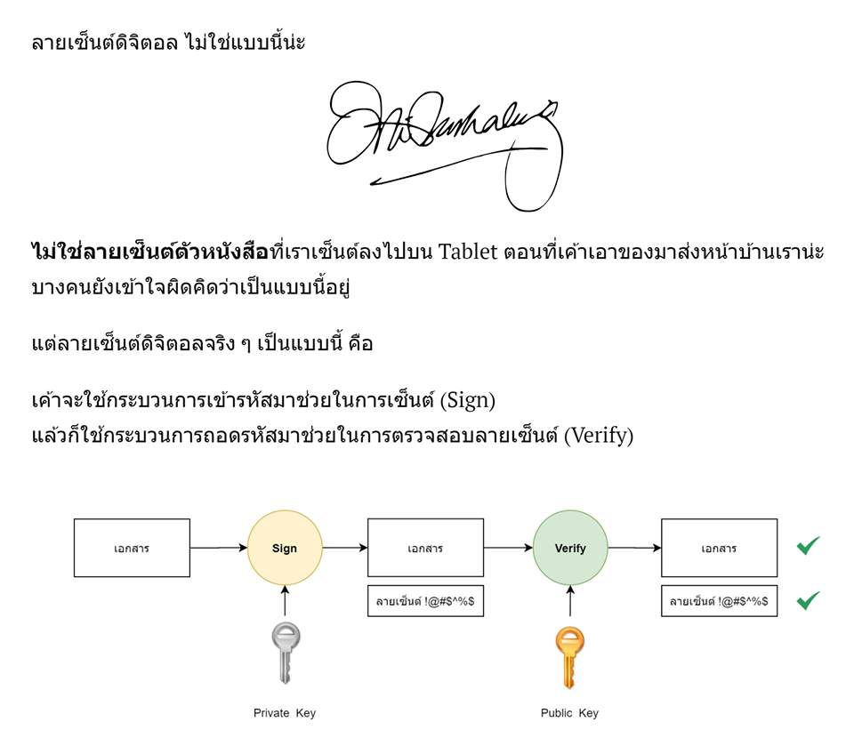
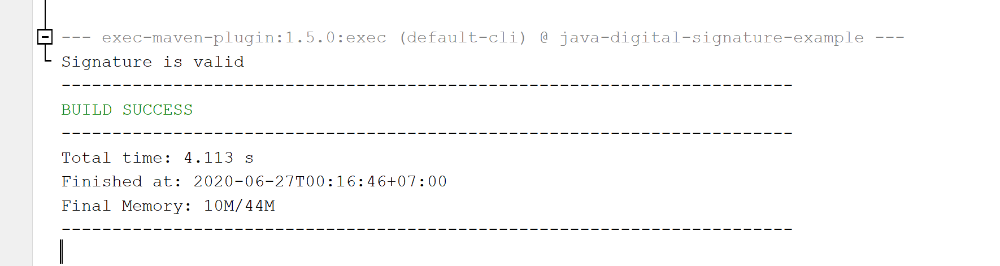

# การทำลายเซ็นต์ดิจิตอล (Digital Signature) อย่างง่าย ด้วยภาษา Java



# ความเข้าใจผิด



# ทฤษฎี 

จากบทความ

- [กระบวนการทำลายเซ็นต์ดิจิตอล (Digital Signature Methodology)](/blog/digital-signature-methodology/) และ 
- [Public Key / Private Key คืออะไร สร้างยังไง แล้วเอาไปใช้ทำอะไรได้บ้าง (ตัวอย่าง Code ภาษา Java)](/blog/what-is-public-key-private-key/)

เราสามารถนำทั้ง 2 บทความมาเป็นพื้นฐานที่ใช้ในการเขียนโปรแกรมสำหรับการทำลายเซ็นต์ดิจิตอล (Digital Signature) อย่างง่าย ได้ดังนี้ 

# 1. เตรียม Data ต้นทางที่จะเอามา Sign 

ในที่นี้จะกำหนดอย่างง่าย ๆ เป็น 

```java
final String document = "Hello World";
final byte[] documentBytes = document.getBytes();
```

# 2. เตรียม Private Key / Public Key ที่จะเอาไว้ Sign และ Verify 

KeyPair ในที่นี้จะใช้การ Generate ด้วย Algorithm  **EC (Elliptic Curve Algorithm)** โดยกำหนด Curve name เป็น `secp256r1`   

```java
private static KeyPair getKeyPair() throws NoSuchAlgorithmException, InvalidAlgorithmParameterException {
    final KeyPairGenerator keyPairGenerator = KeyPairGenerator.getInstance("EC");
    keyPairGenerator.initialize(new ECGenParameterSpec("secp256r1"), new SecureRandom());
    return keyPairGenerator.generateKeyPair();
}
```

### หมายเหตุ 

EC Curve name สามารถดูได้จาก

- [Naming elliptic curves used in cryptography](https://www.johndcook.com/blog/2019/02/15/elliptic-curve-names/)

# 3. กำหนด Signature Algorithm ว่าจะ Sign / Verify ด้วย Algorithm ใด

ในที่นี้ใช้ `SHA256withECDSA` คือ ใช้ Hash Function แบบ **SHA256** และ Verify ด้วย Public Key แบบ **ECDSA (Elliptic Curve Digital Signature Algorithm)**

```java
private static Signature getSignature() throws NoSuchAlgorithmException {
    return Signature.getInstance("SHA256withECDSA");
}
```

# 4. ทำการ Sign 

โดยใช้ Factors จากข้อ 1 - 3 

```java
//1. Define Data
final String document = "Hello World";
final byte[] documentBytes = document.getBytes();
//====================================================

//2. Define KeyPair
final KeyPair keyPair = getKeyPair();
final PublicKey publicKey = keyPair.getPublic();
final PrivateKey privateKey = keyPair.getPrivate();

//3. Define Signature
final Signature signature = getSignature();
//====================================================

//4. Sign Data
signature.initSign(privateKey);
signature.update(documentBytes);
final byte[] signatureBytes = signature.sign();
//====================================================
```

### หมายเหตุ

> การ Sign เราจะ Sign ด้วย Private Key ของผู้ส่ง (เจ้าของ Data)

ผลลัพธ์ เราจะได้ `signatureBytes` หรือ ลายเซ็นต์ดิจิตอล (Digital Signature) มา  
     
ซึ่ง Byte นี้ คือ Byte ที่ถูก Sign มาแล้ว เราสามารถนำไป Save เก็บไว้ เพื่อที่จะได้นำมา Verify ในภายหลังได้ 

# 5. ทำการ Verify Signature เทียบกับ Data 

เพื่อเช็คความถูกต้องของ Data ว่ามีการแก้ไขเปลี่ยนแปลงไปหรือไม่ จาก Signature ที่เคย Sign ไว้ 

```java
//5. Verify Data 
signature.initVerify(publicKey);

//Compare Data and Signature
signature.update(documentBytes);
final boolean isValid = signature.verify(signatureBytes);
if (isValid) {
    System.out.println("Signature is valid");
} else {
    System.out.println("Signature is not valid");
}
```

### หมายเหตุ

> การ Verify เราจะ Verify ด้วย Public Key ของผู้ส่ง (เจ้าของ Data)

# Code เต็ม ๆ

```java
package me.jittagornp.example.digitalsignature;

import java.security.InvalidAlgorithmParameterException;
import java.security.InvalidKeyException;
import java.security.KeyPair;
import java.security.KeyPairGenerator;
import java.security.NoSuchAlgorithmException;
import java.security.PrivateKey;
import java.security.PublicKey;
import java.security.SecureRandom;
import java.security.Signature;
import java.security.SignatureException;
import java.security.spec.ECGenParameterSpec;

/**
 * @author jitta
 */
public class DigitalSignatureExample {

    private static KeyPair getKeyPair() throws NoSuchAlgorithmException, InvalidAlgorithmParameterException {
        final KeyPairGenerator keyPairGenerator = KeyPairGenerator.getInstance("EC");
        keyPairGenerator.initialize(new ECGenParameterSpec("secp256r1"), new SecureRandom());
        return keyPairGenerator.generateKeyPair();
    }

    private static Signature getSignature() throws NoSuchAlgorithmException {
        return Signature.getInstance("SHA256withECDSA");
    }

    public static void main(String[] args) throws NoSuchAlgorithmException, InvalidKeyException, SignatureException, InvalidAlgorithmParameterException {

        //1. Define Data
        final String document = "Hello World";
        final byte[] documentBytes = document.getBytes();
        //====================================================

        //2. Define KeyPair
        final KeyPair keyPair = getKeyPair();
        final PublicKey publicKey = keyPair.getPublic();
        final PrivateKey privateKey = keyPair.getPrivate();

        //3. Define Signature
        final Signature signature = getSignature();
        //====================================================

        //4. Sign Data
        signature.initSign(privateKey);
        signature.update(documentBytes);
        final byte[] signatureBytes = signature.sign();
        //====================================================

        //5. Verify Data
        signature.initVerify(publicKey);

        //Compare Data and Signature
        signature.update(documentBytes);
        final boolean isValid = signature.verify(signatureBytes);
        if (isValid) {
            System.out.println("Signature is valid");
        } else {
            System.out.println("Signature is not valid");
        }

    }

}
```

Run 


 
# เพิ่มเติม 

การใช้งานจริง ๆ จะซับซ้อนกว่านี้ ตรงที่ Public Key ที่ได้มา ควรที่จะได้มาจาก X.509 Certificate เพื่อรับรองว่า Public Key นั้นเป็นของเจ้าของคนที่เราเอามา Verify จริง ๆ

### หมายเหตุ

X.509 Certificate สามารถอ่านได้จาก

- [ทำความรู้จักกับ X.509 Certificate พื้นฐานสำหรับการทำ Https และ Security อื่น ๆ](/blog/what-is-x509-certificate/)

นอกจากนั้น ยังมีเรื่องของการ Set Time Stamp จาก **TSA (Time Stamp Authority)** เพื่อเอาไว้ รับรองเรื่องเวลาที่ใช้ในการ Sign อีกด้วย 

# Source Code

- [https://github.com/jittagornp/java-digital-signature-example](https://github.com/jittagornp/java-digital-signature-example)

# Reference 

- [https://www.tutorialspoint.com/java_cryptography/java_cryptography_verifying_signature.htm](https://www.tutorialspoint.com/java_cryptography/java_cryptography_verifying_signature.htm)