# ทำความรู้จักกับ Java I/O Stream

ผมมองว่าเรื่อง Java I/O Stream เป็นเรื่องนึงที่อธิบายให้เห็นภาพได้ค่อนข้างยาก  เพราะมันมีขั้นตอนการเขียนเยอะแยะมากมาย  ที่ทำให้คนจับ java ใหม่ๆ ไม่อยากจะยุ่งกับเรื่องนี้

แต่วันนี้ผมจะพยายามอธิบายด้วยคำพูดของผมเอง  เพื่อให้เห็นภาพได้ชัดเจน และเข้าใจในคำว่า Stream ให้ได้มากที่สุดครับ ก่อนอื่น เรามาทำความรู้จักกับคำว่า Stream กันก่อน  ว่าจริงๆ แล้ว Stream มันคืออะไร

# (I/O) Stream

>  Stream คือ ทางไหลของ byte ข้อมูล (data ที่มีค่าเป็นไปได้ -128 ถึง 127 : primitive data type) หลายๆ ก้อนต่อกัน  จากจุดหนึงไปสู่อีกจุดหนึ่ง

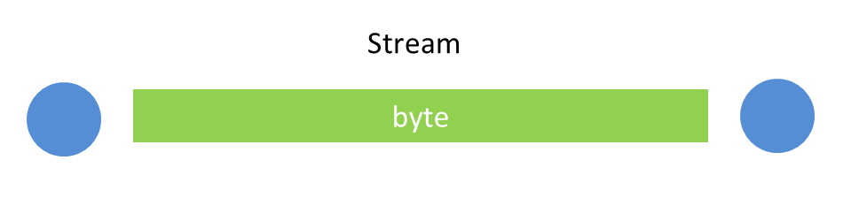

### คำว่าจุดหนึ่งไปสู่อีกจุดหนึ่ง  จุดที่ว่านั้นคืออะไร?
จุดที่ว่า คือ I/O (ระบบ Input Ouput ของ Computer) อาจจะหมายถึง Hardware หรือ Software
เช่น  byte ข้อมูลไหลจาก

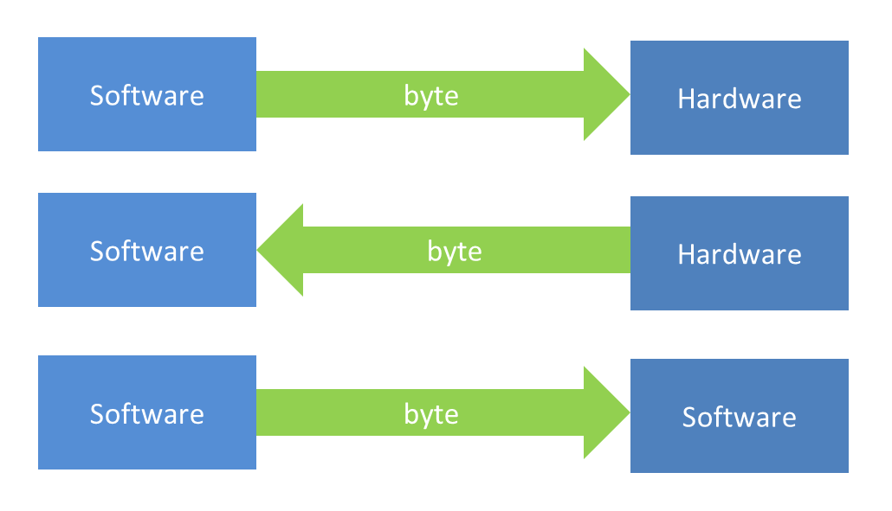

Software คือโปรแกรมที่เราเขียน หรือระบบอื่นๆ  
Hardware อาจหมายถึง Memory File ฯลฯ

> ถ้าใครเคยเรียนพวก Micro processor มา  เราจะรู้จักกับคำว่า **Bus (สายส่งข้อมูล)**
"Stream ก็เปรียบเสมือน Bus ที่ไว้ส่งข้อมูล แต่เป็น Bus I/O (Input Output)ใน Java Programming"

บางครั้ง  เราเรียก Stream ว่า **"Byte Stream"** เพราะมันส่งข้อมูลเป็น byte

โอเค  ผมว่าตอนนี้เราคงจะพอเข้าใจกับคำว่า Stream กันคร่าวๆ แล้วน่ะครับ
ทีนี้  มาลงรายละเอียดกันครับ

# รายละเอียดเบื้องต้น

การส่งข้อมูลด้วย Stream เป็นการส่งข้อมูลที่เป็น byte จากจุดหนึ่งไปสู่อีกจุดหนึ่ง สมมติ

---

### ต้องการส่งข้อมูลจาก Hardware ไปสู่ Software 

เช่น
ผมต้องการอ่านข้อมูลจาก file (ใน harddisk)  เข้ามาในโปรแกรมของผม  ผมก็ต้องอ่านข้อมูล file นั้นเป็น byte เข้ามาในโปรแกรมผ่าน Stream

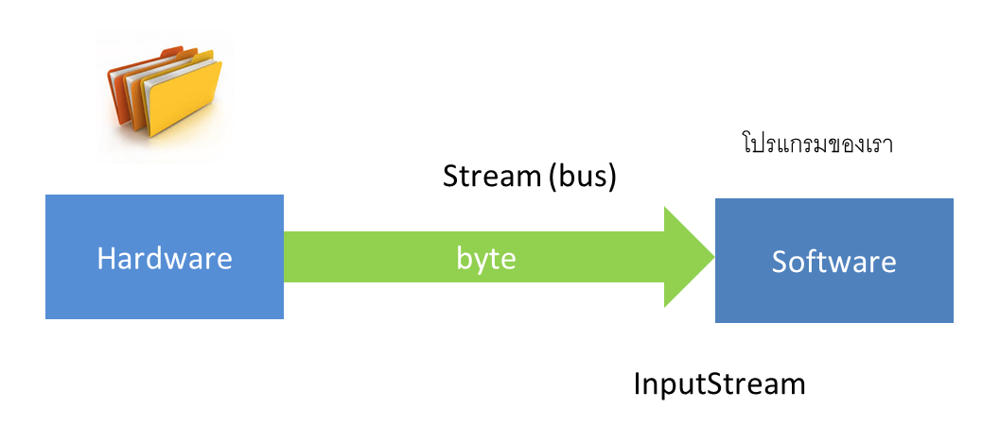

การอ่านข้อมูล (read data) เข้ามา เราจะกระทำผ่าน InputStream (ทางไหลเข้า : ไหลเข้าโปรแกรมเรา)   byte ข้อมูลของ file ก็จะถูกส่งขึ้นมาในโปรแกรมของเรา

---

### ต้องการส่งข้อมูลจาก Software ไปสู่ Hardware 

เช่น
ผมต้องการเขียนข้อมูลลง file  ผมก็จะเอาข้อมูลที่มีอยู่ของผม  แปลงไปเป็น byte  แล้วก็ส่งผ่าน Stream ไปยัง file

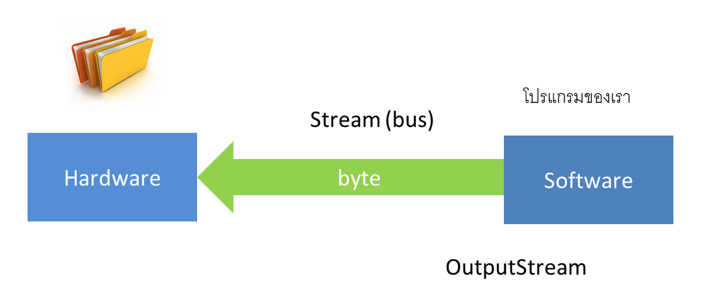

การเขียนข้อมูล (write data) ออกไป เราจะกระทำผ่าน OutputStream (ทางไหลออก : ไหลออกจากโปรแกรมเรา) byte ข้อมูลในโปรแกรมของเรา  จะถูกส่งไปยังปลายทาง (file) โดยอัตโนมัติ

---

# ข้อดีของ Stream

การทำงานผ่าน Stream  ทำให้เราไม่จำเป็นต้องรู้ว่า Hardware และ Software เบื้องหลังแล้วมันทำงานยังไง คุยกันแบบไหน  เราแค่จับข้อมูล (byte data) ยัดลงใน Stream (Bus) ก็พอครับ  เดี๋ยว Stream มันจัดการ อ่าน/เขียน/ส่งข้อมูล ให้เองโดยอัตโนมัติ

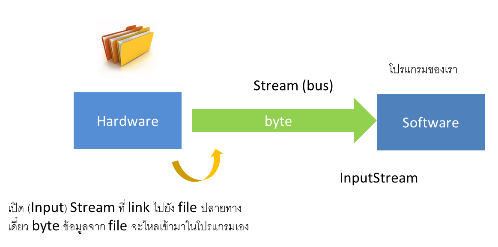

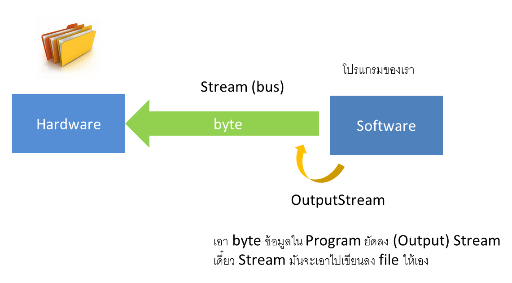

ผมขอสรุปคำว่า Stream อีกคำนึงครับ

> Stream เปรียบเสมือน link ข้อมูล (byte data)  
"ถ้าเราเปิดหรือต่อ Stream ไปยังอะไรก็ตาม สิ่งนั้นกับ Stream จะ link กันโดยอัตโนมัติ" 

- เรากระทำอะไรกับ Stream (bus) ก็เหมือนกับเรากระทำกับ I/O ปลายทางของ Stream  
- เรากระทำอะไรกับ I/O ปลายทาง  ก็จะมีผลต่อ Stream (bus) นั้นด้วย    

เพราะมัน link กันอยู่

เช่น เรา link Stream ไปยัง file

- เราอ่านข้อมูลจาก Stream ก็เหมือนเรากำลังอ่านข้อมูลจาก file
- เราเขียนข้อมูลลง Stream ก็เปรียบเสมือน  เราเขียนข้อมูลง file 

เพราะ Stream กับ file มัน link กัน  เป็นต้น

# กำเนิดตัวแปลง/ตัวส่งผ่าน (Stream Implementation)

เพราะความยากของ Stream ที่ต้องอ่าน/เขียน/ส่งข้อมูลเป็น byte  มันเลยค่อนข้างซับซ้อนในการที่จะเขียนโปรแกรม  คือ เราต้องแปลงข้อมูลที่มีอยู่ของเราให้ไปเป็น byte ก่อน  เราถึงจะส่งข้อมูลไปใน Stream ได้ หรือเมื่อเราอ่านข้อมูลมาจาก Stream เราก็ต้องแปลง byte ข้อมูลนั้นกลับมาเป็นข้อมูลจริงๆ อีกที

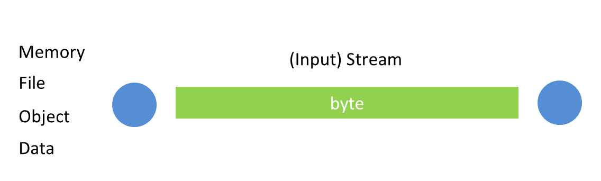

เขาจึงได้สร้างตัวแปลง/ตัวส่งผ่าน (Implementation) ของ Stream ขึ้นมา
เพื่อทำหน้าที่แปลงข้อมูลให้ไปเป็น  byte  และแปลง byte กลับไปเป็นข้อมูลที่เราต้องการโดยอัตโนมัติ  โดยที่เราไม่ต้องแปลงเอง

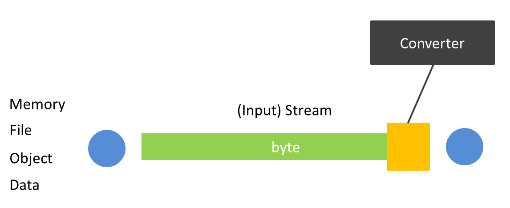

มีหลายตัว  เช่น
  
ถ้าเราใช้ Stream นั้นอ่าน/เขียนข้อมูลเกี่ยวกับ file  เราก็จะมีตัวแปลง byte stream ไปเป็น file และแปลง file กลับมาเป็น byte stream เรียกว่า File Stream ประกอบไปด้วย

- `FileInputStream` ไว้แปลง file ไปเป็น byte stream, Stream (bus) สำหรับอ่าน byte ข้อมูลจาก file
- `FileOutputStream` ไว้แปลง byte stream ไปเป็น file, Stream (bus) สำหรับเขียน byte ข้อมูลลง file

ถ้าเราใช้ Stream นั้น  อ่านเขียนข้อมูลเกี่ยวกับ byte array บน memory  เราก็จะมีตัวแปลง byte stream ไปเป็น byte array และแปลง byte array กลับมาเป็น byte stream เรียกว่า Byte Array Stream ประกอบไปด้วย

- `ByteArrayInputStream` ไว้แปลง byte array ไปเป็น byte ลง stream
- `ByteArrayOutputStream` ไว้แปลง byte stream ไปเป็น byte array

ถ้าเราใช้ Stream นั้น อ่านเขียนข้อมูลเกี่ยวกับ object เราก็จะมีตัวแปลง byte stream ไปเป็น object และแปลง  object กลับมาเป็น byte stream  เรียกว่า Object Stream  ประกอบไปด้วย

- `ObjectInputStream` ไว้แปลง object ไปลง byte stream
- `ObjectOutputStream` ไว้แปลง byte stream กลับมาเป็น object

เป็นต้น  
  
เราจะใช้ Stream กับอะไร  มันก็จะมีตัวแปลง InputStream (ทางไหลเข้า) และ OutputStream (ทางไหลออก) ของ I/O นั้นๆ

# รายละเอียดมากขึ้น

Java I/O Stream เป็นเรื่องของการส่งผ่านข้อมูลทางระบบ I/O หรือระบบ Input Output ของ computer ซึ่ง class หลักๆ ของเรื่อง นี้  จะเก็บไว้ใน package java.io

- InputStream
- OutputStream
- Reader
- Writer

*** มี class เยอะกว่านี้ แต่จะขอพูดถึงแค่ 4 class 
  
ซึ่งทั้ง 4 class นี้เป็น abstract class ทั้งหมดครับ
เพื่อให้ class อื่น extends ไป  และ implements method (พฤติกรรม) ตามที่ต้องการ  ว่าจะใช้ Stream นั้นทำงานเกี่ยวกับอะไร  class ลูกของ Stream ก็คือตัวแปลง  ที่ผมอธิบายไว้ข้างบนนั่นเอง

# InputStream vs OutputStream

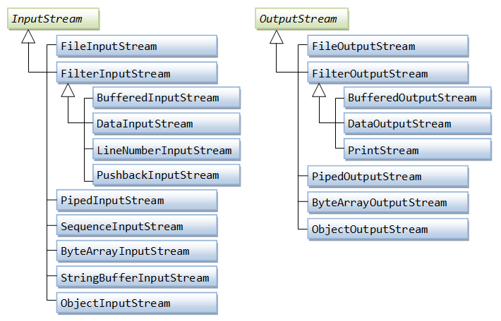

# InputStream (java.io.InputStream)  

จากที่เกริ่นไปแล้วว่า InputStream คือทางไหลเข้าของ byte ข้อมูล

> **ไหลเข้า** ในที่นี้หมายถึง  ไหลจากที่ใดที่หนึ่งเข้ามาในโปรแกรมของเรา  เช่น จาก Memory จาก File จาก Network จากโปรแกรมอื่นๆ ฯลฯ  เข้ามาในโปรแกรมที่เราเขียน

ถ้าเราใช้ InputStream กับ file เราก็จะมี  class FileInputStream ซึ่งเป็น class ที่ extends InputStream ทำหน้าที่ในการอ่าน แปลง file เข้ามาใน Stream ให้เรา
  
ถ้าเราใช้ InputStream กับ byte array บน memory  เราก็จะมี class ByteArrayInputStream ซึ่งเป็น class ที่ extends InputStream ทำหน้าที่ในการอ่าน แปลง byte array เข้ามาใน Stream ให้เรา
    
ประมาณนี้ครับ

InputStream มี method อยู่หลายตัว  ซึ่งผมจะขอไม่อธิบายน่ะครับ  ว่ามีอะไรบ้าง  ถ้าอยากรู้  แนะนำว่าให้อ่าน Java document ใน link นี้ครับ  ([Java 7 InputStream](http://docs.oracle.com/javase/7/docs/api/java/io/InputStream.html))  แต่จะขอยกตัวอย่างการใช้ InputStream คร่าวๆ  ว่า InputStream ทำงานยังไง

### ตัวอย่าง

การใช้ InputStream ที่เป็น FileInputStream (ทางไหลของ byte จาก file เข้ามาในโปรแกรมที่เราเขียน)

```java
package me.jittagornp.learning.java;
 
import java.io.FileInputStream;
import java.io.IOException;
import java.io.InputStream;
 
/**
 * @author jittagornp
 */
public class InputStreamExample {
 
    public static void main(String[] args) throws IOException {
        InputStream inputStream = null;
        try {
            inputStream = new FileInputStream("C:/temp/my-file.txt");
            byte[] bytes = new byte[1024];
            int index;
            while ((index = inputStream.read(bytes)) != -1) {
                System.out.println("index = " + index);
            }
 
        } finally {
            if (inputStream != null) {
                inputStream.close();
            }
        }
    }
}
```

จากตัวอย่าง
  
ทำการอ่าน byte ข้อมูลจาก file ด้วย FileInputStream ทีละ 1024 byte (1 KB) ขึ้นมา
index ในที่นี้หมายถึงตำแหน่งสุดท้ายหรือขนาดของ byte ข้อมูลที่อ่านขึ้นมาได้  เช่น ถ้า file มีขนาด 3000 byte  index ก็จะเป็น

ใน while loop  
- รอบที่ 1 index เท่ากับ 1024 (ไม่เกิน ที่ประกาศไว้)
- รอบที่ 2 index เท่ากับ 1024 (ไม่เกิน ที่ประกาศไว้)
- รอบที่ 3 index เท่ากับ 952 (ครบ 3000 byte แล้ว)
- รอบที่ 4 index เท่ากับ -1  (ไม่มีข้อมูล  ถือว่าสิ้นสุดการอ่าน)

การใช้งาน Stream เราจะครอบมันด้วย try + finally block (อาจมี catch ด้วยก็ได้)

- try block คือส่วนที่เราทำการต่อ Stream / Open Stream และ ใช้งาน Stream ซึ่งคาดว่าในส่วนนี้จะเกิด Exception ขึ้น
- finally block คือส่วนที่เราใช้สำหรับปิด Stream

### ทำไมเราต้องปิด Stream ไว้ใน finally ?

ทุกครั้งที่เราทำการต่อ Stream หรือ Open Stream ไปยัง I/O หรือ Resource ที่กำหนด
Resource นั้นจะถูก lock ไว้ไม่ให้ส่วนอื่นๆ เข้าถึง
  
แน่นอนว่า  ถ้าเราไม่ปิด Stream  Resource นั้นก็จะไม่ถูกปลด lock ทำให้ส่วนอื่นๆ เข้าถึง Resource นั้นๆ ไม่ได้  การใช้งาน Stream เสร็จจึงต้องปิด Stream เสมอ และต้องปิดไว้ใน finally เพื่อยืนยันว่าทุกครั้งที่ประมวลผลใน try block เสร็จแล้ว  ไม่ว่าจะเกิด หรือไม่เกิด Exception ขึ้นก็ตาม  Stream จะถูกปิดเสมอ

# OuputStream (java.io.OutputStream)

OutputStream คือทางไหลออกของ byte ข้อมูล

> **ไหลออก** ในที่นี้หมายถึง ไหลจากโปรแกรมของเรา  ออกไปยัง I/O ใดๆ เช่นไหลจากโปรแกรมออกไปยัง  Memory File Network ฯลฯ

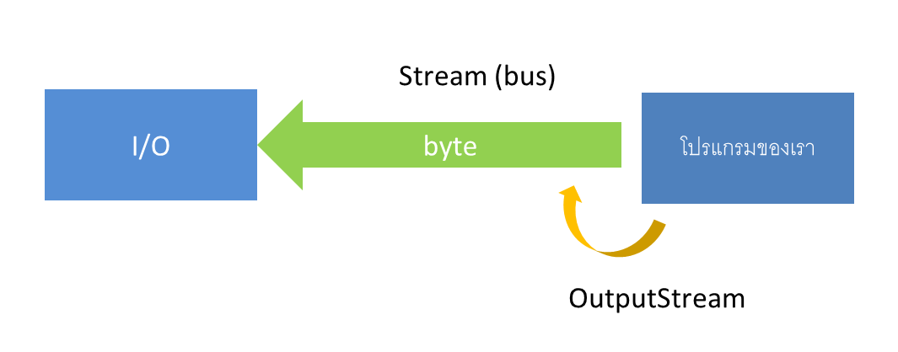

 ถ้าเราใช้ OutputStream กับ file เราก็จะมี class FileOutputStream ซึ่งเป็น class ที่ extends OutputStream ทำหน้าที่ในการเขียน byte data ลงไปใน file ให้เรา
   
concept เดียวกับ InputStream ครับ  แค่ตรงกันข้าม

OuputStream มี method อยู่หลายตัว  ซึ่งผมก็ไม่ขออธิบายว่าแต่ละตัวคืออะไร  ทำงานยังไง  เช่นกันครับ  ถ้าอยากรู้  สามารถเข้าไปอ่านได้ที่ ([Java 7 OutputStream](http://docs.oracle.com/javase/7/docs/api/java/io/OutputStream.html))

### ตัวอย่าง

การ copy file โดยใช้ FileInputStream อ่าน byte ข้อมูลจาก file ขึ้นมา
แล้วเขียน file โดยใช้ OutputStream ที่เป็น FileOutputStream (ทางไหลออกของ byte ข้อมูลจากโปรแกรมเราไปลง file)  เขียนข้อมูลลงไปอีก file นึง

```java
package me.jittagornp.learning.java;
 
import java.io.FileInputStream;
import java.io.FileOutputStream;
import java.io.IOException;
import java.io.InputStream;
import java.io.OutputStream;
 
/**
 * @author jittagornp
 */
public class OutputStreamExample {
 
    public static void main(String[] args) throws IOException {
        InputStream inputStream = null;
        OutputStream outputStream = null;
        try {
            inputStream = new FileInputStream("C:/temp/my-file.txt");
            outputStream = new FileOutputStream("C:/temp/my-file-copy.txt");
            byte[] bytes = new byte[1024];
            int index;
            while ((index = inputStream.read(bytes)) != -1) {
                outputStream.write(bytes, 0, index);
            }
 
        } finally {
            if(outputStream != null){
                outputStream.close();
            }
             
            if (inputStream != null) {
                inputStream.close();
            }
        }
    }
}
```
กระบวนการที่เกิดขึ้นของโปรแกรมนี้

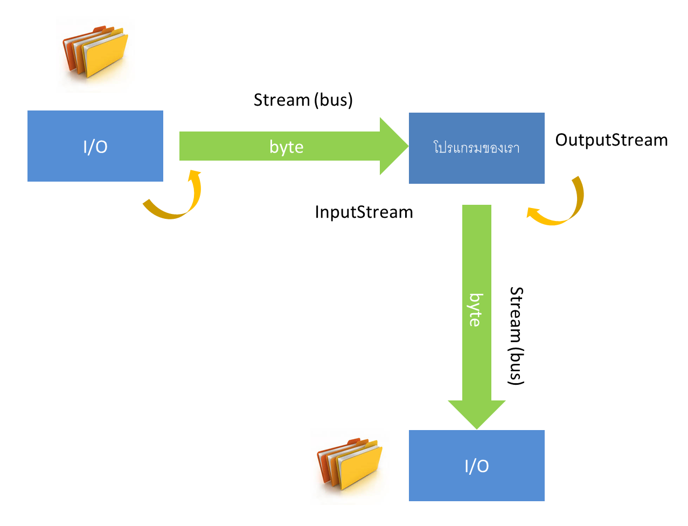

# Reader vs Writer

จากตัวอย่างที่ผ่านมา การส่งผ่าน หรือ อ่าน/เขียนข้อมูลจาก I/O จะเป็น byte ข้อมูล  ซึ่งเราเรียก Stream ที่ทำงานแล้วได้ผลลัพธ์เป็น byte นั้นว่า "Byte Stream"

 ในภาษา java ยังมี Stream อีกแบบที่ทำงานแล้วได้  ผลลัพธ์เป็นตัวอักษร (char) เราเรียก Stream ชนิดนี้ว่า "Character Stream"  ซึ่งก็คือ Stream Reader และ Writer นั่นเอง  

 

# Reader (java.io.Reader)

Reader คือทางไหลเข้าของข้อมูลที่เป็น char

> ข้อมูลที่เป็น char อาจมาจาก char โดยตรง หรือ อาจมาจาก String หรืออาจมาจาก byte ข้อมูล  แล้วแปลงมาเป็น char  อีกที ทั้งนี้ขึ้นอยู่กับว่า I/O นั้นเป็นอะไร

Reader มี method อยู่หลายตัว  ซึ่งผมก็ไม่ขออธิบายว่าแต่ละตัวคืออะไร  ทำงานยังไง  เช่นกันครับ  ถ้าอยากรู้  สามารถเข้าไปอ่านได้ที่ ([Java 7 Reader](https://docs.oracle.com/javase/7/docs/api/java/io/Reader.html))

### ตัวอย่าง

การใช้ Reader ที่เป็น FileReader อ่านข้อมูลจาก file มาเป็นตัวอักษร (ซึ่ง FileInputStream อ่านข้อมูลมาเป็น byte)

```java
package me.jittagornp.learning.java;
 
import java.io.FileReader;
import java.io.IOException;
import java.io.Reader;
 
/**
 * @author jittagornp
 */
public class FileReaderExample {
 
    public static void main(String[] args) throws IOException {
        Reader reader = null;
        try {
            reader = new FileReader("C:/temp/my-file.txt");
            int data;
            while ((data = reader.read()) != -1) {
                System.out.println("char --> " + (char) data);
            }
        } finally {
            if (reader != null) {
                reader.close();
            }
        }
    }
}
```

จากตัวอย่าง  อ่านข้อมูลจาก file ขึ้นมาทีละ 1 ตัวอักษร  
ถ้าอ่านไม่ได้ method read() จะ return -1
  
เราสามารถทำการแปลง FileInputStream มาเป็น FileReader ได้  ด้วยตัวแปลง (class) InputStreamReader ดังนี้

```java
package me.jittagornp.learning.java;
 
import java.io.FileInputStream;
import java.io.IOException;
import java.io.InputStream;
import java.io.InputStreamReader;
import java.io.Reader;
 
/**
 * @author jittagornp
 */
public class InputStreamReaderExample {
 
    public static void main(String[] args) throws IOException {
        InputStream inputStream = null;
        Reader reader = null;
        try {
            inputStream = new FileInputStream("C:/temp/my-file.txt");
            reader = new InputStreamReader(inputStream); //converter
            int data;
            while ((data = reader.read()) != -1) {
                System.out.println("char --> " + (char) data);
            }
        } finally {
            if (reader != null) {
                reader.close();
            }
 
            if (inputStream != null) {
                inputStream.close();
            }
        }
    }
}
```

# Writer (java.io.Writer)

Writer คือทางไหลออกของข้อมูลที่เป็น char

> การที่เราส่งข้อมูลออกไปเป็น char ข้อมูล char นั้นอาจจะถูกแปลงไปเป็น String หรือ byte ข้อมูล ต่อไป  ขึ้นอยู่กับว่า  I/O ปลายทางนั้นเป็นอะไร
  
Writer มี method อยู่หลายตัว  ซึ่งผมก็ไม่ขออธิบายว่าแต่ละตัวคืออะไร  ทำงานยังไง  เช่นกันครับ  ถ้าอยากรู้  สามารถเข้าไปอ่านได้ที่ ([Java 7 Writer](https://docs.oracle.com/javase/7/docs/api/java/io/Writer.html))  

### ตัวอย่าง

การใช้ Writer ที่เป็น FileWriter เขียนข้อมูลลง file ทีละตัวอักษร (ก่อนหน้านั้น FileOutputStream เขียนข้อมูลเป็น byte)

```java
package me.jittagornp.learning.java;
 
import java.io.FileWriter;
import java.io.IOException;
import java.io.Writer;
 
/**
 * @author jittagornp
 */
public class FileWriterExample {
 
    public static void main(String[] args) throws IOException {
        Writer writer = null;
        try {
            writer = new FileWriter("C:/temp/my-file.txt");
            writer.append('4');
            writer.append('2');
            writer.append('3');
            writer.append('5');
        } finally {
            if (writer != null) {
                writer.close();
            }
        }
    }
}
```

จากตัวอย่าง เป็นการเขียนตัวอักษร ทีละตัวลง file ปลายทาง

# Buffered Stream

จากตัวอย่างที่ผ่านๆ มา  เราจะสังเกตเห็นว่า  การอ่าน/เขียนข้อมูลนั้น  จะเป็นการอ่าน/เขียนข้อมูลขนาดเล็ก  เช่น  อ่าน/เขียนข้อมูลทีละไม่กี่ byte หรืออ่าน/เขียนข้อมูลทีละตัวอักษร  ทำให้ยังยุ่งยากในการเขียนโปรแกรมอยู่ดี  เพราะถึงเราจะมีข้อมูลเยอะแค่ไหนก็ตาม  เราก็ต้องเอาข้อมูลเหล่านั้นมาซอยย่อย เป็นข้อมูลเล็กๆ ก่อน  ก่อนที่จะดำเนินการอ่าน/เขียนข้อมูลได้
  
จากปัญหาดังกล่าว  เขาจึงได้คิดค้น Stream อีกแบบหนึ่งขึ้นมาเรียกว่า Buffered Stream  ซึ่งจะทำการอ่าน/เขียนข้อมูลลงใน Buffer ของ Stream นั้นๆ ก่อน  แล้วจึงส่งไปยังปลายทางอีกที  

 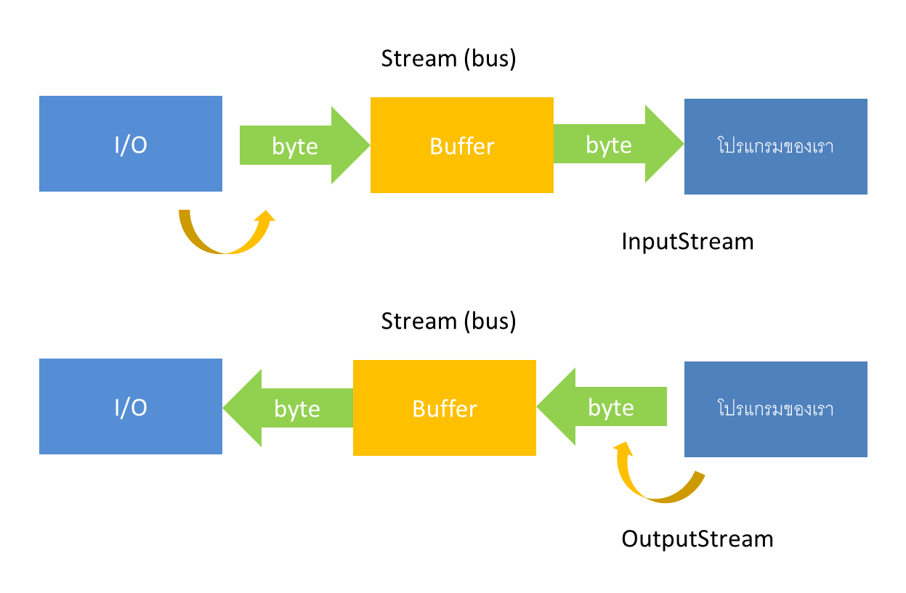

 ตัวอย่างของ Buffered Stream ที่น่าจะทำให้เห็นภาพได้ชัดเจน ผมของยกตัวอย่างเป็น BufferedReader น่ะครับ  ซึ่งเป็น Input Character Stream  ตัวนึง

 ```java
package me.jittagornp.learning.java;
 
import java.io.BufferedReader;
import java.io.FileReader;
import java.io.IOException;
import java.io.Reader;
 
/**
 * @author jittagornp
 */
public class BufferedReaderExample {
 
    public static void main(String[] args) throws IOException {
        BufferedReader bufferedReader = null;
        Reader reader = null;
        try {
            reader = new FileReader("C:/temp/my-file.txt");
            bufferedReader = new BufferedReader(reader);
            String data;
            while ((data = bufferedReader.readLine()) != null) {
                System.out.println("string --> " + data);
            }
        } finally {
            if (bufferedReader != null) {
                bufferedReader.close();
            }
 
            if (reader != null) {
                reader.close();
            }
        }
    }
}
 ```

 จากตัวอย่าง  ผมใช้ Buffered Stream นี้ควบคู่กับ FileReader ซึ่งสามารถอ่านข้อมูลจาก file ได้ทีละตัวอักษร  พอผมครอบมันด้วย BufferedReader ก็ทำให้เราสามารถอ่านข้อมูลได้ทีละหลายๆ ตัวอักษรครับ  ซึ่งในที่นี้  เป็นการอ่านข้อมูลจาก file ทีละ 1 บรรทัด
  
นอกจากที่กล่าวมายังมี Stream อื่นๆ ที่น่าสนใจอีกมากมาย  ซึ่งเราสามารถศึกษาได้จาก เอกสารของ Java หรือ จากแผนผัง Stream hierarchy  ที่แสดงให้เห็นในบทความนี้ครับ

# สรุป

Stream ในภาษา java แบ่งออกเป็น 2 ประเภท ดังนี้

1. Byte Stream คือ Stream ที่อ่าน/เขียนข้อมูลเป็น byte ประกอบด้วย class InputStream และ OutputStream  หรือ class ที่ extends 2 classes นี้
2. Character Stream คือ Stream ที่อ่าน/เขียนข้อมูลเป็น char ประกอบด้วย class Reader และ Writer หรือ class ที่ extends 2 classes นี้

Stream ทั่วๆ ไปอ่าน/เขียนข้อมูลได้ครั้งละน้อยๆ  ถ้าเราอยากอ่านเขียนข้อมูลให้ได้ครั้งละมากๆ  ให้เราใช้ Buffered Stream  ซึ่งมันจะอ่าน/เขียนข้อมูลแล้วเก็บข้อมูลนั้นไว้ใน buffer ก่อน แล้วค่อยคืนค่าออกมาทีหลัง
  
หวังว่าบทความนี้  จะเป็นประโยชน์สำหรับ Java Developer มือใหม่ทุกคนน่ะครับ :)

# หมายเหตุ

เป็นบทความที่ถูกย้ายมาจาก [https://na5cent.blogspot.com/2015/01/java-stream.html](https://na5cent.blogspot.com/2015/01/java-stream.html) ซึ่งผู้เขียน เขียนไว้เมื่อ วันอังคารที่ 27 มกราคม พ.ศ. 2558
