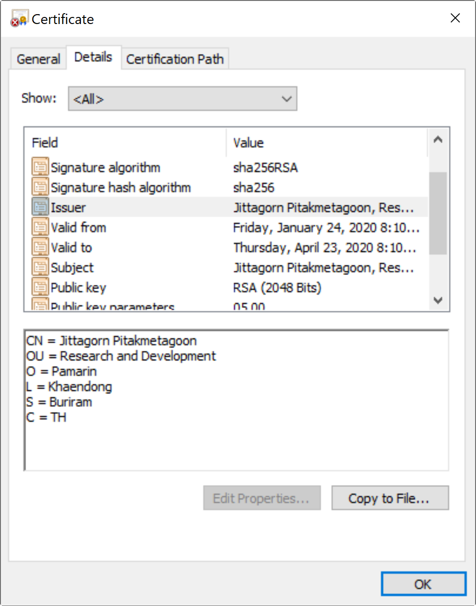
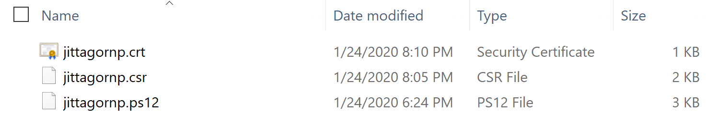
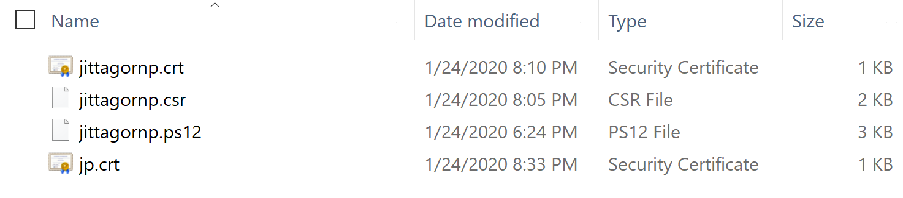

# ทำความรู้จักกับ Java Keytool


*Image from [https://www.digitalocean.com/community/tutorials/java-keytool-essentials-working-with-java-keystores](https://www.digitalocean.com/community/tutorials/java-keytool-essentials-working-with-java-keystores)*

> **Java Keytool** เรียกสั้น ๆ ว่า `Keytool` เป็นเครื่องมือแบบ Command Line ใช้สำหรับ Manage Key ต่าง ๆ เช่น Private Key, Secret Key และ (Public Key +) Certificate รองรับการทำงานร่วมกับ Java KeyStore

### หมายเหตุ 

แนะนำให้อ่านบทความนี้ก่อนครับ [ทำความรู้จักกับ Java KeyStore](/blog/java-keystore/?series=java-security) เนื่องจากคำศัพท์บางคำ หรือการทำงานบางอย่าง มีการทำงานร่วมกันกับ Java KeyStore ซึ่งถ้าเข้าใจ Java KeyStore แล้ว จะสามารถเข้าใจการทำงานของ Keytool ได้ไม่ยากครับ

# เริ่ม

เราสามารถใช้ Keytool ในการ 
- Generate Keypairs (Private Key + Public Key) 
- สร้างไฟล์ Certificate Signing Request (CSR) 
- ทำ Self-Signed Certificate 
- นำเข้า (Import) Certificate 
- ส่งออก (Export) Certificate
- และ ทำงานอื่น ๆ ได้ เหมือนกันกับคำสั่ง [`OpenSSL`](https://wiki.openssl.org/index.php/Command_Line_Utilities)
  
สำหรับคนที่เขียน Java อยู่แล้ว Keytool ถือเป็นเครื่องมือตัวนึงที่ช่วย Support การทำงานของคนเขียน Java ที่ต้องการทำงานร่วมกับ Key และ Certificate ต่าง ๆ ในระบบได้ดีเลยทีเดียวครับ มาดูตัวอย่างการใช้งาน Keytool กัน

### หมายเหตุ

Keytool มาพร้อมกับ JRE (Java Runtime Environment) ถ้าเครื่องเราลง Java อยู่แล้วก็สามารถใช้ Keytool ได้เลย ดังนี้


# ทดสอบคำสั่ง Keytool

```sh
$ keytool 
```
มันจะแสดงคำสั่งต่าง ๆ ที่เราสามารถใช้งานได้ ดังนี้

```plaintext
Key and Certificate Management Tool                                   
                                                                      
Commands:                                                             
                                                                      
 -certreq            Generates a certificate request                  
 -changealias        Changes an entry's alias                         
 -delete             Deletes an entry                                 
 -exportcert         Exports certificate                              
 -genkeypair         Generates a key pair                             
 -genseckey          Generates a secret key                           
 -gencert            Generates certificate from a certificate request 
 -importcert         Imports a certificate or a certificate chain     
 -importpass         Imports a password                               
 -importkeystore     Imports one or all entries from another keystore 
 -keypasswd          Changes the key password of an entry             
 -list               Lists entries in a keystore                      
 -printcert          Prints the content of a certificate              
 -printcertreq       Prints the content of a certificate request      
 -printcrl           Prints the content of a CRL file                 
 -storepasswd        Changes the store password of a keystore         
                                                                      
Use "keytool -?, -h, or --help" for this help message                 
Use "keytool -command_name --help" for usage of command_name.         
Use the -conf <url> option to specify a pre-configured options file. 
```

# ลองสร้าง Keypairs และ Certificate เก็บไว้ใน Java KeyStore


เราจะลองใช้คำสั่ง `genkeypair` ลองสร้างดู 
   
เช็คคำสั่ง

```sh
$ keytool -genkeypair --help
```
มี parameters ให้ใส่เข้าไปดังนี้
```plaintext
keytool -genkeypair [OPTION]...                                                
                                                                               
Generates a key pair                                                           
                                                                               
Options:                                                                       
                                                                               
 -alias <alias>          alias name of the entry to process                    
 -keyalg <alg>           key algorithm name                                    
 -keysize <size>         key bit size                                          
 -sigalg <alg>           signature algorithm name                              
 -destalias <alias>      destination alias                                     
 -dname <name>           distinguished name                                    
 -startdate <date>       certificate validity start date/time                  
 -ext <value>            X.509 extension                                       
 -validity <days>        validity number of days                               
 -keypass <arg>          key password                                          
 -keystore <keystore>    keystore name                                         
 -storepass <arg>        keystore password                                     
 -storetype <type>       keystore type                                         
 -providername <name>    provider name                                         
 -addprovider <name>     add security provider by name (e.g. SunPKCS11)        
   [-providerarg <arg>]    configure argument for -addprovider                 
 -providerclass <class>  add security provider by fully-qualified class name   
   [-providerarg <arg>]    configure argument for -providerclass               
 -providerpath <list>    provider classpath                                    
 -v                      verbose output                                        
 -protected              password through protected mechanism                  
                                                                               
Use "keytool -?, -h, or --help" for this help message                         
``` 

ทดลอง run คำสั่ง

```sh
$ keytool -genkeypair -alias jittagornp -keyalg RSA -keysize 2048 -validity 365 -keystore ./jittagornp.ps12 -storepass 123456890
``` 
### genkeypair

> เป็นคำสั่งที่ใช้ในการ generate คู่ key (private key + public key) และ certificate

- alias คือ ชื่อ key
- keyalg คือ algorithm ในการสร้าง key เป็น RSA 
- keysize คือ ขนาดของ key เป็น 2,048 bits
- validity คือ อายุของ certificate กำหนดให้ valid 365 วัน 
- keystore คือ ไฟล์ keystore ที่จะใช้เก็บ key
- storepass คือ รหัสผ่านในการ access keystore กำหนดเป็น `123456890`  

เมื่อเรา run คำสั่ง มันจะให้เรากรอก ข้อมูล **Distinguished Name** ดังต่อไปนี้  

```plaintext
What is your first and last name?                                                                   
  [Unknown]:  Jittagorn Pitakmetagoon                                                               
What is the name of your organizational unit?                                                       
  [Unknown]:  Research and Development                                                              
What is the name of your organization?                                                              
  [Unknown]:  Pamarin                                                                               
What is the name of your City or Locality?                                                          
  [Unknown]:  Khaendong                                                                             
What is the name of your State or Province?                                                         
  [Unknown]:  Buriram                                                                               
What is the two-letter country code for this unit?                                                  
  [Unknown]:  TH                                                                                    
Is CN=Jittagorn Pitakmetagoon, OU=Research and Development, O=Pamarin, L=Khaendong, ST=Buriram, C=TH
 correct?                                                                                           
  [no]:  yes                                                                                        
```
### อธิบาย

- **What is your first and last name?** คือ ให้เรากรอกข้อมูล [**CN**] หรือ Common Name ที่จะเอาไปแสดงใน Certificate 
- **What is the name of your organizational unit?** คือให้เรากรอกข้อมูล [**OU**] ที่จะเอาไปแสดงใน Certificate  
- **What is the name of your organization?** คือให้เรากรอกข้อมูล [**O**] ที่จะเอาไปแสดงใน Certificate  
- **What is the name of your City or Locality?** คือให้เรากรอกข้อมูล [**L**] ที่จะเอาไปแสดงใน Certificate  
- **What is the name of your State or Province?** คือให้เรากรอกข้อมูล [**ST**] ที่จะเอาไปแสดงใน Certificate  
- **What is the two-letter country code for this unit?** คือให้เรากรอกข้อมูล [**C**] ที่จะเอาไปแสดงใน Certificate  



### หมายเหตุ 

จริง ๆ **Distinguished Name** เราสามารถที่จะกำหนดเป็น parameter `-dname` ทีเดียวเลยก็ได้ เป็น

```sh
-dname "CN=Jittagorn Pitakmetagoon, OU=Research and Development, O=Pamarin, L=Khaendong, ST=Buriram, C=TH"
```

เมื่อกรอกเสร็จ และกด Enter จะมีไฟล์ `jittagornp.ps12` ถูกสร้างขึ้นมาใน path ปัจจุบันที่เรา run คำสั่งนี้ 

# ทดสอบเขียน Code เพื่ออ่านข้อมูล


Code อธิบายไว้ในเรื่อง [Java KeyStore](/blog/java-keytool/?series=java-security) แล้ว
```java
...

final String KEY_STORE_FILE = "../jittagornp.ps12";
final String KEY_STORE_PASSWORD = "123456890";
final String ALIAS = "jittagornp";

final KeyStore keyStore = KeyStore.getInstance("pkcs12");
try ( InputStream inputStream = new FileInputStream(KEY_STORE_FILE)) {
    keyStore.load(inputStream, KEY_STORE_PASSWORD.toCharArray());
}

final KeyStore.ProtectionParameter parameter = new KeyStore.PasswordProtection(KEY_STORE_PASSWORD.toCharArray());
final KeyStore.PrivateKeyEntry entry = (KeyStore.PrivateKeyEntry) keyStore.getEntry(ALIAS, parameter);

final PrivateKey privateKey = entry.getPrivateKey();
final Certificate certificate = entry.getCertificate();

System.out.println("privateKey => " + privateKey);
System.out.println("certificate => " + certificate);

...
```
output
```plaintext
privateKey => SunRsaSign RSA private CRT key, 2048 bits
  params: null
  modulus: 192782963430307238496187033437678128682382565...
  private exponent: 520808454389671431035139146896271002...
certificate => [
[
  Version: V3
  Subject: CN=Jittagorn Pitakmetagoon, OU=Research and Development, O=Pamarin, L=Khaendong, ST=Buriram, C=TH
  Signature Algorithm: SHA256withRSA, OID = 1.2.840.113549.1.1.11

  Key:  Sun RSA public key, 2048 bits
  params: null
  modulus: 19278296343030723849618703343767812868238...
  public exponent: 65537
  Validity: [From: Fri Jan 24 17:44:44 ICT 2020,
               To: Thu Apr 23 17:44:44 ICT 2021]
  Issuer: CN=Jittagorn Pitakmetagoon, OU=Research and Development, O=Pamarin, L=Khaendong, ST=Buriram, C=TH
  SerialNumber: [    4d43ccfa]

Certificate Extensions: 1
[1]: ObjectId: 2.5.29.14 Criticality=false
SubjectKeyIdentifier [
KeyIdentifier [
0000: 27 7E 18 B4 E7 70 3E F9   5E 95 92 A7 84 72 7B 1F  '....p>.^....r..
0010: 14 3F 28 C4                                        .?(.
]
]

]
  Algorithm: [SHA256withRSA]
  Signature:
0000: 13 EE 84 0A A3 AB 10 44   04 40 FB 73 69 5E 25 AD  .......D.@.si^%.
0010: 48 A8 F8 36 B9 21 BC 89   B0 4D A0 3E A8 FB D0 B1  H..6.!...M.>....
]
```

ผลจากการ run code จะพบว่าเราสามารถใช้ Java KeyStore ในการอ่าน Key และ Certificate ที่ถูกสร้างมาจาก Keytool ได้

# คำสั่งอื่น ๆ ของ Keytool


### 1. ใช้ Keytool สร้างไฟล์ Certificate Signing Request (CSR)

ใช้คำสั่ง `-certreq`
```sh
$  keytool -certreq -alias jittagornp -keystore ./jittagornp.ps12 -storepass 123456890 -file ./jittagornp.csr
```
จะมีไฟล์ `jittagornp.csr` ถูกสร้างขึ้นมา 

### 2. ใช้ Keytool สร้างไฟล์ Certificate (.crt) จาก ไฟล์ .csr 

ใช้คำสั่ง `-gencert`
```sh
$  keytool -gencert -alias jittagornp -keystore ./jittagornp.ps12 -storepass 123456890 -infile ./jittagornp.csr -outfile ./jittagornp.crt
```

### ผลลัพธ์



### 3. ใช้ Keytool import Certificate (.crt) เข้า Java KeyStore

ใช้คำสั่ง `-import -trustcacerts`
```sh
$  keytool -import -trustcacerts -alias pamarin -file pamarin.crt -keystore ./jittagornp.ps12 -storepass 123456890
```

### 4. ใช้ Keytool export Certificate จาก Java KeyStore เป็นไฟล์ .crt

ใช้คำสั่ง `-export`
```sh
$ keytool -export -alias jittagornp -file ./jp.crt -keystore ./jittagornp.ps12 -storepass 123456890
```
จะมีไฟล์ `jp.crt` ถูกสร้างขึ้นมา



### 5. ใช้ Keytool Print ข้อมูลในไฟล์ Certificate (.crt) ออกมาดู

ใช้คำสั่ง `-printcert`
```sh
$ keytool -printcert -v -file jittagornp.crt
```
- v (verbose output) คือ แสดงข้อมูลอย่างละเอียด   

### 6. ใช้ Keytool List ข้อมูล Entry ใน KeyStore ออกมาดู

ใช้คำสั่ง `-list`
```sh
$ keytool -list -v -keystore ./jittagornp.ps12 -storepass 123456890
```

### 7. ใช้ Keytool ลบ Key ออกจาก KeyStore

ใช้คำสั่ง `-delete`
```
$ keytool -delete -alias jittagornp -keystore ./jittagornp.ps12 -storepass 123456890
```

### 8. ใช้ Keytool List ข้อมูล CA Certificate ใน Java ออกมาดู

ให้เข้าไปที่ $JAVA_HOME ก่อน (ลง java ไว้ที่ไหน ก็ให้เข้าไปที่ folder นั้น)
```sh
$ cd open-jdk-11.0.1
```
จากนั้น list certs ออกมาดู
```sh
$ keytool -list -v -keystore lib/security/cacerts
```

คำสั่งอื่น ๆ เพิ่มเติม สามารถเรียนรู้ได้จาก Reference ด้านล่างครับ 

# GUI

ถ้าใครไม่ถนัดหรือขี้เกียจใช้งาน Command Line สามารถ Download และใช้งานแบบ GUI ได้ที่   
- [https://keystore-explorer.org/](https://keystore-explorer.org/) 


# Reference

- [https://docs.oracle.com/javase/8/docs/technotes/tools/unix/keytool.html](https://docs.oracle.com/javase/8/docs/technotes/tools/unix/keytool.html)
- [https://www.sslshopper.com/article-most-common-java-keytool-keystore-commands.html](https://www.sslshopper.com/article-most-common-java-keytool-keystore-commands.html)

