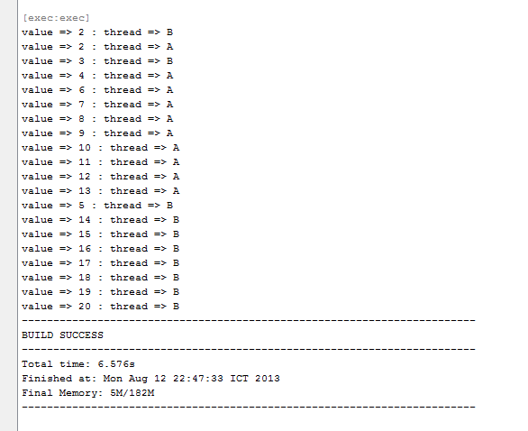
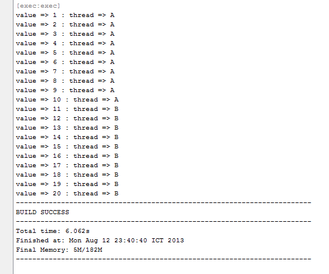

# ทำความรู้จักกับ Java Synchronized

# ความหมาย

> **synchronized** "เป็น keyword หนึ่งของภาษา java ที่ไว้ใช้สำหรับยืนยันว่า ณ ขณะนั้นจะมีเพียง thread เดียว หรือ 1 thread เท่านั้นที่กำลังทำงาน ในส่วนที่เราต้องการให้ทำ"  ส่วนที่ว่าหรือส่วนที่เราต้องการให้ทำนั้น อาจจะเป็น method  หรือ synchronized block

ความหมายมันอาจจะดูงงๆ  อ่านแล้วยังไม่เข้าใจ  เรามาดูของจริงกันดีกว่าครับ อันนี้ขอยกตัวอย่างเป็น synchronized method ของ instance น่ะครับ

# ปัญหา

ผมทำการสร้าง class Counter ขึ้นมา  เพื่อทดสอบการทำงาน  ดังต่อไปนี้  (ยังไม่มี synchronized)
  
Counter.java

```java
package me.jittagornp.learning.javasync;
 
/**
 * @author jittagornp
 */
public class Counter {
    
    private int value = 0;
     
    public void increase(){
        for(int i=0; i<10; i++){
            value = value + 1;        
            System.out.println("value => " + value + " : thread => " + Thread.currentThread().getName());
        }
    }
}
```

class Counter  มีอยู่ method เดียว (increase)  และมี attribute เดียว (value)
ซึ่งผมจะทำการทดสอบง่ายๆ  โดยการใช้  increase method สำหรับเพิ่มค่า attribute value  จากนั้นก็แสดงค่า value พร้อมกับ thread ปัจจุบันออกมาดูว่า  thread ไหนที่เป็นตัว access method นั้นอยู่

ต่อมา สร้าง class สำหรับทดสอบ
  
Main.java

```java
package me.jittagornp.learning.javasync;
 
/**
 * @author jittagornp
 */
public class Main implements Runnable{
     
    private Counter counter = new Counter();
 
    public static void main(String[] args) {
        Main main = new Main();
        Thread A = new Thread(main, "A");
        Thread B = new Thread(main, "B");
         
        A.start();
        B.start();
    }
 
    public void run() {
        counter.increase();
    }
}
```

class Main implements Runnable เพื่อให้ thread เรียกใช้งาน  ที่ run method ซึ่งก็คือเรียกใช้  counter.increase();
  
ที่ main method ทำการสร้าง instance ของ class Main ขึ้นมา 1 instance  
 ```java
 Main main = new Main();
 ```
จากนั้นสร้าง thread ขึ้นมา 2 ตัว  คือ
```java
Thread A = new Thread(main, "A");// ชื่อ A
Thread B = new Thread(main, "B"); //ชื่อ B
```
เพื่อใช้งาน instance main (parameter แรก)  จากนั้นก็สั่งให้ thread A และ B  ให้เริ่มทำงาน  ด้วยคำสั่ง
```java
A.start();
B.start();
```
ลอง run program ดูครับ  แล้วสังเกตผล



จากภาพจะเห็นว่า  ณ เวลาเดียวกัน  increase method ถูก thread 2 ตัว access
แต่ใน increase method ผมเขียนไว้ว่า  ให้วนลูป

```java
for(i=0; i<10;i++) (10 รอบ) 
```

แต่ยังวนลูปไม่ถึง 10 รอบเลย  ก็ถูก thread ตัวอื่นเข้ามาแทรกแล้ว  จะเห็นว่า thread A กับ thread B สลับการทำงานกันไปมา  ทั้งๆ ที่ thread B access ตัวแรก  แต่ thread B ยังทำงานไม่เสร็จเลย (ยังไม่ถึง 10 รอบ)  ก็ถูก thread A แทรกมาทำงานแทนแล้ว
  
บางครั้ง  เราอาจมีการทำงานบางอย่างที่ต้องการให้มันเป็นไปตาม step ของมัน  ไม่ใช่กระโดดข้ามหรือสลับกันไปมา  เช่น  การเพิ่มค่าที่ยกตัวอย่างให้เห็น  ซึ่งมันควรที่จะเป็น 1 2 3 4 5 6 7 .... 20  แต่จากตัวอย่างจะเห็นว่า  มันไม่เป็นไปตามลำดับเลย  จึงอาจทำให้การทำงานของ program นั้นผิดพลาดไปก็ได้
  
แล้วเราจะทำยังไงล่ะ  ให้มันเป็นไปตามลำดับ  ในเมื่อ program แบบ multithread มันก็ทำงานแบบนี้อยู่แล้ว   คือ thread หลายตัวทำงานไปพร้อมๆกัน  ซึ่งถือว่าป็นเรื่องปกติของมันครับ
  
แต่ logic บางอย่างเราไม่ต้องการให้มันเป็นแบบนี้น่ะสิครับ  อย่างอื่นก็ทำงานอิสระของใครของมันไป  แต่พอมาถึงเรื่องของการเพิ่มค่า  ก็ควรที่จะเพิ่มไปตาม step เท่านั้น  ห้ามกระโดด  ห้ามสลับไปสลับมา  ไม่งั้นการทำงานของ program ผิดแน่นอน
  
ด้วยปัญหานี้  จึงนำไปสู่การแก้ปัญหา multithread โดยการใช้ synchronized keyword ครับ
  
# วิธีแก้ไข

ทีนี้เราลองมาแก้ increase method ของ class Counter กันใหม่  โดยการใส่ synchronized keyword ไว้หน้า method ครับ  ดังนี้        

```java
public synchronized void increase(){
    for(int i=0; i<10; i++){
        value = value + 1;        
        System.out.println("value => " + value + " : thread => " + Thread.currentThread().getName());
    }
}
```
จากนั้น  ลอง run class Main ดูอีกครั้ง แล้วสังเกตผลลัพธ์  ซึ่งจะเป็นดังนี้ครับ



จะเห็นว่า thread A ทำงานก่อน โดยการวนลูปจนครบ 10 รอบ  แล้ว thread B ค่อยตามมาทำงานในภายหลังอีก 10 รอบ  ซึ่งมีการทำงานเป็น 1 2 3 4 5 6 7 ... 20  ตามลำดับ  โดยไม่กระโดดข้ามกันไปมา  เหมือนก่อนหน้านี้
  
เหตุผลที่เป็นแบบนี้ก็เพราะว่า synchronized keyword  จะเป็นตัวยืนยันว่า **ณ ขณะนั้นจะมีเพียง thread เดียว หรือ 1 thread เท่านั้นที่กำลังทำงาน ในส่วนที่เราต้องการให้ทำ** (increase method)  อย่างที่ผมได้เขียนไว้ตั้งแต่แรก  
  
มันจะ block increase method ให้ thread A โดยให้ thread B รอ (wait)  จนกว่า thread A จะทำงานเสร็จ  thread B จึงจะมีสิทธิ์เข้าใช้งาน increase method ครับ  
  
synchronized ในลักษณะอื่นๆ  ลองไปหาอ่านกันเอาเองน่ะครับ เช่น synchronized block, synchronized static method, ...  อันนี้ประมาณว่า แค่แนะนำหรือเกริ่นให้เห็นภาพครับ  จะได้นำไปต่อยอดได้ โดยบทความนี้เขียนขึ้นเพื่อให้เข้าใจ basic มันว่ามันคืออะไร  เอาไว้ใช้ทำอะไรครับ  

# หมายเหตุ

เป็นบทความที่ถูกย้ายมาจาก [https://na5cent.blogspot.com/2013/08/synchronized-keyword-in-java.html](https://na5cent.blogspot.com/2013/08/synchronized-keyword-in-java.html) ซึ่งผู้เขียน เขียนไว้เมื่อ วันจันทร์ที่ 12 สิงหาคม พ.ศ. 2556