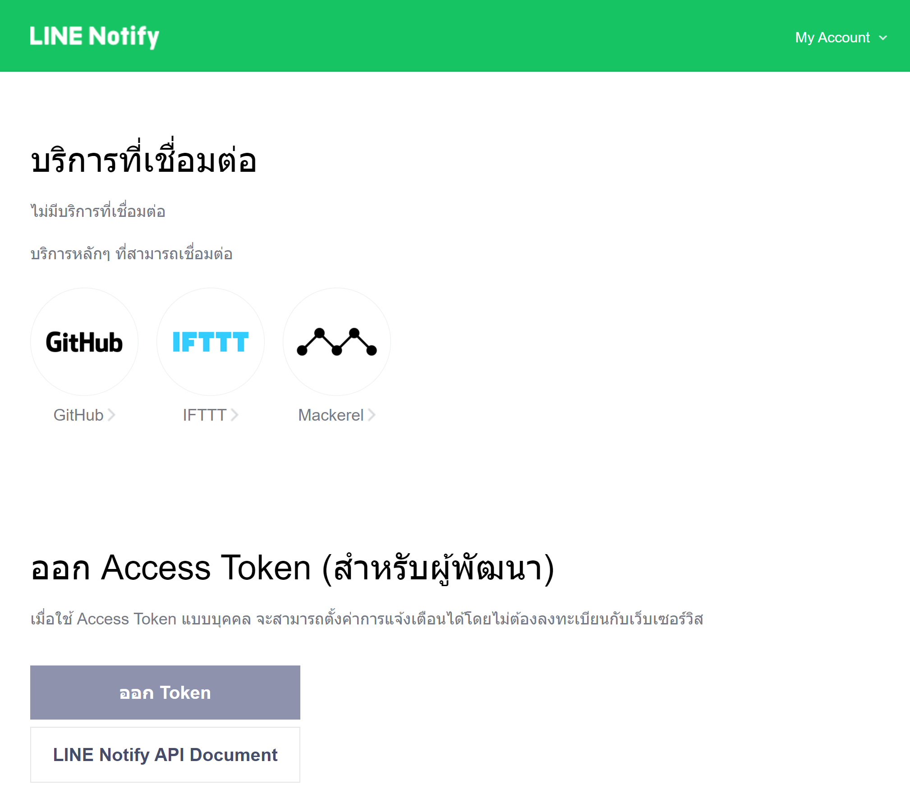
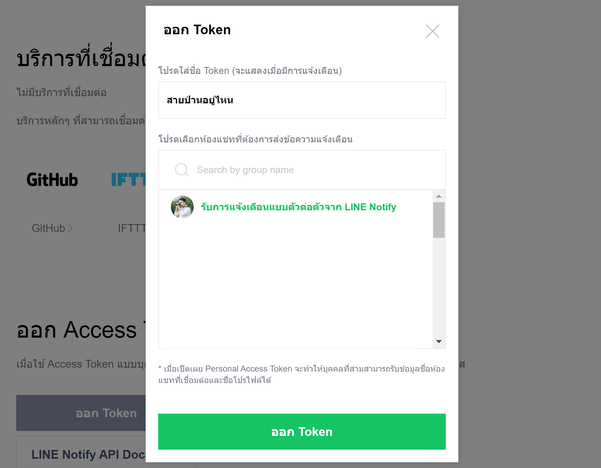
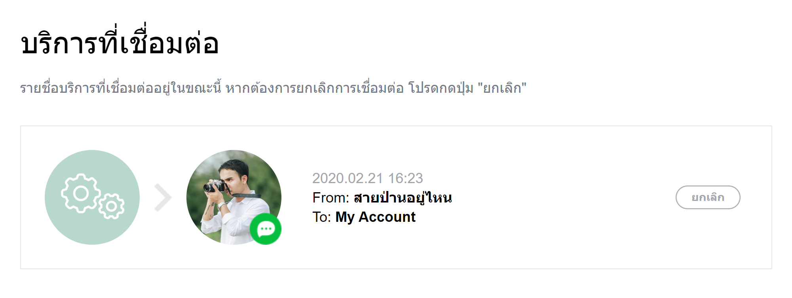
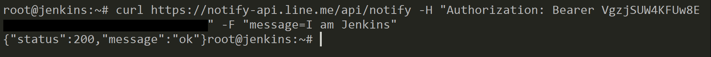

# ทำให้ Jenkins ส่งข้อความแจ้งเตือนเข้า Line กรณีที่ระบบ Deploy ไม่สำเร็จ


# 1. สมัคร Line Notify

ที่ลิงค์นี้

- [https://notify-bot.line.me/my/](https://notify-bot.line.me/my/)



# 2. ทำการออก Token

โดยการคลิกที่ปุ่ม **ออก Token** จากนั้น   

- ตั้งชื่อ **Line User** ที่จะให้ Line แจ้งข้อความไปหาเรา  
- เลือกว่าจะให้ Line แจ้งข้อความไปหาเราโดยตรง หรือ กลุ่ม Line ที่เราอยู่
- คลิกปุ่ม **ออก Token**




ให้ทำการ Copy Token นี้เก็บไว้ **อย่าให้หาย** เพราะถ้าหายต้องออก Token ใหม่อย่างเดียว 



# 3. ทดสอบการทำงาน

โดยการใช้คำสั่ง `curl` ยิง Message เข้า Line ดังนี้

```sh
$ curl https://notify-api.line.me/api/notify -H "Authorization: Bearer <TOKEN>" -F "message=<MESSAGE>"
```
ลอง run คำสั่ง



ดูที่ Line


# 4. เขียน Jenkinsfile (Jenkins Pipeline)

ถ้าใครเขียน Jenkins Pipeline ไม่เป็น สามารถอ่านได้จากบทความนี้ครับ 

- [พื้นฐานการเขียน Jenkins Pipeline](/blog/jenkins-pipeline/)

ตรง Pipeline ให้เพิ่ม Code เข้าไปประมาณนี้

```js
def notify(message) {
    def token = "<YOUR_TOKEN>";
    def jobName = env.JOB_NAME + ' - ' + env.BRANCH_NAME;
    def buildNo = env.BUILD_NUMBER;
      
    def url = "https://notify-api.line.me/api/notify";
    def lineMessage = "${jobName} [#${buildNo}] : ${message} \r\n";
    sh "curl ${url} -H 'Authorization: Bearer ${token}' -F 'message=${lineMessage}'";
}

pipeline {
    agent any
    stages {
        stage ("Change Directory") {
            steps {
                script {
                    try{
                        sh 'cd /not-found-directory';
                    }catch(Exception e){
                        notify("${e.getMessage()}");
                        throw e;
                    }
                }
                
            }    
        }
        
    }
}
```

- Method `notify` ใช้สำหรับแจ้งเตือนเข้า Line ผ่านคำสั่ง `curl` ของ Linux     
- ใน `steps` เรามีการ `try/catch` คำสั่งไว้ ถ้าเกิด **Exception** ขึ้น ก็จะทำการ notify message ไปยัง Line ที่กำหนด

# 5. ทดสอบ Pipeline

Pipeline Build Fail 


กลับไปดูที่ Line จะเห็นว่า Jenkins มีการส่งข้อความแจ้งเตือนไปให้


# Reference

บทความนี้ผมยกเครดิตให้กับคุณ [Petch Kruapanich](https://medium.com/@petchkruapanich) ครับ ซึ่งผมทำตามที่คุณ Petch Kruapanich เขียนไว้บน Medium จาก บทความนี้ [มาเพิ่ม LINE Notify ให้ Jenkins กันเถอะ](https://medium.com/readmoreth/มาเพิ่ม-line-notify-ให้-jenkins-กันเถอะ-4e7af7c87515) ขอบคุณ คุณ Petch มาก ๆ ครับ    
