# พื้นฐานการเขียน Jenkins Pipeline


ก่อนที่จะไปเขียน Jenkins Pipline เรามาทำความรู้จักกับ Jenkins กันก่อน

# Jenkins คืออะไร

`Jenkins` เป็น Software (Tool) ตัวนึงที่เอามาใช้ทำ **CI/CD (Continuous Integration/Continuous Delivery)** เพื่อให้เราสามารถที่จะผลิตและส่งมอบ Software ไปยังผู้ใช้ได้อย่างต่อเนื่อง เกิดความราบรื่น และลดต้นทุนด้านเวลาในระหว่างการพัฒนา Software 
  
โดยอาศัยหลักการของ Automation คือ การทำทุกอย่างให้เป็นไปอย่างอัตโนมัติ ตั้งแต่ 
- การ **Build** Source Code
- การทดสอบ (**Test**) Source Code
- การ **Release** Source Code และ
- การ **Deploy** Source Code ไปยัง Environment ต่าง ๆ

โดยไม่ต้องใช้คนทำ 

# Jenkins Pipeline


เป็นการใช้ Jenkins ทำ Automation ต่าง ๆ ตามที่ได้กล่าวไป ให้อยู่ในรูปแบบของ `Code` หรือ `Script`   
  
ซึ่งเราสามารถที่จะกำหนด Steps และ Flow การทำงานต่าง ๆ ได้เอง ว่าจะให้ Jenkins ทำอะไรให้บ้าง ตาม Code (Pipeline) ที่เราเขียนไว้     
  
การเขียน Jenkins Pipeline ทำได้ 2 วิธี คือ 

1. เขียน Pipeline ไว้บน Jenkins เลย กับ 
2. เขียน Pipeline เป็น File ไว้ที่ Source Code แล้วใช้ Jenkins ดึง Source Code จาก Git ลงมาทำ Pipeline 

### วิธีแรก 

- **ข้อดี** คือ เหมาะกับการทดลองเขียน Pipeline เพื่อทดสอบดูผลลัพธ์ เนื่องจากเราสามารถแก้ไข และทดสอบคำสั่งจาก Jenkins ได้ทันที 
- **ข้อเสีย**ของวิธีนี้ คือ ถ้ามีการย้าย Jenkins Server ต้องทำการเขียน Pipeline บน Jenkins Server ใหม่ทุกครั้ง เพราะไม่ได้ Save เป็น File เก็บไว้ 

### วิธีที่ 2 
- **ข้อดี** คือ จะสะดวกตรงที่ Pipeline อยู่ใน Source Code เราแก้ไขได้ง่าย เวลา Setup Jenkins เสร็จ สามารถกำหนดให้ Jenkins ดึง Source Code + Pipeline มาใช้งานได้เลย โดยไม่ต้องเขียนใหม่ เพราะเรามี Pipeline เตรียมพร้อมไว้แล้ว  
- **ข้อเสีย** คือ Test ยาก เพราะต้องแก้แล้ว Save (Commit + Push) File ถึงจะสามารถ Test ได้ 

### แนะนำ

ถ้าจะแค่ทดสอบการทำงานของ Pipeline ให้ใช้วิธีแรก   
แต่ถ้าทดสอบจนทำงานได้แล้ว ให้เปลี่ยนไปใช้วิธีที่ 2 ครับ 

# Jenkinsfile

การเขียน Jenkins Pipeline เป็น File จะเป็น Text File ธรรมดา ๆ (ไม่มีนามสกุล) ปกติจะตั้งชื่อ File ว่า `Jenkinsfile`

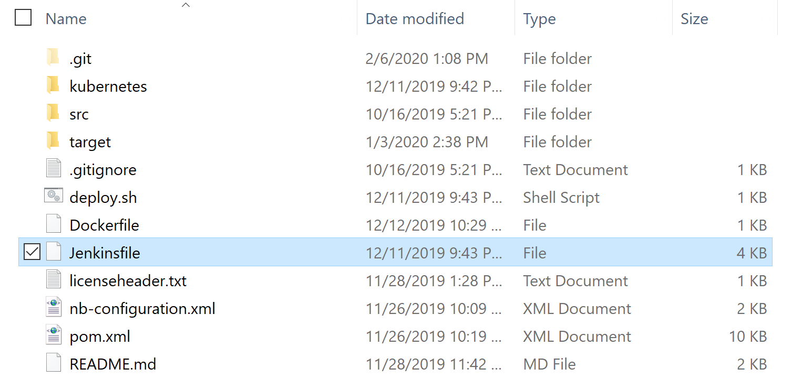

โดยทั่วไป มักจะเก็บ `Jenkinsfile` เอาไว้ที่ root ของ Project 

# การเขียน Pipeline 

เริ่มต้น ประกาศ `pipeline` แล้วตามด้วย `{ ... }` 

```js
pipeline {
    ...
}
```
ถัดมา กำหนด `agent` และ `stages` ต่าง ๆ 

```js
pipeline {
    
    agent any 

    stages {

        stage('Init'){
            ...
        }

        stage('Yarn Install') {
            ...
        }

        stage('Yarn Build') {
            ...
        }

        ...

        stage('Deploy') {
            ..
        }
    }
}
```

### agent 

เป็นคำสั่งที่เอาไว้บอก Jenkins ว่าจะให้ใช้ executor ตัวใดมา run คำสั่งใน stages ทั้งหมดนี้   
  
ที่ใช้บ่อย ๆ จะเป็น
- `none` คือ ไม่ใช้ executor ใด ๆ สำหรับ stages ทั้งหมด (ต้องไปกำหนด executor แยกสำหรับแต่ stage เอง) 
- `any` คือ ใช้ executor ใด ๆ ก็ได้ 
- `docker` คือ ใช้ docker executor มา run stages ทั้งหมดนี้  

### stage

เปรียบเสมือนกับ Flow การทำงาน ว่าจะให้ทำอะไรบ้างใน Pipeline นี้ เช่น

- การ Build Code Frontend (Angular, VueJS, React, ect)
- การ Test Code Frontend
- การ Build Code Backend
- การ Test Code Backend
- การ Build Docker Image
- การ Push Docker Image ไปยัง Registry
- การ ออก Report
- การ Deploy

ตัวอย่างของ stages   

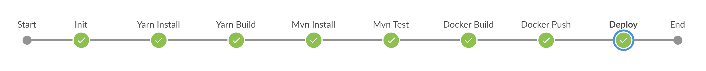

ถัดมา ในแต่ละ `stage` ให้กำหนด `steps` การทำงาน เพื่อบอก Jenkins ว่า จะให้ทำอะไร ยังไงบ้างใน stage นี้

```js
pipeline {
    
    agent any  

    stages {

        stage('Init'){
            steps {
                echo 'Init'
                echo '******************************'
            }
        }

        stage('Yarn Install') {
            steps {
                echo 'Yarn Install'
                echo '******************************'
            }
        }

        stage('Yarn Build') {
            steps {
                echo 'Yarn Build'
                echo '******************************'
            }
        }

        ...

        stage('Deploy') {
            steps{
                echo 'Deploy'
                echo '******************************'
            }
        }
    }
}
```

สามารถใส่ step การทำงานภายใน `steps { ... }` ได้หลาย steps 
   
ที่ใช้บ่อย ๆ จะเป็น
- `echo` เป็นคำสั่งที่ใช้ในการ print (log) ข้อความต่าง ๆ ออกมาดู  
- `sh` เป็นคำสั่งที่ใช้ในการ run Linux Command เช่น 
   - sh `'node --version'`  
   - sh `'cd frontend && yarn build'`  
   - sh `'chmod 744 deploy.sh'`  

# ทดลอง Run Pipeline 

ตอนนี้พักการเขียน Pipeline ไว้ก่อน มาทดลอง run Pipeline จากข้างบนที่เราเขียนไว้ดู 

### ที่ Jenkins 
ให้ **New Item** > กำหนดชื่อ แล้วเลือกเป็นแบบ **Pipeline** > OK 

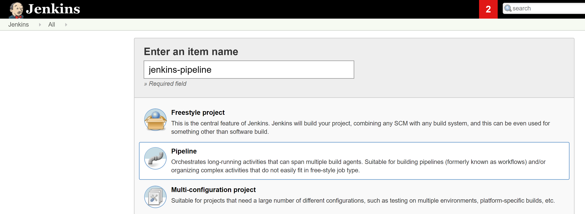

ถ้าใครยังไม่มี Jenkins สามารถใช้ Docker ติดตั้งได้ตามลิ้งค์ นี้

- [ติดตั้ง Jenkins JDK 11 ด้วย Docker บน Ubuntu 18.04](/blog/install-docker-jenkins-jdk-11-on-ubuntu-18.04/)

เขียน Pipeline script จากนั้น Save 

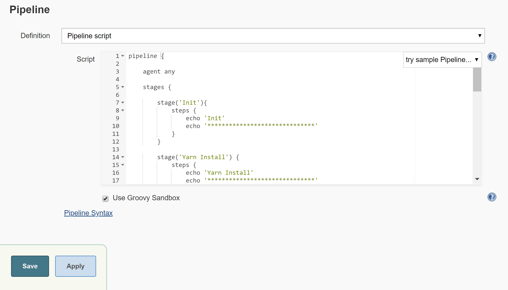

### หมายเหตุ

ถ้าเขียน Pipeline เป็น `Jenkinsfile` และเก็บไว้ใน Git ให้เลือก Pipeline เป็น `Pipeline script from SCM` จากนั้นกำหนดค่า Git ต่าง ๆ จากนั้น Save  

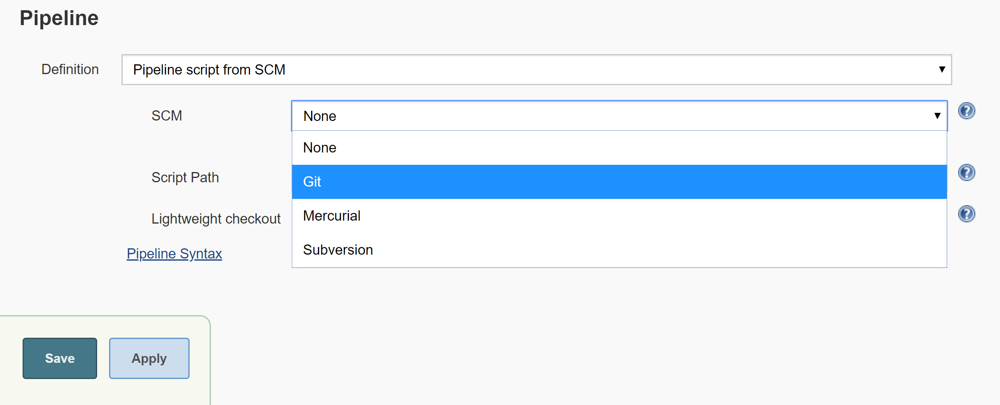

ทดลอง Build 

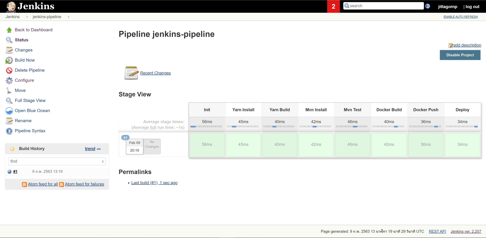

ดู Console Output โดยการคลิกที่ กลม ๆ สีน้ำเงิน หน้า `#1`  

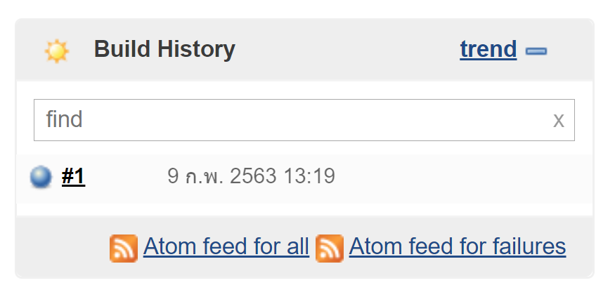
 
ผลลัพธ์จากการ Build จะเห็นว่ามีการ Print ข้อความต่าง ๆ ตามที่เราได้เขียนไว้ใน Pipeline  

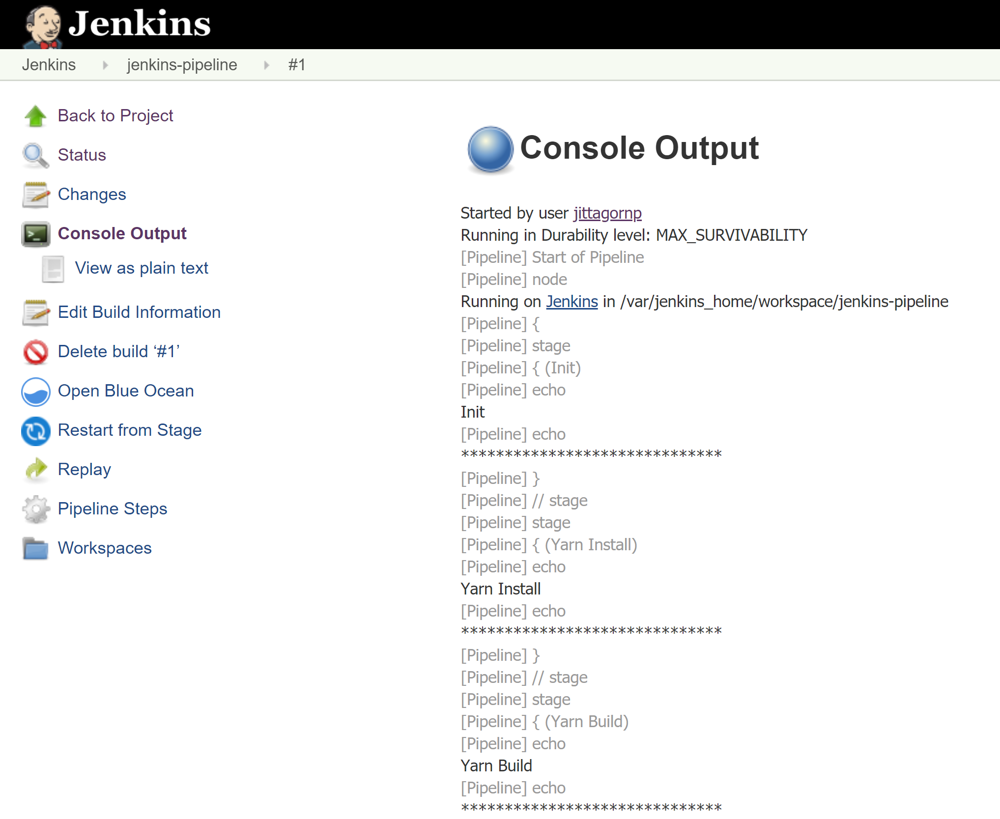

# กำหนด Environment 

ในการเขียน Pipeline เราสามารถกำหนดให้ Pipeline ใช้งานจากตัวแปร `env` หรือ Environment ต่าง ๆ ของระบบได้  โดยการใช้ `${env.XXXXX}`
  
ตัวอย่างการใช้ `env` ของระบบ    
```js
pipeline {

    agent any

    stages {

        stage('Init'){
            steps {
                echo 'Init'
                echo '******************************'  
                echo "build number : ${env.BUILD_NUMBER}"
            }
        }

        ...
    }    
}
```

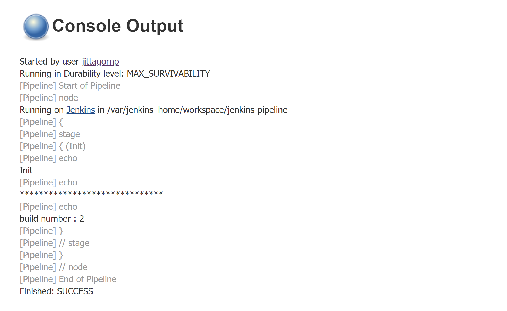

ตัวอย่างการใช้ `env` ที่กำหนดขึ้นมาเอง   
```js
pipeline {

    agent any

    environment {
        REGISTRY_URL = 'https://registry.mydomain.com'
    }    

    stages {

        stage('Init'){
            steps {
                echo 'Init'
                echo '******************************'  
                echo "registry url : ${env.REGISTRY_URL}"
            }
        }

        ...
    }    
}
```

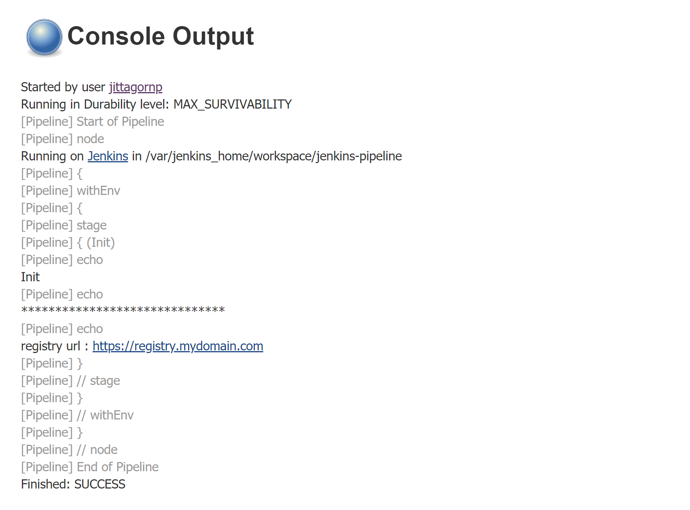

### ข้อควรระวัง

การใช้ตัวแปร `env` หรือ Environment จะต้องทำภายใน String ที่เป็น `Double Quote เท่านั้น (")` เพราะถ้าใช้ Single Quote (') ตัวแปร env จะไม่ทำงาน 

อ่านเพิ่มเติมได้ที่

- [https://jenkins.io/doc/book/pipeline/syntax/#environment](https://jenkins.io/doc/book/pipeline/syntax/#environment)

# กำหนด Agent 

เราสามารถกำหนด `agent` ในการ run Pipeline แต่ละ `stage` แยกออกมาได้ 
  
ตัวอย่างเช่น กำหนดให้ stage นี้ถูก execute ด้วย docker เป็นต้น

```js
pipeline {

    agent any

    environment {
        NODE_IMAGE = 'node:12.13.0'
        NODE_IMAGE_ARGS = '-u 0:0'
    }    

    stages {

        ...

        stage('Yarn Install') {

            agent {
                docker {
                    image "${env.NODE_IMAGE}"
                    args "${env.NODE_IMAGE_ARGS}"
                }
            }

            steps {
                echo 'Yarn Install'
                echo '******************************'  
                sh 'node --version'
                sh 'yarn --version'
            }
        }
    }    
}
```

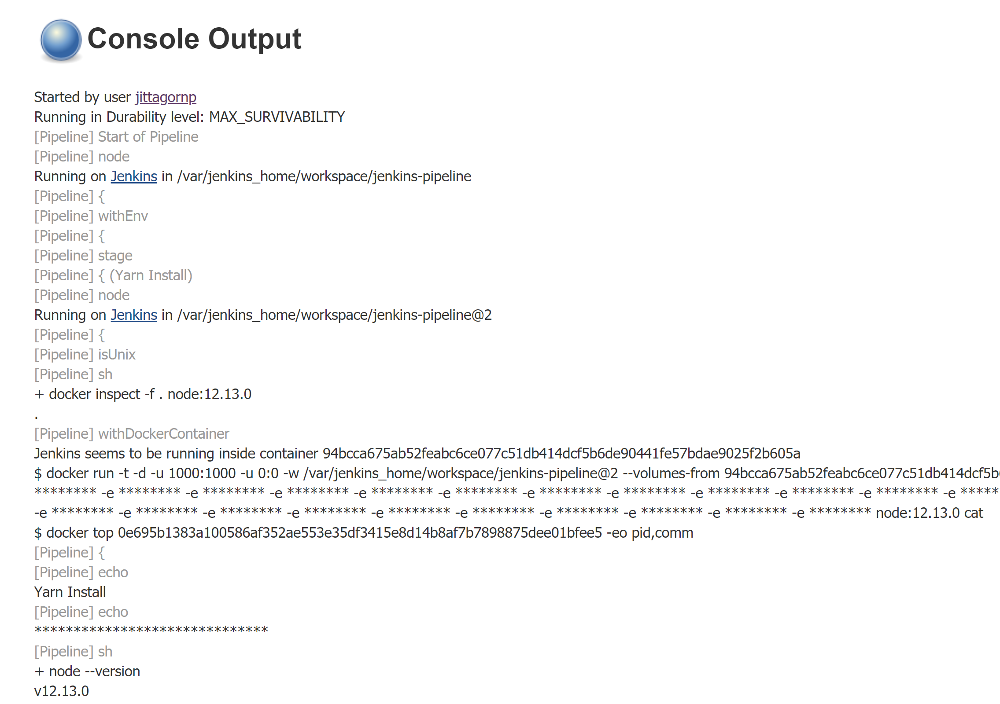

อ่านเพิ่มเติมได้ที่

- [https://jenkins.io/doc/book/pipeline/syntax/#agent](https://jenkins.io/doc/book/pipeline/syntax/#agent)


# Script

เราสามารถเขียน Pipeline Logic ที่ซับซ้อนด้วยภาษา `Groovy` ได้ โดยการใช้ `script` block   
      
โดยการ กำหนด `script { ... }` ไว้ใน `steps { ... }` ดังนี้

```js
...
        stage('Read .env') {
            
            agent any

            steps{
                script {
                    ...
                }
            }
        }
...
```
ตัวอย่าง 
```js
def envProps

pipeline {
    
    agent none

    environment {
        MAVEN_IMAGE = 'maven:3.6.2-jdk-11'
        MAVEN_IMAGE_ARGS = '-v /root/jenkins_home/ssh:/ssh -v /root/jenkins_home/.m2:/root/.m2:z -u root'
        NODE_IMAGE = 'node:12.13.0'
        NODE_IMAGE_ARGS = '-u 0:0'
        DOCKER_IMAGE = ''
    }

    stages {

        stage('Read .env') {
            
            agent any

            steps{
                echo 'Read .env'
                echo '******************************'
                script {
                    def envFile = readFile("${env.JENKINS_HOME}/deploy/account.env");
                    def map = [:], lines = envFile.split("\r?\n"); 
                    for (def line : lines) {
                        def arr = line.split("=");
                        map.put(arr[0], arr[1]);
                    }
                    envProps = map;
                }
            }
        }

        ...

    }
}
```

อ่านเพิ่มเติมได้ที่ 

- [https://jenkins.io/doc/book/pipeline/syntax/#script](https://jenkins.io/doc/book/pipeline/syntax/#script)

# ตัวอย่างเต็ม ๆ

```js
def envProps

pipeline {
    
    agent none

    environment {
        MAVEN_IMAGE = 'maven:3.6.2-jdk-11'
        MAVEN_IMAGE_ARGS = '-v /root/jenkins_home/ssh:/ssh -v /root/jenkins_home/.m2:/root/.m2:z -u root'
        NODE_IMAGE = 'node:12.13.0'
        NODE_IMAGE_ARGS = '-u 0:0'
        DOCKER_IMAGE = ''
    }

    stages {

        stage('Read .env') {
            
            agent any

            steps{
                echo 'Read .env'
                echo '******************************'
                script {
                    def envFile = readFile("${env.JENKINS_HOME}/deploy/account.env");
                    def map = [:], lines = envFile.split("\r?\n"); 
                    for (def line : lines) {
                        def arr = line.split("=");
                        map.put(arr[0], arr[1]);
                    }
                    envProps = map;
                }
            }
        }

        stage('Yarn Install') {

            agent {
                docker {
                    image "${env.NODE_IMAGE}"
                    args "${env.NODE_IMAGE_ARGS}"
                }
            }

            steps {
                echo 'Yarn Install'
                echo '******************************'
                sh 'node --version'
                sh 'yarn --version'
                sh 'cd frontend && yarn install'
            }
        }

        stage('Yarn Build') {

            agent {
                docker {
                    image "${env.NODE_IMAGE}"
                    args "${env.NODE_IMAGE_ARGS}"
                }
            }

            steps {
                echo 'Yarn Build'
                echo '******************************'
                sh 'cd frontend && yarn build'
            }
        }
        
        stage('Mvn Install') {
        
            agent {
                docker {
                    image "${env.MAVEN_IMAGE}" 
                    args "${env.MAVEN_IMAGE_ARGS}"
                    reuseNode true
                }
            }

            steps {
                echo 'Mvn Install'
                echo '******************************'
                sh 'java -version'
                sh 'mvn -version'
                sh 'mvn -U clean install -DskipTests=true'
            }
        }

        stage('Mvn Test') {
        
            agent {
                docker {
                    image "${env.MAVEN_IMAGE}" 
                    args "${env.MAVEN_IMAGE_ARGS}"
                    reuseNode true
                }
            }

            steps {
                echo 'Mvn Test'
                echo '******************************'
                sh 'mvn test'
            }
        }

        stage('Docker Build') {

            agent any

            steps{
                echo 'Docker Build'
                echo '******************************'
                script {
                  DOCKER_IMAGE = docker.build envProps.REGISTRY_NAME + ":latest"
                }
            }
        }

        stage('Docker Push') {

            agent any

            steps{
                echo 'Docker Push'
                echo '******************************'
                script {
                    docker.withRegistry(envProps.REGISTRY_URL, envProps.REGISTRY_CREDENTIAL) {
                        DOCKER_IMAGE.push()
                    }
               }
            }
        }

        stage('Deploy') {

            agent any

            steps{
                echo 'Deploy'
                echo '******************************'
                sh "sh ${env.JENKINS_HOME}/deploy/${envProps.DEPLOY_SH_FILE}"
            }
        }

    }
}
```

การเขียน Jenkins Pipeline อื่น ๆ ที่ซับซ้อน สามารถเรียนรู้ได้จากลิ้งค์ใน Reference ด้านล่างครับ

# บทความน่าอ่าน

- [Tips สำหรับการใช้ Jenkinsfile จาก Wongnai](https://life.wongnai.com/tips-สำหรับการใช้-jenkinsfile-c6fad180bec4)

# Google Slide 

- [https://docs.google.com/presentation/d/1nEYWP-Su555FVPHJQgJKYjhQ8Na-nYQAqvarYH7gV3s/edit?usp=sharing](https://docs.google.com/presentation/d/1nEYWP-Su555FVPHJQgJKYjhQ8Na-nYQAqvarYH7gV3s/edit?usp=sharing)

# ตัวอย่าง Code บน GitHub 

- [Jenkins Pipeline Example](https://github.com/jittagornp/jenkins-pipeline-example)

# Reference 

- [https://jenkins.io/doc/book/pipeline/getting-started/](https://jenkins.io/doc/book/pipeline/getting-started/)
