# ไหน ๆ ก็เป็น Developer แล้ว เรามาสร้าง Weblog (Blog) ใช้เองกันเถอะ!


> บทความนี้เขียนขึ้น เพราะอยากที่จะเชิญชวน Developer ทุกคน มาร่วมกันสร้าง Blog หรือ Website ของตัวเอง โดยใช้ Programming Language และ Technology ตามที่ตัวเองถนัด โดยไม่ใช้ Blog สำเร็จรูปที่มีอยู่แล้ว  

เราว่าการสร้าง Blog ด้วยตัวเอง มันบ่งบอกถึงตัวตนและ `Lifestyle` ของเราน่ะ     
รสนิยมของเราจะเป็นยังไง ส่วนนึงมันก็แสดงออกมาจากรูปแบบของ Blog และวิธีการเขียนบทความของเรานั่นแหล่ะ 

# ทำไมถึงสร้าง Blog เอง

เหตุผลหลัก ๆ ก็คือ Blog สำเร็จรูปที่มีอยู่ `มันไม่ตอบโจทย์ที่ตัวเองอยากจะได้สักเท่าไหร่`   
ไม่ใช่ว่าของเค้าไม่ดีน่ะ หลาย ๆ อันดี ถึงดีมาก แต่แค่เราอยากได้อะไรตามใจตัวเองแค่นั้นแหล่ะ 

# ทำไม Blog ที่มีอยู่ถึงไม่ตอบโจทย์

อันนี้เหตุผลส่วนตัวน่ะ

1. เราอยากได้ Blog ที่มันดูสวย เรียบง่าย เป็น Blog ที่เขียนบทความแล้วน่าอ่าน (เราอยากให้คนอ่าน อ่านเพลิน) ซึ่งตรงนี้เราประทับใจ [Medium](https://medium.com) เอามาก ๆ เลยเป็นเหตุผลว่า ทำไม Blog นี้ถึงหน้าตาคล้าย Medium **ใช่! เราลอก  Style ของ Medium มาเลย** อันนี้ยอมรับ แล้วทำไมถึงไม่ใช้ Medium เลยล่ะ ลองอ่านเหตุผลถัด ๆ ไปดู    

2. `เราอยากได้สารบัญบทความ (Table of Contents) อัตโนมัติ` ขอย้ำว่าอัตโนมัติด้วยน่ะ เพราะขี้เกียจทำสารบัญเอง คือ เคยเจอมั้ย ที่ต้องอ่านบทความยาว ๆ แล้วไม่รู้ว่ามันมีหัวข้ออะไรให้อ่านบ้าง  และเราอ่านถึงไหนแล้ว บางที บางอันเราเคยอ่านแล้ว เราก็อยากที่จะเลื่อนไปอ่านแค่บางหัวข้อแค่นั้น ไม่ได้อยากอ่านทั้งหมด ไม่มีสารบัญนี่ไล่หาตาแตกเลย  

3. เราอยากเขียนบทความเป็น Markdown เก็บไว้ เพื่อที่ว่าจะได้เอาไปใช้กับ Platform อื่น ๆ ได้ด้วย เช่น GitHub, GitLab และ Plaform อื่น ๆ ที่ Support Markdown

4. เราเป็น Blogger มา 10 ปีล่ะ (หัดเขียนบทความตั้งแต่เรียนอยู่ปี 3) เคยลองเขียนบทความมาหลาย Platform ทั้ง Blogspot, Wordpress, GitHub Pages, Git Book, Medium, Dev และอื่น ๆ เราพบว่า เมื่อเวลาผ่านไป หลาย ๆ Platform จะค่อย ๆ `ได้รับความนิยมลดลง` คนก็หันใช้ไปใช้ Plaform อื่น ๆ สิ่งที่เราเคยเขียนไว้ใน Plaform นึง ถ้าจะต้องย้ายไปตาม Plaform ที่คนให้ความสนใจ มันก็ค่อนข้างลำบากเลยแหล่ะ เพราะจะต้อง Copy Content แล้วไปจัด Format ใหม่ บางบทความคือเราเขียนยาวมาก จัด Format ทีนี่ แทบอ้วกเลย นี่จึงเป็นเหตุผลที่เราต้องการเขียนเป็น Markdown เก็บไว้

5. เราอยากได้ Blog ที่เป็น Style เฉพาะตัวเรา คือ พอมันเป็น Plaform สิ่งที่ต้องทำใจยอมรับอย่างนึงคือ หน้าตา Blog ของทุกคนจะมาเป็น Pattern เดียวกันทั้งหมดเลย ซึ่งตรงนี้บางคนก็อาจจะไม่ได้คิดอะไรมาก (แต่เราคิด!)

6. ลูกเล่นอื่น ๆ ที่เราอยากจะใส่เพิ่ม พอมันเป็น Blog สำเร็จรูป พอถึงจุด ๆ นึง มันเริ่มที่จะ Custom ลำบากล่ะ 

7. อยากมีรายได้จากการทำ Blog เราเขียน Blog เป็นงานอดิเรกมานานมากแล้ว `ไม่เคยมีรายได้เลย` เลยอยากที่จะใช้ตรงนี้สร้างรายได้เล็ก ๆ น้อย ๆ ให้ตัวเอง ได้แค่ค่า Server หรือ ค่ากาแฟ ต่อเดือนก็ยังดีน่า!  

ถ้าคิดออก เดี๋ยวมาเขียนเพิ่มน่ะ 

#   ราคาที่ต้องจ่าย และสิ่งที่สูญเสียไป เมื่อต้องสร้าง Blog เอง

1. ต้องมีความรู้ในการเขียนโปรแกรม และการ Setup ระบบในระดับนึงเลย 
2. ค่า Server หรือ ค่าบริการ Cloud อื่น ๆ อย่าง Blog นี้ เราเสียค่า Server DigitalOcean ตกเดือนละ 5 USD (คิดเป็นเงินไทยประมาณ 150 บาท ณ วันที่ 16 ก.พ. 2564) 
3. คนอ่าน คน Follow อาจจะไม่เยอะเท่า Plaform ที่คนรู้จักแล้ว 
4.  `ถ้าเป็นคนที่ไม่มีศิลปะในหัวเลย การแต่ง Blog (CSS) จะถือเป็นเรื่องที่ยากมาก` โดยเฉพาะคนที่ทำงานด้าน Back-end เป็นหลัก  

# สร้าง Blog เองแล้วได้อะไร 

- ได้ Blog ตามที่ตัวเองอยากจะได้
- ได้ความรู้เพิ่มขึ้น 
- ได้อวดผลงานตัวเอง 
- มีรายได้ (ถ้าติด Google AdSense)
- สนุก 

# Blog นี้สร้างยังไง 

เดี๋ยวจะอธิบายให้ฟัง/อ่านกัน เผื่อใครอยากที่จะเอาไอเดียนี้ไปใช้สร้าง Blog ของตัวเอง

# ลักษณะของ Blog 

Blog นี้เป็น `กึ่ง ๆ Static` คือ ไม่ Static 100% 

- ตัวบทความเป็น Static (แปลง Markdown -> HTML)
- บางส่วนของ Blog เป็น Dynamic เช่น ข้อมูล Page views, ข้อมูล COVID-19 ที่หน้าแรก 

แน่นอน ว่ามันต้องมี Database และ API ด้วย (แต่บทความนี้จะไม่ได้ลงรายละเอียดเรื่องพวกนี้)

# การแบ่ง Source Code

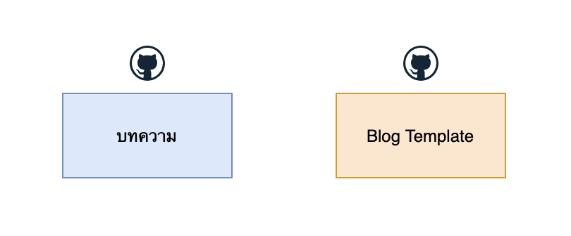

 Blog นี้แบ่ง Source Code ออกเป็น 2 ชุด คือ 

 - ตัวบทความ (ที่เขียนเป็น Markdown ไฟล์ `.md`)
 - Blog Template (หน้าตาของ Blog)

### ตัวบทความ

เขียนเป็น Markdown เก็บไว้ที่ GitHub 

- [https://github.com/jittagornp/www.jittagornp.me](https://github.com/jittagornp/www.jittagornp.me) 
  
ที่ไม่เก็บลง Database และเปิดเป็น Public ไว้ มีเหตุผล คือ 

> กลัวว่าในอนาคต ถ้าวันใดวันนึงเราไม่อยู่แล้ว (ไม่ว่าจะด้วยเหตุผลอะไรก็ตาม พูดง่าย ๆ คือ ตาย นั่นแหล่ะ) บทความที่เราเคยเขียนไว้จะยังคงอยู่ ไม่สูญหายไปกับตัวเรา (ไม่ต้องกังวลถ้าลืมจ่ายค่า Server) 

หลาย ๆ บทความ คือ เราตั้งใจเขียนเอามาก ๆ หายไปก็น่าเสียดายแย่ :)  

### Blog Template 

เขียนด้วย Programming Language และใช้ Technology ตามที่ตัวเองถนัด

# Tech Stack ของ Blog Template 


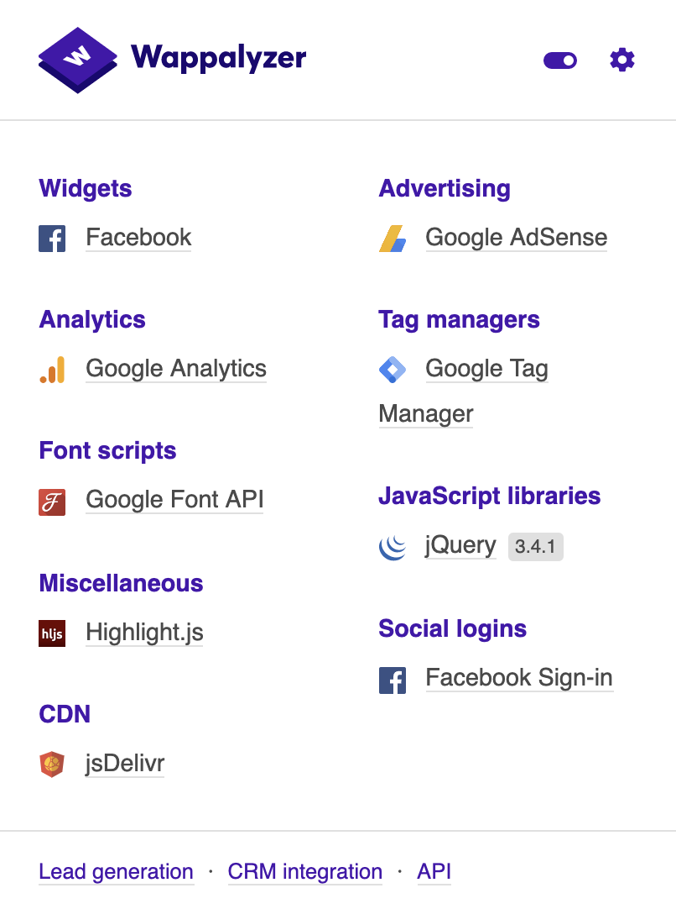

Blog นี้ไม่ได้ใช้  Vue, React หรือ Angular   
ไม่ได้เขียนแบบ SPA (Single Page Application)   
  
ต้องการแค่ให้มันทำงานง่าย ๆ คือ  
- เป็น SSR (Server Side Rendering)  
- และ Redirect เปลี่ยนหน้าไปมา

เลยใช้ Stack ง่าย ๆ แค่นี้ 

### Front-end

- Html 
- Css
- JavaScript
- JQuery
- Font Awesome
- Google Font (PT Serif)
- Facebook Plugins
- PWA (Progressive Web Apps)

### Back-end
- [Apache Maven](/blog/what-is-apache-maven/)
- Java
- [Spring-boot Reactive (WebFlux)](https://github.com/jittagornp/spring-boot-reactive-example)
- Postgresql
- Markdown Text Processor
- HTML + YUI Compressor
- [Docker](https://docs.google.com/presentation/d/1NXArkIDFIJMmcvXY63cc5z7jIsbx8SDZqt76RqeuGwU/edit?series=docker#slide=id.p) 

### อื่น ๆ
- Visual Studio Code
- IntelliJ IDEA
- GitHub
- DigitalOcean
- [Cloudflare](/blog/https-by-cloudflare/) 

# การวางระบบและการ Deploy 


### ภาพรวม 

จากภาพด้านบน จะเห็นว่าองค์ประกอบหลัก ๆ ของ Blog จะมีอยู่ 3 ส่วน คือ 

**1. Cloudflare** [https://www.cloudflare.com/](https://www.cloudflare.com/)     
ไว้ทำ `DNS` + `HTTPS` + `CDN` (Caching) สามารถอ่านได้จากบทความ [ทำ Website เราให้เป็น https ด้วย Cloudflare](/blog/https-by-cloudflare/)

**2. DigitalOcean** [https://www.digitalocean.com/](https://www.digitalocean.com/)     
เป็น VPS (Virtual Private Server) ไว้ Run Server ง่าย ๆ แค่ 1 เครื่อง   
ตอนนี้ใช้ Spec เครื่องแค่       

- CPU : 1 vCPU
- Memory (RAM) : 1 GB
- Hard disk (SSD) : 25 GB

ราคา 5 USD ต่อเดือน เปิดเครื่องไว้ที่ Singapore 

> เนื่องจากคนไม่ได้อ่านบทความเยอะมาก เลยใช้ Spec เครื่องแค่นี้พอ 

**3. GitHub** [https://github.com/](https://github.com/)    
ไว้ฝาก Source Code โดยแยกเป็น 2  Repositories คือ 

- [บทความ (Public Repository)](https://github.com/jittagornp/www.jittagornp.me) 
- Blog Template (Private Repository)  

### เครื่อง Server 


- ลง Docker ไว้ 
- Run PostgresQL เป็น Database ไว้ 1 Container (อย่าลืม Mount Volume ข้อมูล ออกมาไว้นอก Container น่ะ!)  

> Database ไว้เก็บข้อมูล Page views

### การ Deploy 

- ครั้งแรกเราจะ Deploy แบบ Manaul ก่อน   
- ครั้งถัด ๆ ไป เราจะ Deploy แบบ Automatation

**Manual**  

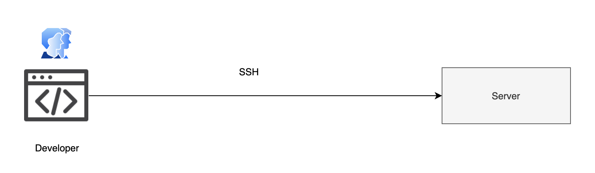

ก็คือการ Remote SSH เข้าไปที่เครื่อง Server แล้ว 

```sh
$ git clone https://github.com/jittagornp/xxx.git 
```

Repository ที่ต้องการลงมา แล้วก็ Deploy ตามเทคโนโลยีที่เราใช้ ซึ่ง Blog นี้เรา Deploy บน Docker 
  
การ Deploy   
- ตัวบทความ : แค่ Clone ลงมา เป็น Directory ธรรมดา ๆ  
- ส่วน Blog Template : Clone ลงมา แล้ว Build เป็น Docker Image จากนั้นก็ Run App เป็น Container 
  
ถ้าใครไม่แม่นเรื่อง SSH, Git และ Docker สามารถเรียนรู้ได้จาก 

- [การติดตั้งและใช้งาน SSH บน Ubuntu Server](/blog/ssh-ubuntu-server/)
- [พื้นฐาน Git](https://docs.google.com/presentation/d/15OPX4ho6uvhgOubxFxSp1Cl7myOlyQ7OBC9PoClMwBA/edit?series=series)
- [พื้นฐาน Docker](https://docs.google.com/presentation/d/1NXArkIDFIJMmcvXY63cc5z7jIsbx8SDZqt76RqeuGwU/edit?series=docker)

**Automatation**  

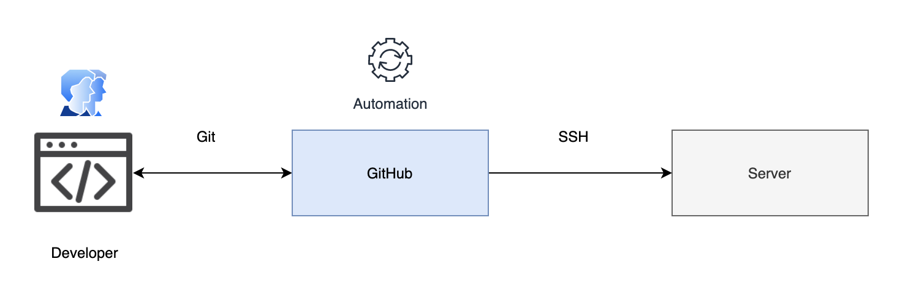

หลังจากที่เรา Manual Deploy เอง ไปแล้ว 1 รอบ   
ครั้งถัด ๆ มา เราจะเปลี่ยนระบบให้มันทำงานแบบ Automation เพื่อที่ว่า เราจะได้ไม่ต้อง Remote เข้าไป Manual Deploy ที่เครื่อง Server เองบ่อย ๆ  
  
การ Set Automation เราจะใช้ `GitHub Action` (CI/CD) ช่วยในการ Deploy   
โดยการเขียน `YML` File ไว้ใน Repository แบบนี้ 

```plaintext
.github/workflows/ci.yml
``` 

  

ตัวอย่างไฟล์เต็ม ๆ [ci.yml](https://github.com/jittagornp/www.jittagornp.me/blob/master/.github/workflows/ci.yml)   
ซึ่งค่าตัวแปร 

```plaintext
- ${{ secrets.REMOTE_KEY }}
- ${{ secrets.REMOTE_HOST }}
- ${{ secrets.REMOTE_USER }}
- ${{ secrets.REMOTE_PORT }}
```

เราจะ Set ไว้ที่ **Settings > Secrets**

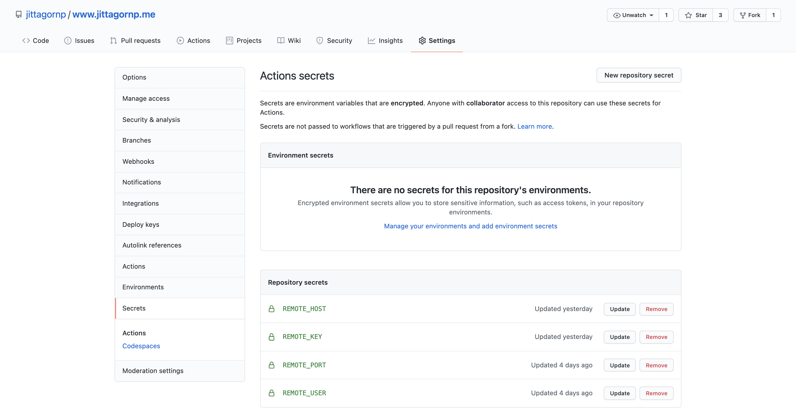

จาก YML File   
เมื่อเราทำการ Push หรือ Pull Request ไปที่ Branch `master` ตัว Action นี้จะทำงาน และทำการ Remote SSH เข้าไปที่เครื่อง Server เรา เพื่อ Deploy หรือทำตามคำสั่ง (Command) ที่เรากำหนดไว้ 
  
จากตัวอย่าง คือ   
``` plaintext
script: |
    rm -rf ~/www.jittagornp.me/dist 
    cd ~/www.jittagornp.me && git pull
```


ลองดูวิดีโอ

<iframe class="ui-video" src="https://www.youtube.com/embed/U5NTpQoE1Tw" frameborder="0" allow="accelerometer; autoplay; clipboard-write; encrypted-media; gyroscope; picture-in-picture" allowfullscreen></iframe>

# การทำงานของ Blog Template

อย่างที่อธิบายไปในตอนแรกว่า Blog นี้ แบ่ง Source Code / Repository ออกเป็น 2 ชุด คือ 

- ตัวบทความ (Markdown)
- Blog Template 

### Blog Template 

จะเป็นตัวที่ใช้ แปลง Markdown และ Render HTML โดยมีหลักการดังรูป 

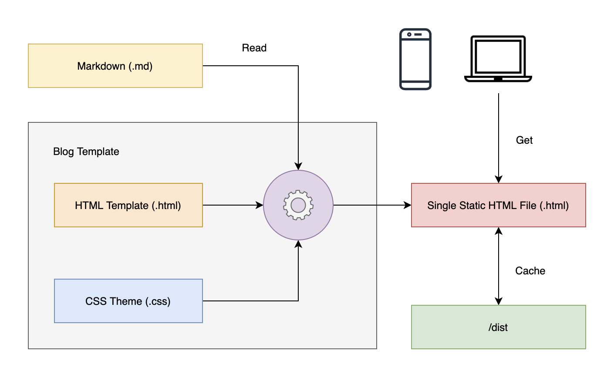

### การเตรียมไฟล์ 

**Makdown**  

แยกเป็น Directory ไว้สำหรับแต่ละบทความแบบนี้  

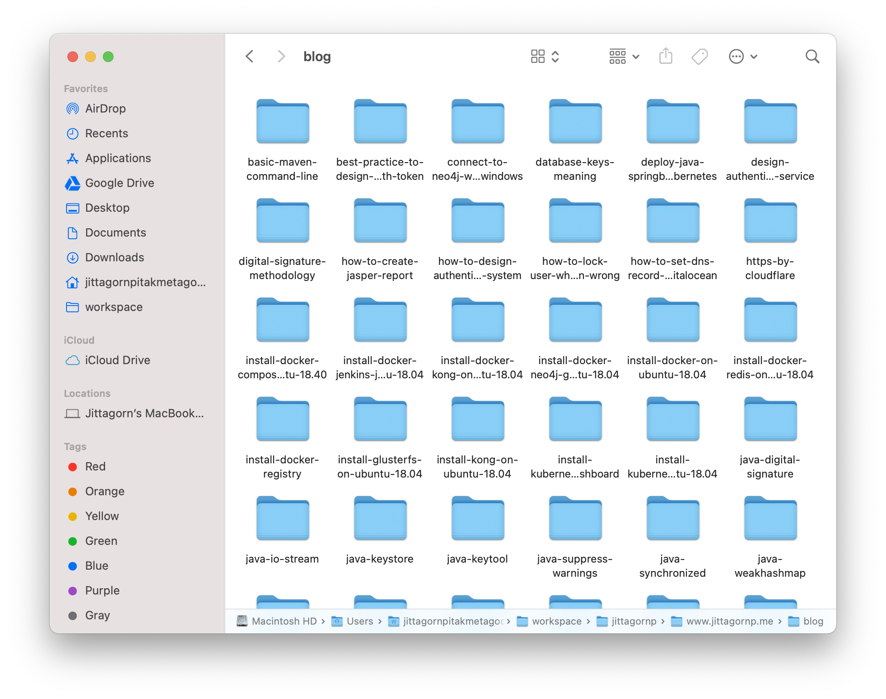

บทความนึงจะประกอบไปด้วยหลายไฟล์ ทั้งไฟล์ Markdown (`.md`), ไฟล์รูปภาพ และไฟล์อื่น ๆ 

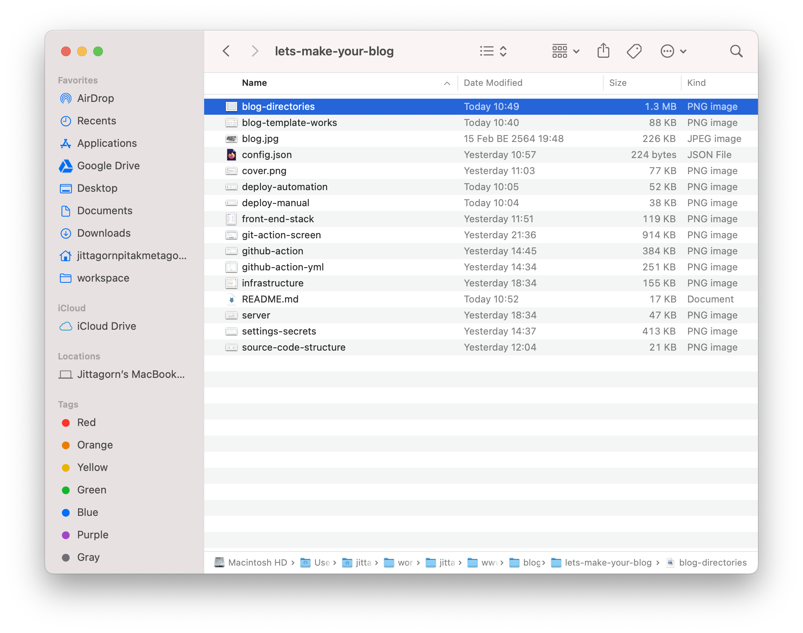

**HTML Template**   

เขียน HTML Layout ของ Blog ตามที่เราอยากจะได้ โดยเว้นตรงกลางว่างไว้ เพื่อรอเอาบทความมาใส่ 


**CSS Theme**  

Blog นี้มี Theme อยู่ 2 แบบคือ 

- Light Mode 
- Dark Mode


โดยเราจะแบ่ง CSS ออกเป็น 3 ไฟล์ ดังนี้ 

- `app.css` เป็น CSS Layout เขียนแค่ Layout ไม่มีการลงสีใด ๆ ทั้งสิ้น  
- `theme-light.css` เป็น สีของ Light Mode  
- `theme-dark.css` เป็น สีของ Dark Mode  

 ถ้าเราจะใช้ Light Theme : ให้เราใช้ 2 ไฟล์รวมกันแบบนี้  

 ```plaintext
Light Theme = app.css + theme-light.css
 ```

ถ้าเราจะใช้ Dark Theme : ให้เราใช้ 2 ไฟล์รวมกันแบบนี้  

 ```plaintext
Dark Theme = app.css + theme-dark.css
 ```

### การแปลง การรวม และการบีบอัด

หลังจากที่เราเตรียมไฟล์ต่าง ๆ พร้อมแล้ว เราจะนำแต่ละไฟล์มาเข้ากระบวนการ 

```plaintext
Output = Convert -> Combine -> Compress 
```

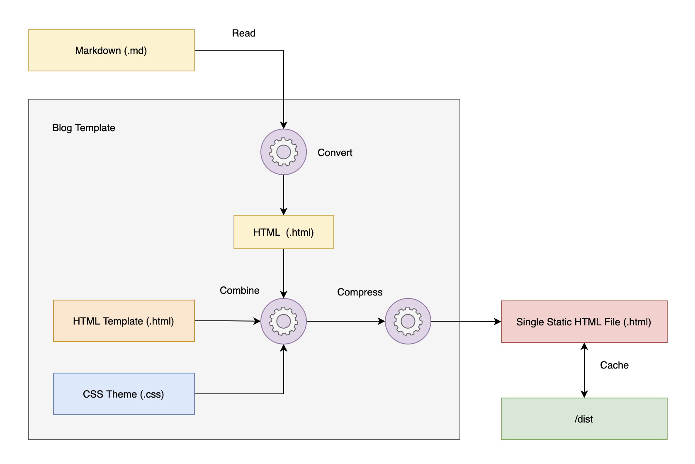

ผลลัพธ์ได้ออกมาเป็น Single Static HTML File   
แล้วก็นำไฟล์นี้ไปใช้ รวมทั้ง Cache ไว้ใช้ในครั้งถัด ๆ ไปด้วย 
  
Cache 

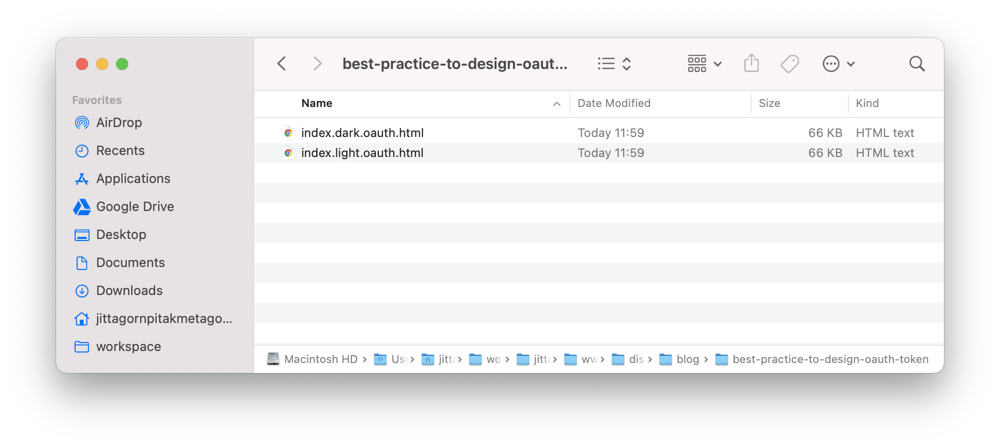

เมื่อเราลองคลิกไฟล์นี้ดู 

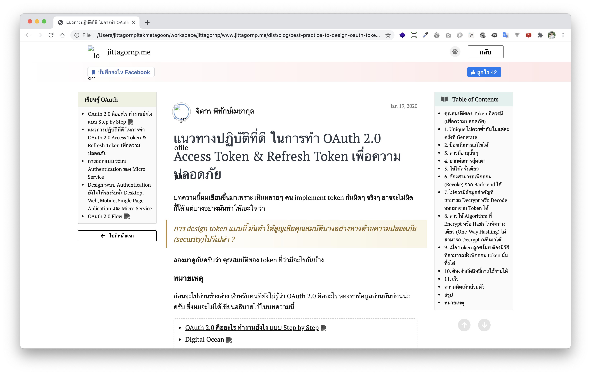

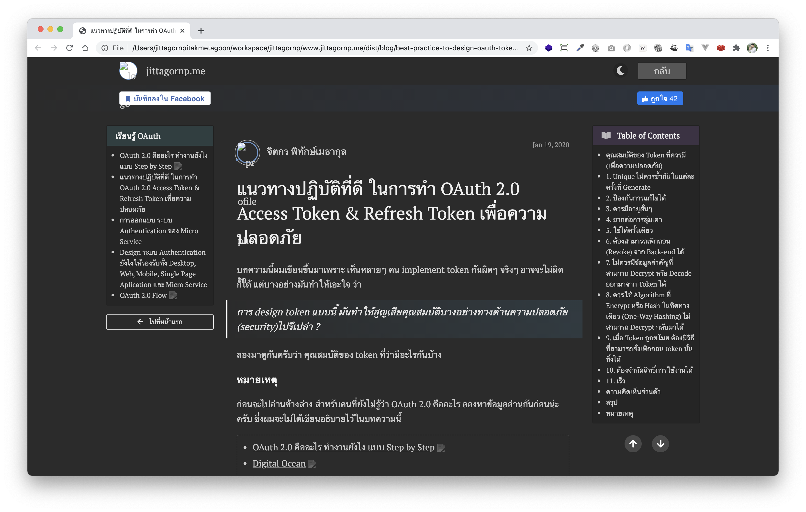

จะเห็นว่า เราสามารถนำไปใช้งานได้เลย **แค่รูปไม่ขึ้น**
  
เมื่อเราลอง View Source Code ดู

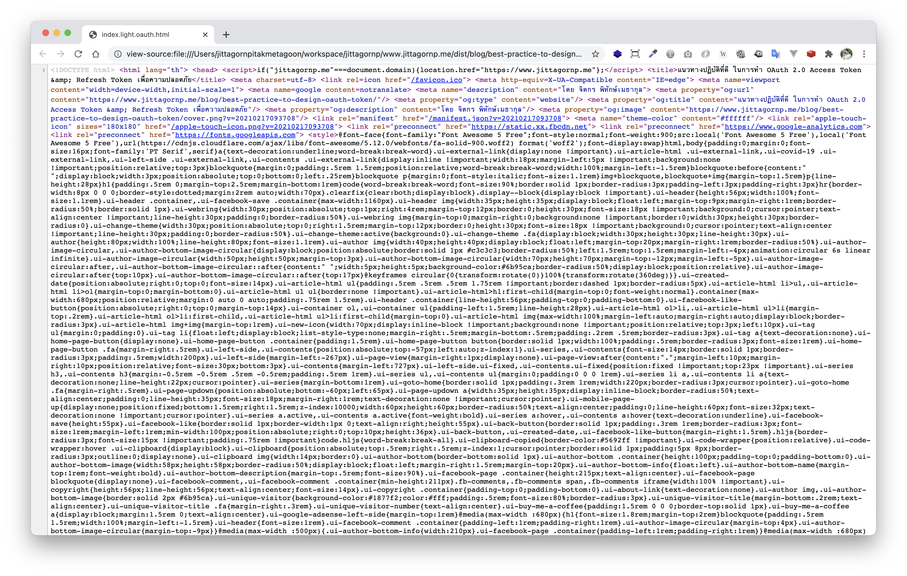

ทั้ง HTML, CSS ถูก Combine (รวม) กัน พร้อมทั้ง Compress (บีบอัด) Source Code ให้ด้วย 

> การ Convert -> Combine -> Compress จะเกิดขึ้นแค่ครั้งแรกที่ User อ่านบทความนั้น ครั้งถัด ๆ ไปจะ Return Static (Cache) File เดิมที่ทำไว้แล้ว 

# สารบัญอัตโนมัติ

ก่อนที่จะทำการ Convert Markdown ระบบจะอ่านสารบัญออกมาก่อน โดยการอ่านเฉพาะ Heading `H1` (# เดียว) มาเป็นสารบัญ เช่น

```md
# ไหน ๆ ก็เป็น Developer แล้ว เรามาสร้าง Weblog (Blog) ใช้เองกันเถอะ!


> บทความนี้เขียนขึ้น เพราะอยากที่จะเชิญชวน Developer ทุกคน มาร่วมกันสร้าง Blog ของตัวเอง โดยใช้ Programming Language และ Technology ตามที่ตัวเองถนัด โดยไม่ใช้ Blog สำเร็จรูปที่มีอยู่แล้ว  

เราว่าการสร้าง Blog ด้วยตัวเอง มันบ่งบอกถึงตัวตนและ `Lifestyle` ของเราน่ะ     
รสนิยมของเราจะเป็นยังไง ส่วนนึงมันก็แสดงออกมาจากรูปแบบของ Blog และวิธีการเขียนบทความของเรานั่นแหล่ะ 

# ทำไมถึงสร้าง Blog เอง

เหตุผลหลัก ๆ คือ Blog สำเร็จรูปที่มีอยู่ `มันไม่ตอบโจทย์ที่ตัวเองอยากจะได้สักเท่าไหร่`   
ไม่ใช่ว่าของเค้าไม่ดีน่ะ หลาย ๆ อันดี ถึงดีมาก แต่แค่เราอยากได้อะไรตามใจตัวเองแค่นั้นแหล่ะ 

# ทำไม Blog ที่มีอยู่ถึงไม่ตอบโจทย์

อันนี้เหตุผลส่วนตัวน่ะ
...
```
> ตัด H1 ตัวแรกออก

สารบัญจะได้เป็น 

- ทำไมถึงสร้าง Blog เอง
- ทำไม Blog ที่มีอยู่ถึงไม่ตอบโจทย์ 
- ...
  
 

# PWA

ใช้ PWA (Progressive Web Apps) ทำ Offline แบบขำ ๆ กรณีที่ไม่ได้เชื่อมต่ออินเตอร์เน็ต 

> เดี๋ยวอนาคตจะหาเกมส์มาใส่   

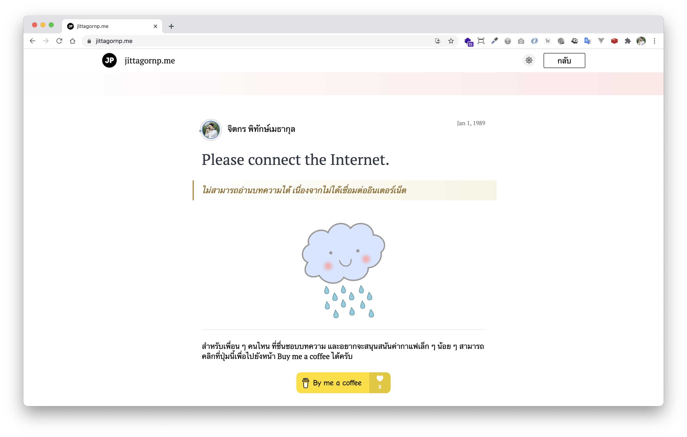

# Layout 

จากที่ลองทำ Blog เองดู ถ้าเรากำหนดขนาดความกว้างของ Content ให้อยู่ที่ไม่เกิน `700px` เวลาเราสั่ง Print Blog มันจะเท่ากับขนาดของ PDF พอดี 

> เผื่อใครอยาก Print เป็นกระดาษเอาไปอ่าน 

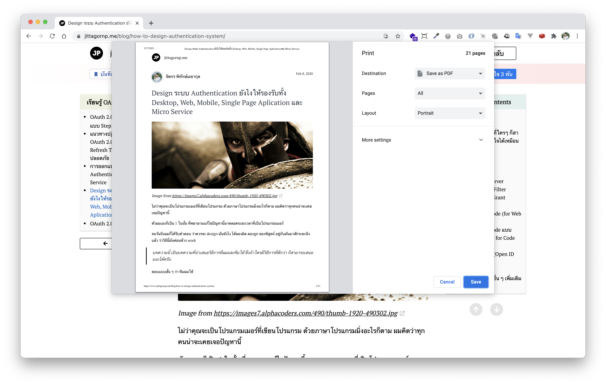

# Responsive

อย่าลืมเขียนให้แสดงผลได้ทุกหน้าจอด้วยล่ะ 

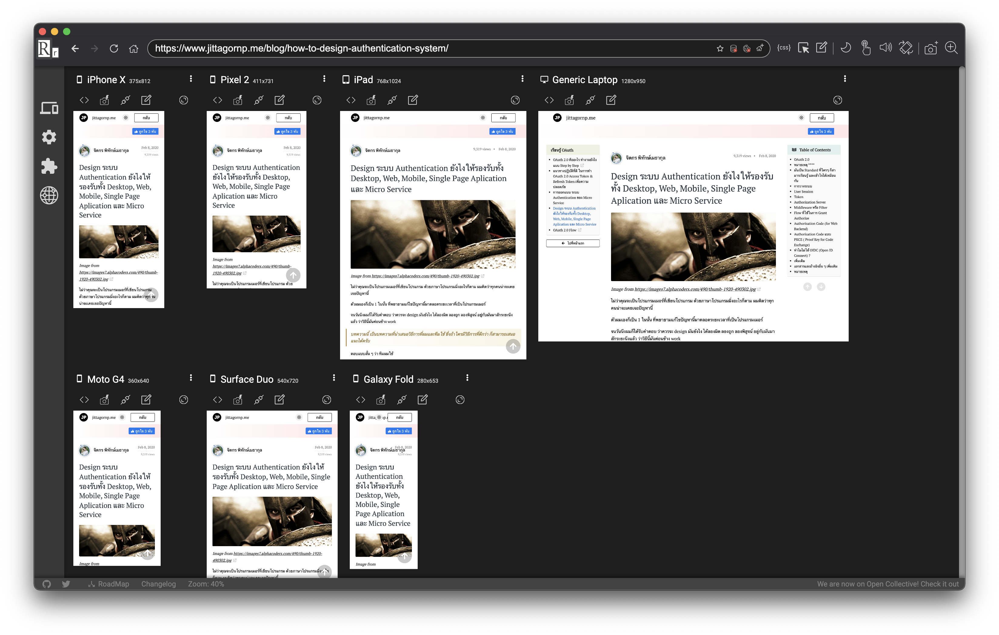

ใช้ Tool ตัวนี้ช่วย 

- [https://responsively.app/](https://responsively.app/)

# ชวนเข้าร่วม Webring 

พอเราทำ Blog ออกมาแล้ว และอยากที่จะแชร์ Blog เราให้คนอื่นได้อ่านบ้าง   
เรามีวิธีแนะนำ นั่นก็คือ การเข้าร่วมเป็นส่วนหนึ่งของ `Webring`  
  
> "Webring" หรือ “วงแหวนเว็บ” สร้างขึ้นเพื่อส่งเสริมให้ศิลปิน นักออกแบบ และนักพัฒนาชาวไทย สร้างเว็บไซต์ของตัวเองและแบ่งปันการเข้าชมซึ่งกันและกัน

ซึ่ง Blog นี้ก็เข้าร่วม Webring เป็นที่เรียบร้อย 

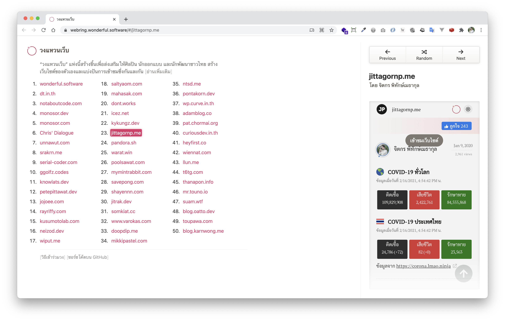

ถ้าใครสนใจ Join Webring สามารถทำตาม Link นี้ได้ 

- [https://github.com/wonderfulsoftware/webring](https://github.com/wonderfulsoftware/webring)

ต้องขอบคุณ คุณ [**Thai Pangsakulyanont**](https://github.com/dtinth) ที่ทำเว็บดี ๆ แบบนี้ขึ้นมา

# สุดท้าย 

ก็ขอเชิญชวนทุกคนที่เป็น Developer มี Website หรือ Blog เป็นของตัวเองน่ะ   
ต่อให้ไม่ได้เขียน Code เอง ก็ยังอยากให้ทุกคนมี Blog เป็นของตัวเองอยู่ดี

> มีเถอะนะ นะ นะ นะ นะ!