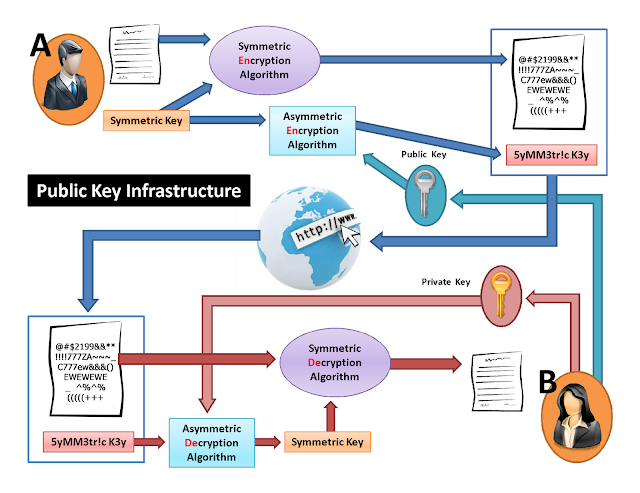

# โครงสร้างการเข้ารหัสข้อมูลแบบกุญแจสาธารณะ (Public Key Infrastructure)

# กระบวนการทางฝั่งผู้ส่ง

1. จากภาพ  นาย A ต้องการส่งข้อมูล (Data)  ไปให้กับนางสาว B
2. ระบบจะสร้าง Symmetric Key ขึ้นมา 1  ชุด  
3. และนำ Data ที่นาย A ต้องการจะส่ง  มาทำการเข้ารหัสข้อมูลกับ Symmetric Key ด้วยอัลกอริทึมแบบ Symmetric กลายเป็น Data Encryption
4. นำ Symmetric Key ของนาย A มาเข้ารหัสข้อมูลอีกทีด้วย `Public Key ของนางสาว B (ผู้รับ)` กลายเป็น Symmetric Key Encryption
5. ส่งข้อมูลที่เป็น Data Encryption +  Symmetric Key Encryption  ไปพร้อมกัน    

### ข้อสังเกต

1. Data มีการเข้ารหัสข้อมูลแบบ Symmetric Key คือใช้ Key ใดเข้ารหัส  จะต้องใช้ Key นั้นถอดรหัสเท่านั้น
2. การเข้ารหัสข้อมูลเกิดขึ้นทั้งหมด 2 ครั้ง คือ
   - การทำ  Data Encryption ด้วย Symmetric Key
   - และการทำ  Symmetric Key Encryption ด้วย Public Key ของผู้รับ
3. ส่ง   Data Encryption +  Symmetric Key Encryption  ไปพร้อมกัน  

# กระบวนการทางฝั่งผู้รับหรือกระบวนการตรวจสอบ

1. ระบบของนางสาว B (ผู้รับ) จะได้รับข้อมูลที่เป็น  Data Encryption +  Symmetric Key Encryption  แนบมาด้วยกัน
2. นางสาว B (ผู้รับ) จะใช้ Private Key ของตนเอง มาถอดรหัส  Symmetric Key Encryption ได้เป็น  Symmetric Key
3. จากนั้นจะนำ  Symmetric Key ที่ได้จากข้อ 2 มาถอดรหัส Data Encryption อีกที ได้ผลลัพธ์เป็น Data  จึงถือว่าการส่งข้อมูลเสร็จสมบูรณ์

### ข้อสังเกต

1. ข้อมูลที่ระบบของผู้รับได้ตอนแรกคือ   Data Encryption +  Symmetric Key Encryption ซึ่งถูกส่งมาด้วยกัน
2. มีการถอดรหัสข้อมูลเกิดขึ้นทั้งหมด 2 ครั้ง คือ
   - การถอดรหัสข้อมูล  Symmetric Key Encryption ด้วย Private Key ของผู้รับ
   - การถอดรหัสข้อมูล (Data) ด้วย Symmetric Key ที่ได้มา 

# หมายเหตุ
เป็นบทความที่ถูกย้ายมาจาก [https://na5cent.blogspot.com/2012/04/public-key-infrastructure.html](https://na5cent.blogspot.com/2012/04/public-key-infrastructure.html) ซึ่งผู้เขียน เขียนไว้เมื่อ วันอังคารที่ 3 เมษายน พ.ศ. 2555  