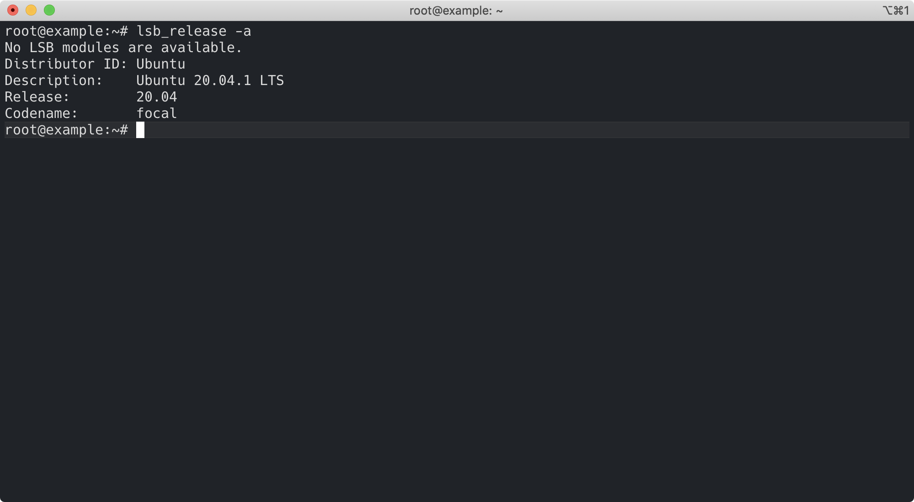
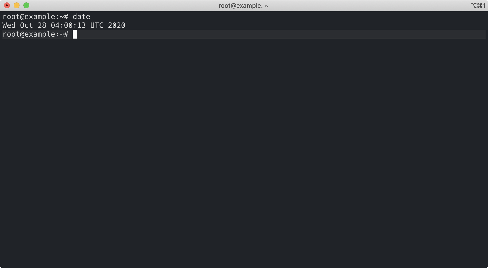
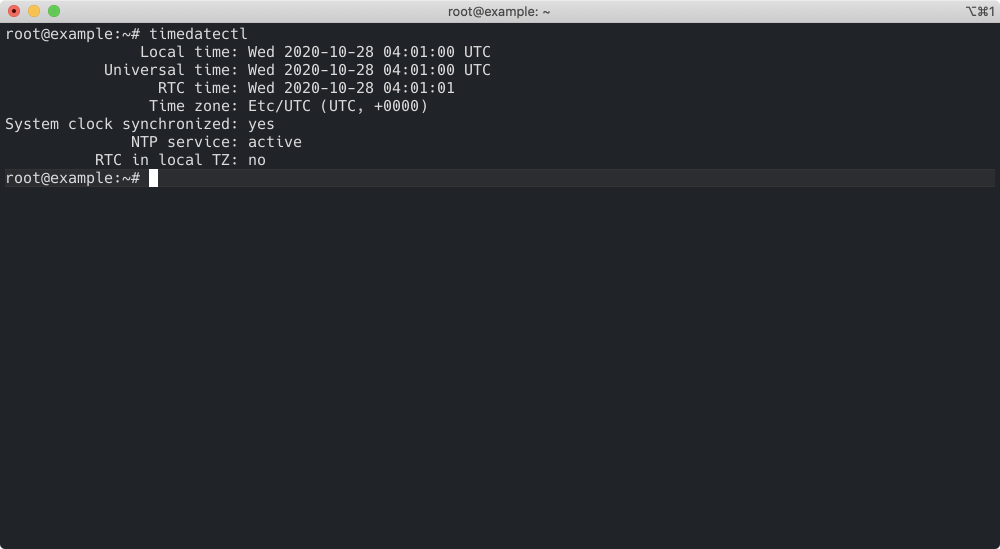
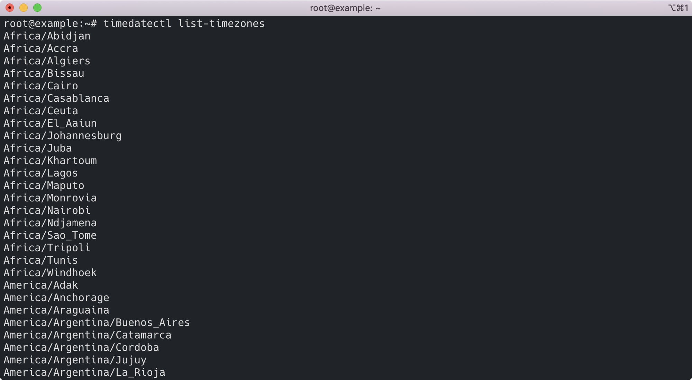
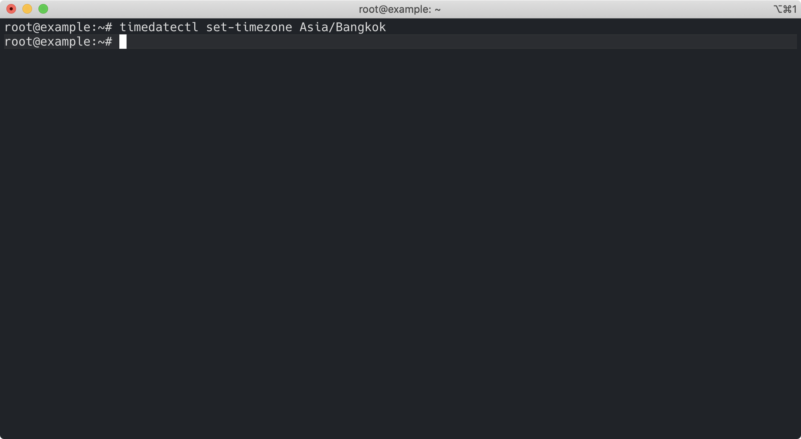
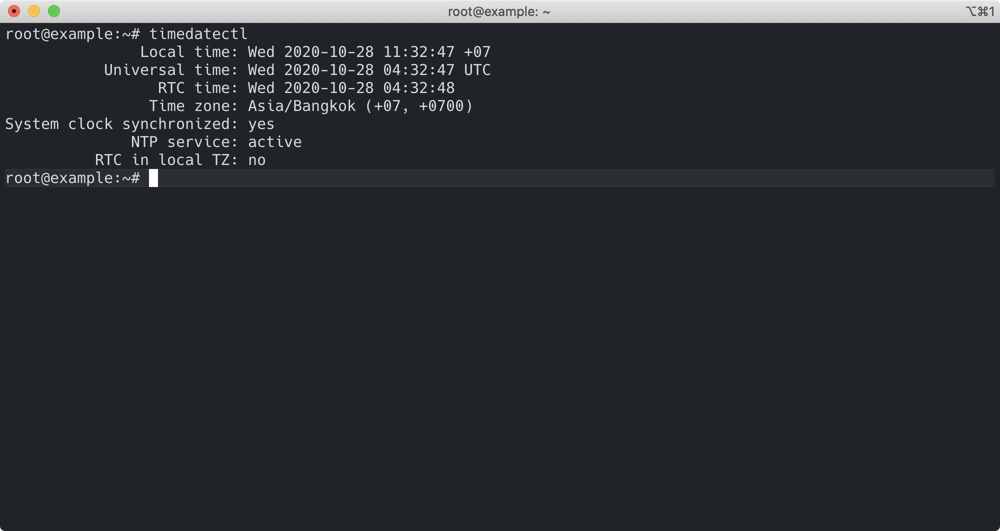

# ตั้งค่า Time Zone สำหรับ Ubuntu 20.04 LTS 


# Time Zone คืออะไร

อ่านได้จากบทความนี้ [สรุปสั้น ๆ เรื่องเขตเวลา (Time Zone) และไขข้อสงสัยว่าทำไมเวลาประเทศไทยถึงเป็น UTC+7](/blog/short-summary-of-time-zone/)

# ทำไมต้อง Set Time Zone

> เพื่อให้ Server ใช้วันเวลา (Time Zone) ที่ถูกต้องตามที่เรากำหนด (ไม่ว่า Server จะตั้งอยู่ที่ไหนในโลกก็ตาม)
  
การ Set Time Zone สำหรับ Ubuntu 20.04 LTS ให้ทำดังนี้

# 1. แสดงรายละเอียด OS (Operating System)

```sh
$ lsb_release -a
```



# 2. ดูวัน/เวลาปัจจุบันก่อน Set Time Zone

```sh
$ date 
```



วันเวลาปัจจุบันคือ `Wed Oct 28 04:00:13 UTC 2020`

# 3. ดูว่าปัจจุบันเครื่องใช้ Time Zone อะไร

```sh
$ timedatectl 
```



จากภาพ Time Zone คือ  `Etc/UTC (UTC, +0000)`

# 4. ดูว่าเราสามารถเปลี่ยน Time Zone เป็นอะไรได้บ้าง

```sh
$ timedatectl list-timezones
```



กด Contrl + C เพื่อออก 

# 5. เปลี่ยน Time Zone ตามที่อยากจะให้เป็น

เช่น ต้องการเปลี่ยนจาก `UTC` ไปเป็น `Asia/Bangkok` (ใช้ Time Zone ประเทศไทย)

```sh
$ timedatectl set-timezone Asia/Bangkok
```



# 6. ตรวจสอบ Time Zone เครื่องอีกครั้ง 

```sh
$ timedatectl
```



จากภาพ Time Zone ถูกเปลี่ยน
- จาก `Etc/UTC (UTC, +0000)` 
- ไปเป็น `Asia/Bangkok (+07, +0700)` 

แล้ว 

# 7. ดูวัน/เวลาปัจจุบันหลัง Set Time Zone

```sh
$ date
```


วันเวลาปัจจุบันคือ `Wed Oct 28 11:07:13 +07 2020`

### ข้อสังเกต

จะเห็นว่า วัน/เวลาถูกเปลี่ยน
- จาก `Wed Oct 28 04:00:13 UTC 2020` 
- ไปเป็น `Wed Oct 28 11:07:13 +07 2020`  

ซึ่งจะถูกบวกเพิ่มไปอีก 7 ชั่วโมง (UTC + 7) ซึ่งก็คือ วัน/เวลา ปัจจุบันของประเทศไทย นั่นเอง 