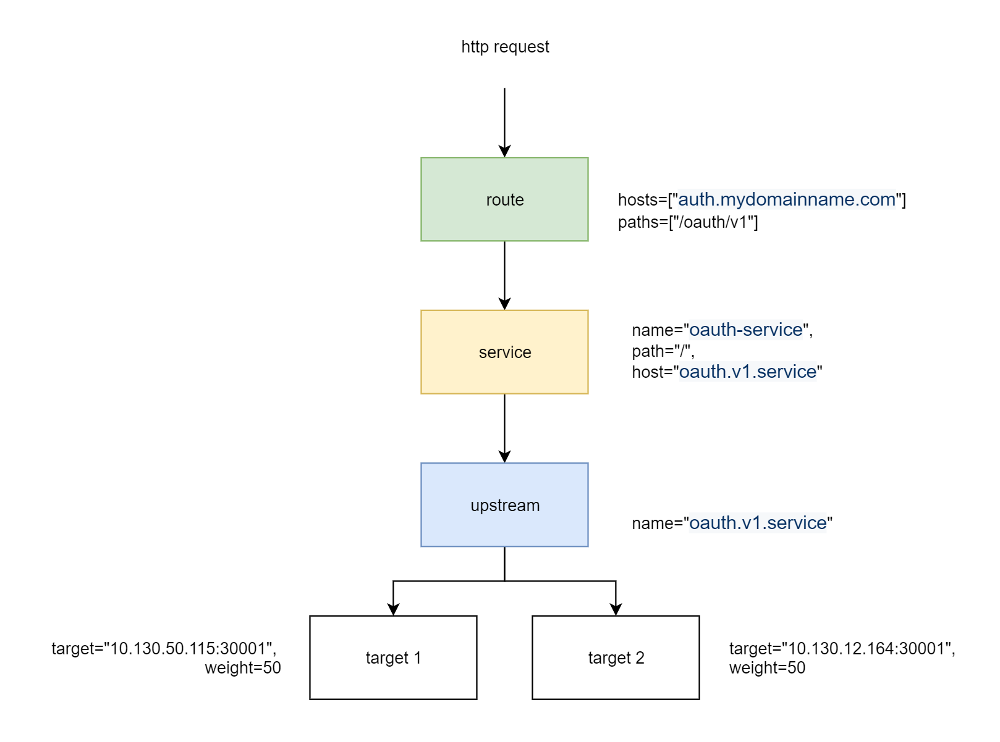

# Setup Kong Loadbalancing 



headers for all requests  
```plaintext
Content-Type : application/json  
```

### 1. Add Upstreams server

1.1 set upstream name  
http post  
> http://`<GATEWAY_IP>`:8001/upstreams  

body 
```json
{
  "name" : "oauth.v1.service"    
}
```

1.2 set target servers under upstream 
http post
> http://`<GATEWAY_IP>`:8001/upstreams/`oauth.v1.service`/targets   

body  

target server 1
```json
{
  "target" : "10.130.50.115:30001",
  "weight" : 50
}
```
target server 2  
```json
{
  "target" : "10.130.12.164:30001",
  "weight" : 50
}
```

### 2. Add Service 
http post
> http://`<GATEWAY_IP>`:8001/services

body
```json
{
  "name" : "oauth-service",
  "host" : "oauth.v1.service",
  "path" : "/"
}
```

### 3. Add Route under service 
http post
> http://`<GATEWAY_IP>`:8001/services/`oauth-service`/routes

body
```json
{
  "hosts" : ["auth.mydomainname.com"],
  "paths" : ["/oauth/v1"]
}
```

### 4. Test Access

> https://auth.mydomainname.com`/oauth/v1`

# Reference 
[https://docs.konghq.com/1.4.x/loadbalancing/](https://docs.konghq.com/1.4.x/loadbalancing/)
