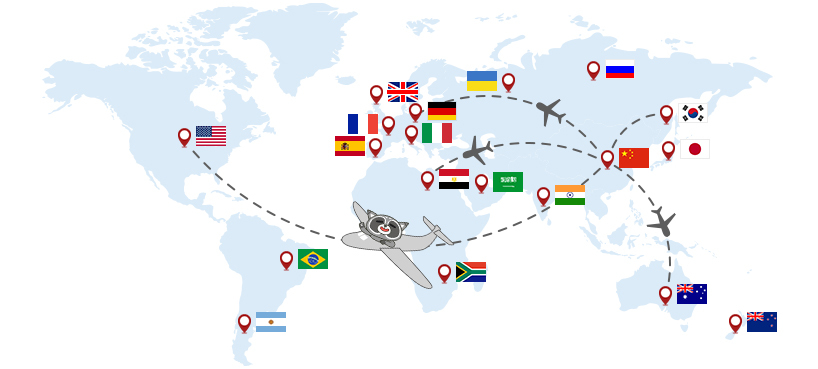

# สรุปสั้น ๆ เรื่อง Internationalization (i18n) และ Localization (L10n) 



*[Image from https://www.deepin.org/en/developer-community/internationalization/](https://www.deepin.org/en/developer-community/internationalization/)*

# ความหมาย

> `i18n` และ `L10n` เป็นเรื่องของการทำให้โปรแกรมที่เราเขียน รองรับ (Support) หลายภาษา หลายรูปแบบการแสดงผล ทั้งตัวเลข ค่าเงิน รูปแบบวันที่/เวลา และอื่น ๆ ตามแต่ละวัฒนธรรม ท้องถิ่น หรือประเทศนั้น ๆ

- `i18n` มาจากตัว i (ใช้ตัวเล็ก) แล้วตามด้วยตัวอักษร 18 ตัวก่อนจะถึง n ตัวสุดท้ายของคำว่า (Internationalization)
- `L10n` มาจากตัว L (ใช้ตัวใหญ่เพื่อไม่ให้สับสนกับ i ใน i18n) แล้วตามด้วยตัวอักษร 10 ตัวก่อนจะถึง n ตัวสุดท้ายของคำว่า (Localization)

# i18n vs L10n

*"**Internationalization** (i18n) is the design and development of a product, application or document content that enables easy localization for target audiences that vary in culture, region, or language."*

*"**Localization** (L10n) refers to the **adaptation** of a product, application or document content to meet the language, cultural and other requirements of a specific target market (a locale)."*

### สรุปใจความ

- `i18n` เป็นเรื่องของการออกแบบและพัฒนาแอพพลิเคชันหรือโปรแกรมให้รองรับหลายภาษา เพื่อให้เหมาะสมกับวัฒนะธรรม และท้องถิ่นนั้น ๆ
- `L10n` เป็นเรื่องของการปรับรูปแบบการแสดงผลต่าง ๆ เช่น ตัวเลข ค่าเงิน รูปแบบวันที่/เวลา และอื่น ๆ ให้สอดคล้องกับภาษาและวัฒนธรรม ท้องถิ่นนั้น ๆ

**หมายเหตุ**

อาจจะไม่ได้แปลตรงตัวเป๊ะ ๆ น่ะ

**อ้างอิง**

- [i18n vs l10n — what’s the diff? by Mozilla](https://blog.mozilla.org/l10n/2011/12/14/i18n-vs-l10n-whats-the-diff/)
- [AngularJS i18n](https://docs.angularjs.org/guide/i18n)
- [Localization vs. Internationalization by W3](https://www.w3.org/International/questions/qa-i18n)

# Language Code & Language Tag

ปกติเวลาเราทำเรื่อง `i18n` และ `L10n` เรามักที่จะคุ้นเคยกับรูปแบบของ **Language Code** หรือ **Language Tag** ประมาณนี้

- en
- en-US
- en-GB 
- en-CA
- th
- th-TH
- zh
- zh-CN
- zh-HK

### รูปแบบที่  1

Language Code (ตัวพิมพ์เล็ก 2 ตัว ตามมาตรฐาน [ISO 639-1](https://www.wikiwand.com/en/List_of_ISO_639-1_codes)) เช่น

- en
- th
- zh

### รูปแบบที่  2

Language Code (ตัวพิมพ์เล็ก 2 ตัว ตามมาตรฐาน [ISO 639-1](https://www.wikiwand.com/en/List_of_ISO_639-1_codes)) จากนั้นขั้นด้วย `-` แล้วตามด้วย Country (Region) Code

- en-US - English (United States)
- en-GB - English (United Kingdom)
- en-CA - English (Canada)
- th-TH - Thai (Thailand)
- zh-CN - Chinese (China)
- zh-HK - Chinese (Hong Kong)

ซึ่งค่าต่าง ๆ เหล่านี้ คือสิ่งที่ใช้บอกว่า 
ในตอนนั้น โปรแกรมที่เราเขียน กำลังทำงาน Support กับภาษา และรูปแบบการแสดงผล ตามวัฒนธรรม ท้องถิ่นใด เช่น

ถ้าเรากำหนดให้โปรแกรมเราใช้ Language เป็น

```plaintext
en
```

หมายความว่า ต้องการให้โปรแกรมเราแสดงผลเป็นภาษาอังฤษ (English) แต่ไม่ได้เจาะจงว่าต้องเป็นภาษาอังกฤษบน Region ใด

แต่ถ้าเรากำหนดให้โปรแกรมเราใช้ Language เป็น

```plaintext
en-US
```
 
หมายความว่า ต้องการให้โปรแกรมเราแสดงผลเป็นภาษาอังฤษ (English) สำหรับประเทศสหรัฐอเมริกา (USA)

### แล้วมันต่างกันยังไง

- `en` เฉย ๆ เราจะเรียกมันว่า **Language Code** ที่เจาะจงไปเฉพาะเรื่องของภาษาเท่านั้น
- `en-US` เราจะเรียกมันว่า **Language Tag**  ที่เจาะจงทั้งภาษาและ Region (Country) เพื่อให้ใช้รูปแบบของภาษาและการแสดงผล อื่น ๆ เช่น ตัวเลข ค่าเงิน รูปแบบวันที่/เวลา และอื่น ๆ ให้เหมาะสมกับวัฒนะธรรม ท้องถิ่น ประเทศนั้น ๆ มากขึ้น


### ใช้แบบไหนดี

ถ้าเป็นไปได้ ให้ใช้เป็นแบบ Language Tag แทน Language Code อย่างเดียว เพื่อเป็นการเจาะจงทั้งภาษา และการแสดงผลอื่น ๆ มากขึ้น 

ใช้แบบนี้

```plaintext
en-US
en-GB
en-CA
```

แทน

```plaintext
en
```

# ประเทศไทย
สำหรับประเทศไทย เราใช้ Language Tag เป็น 

```plaintext
th-TH
```

Language Code : th  
Country (Region) Code : TH

# ข้อควรระวัง

ในการออกแบบระบบให้รองรับหลายภาษา การตั้งชื่อเก็บข้อมูลภาษา เช่น ตัวข้อมูล, Field, Attribute, Column ควรที่จะอ้างอิง หรือใช้ชื่อตาม Standard Language Code หรือ Language Tag ไม่ควรใช้เป็น Country (Region) Code ในการเก็บ เพราะจะนำไป Map หรือใช้งานร่วมกับ Standard Tools ต่าง ๆ ลำบาก
  
ตัวอย่างที่พบบ่อย เช่น ภาษาจีน  
หลายคนมักที่จะตั้งชื่อเก็บเป็น CN ซึ่งมาจาก China ที่เป็น Country (Region) Code 
  
ถ้าเราไปดูการเก็บข้อมูลภาษาจีนจริง ๆ เราจะพบว่าเค้าเก็บเป็น 

- `zh` มาจาก 中文 (Zhōngwén), 汉语, 漢語 หรือ 
- `zh-CN` มาจาก Chinese (China)
- `zh-HK` มาจาก Chinese (Hong Kong)
- `zh-TW` มาจาก Chinese (Taiwan)
- อื่น ๆ

แทน **ตรงนี้ให้ระวัง**

### บทเรียนตรง

> ตอนที่ทีมผมเคยทำงานร่วมกับ Developer จีน เพื่อพัฒนาแอพพลิเคชันนึง (บน WeChat) ทีมผมเก็บภาษาจีนและใช้การอ้างถึงด้วยค่า CN ทีมจีนเค้าบอกว่าภาษาจีนเค้าไม่ได้ใช้ CN แต่เป็น zh เราก็เลยจำมาตั้งแต่ตอนนั้นว่าที่ผ่านมา เราเก็บผิดมาตลอดเลย 

# อ้างอิง

- [https://www.wikiwand.com/en/Internationalization_and_localization](https://www.wikiwand.com/en/Internationalization_and_localization)
- [https://www.wikiwand.com/en/Language_localisation](https://www.wikiwand.com/en/Language_localisation)
- [https://www.wikiwand.com/en/List_of_ISO_639-1_codes](https://www.wikiwand.com/en/List_of_ISO_639-1_codes)
- [http://www.lingoes.net/en/translator/langcode.htm](http://www.lingoes.net/en/translator/langcode.htm)


