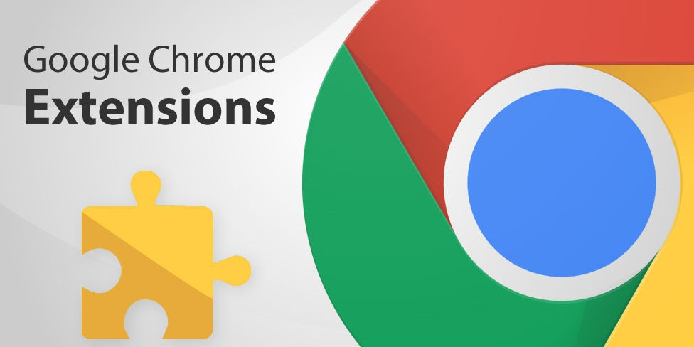
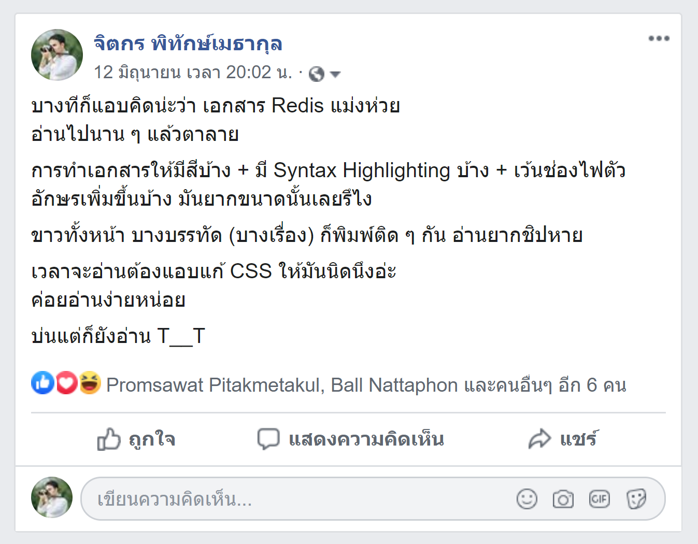
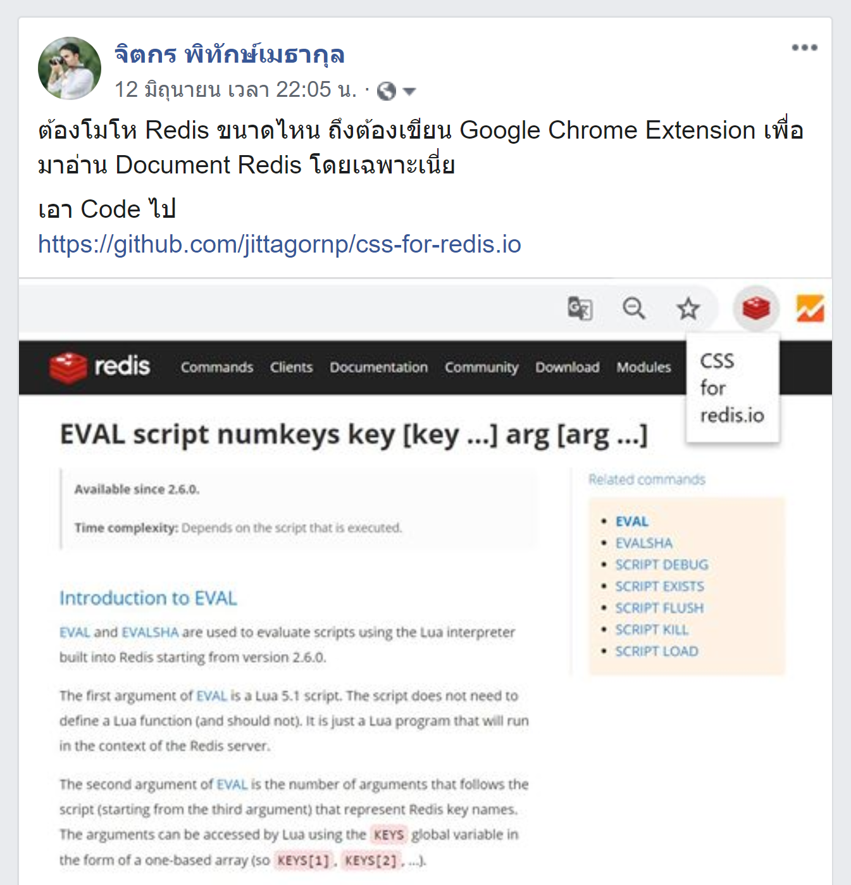
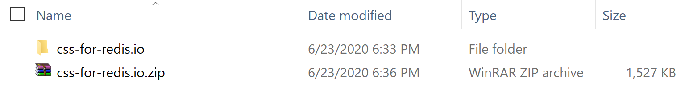
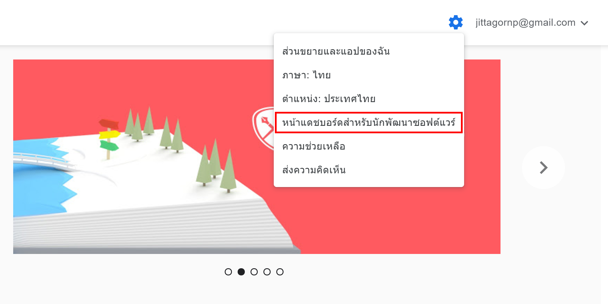
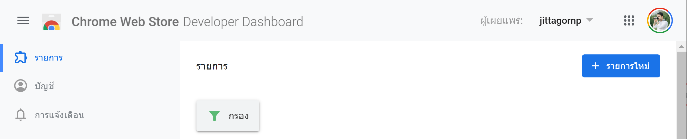
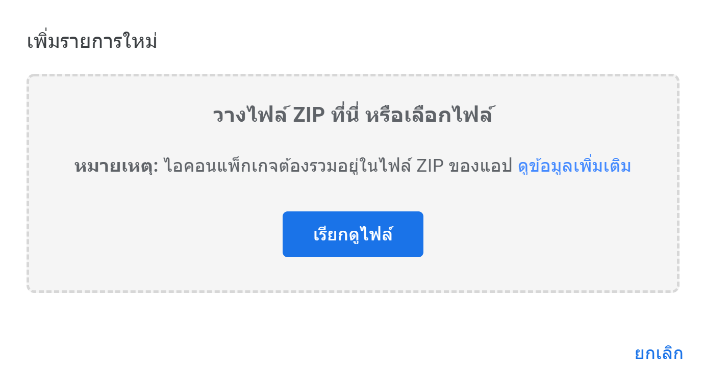
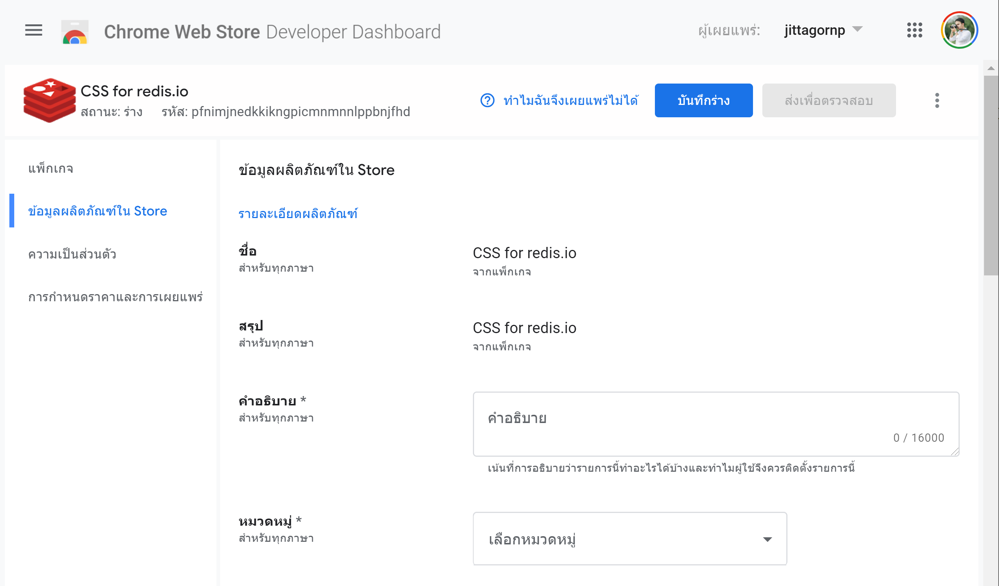
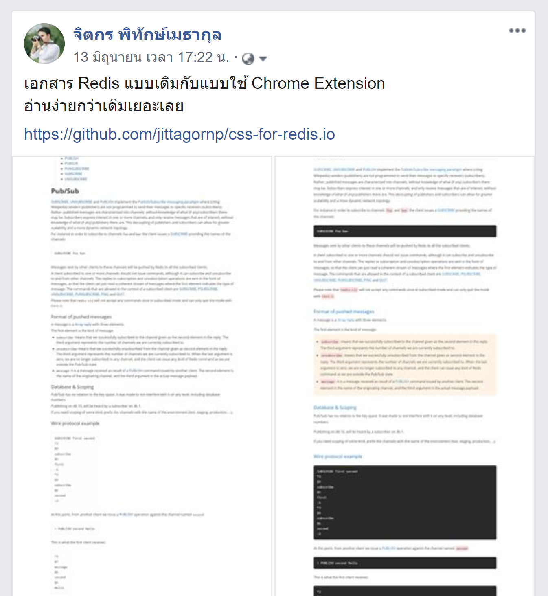
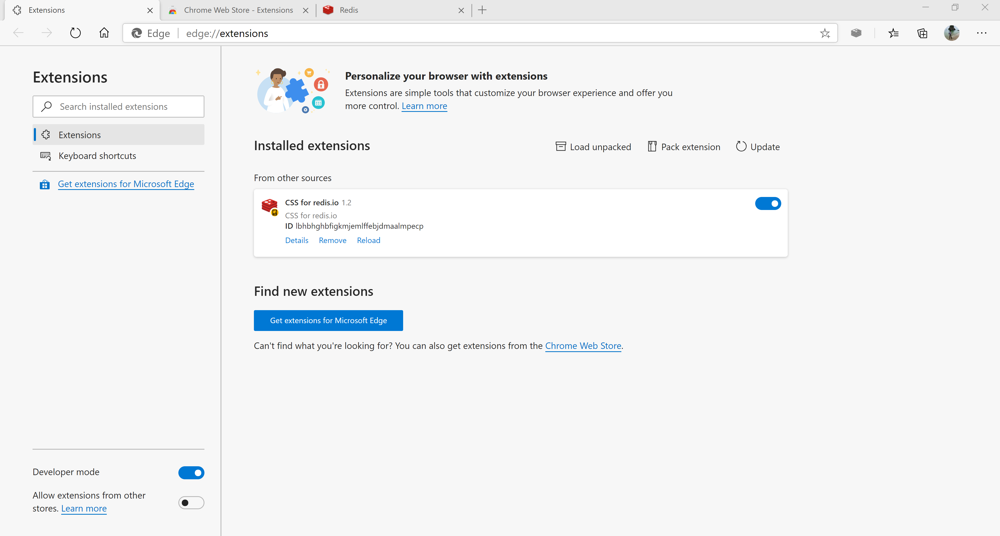

# เขียน Google Chrome Extension อย่างง่ายเอาไว้ใช้เอง ด้วยทฤษฎี "Angry Driven Development"



*Image from [https://news.thaiware.com/17797.html](https://news.thaiware.com/17797.html)*

จริง ๆ ไม่ได้มีทฤษฎีอะไรหรอก แค่วันนั้นโกรธให้กับเอกสารของ [redis.io](https://redis.io) เลยเป็นที่มาของการทำ Google Chrome Extension ง่าย ๆ เอาไว้ใช้เอง 
  
ไหน ๆ ก็ทำไปล่ะ เลยเอามาเขียนเป็นบทความเก็บไว้

# ต้นเหตุของความโกรธ 



# หลังจากนั้น 2 ชั่วโมง



# การเขียน Google Chrome Extension 

เราสามารถเขียน Google Chrome Extension อย่างง่ายขึ้นมาใช้งานได้เอง โดยใช้แค่ Skill พื้นฐาน HTML, CSS และ Javascript ดังนี้ 

### 1. เตรียมไฟล์ที่จะเขียน

* `manifest.json` 
* Icon สำหรับแสดงบน Bar ของ Google Chrome ขนาด 128 x 128 pixel
* อื่น ๆ เช่น HTML, CSS และ Javascript (ถ้าใช้)

### 2. เขียนไฟล์ manifest.json 

> ไฟล์ `manifest.json` คือไฟล์หลักที่ใช้ในการอธิบาย กำหนดสิทธิ์และการทำงานต่าง ๆ ของ Extension 

manifest.json

``` json
{
    "name": "<YOUR_EXTENSION_NAME>",
    "version": "<YOUR_EXTENSION_VERSION>",
    "description": "<YOUR_EXTENSION_DESCRIPTION>",
    "manifest_version": 2,
    "icons": {
        "128": "<YOUR_ICON_128_PIXEL>"
    }
}
```

แก้ใหม่เป็นของเราเอง เช่น  
  
manifest.json

``` json
{
    "name": "CSS for redis.io",
    "version": "1.2",
    "description": "Easy to read redis.io documents",
    "manifest_version": 2,
    "icons": {
        "128": "redis128.png"
    }
}
```

# กำหนดสิทธิ์และการทำงานของ Extension

**ทำความเข้าใจกันก่อน**  
  
เราสามารถกำหนดได้ว่า**จะให้ Extension ทำงานตอนไหน** เช่น 

* ให้ทำงานตอนคลิกที่ Icon Extention หรือ 
* ให้ทำงานทันทีตอนที่ Web Page โหลดเสร็จ  

### 1. ทำงานตอนคลิกที่ Icon Extension 

ให้เขียน manifest.json ดังนี้   
  
manifest.json

``` json
{
    "name": "CSS for redis.io",
    "version": "1.0",
    "description": "Easy to read redis.io documents",
    "manifest_version": 2,
    "icons": {
        "128": "redis128.png"
    },
    "browser_action": {
        "default_title": "CSS for redis.io",
        "default_popup": "popup.html"
    },
    "permissions": [
        "https://redis.io/*"
    ]
} 
```

**คำอธิบาย** 

* `browser_action` เป็นส่วนที่จะทำงานก็ต่อเมื่อ มีการคลิกที่ Icon Extension (ถ้าไม่คลิก ตัว Extension จะไม่ทำงาน)
   - `default_title` ถ้าเราเอา Mouse ไป Hover ที่ Icon จะแสดงข้อความที่กำหนดไว้ขึ้นมา (เหมือน Attribute `title` ใน HTML Tag ทั่ว ๆ ไป)
   - `default_popup` เป็น Popup ที่แสดงขึ้นมาใต้ Icon ตอนที่เราคลิกที่ Icon (อันนี้ Custom HTML, CSS, Javascript เองตามใจชอบได้เลย)
* `permissions` เป็นการกำหนด Permission ให้กับ Extension นี้ จากตัวอย่างด้านบน เป็นการบอกว่า Extension นี้ จะทำงานเฉพาะบนทุกหน้าจอของ Web Site [https://redi.io](https://redi.io) เท่านั้น (Web Site อื่น ๆ Extension นี้จะไม่ทำงาน)

### 2. ทำงานทันทีตอนที่ Web Page โหลดเสร็จ (ไม่ต้องคลิก Icon) 
ให้เขียน manifest.json ดังนี้ 
  
manifest.json

``` json
{
    "name": "CSS for redis.io",
    "version": "1.2",
    "description": "Easy to read redis.io documents",
    "manifest_version": 2,
    "content_scripts": [
        {
            "matches": [
                "https://redis.io/*"
            ],
            "js": [
                "script.js"
            ],
            "css": [
                "redis.io.css"
            ]
        }
    ],
    "icons": {
        "128": "redis128.png"
    }
}
```

**คำอธิบาย** 

* `content_scripts` จะเป็นส่วนที่ทำงานทันทีหลังจากที่ Web Page โหลดเสร็จ 
   - `matches` ให้ทำงานกับ Web Site ไหน จากตัวอย่างจะทำงานเฉพาะกับ Web Site [https://redi.io](https://redi.io) เท่านั้น
   - `js` ให้เรียกไฟล์ Javascript ใน List นี้ให้ทำงานทันที
   - `css` ให้เรียกไฟล์ CSS ใน List นี้ให้ทำงานทันที  

# ตัวอย่าง

อันนี้เป็นตัวอย่าง Google Chrome Extension อย่างง่ายที่ผมเขียนไว้ เพื่อเอาไว้อ่านเอกสาร Redis โดยเฉพาะ 
  
ขั้นตอนการติดตั้ง สามารถอ่านได้ตาม README.md ที่เขียนไว้ใน Repository นี้  

- [https://github.com/jittagornp/css-for-redis.io](https://github.com/jittagornp/css-for-redis.io)

# การเอาขึ้น Chrome Web Store 

เมื่อเราเขียน Extension เสร็จแล้ว และอยากเอาขึ้น Web Store ให้ทำดังนี้

### 1. Zip Folder Extension 

ทำการ Zip Folder Extension ที่เราเขียนเสร็จแล้วเป็นไฟล์ `.zip`



### 2. ไปที่ Chrome Web Store 

- [https://chrome.google.com/webstore/category/extensions](https://chrome.google.com/webstore/category/extensions)

### 3. ไปที่หน้าแดชบอร์ดสำหรับนักพัฒนาซอฟต์แวร์

Chrome Web Store 


Developer Dashboard 



### 4. เพิ่มรายการใหม่ (อัพโหลดไฟล์ .zip) 

คลิกที่ปุ่มเพิ่มรายการใหม่ จากนั้นอัพโหลดไฟล์ `.zip` จากข้อ 1  



### 5. ระบุข้อมูลต่าง ๆ ลงไป 



### 6. ส่งตรวจสอบ 

ใช้เวลาประมาณ 1-3 วัน 
   
- **ถ้าผ่าน** Extension เราก็จะถูก Published บน Web Store 
- แต่**ถ้าไม่ผ่าน** ก็จะโดน Reject กลับมาให้แก้ใหม่  

ตัวอย่าง Extension ที่ตรวจสอบผ่าน จะขึ้นบน Web Store แบบนี้


### ประสบการณ์เอาขึ้น Web Store 

ผมเคยเอาขึ้น Chrome Web Store น่ะ แต่เอาขึ้นได้เฉพาะการเขียนแบบข้อ 1) ในหัวข้อ **กำหนดสิทธิ์และการทำงานของ Extension** คือ Extension จะทำงานก็ต่อเมื่อคลิกที่ Icon ก่อน แต่พอผมพยายามเขียนแบบข้อ 2)ให้ทำงานทันทีหลังจาก Web Page โหลดเสร็จ ส่งให้ Google ตรวจสอบใหม่ ก็ปรากฏว่าโดน `Reject` มา 2 รอบล่ะ ไม่รู้ว่าติด Permission อะไร ตอนแรกคิดว่าเป็นที่ Code ผมมี Remote Script แต่ก็พยายามแก้แล้วน่ะ ก็ยังโดน Reject อีก ตอนนี้ขี้เกียจแก้ล่ะ ทำไว้ใช้เองก็พอ 
   
ถ้าใครสนใจเขียน Google Chrome Extension ขึ้นมาใช้งานเอง ก็ลองนำไปประยุกต์ใช้กันดูครับ 

# ผลงานบน Web Store 

อันนี้เป็น Version 1.0 ยังไม่ค่อยดีเท่าไหร่ ต้องคลิกที่ Icon ทุกรอบ Extension ถึงจะทำงาน

- [https://chrome.google.com/webstore/detail/css-for-redisio/hnkjnlfmcnebpdnplglpdmpfpbonlhoe](https://chrome.google.com/webstore/detail/css-for-redisio/hnkjnlfmcnebpdnplglpdmpfpbonlhoe)

ถ้าใครอยากจะใช้งาน Extension นี้แบบจริงจัง แนะนำให้ติดตั้งเองจาก GitHub นี้ครับ

- [https://github.com/jittagornp/css-for-redis.io](https://github.com/jittagornp/css-for-redis.io)

> เขียนเล่นขำ ๆ

# ผลที่ได้



# หลังจากวันนั้น 


# เพิ่มเติม

Microsoft Edge ก็สามารถใช้ Extension ที่เราเขียนได้เหมือนกันน่ะ เพราะเป็น Chromium เหมือนกัน 



# Reference

เอกสารการเขียน Google Chrome Extension อย่างละเอียด สามารถเรียนรู้ได้จาก

- [https://developer.chrome.com/extensions/getstarted](https://developer.chrome.com/extensions/getstarted)
