# การติดตั้งและใช้งาน SSH บน Ubuntu Server

> เป็นบทความเก่าที่เขียนไว้ตั้งแต่ปี 2556

สภาพแวดล้อมระบบ จำลองโดยใช้ VMware 2 ตัว

### Client

```plaintext
OS : ubuntu 12.04-server
VM : ssh-client
IP : 192.168.1.35
User : elastic
SSH Application : openssh-server
```

### Server

```plaintext
OS : ubuntu 12.04 server
VM : ssh-server
IP : 192.168.1.34
User : elastic
SSH Application : openssh-server
```

# แนวคิด

1. จัดเตรียม client และ server โดยที่ทำการติดตั้ง openssh-server เป็นที่เรียบร้อยทั้ง 2 เครื่อง
2. สร้าง key `เอาไว้ที่ client` ซึ่งจะได้ทั้ง private key และ public key
3. copy `public key ไปไว้ที่ server`
4. login เข้าใช้งาน server โดยใช้ private key ที่อยู่บน client  เข้ารหัส / ถอดรหัสกับ public key ที่อยู่บน server
5. เข้าใช้งานได้

ขอสมมติ ว่าทั้ง 2 VM ได้ติดตั้ง openssh-server เป็นที่เรียบร้อยแล้ว 

```sh
$ sudo apt-get install openssh-server
```

# ที่  ssh-client 

1. ให้ทำการสร้าง key ขึ้นมา  ด้วยคำสั่ง ssh-keygen

```sh
$ ssh-keygen [-b bits-length (default 2048)] -t algorithm-type [-f output-file-name]
```

จากนั้นใส่ passphress หรือ password ลงไปครับ 

### หมายเหตุ 

การใช้งานบางอย่าง  ไม่แนะนำให้เป็น empty password หรือ password ว่าง เพราะเอาไว้ใช้ป้องกัน private key จากการที่ผู้อื่นเอา private key ของเราไปใช้งานครับ
  
-f  ถ้าไม่ใส่ default จะเป็น ~/.ssh/id_rsa (`private key`) กับ ~/.ssh/id_rsa.pub (`public key`)

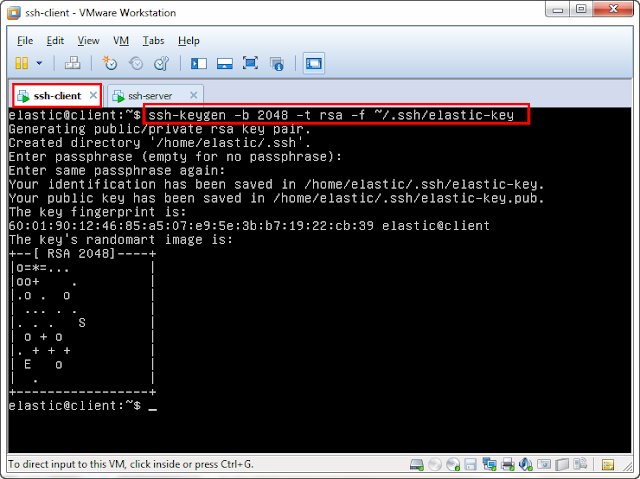

จากภาพ ทำการสร้าง key ชื่อ elastic-key ขนาด 2048 bit ชนิด rsa (default ตอนนี้คือ rsa2) ไว้ที่ folder ~/.ssh/

2. ใช้คำสั่ง ls ดูผลลัพธ์ที่เกิดขึ้นใน folder ~/.ssh จะมี 2 file ปรากฏขึ้นมา ได้แก่

- `elastic-key` ซึ่งเป็น `private key` และ  
- `elastic-key.pub` ซึ่งเป็น `public key`  

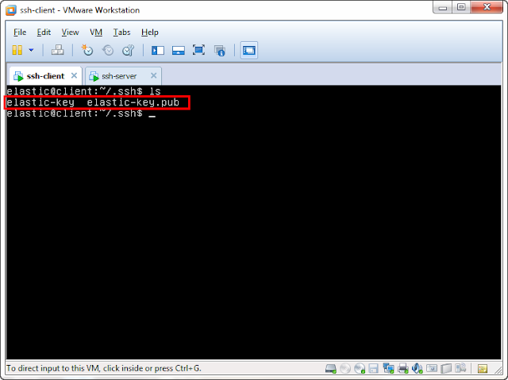

ลองดูเนื้อหาภายในของทั้ง 2 file  โดยใช้คำสั่ง cat

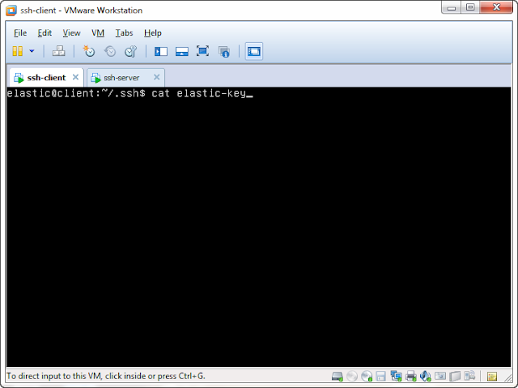

~/.ssh/elastic-key

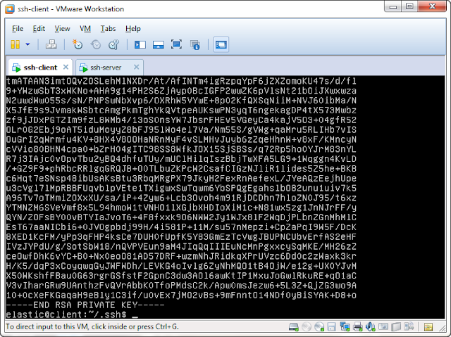

~/.ssh/elastic-key.pub

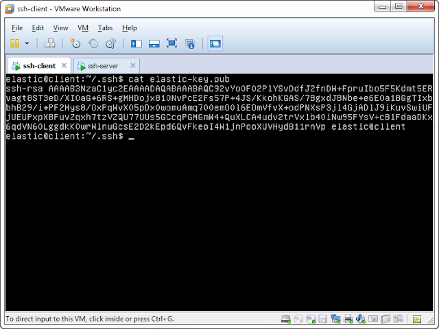

3. กำหนด permission ให้กับ key file โดยให้

- `elastic-key (private key)` เป็น `600` คือ เจ้าของสามารถอ่าน เขียน ได้ ส่วน
- `elastic-key.pub (public key)` เป็น `644` คือ เจ้าของสามารถอ่าน เขียน ได้ ส่วน**คนอื่น  อ่านได้อย่างเดียว**

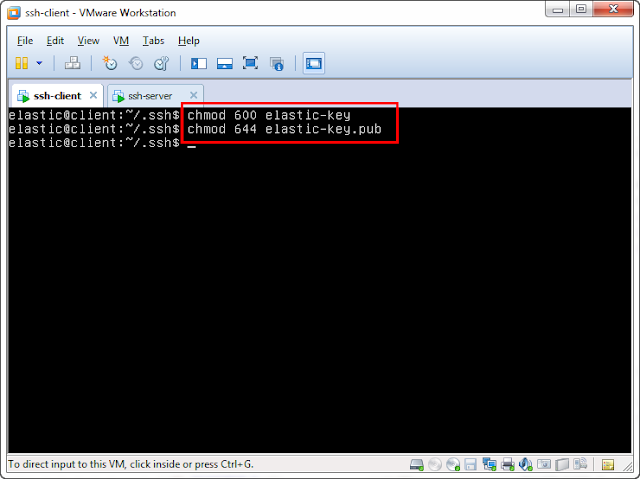

4. ทำการ **copy elastic-key.pub (public key) ไปไว้บน server** ด้วยคำสั่ง `scp  (secure-copy)`

**อย่าลืม** : (colon) หลัง target host ไม่อย่างนั้น คำสั่งจะไม่ทำงานครับ

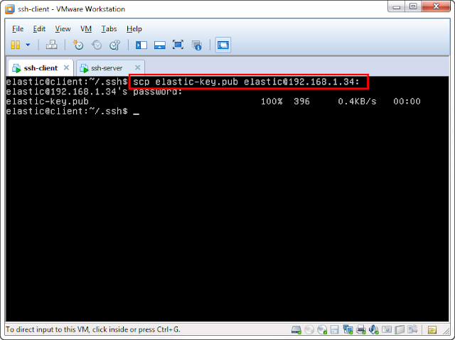

# ที่ ssh-server 

5. ลองเข้าไปดูที่ /home/elastic  จะมี file `elastic-key.pub` โผล่ขึ้นมา

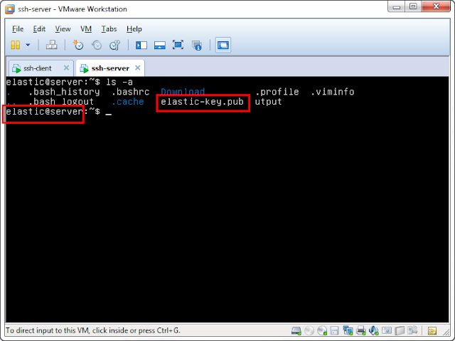

6. จากนั้น  ทำการย้าย elastic-key.pub ไปไว้ใน /home/elastic/.ssh/  แล้วเปลี่ยนชื่อเป็น `authorized_keys` 
แล้วก็กำหนด permission ให้ด้วย

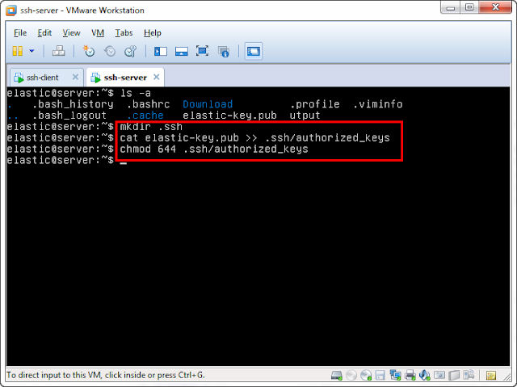

เหตุผลที่ต้องย้ายและกำหนดชื่อเป็น authorized_keys  ก็เพื่อให้เป็นไปตาม file config `/etc/ssh/sshd_config`  
  
โดย default มันจะถูกเก็บไว้ใน `%h/.ssh/authorized_keys` (จากภาพถูก comment ไว้ แต่ค่า AuthorizedKeyFile โดย default แล้วจะเป็น `%h/.ssh/authorized_keys)`  

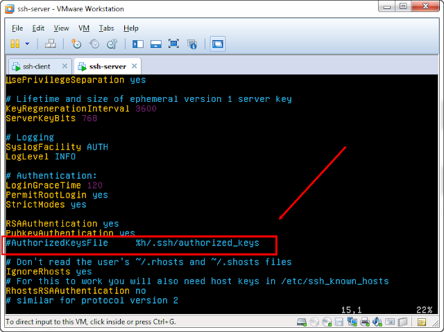

# กลับมาที่ ssh-client  

7. ลองเข้าใช้งาน ssh-server แบบปกติดูครับ  จะเห็นว่า มันจะติด permission denied (publickey)


ลองใหม่  ด้วยการ  อ้างไปที่ private key ของ client ด้วยคำสั่ง

```sh
$ ssh [-i private-key-file-location] username@target-host 
```

แล้วก็ใส่ passphress หรือ password ที่เราเคยตั้งไว้ในขั้นตอนที่ 1 ลงไปครับ

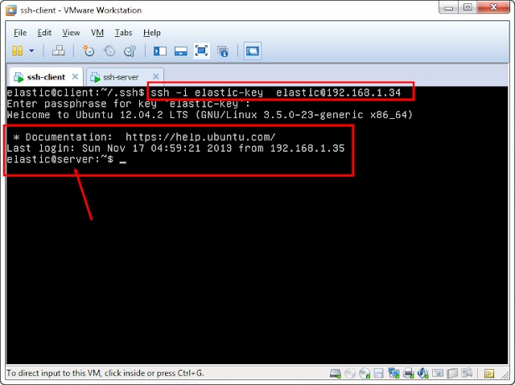

แค่นี้ ก็สามารถ เข้าใช้งาน ssh-server  ด้วย public/private key ได้แล้วครับ

# หมายเหตุ
เป็นบทความที่ถูกย้ายมาจาก [https://na5cent.blogspot.com/2013/11/ssh-keys-linux-ubuntu.html](https://na5cent.blogspot.com/2013/11/ssh-keys-linux-ubuntu.html) ซึ่งผู้เขียน เขียนไว้เมื่อ วันอาทิตย์ที่ 17 พฤศจิกายน พ.ศ. 2556