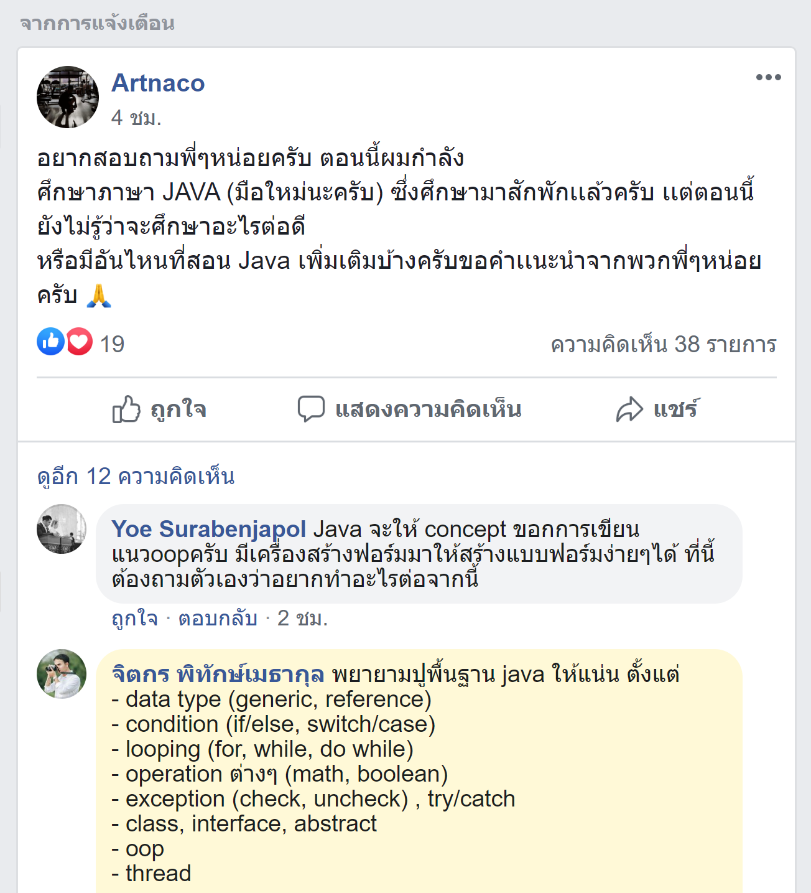

# ถึงน้อง ๆ ที่กำลังเริ่มต้นเขียนภาษา Java 

*Image from [https://images5.alphacoders.com/428/428963.png](https://images5.alphacoders.com/428/428963.png)*

> อยากสอบถามพี่ๆหน่อยครับ ตอนนี้ผมกำลัง
ศึกษาภาษา JAVA (มือใหม่นะครับ)​ ซึ่งศึกษามาสักพักเเล้วครับ เเต่ตอนนี้ยังไม่รู้ว่าจะศึกษาอะไรต่อดี
หรือมีอันไหนที่สอน Java เพิ่มเติมบ้างครับขอคำเเนะนำจากพวกพี่ๆหน่อยครับ

วันนี้เห็นมีน้องคนนึงโพสต์ถามใน Facebook Group **สมาคมโปรแกรมเมอร์ไทย** เกี่ยวกับภาษา Java ผมเลยมีโอกาสได้ช่วยเข้าไปตอบคำถาม เลยเห็นว่าคำถามนี้เป็นประโยชน์มาก ๆ สำหรับผู้เริ่มต้นเขียน Java เลยเอามาเรียบเรียง เขียนเป็นบทความเก็บไว้ครับ

# ต้นทาง

- [https://web.facebook.com/groups/ThaiPGAssociateSociety/permalink/1535308643347066/](https://web.facebook.com/groups/ThaiPGAssociateSociety/permalink/1535308643347066/)

# พื้นฐานที่ควรจะรู้ 

พยายามปูพื้นฐาน Java ให้แน่น ตั้งแต่เรื่อง 

### Basic 
- เข้าใจว่า Java ทำงานยังไง
- ข้อมูลพื้นฐาน (Data Type) ต่าง ๆ ทั้ง Generic Data Type และ Reference Data Type
- การทำเงื่อนไข (Condition) ต่าง ๆ (if/else, switch/case)
- การวนซ้ำ (Looping) เช่น for, while, do while
- การดำเนินการ (Operation) ต่าง ๆ ทั้ง Math Operation, Boolean Operators (AND, OR, NOT)
- การจัดการ Error (Error, Throwable) และ Exception ทั้งประเภท Checked (Exception), ประเภท Unchecked (Runtime Exception), การใช้ try/catch/finally 
- เรียนรู้เรื่องการสร้าง class, interface, abstract class 
- OOP (Object-Oriented Programming)
- Enumeration
- การทำงานของ Thread (พื้นฐาน)

### Medium -> Advance 
- JVM (Java Virtual Machine)
- Garbage Collection
- Generic
- Java Collection (List, Set, Map, ..)
- I/O Stream, NIO
- Date/Time (Java 8)
- Lambda, Stream (Java 8)
- Annotation
- Java Reflection
- Java Cryptography 
- อื่นๆ

### รวมทั้ง 
 
- อ่าน Java Data Structure + Algorithm เพิ่มเติม
- อ่าน Design Pattern + Principle (ทฤษฎี) ต่างๆ เช่น SOLID Principles, The 12 Factors, ...
- อ่าน Apache Maven หรือ Gradle เพื่อใช้สำหรับ Build Java Project
- หัดใช้ IDE (เครื่องมือช่วยเขียน Code) เช่น IntelliJ หรือ Netbeans IDE
- เข้าใจการทำงานของ Http/Https
- อ่าน JSON + ทำความเข้าใจการทำ RESTFul API

# นอกจากนั้น (ใช้ทำมาหากิน)

- ลองหัดเขียน **Spring-boot** ดู
- Spring-boot เป็น Java Framework ตัวนึง ซึ่งจะมี 2 แบบ คือ แบบ Servlet Stack กับแบบ Reactive Stack หลัง ๆ คนเริ่มมาสาย Reactive กันมากขึ้น (เพราะเป็น Non-Blocking I/O) ถ้าจะเขียนแบบ Reactive ให้อ่านทฤษฎี Reactive Programming เพิ่มเติมด้วย
- เอา SQL ให้คล่อง + หัดเขียน Java ต่อและ Query ข้อมูลจาก Database เช่น MySQL, Postgresql, Oracle หรือ MS SQL Server ดู
- หัด JPA (Java Persistence API) + ORM (Object Relational Mapping) เพิ่มเติม เช่น Hibernate
- อ่านพวก NoSQL เพิ่มเติม เช่น Mongodb, Redis, Neo4j, Cassandra ...
- หัดทำ Report เช่น Jasper Report 
- หัดใช้ JWT (JSON Web Token) และ OAuth2 เพื่อทำระบบ Authentication 
- หัดเขียน Unit Test ด้วยทฤษฎี TDD (Test Driven Development)
- หัดใช้ Version Control System เช่น Git อาจจะใช้ GitHub, GitLab หรือ BitBucket
- หัดใช้ Docker
- หัดทำ Linux Server (เช่น Ubuntu, CentOS, ...)
- หัดใช้ Cloud เช่น Google Cloud, AWS (Amazon Web Service), DigitalOcean

### และ
- เรียนรู้เรื่อง Micro Service เพิ่มเติม
- อ่าน Spring Cloud เพิ่มเติม
- เรียนรู้ Elastic Search 
- หัดใช้งาน Nginx เพื่อทำ Web Server, Load Balancer, Reverse Proxy, ...
- หัดทำ DevOps เช่น การทำ CI/CD อาจจะด้วย Jenkins ...
- หัดทำระบบ Monitoring เช่น Prometheus + Grafana ...
- หัดทำระบบ Logging เช่น ELK Stack
- ทำความเข้าใจ และลองใช้งาน Apache Kafka 
- ทำความเข้าใจ และลองใช้งาน Kubernetes 
- อื่น ๆ อีกเยอะแยะมากมาย ที่เขียนไม่หมด

### ถ้าจะให้ดี 

> แนะนำให้อ่าน **Best Practice (แนวทางปฎิบัติที่ดี)** ต่างๆ เพิ่มเติมด้วยครับ

# ข้อควรพิจารณา

- ไม่ต้องอ่าน JSP (JavaServer Pages) แล้วน่ะ (ถ้าไม่ต้องใช้มัน)
- ถ้าจะทำเว็บแนะนำให้ไป Spring-boot แล้วใช้ Front-end พวก vue, react, angular เลย
- JSP เป็นเทคโนโลยีเก่าแล้ว แต่ก็ยังมีบางองค์กรที่ใช้
- แต่สมัยใหม่เค้าค่อยๆ เลิกใช้กันแล้ว

# ที่อยากจะบอก

เทคโนโลยี มีเยอะแยะมากมาย และออกใหม่เรื่อย ๆ ทุก ๆ วัน 

> ไม่ต้องไป Focus ที่เทคโนโลยีมาก ให้ Focus ไปที่พื้นฐาน (Basic)  

เอาให้แน่น เพราะถ้าพื้นฐานเราแน่น ไม่ว่าจะเจอเทคโนโลยีแบบไหน เราก็สามารถเรียนรู้ และรับมือกับมันได้หมด 
**ไม่มีทางลัดน่ะ** พี่ ๆ ที่เค้าเก่ง ๆ เค้าก็ผ่านเรื่องพวกนี้มาเหมือนกันหมด 
   
เห็นสิ่งที่เราต้องศึกษาแล้ว ไม่ต้องท้อ และอย่าพึ่งถอดใจครับ พี่ ๆ เค้าทำกันได้ เราก็ทำได้ 

# กันคนเข้าใจผิด

ทั้งหมด ทั้งมวลที่ว่ามา ไม่ได้ให้เรียนรู้ทีเดียว แล้วต้องเข้าใจทั้งหมดน่ะ ให้ค่อย ๆ เรียนรู้ ค่อย ๆ เป็นค่อย ๆ ไป 
อันนี้เป็นแค่ List หรือ Guideline โดยรวมทั้งหมด ว่าเราต้องรู้อะไรประมาณไหนบ้าง บางอย่างก็เป็นแค่ Optional ที่เอาไปต่อยอดต่อ  
ทั้งหมดที่ว่ามา กว่าจะคล่องก็ใช้เวลาเรียนรู้กันหลายปี อาจจะ 5 - 10 ปีเลย  

> เพราะฉะนั้น *"ไม่ต้องตกใจครับ"* 

# กล่ม Facebook Java ในประเทศไทย

จะมีพี่ ๆ เก่ง ๆ หลายคนช่วยตอบคำถามให้

- [Java Developers Thailand](https://web.facebook.com/groups/265480147632946/)
- [Spring Developers Thailand](https://web.facebook.com/groups/687453848266156/)

# เพิ่มเติม

อันนี้เป็น List เกี่ยวกับสิ่งที่ Java Developer ต้องรู้ที่ผมได้เขียนไว้บ้าง เผื่อเป็นประโยชน์น่ะ 

- [รู้จักกับ Apache Maven](/blog/what-is-apache-maven/)
- [พื้นฐานการใช้ Maven Command Line](/blog/basic-maven-command-line/)
- [ทำความรู้จักกับ Java I/O Stream](/blog/java-io-stream/)
- [พื้นฐาน Git](https://docs.google.com/presentation/d/15OPX4ho6uvhgOubxFxSp1Cl7myOlyQ7OBC9PoClMwBA/edit?usp=sharing)
- [พื้นฐาน Docker](https://docs.google.com/presentation/d/1NXArkIDFIJMmcvXY63cc5z7jIsbx8SDZqt76RqeuGwU/edit?usp=sharing)
- [ตัวอย่างการเขียน Spring-boot Reactive (WebFlux)](https://github.com/jittagornp/spring-boot-webflux-example)

# สุดท้าย

ถ้าผมขาดตกเรื่องอะไรไป รบกวน พี่ ๆ เพื่อน ๆ น้อง ๆ สาย Java Developer ช่วย Commment ตอบไว้ให้ด้วยน่ะครับ เพื่อเป็นประโยชน์กับน้อง ๆ ที่กำลังหัดเขียน Java ครับ
