# รู้จักกับ Apache Maven

# คำศัพท์ที่ต้องรู้

- `Dependency` หมายถึง ไลบรารี (Library) ที่โปรเจ็คจำเป็นต้องใช้
- `Build` หมายถึง การนำ Source Code ต้นฉบับที่เขียนไว้ พร้อมทั้ง Resources ต่าง ๆ มาคอมไพล์ (Compile) แล้วแพ็ก (Pack) เป็นไฟล์ที่พร้อมนำไปใช้งาน เช่น .jar .war .ear เป็นต้น
- `Deploy` หมายถึง การติดตั้ง Source Code ที่เขียนเสร็จแล้ว ให้พร้อมใช้งาน
- `Unit Test` เป็นการเขียน Code ทดสอบรูปแบบหนึ่ง
- `Integration Test` เป็นการเขียน Code ทดสอบรูปแบบหนึ่ง
- `Plugins` หมายถึง โปรแกรมส่วนเสริมต่าง ๆ
- `Proxy` ในหัวข้อนี้จะหมายถึง ระบบที่ทำหน้าที่เป็นตัวกลางในการดาวน์โหลด (Download) และ Cache ข้อมูลต่าง ๆ ที่โหลดมาจากอินเตอร์เน็ต (Internet)
- `Bandwidth` หมายถึง ปริมาณการใช้เน็ตเวิร์ค (Network) หรือ อินเตอร์เน็ต

# Apache Maven คืออะไร

> Apache Maven อาจเรียกสั้น ๆ ว่า Maven เป็นเครื่องมือตัวนึงที่ช่วยให้นักพัฒนา (Developer) เขียน Java Application ได้ง่ายขึ้น เป็น Project Management Tools ที่คอยอำนวยความสะดวกสบายในการสร้าง Java Project โดยมีความสามารถที่

- ช่วยในเรื่องการจัดการ Dependencies ต่าง ๆ ให้กับ Java Project (ทำหน้าที่เป็น Dependency Management)
- ช่วยในเรื่องการ Compile Source Code ทั้งหมดภายในโปรเจ็ค จาก .java ไปเป็น .class ให้โดยอัตโนมัติ
- ช่วยในเรื่องการ Run Code ทดสอบ เช่น การ Run Unit Test/Integration Test ต่าง ๆ ภายในโปรเจ็ค
- ช่วยในเรื่องการ Build Project ไปเป็นรูปแบบต่าง ๆ ตามที่ต้องการจะนำไปใช้งาน เช่น .jar .war .ear .bundle
- ช่วยในเรื่องการ Deploy Source Code แบบอัตโนมัติ
- ช่วยในเรื่องการแบ่งโปรเจ็คออกเป็นระบบโมดูล (การทำ Mutiple Modules)
- มีโครงสร้างโปรเจ็คที่เป็นมาตรฐาน (Standard)
- ช่วยในเรื่องการทำโปรไฟล์ (Profile) คือ สามารถ Config ค่าต่าง ๆ สำหรับโปรเจ็ค เพื่อนำไปใช้งานในแต่ละ Environment ที่แตกต่างกันได้  
- และอื่น ๆ อีกมากมาย ตามที่ระบบ Plugins ของ Maven มีให้ใช้
- นักพัฒนา สามารถเขียน Maven Plugin ขึ้นมาใช้งานเองได้

# ระบบ Dependency Management

ในอดีต ก่อนที่จะมีระบบ Dependency Management เวลาที่เราต้องการ Dependencies ต่าง ๆ เพื่อนำมาใช้ในโปรเจ็ค เราต้องไปหาโหลด Dependencies นั้น ๆ มาใส่เอง ทำให้เกิดความยุ่งยากตรงที่ บางครั้งก็หาโหลด Dependencies ที่ต้องการไม่ได้ หรือเมื่อหามาได้ ก็ไม่ได้เวอร์ชัน (Version) ตรงตามที่ต้องการ นอกจากนั้นแล้ว ยังวุ่นวายในขั้นตอนการนำไปใช้งานอีก เพราะต้องคอยนำ Dependencies ที่หามาได้ มาใส่ในโปรเจ็คเอง
  
เมื่อเกิดระบบ Dependency Management ขึ้นมา นักพัฒนาเพียงแค่ทำการกำหนดค่า หรือ Config Dependencies ที่ต้องการลงไปในโปรเจ็ค ระบบ Dependency Management ก็จะทำหน้าที่ไปเอา Dependencies ต่าง ๆ ตามที่ได้ Config ไว้ ที่อยู่บนอินเตอร์เน็ตมาใส่ในโปรเจ็คให้เองโดยอัตโนมัติ  

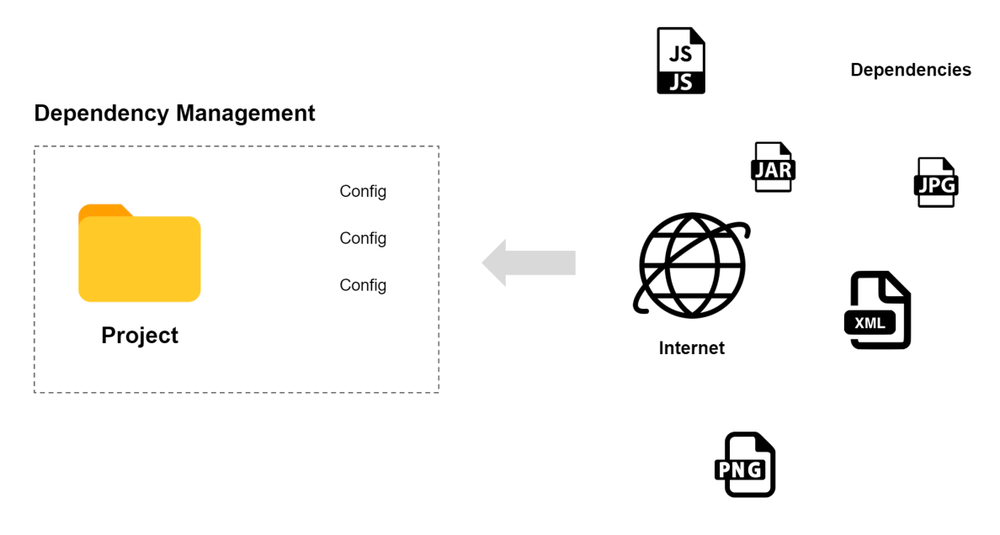

# ข้อดีของระบบ Dependency Management

- ระบบจะทำการดาวน์โหลด Dependencies ต่าง ๆ มาให้เอง นักพัฒนาเพียงแค่ทำการเขียน Configuration ต่าง ๆ ลงไปในไฟล์ที่กำหนด
- ประหยัดพื้นที่ (Storage) ไม่ต้องคอยเก็บ Dependencies ไว้ที่เครื่องของตนเอง เพราะ Dependencies ต่าง ๆ จะถูกเก็บไว้บนอินเตอร์เน็ต
- โปรเจ็คมีขนาดเล็กลง เพราะไม่ได้เก็บ Dependencies ไว้ในโปรเจ็ค ทำให้สามารถแชร์ Code ระหว่างกันและกันได้ง่ายขึ้น
- นักพัฒนาทุกคนจะได้ Dependencies ที่เหมือนกันตามที่เขียน Config ไว้
- เป็นมาตรฐานให้ทุกคนใช้งานเหมือนกัน
- ลดระยะเวลาในการพัฒนาระบบ

ระบบ Dependency Management ไม่ได้มีเพียงแค่ภาษา Java เท่านั้นที่ใช้ ทุกวันนี้ภาษาโปรแกรมมิ่ง (Programming Languages) อื่น ๆ ก็มีระบบ Dependency Management เป็นของตนเอง เช่น

- `PHP` มี Composer https://getcomposer.org/
- `Javascript` (Node.js) มี NPM (Node Package Manager) https://www.npmjs.com/
- `Ruby` มี RubyGems https://rubygems.org/
- `Python` มี pip https://pypi.org/
- และ อื่น ๆ

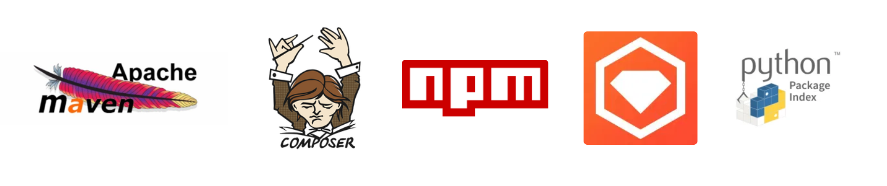

# Repository

Repository ใน Maven หมายถึง ที่ที่ระบบ Dependency Management ใช้เก็บ Dependencies หรืออาจเรียกได้ว่า เป็นคลังเก็บ Dependencies แบ่งได้เป็น 3 ประเภท ดังนี้

1. Central Repository
2. Remote Repository
3. Local Repository

### Central Repository

เป็น Repository กลางที่ทาง Maven สร้างขึ้น เพื่อให้นักพัฒนาทั่วโลกสามารถเอา Dependencies หรือ Code ที่ตนเองเขียนไปวางไว้ เพื่อแชร์ให้นักพัฒนาคนอื่น ๆ สามารถนำ Dependencies นั้น ๆ ไปใช้งานได้ฟรี ซึ่งการนำไปวางจะต้องทำการลงทะเบียน (Register) ตามข้อกำหนดของ Maven

### Remote Repository

เป็น Repository ที่องค์กร หรือหน่วยงานต่าง ๆ สร้างขึ้นมาใช้งานเอง เพื่อแชร์ Dependencies ให้กับนักพัฒนา

- บาง Repository ก็ทำขึ้นมาเชิงธุรกิจ คือ เสียตังค์เพื่อโหลด Dependencies
- บาง Repository ก็เปิดให้นักพัฒนาสามารถโหลด Dependencies ไปใช้งานได้ฟรี
- บาง Repository ก็ทำขึ้นมาเพื่อทำหน้าที่เป็น Proxy ไว้คอย Cache Dependencies ต่าง ๆ ที่โหลดมาจาก Central Repository หรืออินเตอร์เน็ต เพื่อลด Bandwidth ในการใช้งาน เพราะจะโหลดจากอินเตอร์เน็ตมาแค่ครั้งเดียว จากนั้นเครื่องของนักพัฒนาคนอื่น ๆ ก็จะมาโหลดที่ Remote Repository นี้แทน

### Local Repository

เป็น Repository ในเครื่องของนักพัฒนา โดยปกติจะอยู่ที่โฟลเดอร์ .m2 ใน Home Directory ของผู้ใช้ (Default) เช่น ถ้าใช้งานระบบปฏิบัติการ (Operating System) ที่เป็น (Microsoft) Windows
  
Home Directory ของผู้ใช้จะเป็น C:\Users\[ชื่อผู้ใช้งาน] เช่น C:\Users\jitta    
  
ซึ่ง .m2 จะอยู่ที่ C:\Users\jitta\.m2 (แต่ก็สามารถเปลี่ยนแปลงได้)  
  
Local Repository มีหน้าที่ไว้คอย Cache หรือเก็บ Dependencies ต่าง ๆ ที่โหลดมาจาก Central Repository หรือ Remote Repository  แล้วนำมาเก็บไว้ในเครื่องของนักพัฒนา เพื่อที่จะได้ไม่ต้องไปโหลดมาใหม่อีกครั้ง  
  
การทำงานของ Maven Repository แบบธรรมดาทั่ว ๆ ไป  

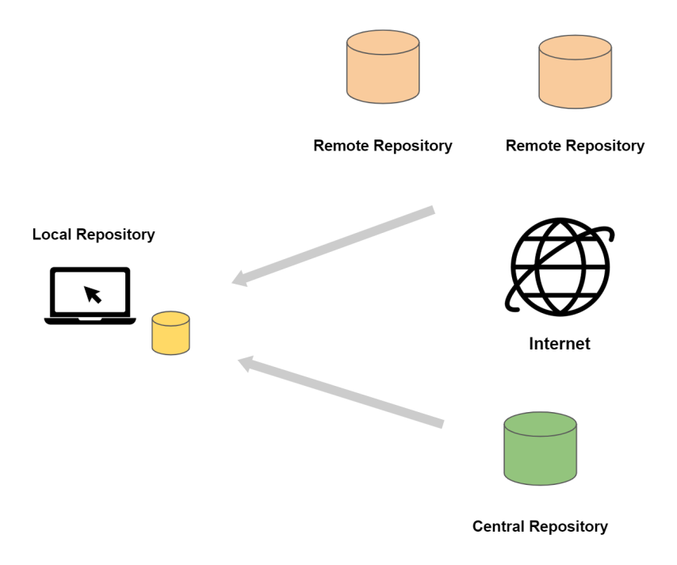

การทำงานของ Maven Repository กรณีที่ใช้ Remote Repository ทำหน้าที่เป็น Proxy

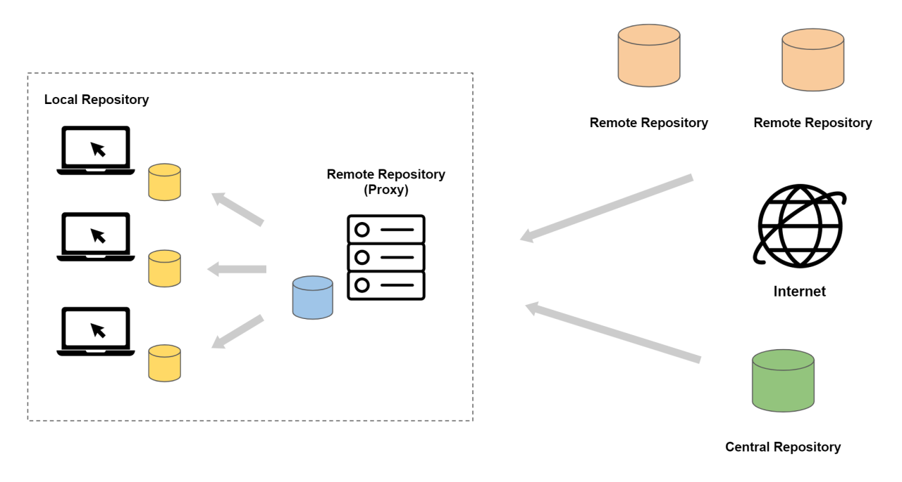

# โครงสร้างโปรเจ็ค (Project Structure)

เมื่อเราใช้ Apache Maven ช่วยในการสร้าง Java Project หน้าตาคร่าว ๆ ของโปรเจ็คจะมีลักษณะเป็นดังนี้

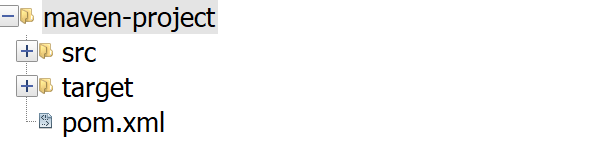

ภายใน  **maven-project** จะประกอบด้วยส่วนหลัก ๆ 3 ส่วน คือ

1. โฟลเดอร์ **src** เป็นโฟลเดอร์ที่เอาไว้เก็บ Source Code ต้นฉบับที่ถูกเขียนไว้
2. โฟลเดอร์ **target** เป็นโฟลเดอร์ที่เอาไว้เก็บ Output Result ที่พร้อมนำไปใช้งาน หลังจากที่ทำการ Build Code ต้นฉบับที่เก็บไว้ในโฟลเดอร์ src แล้ว
3. ไฟล์ **pom.xml** เป็น Maven Configuration ของโปรเจ็ค

เมื่อขยายออก

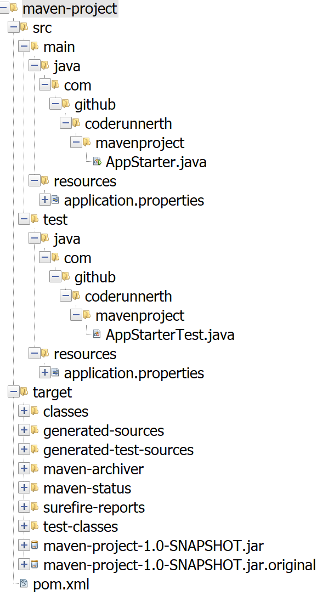

 จะพบว่าข้างในโฟลเดอร์ **src** และโฟลเดอร์ **target** มีโฟลเดอร์อื่น ๆ ซ้อนอยู่อีกมากมาย ซึ่งเมื่อพัฒนาโปรเจ็คไปเรื่อย ๆ ก็จะทำให้มีไฟลเดอร์และไฟล์ต่าง ๆ เพิ่มขึ้นมาอีก   
   
ผู้เขียนขอให้ผู้อ่านโฟกัส (Focus) ดังนี้ เพื่อทำความเข้าใจโครงสร้างหลัก ๆ ของ Maven   

- **maven-project** คือ ชื่อโปรเจ็ค หรือ Root Folder ของโปรเจ็ค
- **src** เป็นที่เก็บ Source ต้นฉบับ ประกอบด้วย
    - **main** เป็นส่วนหลักของโปรแกรม ที่จะทำงานจริง ๆ
       - **java** เป็นที่เก็บไฟล์นามสกุล .java (สามารถมีโฟลเดอร์ย่อยลงไปอีกได้ เป็น Java Package)
       - **resources** เป็นที่เก็บไฟล์ หรือ Resources ต่าง ๆ ที่ .java เรียกใช้งาน เช่น ไฟล์ Configuration ต่าง ๆ
    - **test** เป็นส่วนที่ใช้สำหรับทดสอบ (Test) โปรแกรม
       - **java** เป็นที่เก็บไฟล์นามสกุล .java สำหรับ Test โปรแกรม
       - **resources** เป็นที่เก็บไฟล์ หรือ Resources ต่าง ๆ ที่ .java ของ Test เรียกใช้งาน (คล้าย ๆ กับ /src/main/resources แต่เป็น /src/test/resources)
- **target** เป็นที่เก็บ Output Result ที่ถูก Build เสร็จเรียบร้อยแล้ว พร้อมนำไปใช้งาน
- **pom.xml** เป็นไฟล์ที่ใช้เป็น Configuration หลักของ Maven สำหรับโปรเจ็คนี้

ภายใต้ /src/main/java

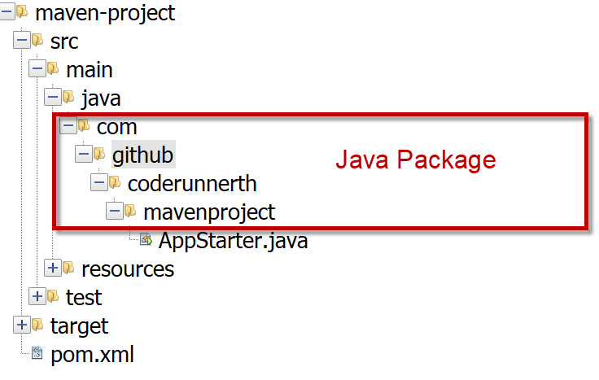

Output Result ที่พร้อมนำไปใช้งาน ในที่นี้ Build เป็นไฟล์ .jar

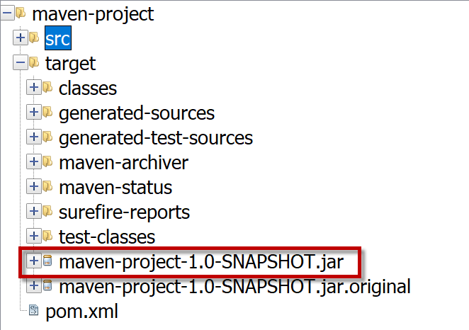

# pom.xml

ไฟล์ pom.xml ถือเป็นหัวใจ หรือ Core ของ Apache Maven ใน 1 Java Project จะมีไฟล์ pom.xml เพียงไฟล์เดียว วางอยู่ใน Root โฟลเดอร์ของโปรเจ็คเป็นไฟล์ที่ใช้สำหรับกำหนดค่า Configuration ต่าง ๆ ให้กับโปรเจ็คที่สร้างโดยใช้ Maven

หน้าตาข้างในของไฟล์ pom.xml

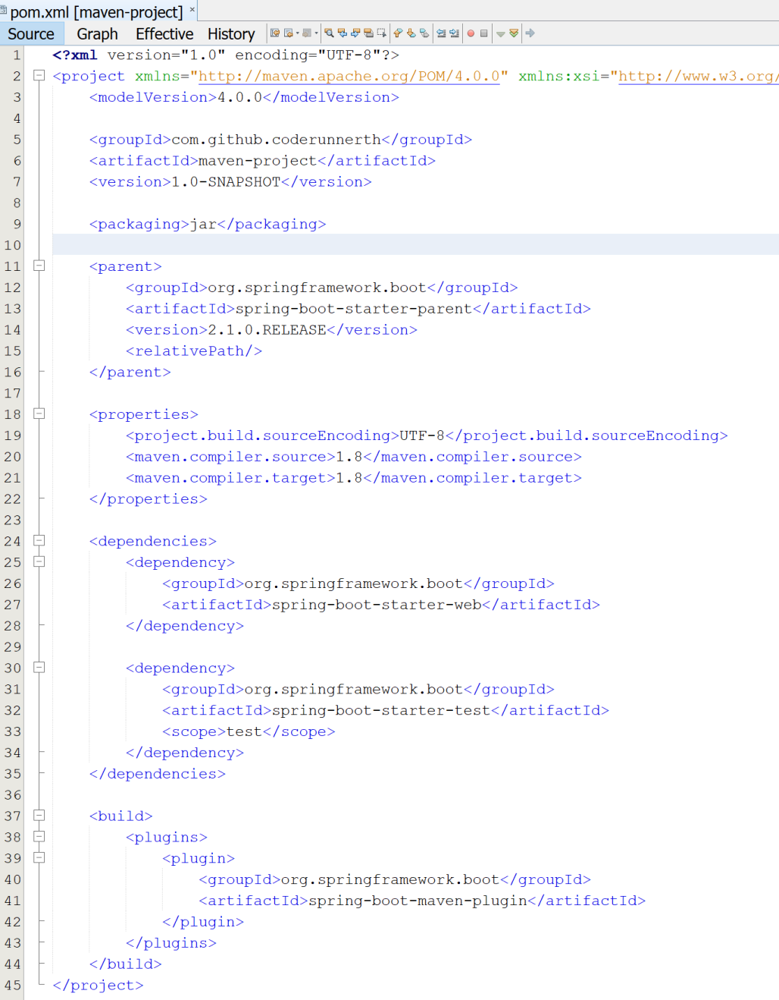

 ไฟล์นี้ถูกเขียนขึ้นด้วยไวยากรณ์ (Syntax) **XML** (E**x**tension **M**arkup **L**anguage) ซึ่งประกอบด้วยแท็ก (Tag) </> ต่าง ๆ มากมาย เมื่อพิจารณาตามรูปแบบการ Config และการใช้งาน จะสามารถแบ่งเป็นกลุ่มได้ดังนี้

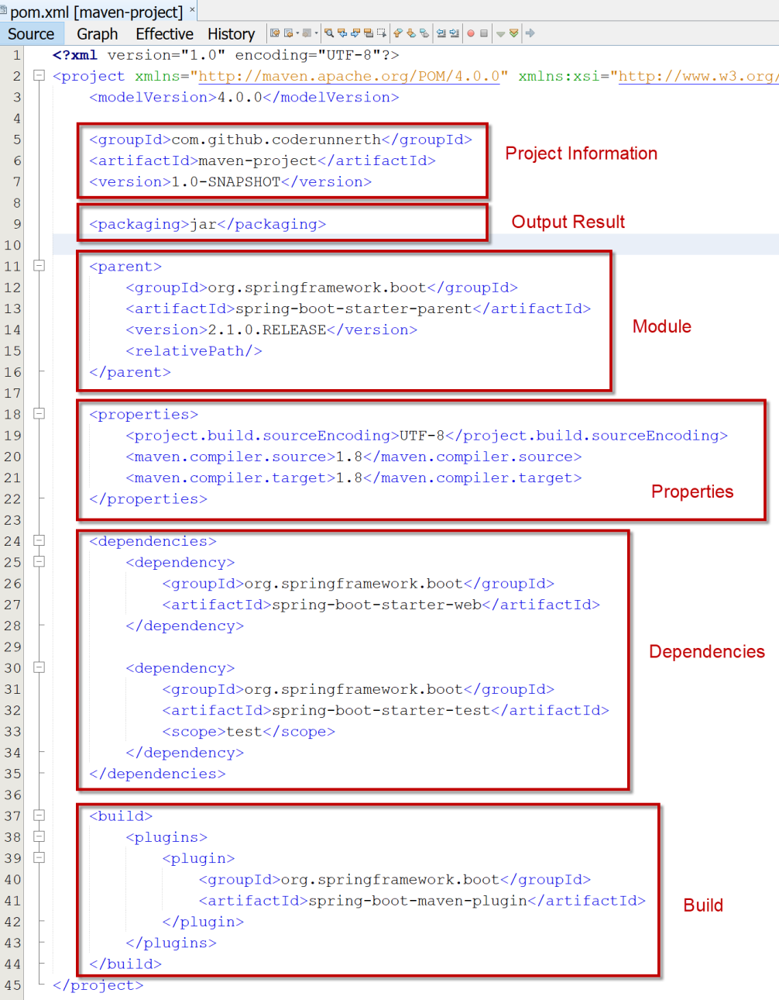

 จริง ๆ จะมีแท็กมากกว่านี้ แต่แท็กหลัก ๆ ที่ใช้งานอยู่เป็นประจำ จะมีประมาณนี้

 - **Project Information** เป็นส่วนที่ใช้สำหรับอธิบายข้อมูลสำคัญของโปรเจ็ค เช่น
    - **groupId** คือ id ของกลุ่มโปรเจ็ค หรือ Name Space ของโปรเจ็ค ใช้เพื่อบอกว่า โปรเจ็คนี้ จัดอยู่ในกลุ่ม Code ชุดใด ปกติจะใช้เป็น Reverse Domain Name
    - **artifactId** คือ id ของโปรเจ็ค จะต้องเป็น Unique คือ artifactId นึงต้องไม่ซ้ำกันใน groupId นั้น ๆ แต่สามารถซ้ำกับ groupId อื่น ๆ ได้
    - **version** คือ เวอร์ชันปัจจุบันของโปรเจ็ค
- **Output Result** เป็นส่วนที่เอาไว้กำหนดรูปแบบของ Output ไฟล์ ว่าหลังจากที่ทำการ Build โปรเจ็คเสร็จแล้ว จะนำไฟล์รูปแบบไหนไปใช้งาน เช่น .jar .war .ear .bundle เป็นต้น
- **Module** เป็นส่วนที่ใช้สำหรับกำหนดค่าโปรเจ็คแบบโมดูล ซึ่ง Maven สามารถเขียน Code โดยการแบ่งออกเป็นโมดูลต่าง ๆ แล้วแชร์ (Share) Code ร่วมกันได้ (ระบบ Module สามารถศึกษาเพิ่มเติมได้จากเรื่อง Maven Multiple Modules โดยสามารถดูตัวอย่างการ Config ได้จากโปรเจ็คนี้ [https://github.com/pamarin-tech/commons](https://github.com/pamarin-tech/commons))
- **Properties** เป็นส่วนที่เอาไว้กำหนดค่า Configuration ต่าง ๆ ของโปรเจ็ค
- **Dependencies** เป็นส่วนที่เอาไว้กำหนด Dependencies ที่โปรเจ็คจำเป็นต้องใช้
- **Build** เป็นส่วนที่เอาไว้กำหนดค่าต่าง ๆ เกี่ยวกับการ Build โปรเจ็ค เช่น
    - **plugins** จะใช้ Plugins อะไรบ้างในระหว่างที่ทำการ Build
    - **profile** สามารถกำหนด Configuration Profile ในระหว่างที่ทำการ Build เพื่อนำไปใช้งานในแต่ละ Environment ที่แตกต่างกันได้
- และอื่น ๆ

# การทำงานของ Apache Maven

เมื่อสร้างโปรเจ็คด้วย Apache Maven เราจะได้โปรเจ็คที่มีโครงสร้างเป็นแบบนี้

ทั้ง 2 ภาพเป็นโปรเจ็คเดียวกัน (ต่างกันแค่มุมมอง)
   
หากต้องการ Dependencies เพื่อใช้ในโปรเจ็ค ก็ให้ทำการ Config ลงไปในไฟล์ pom.xml ในส่วนของ dependencies ดังนี้

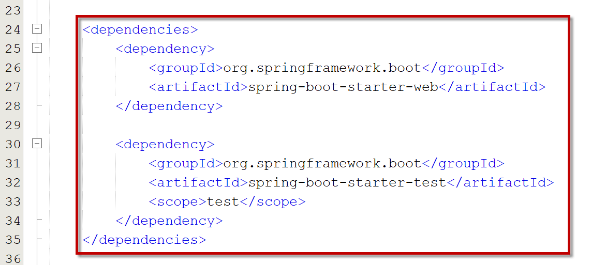

จากนั้นทำการ Build Project

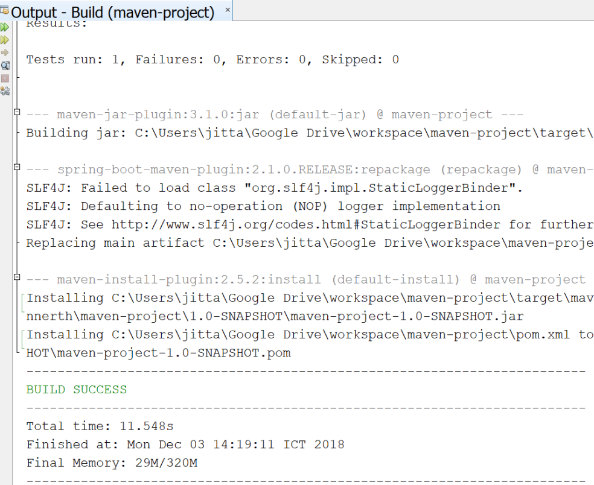

Maven จะทำการโหลด Dependencies จาก Central Repository หรือ Remote Repository เข้ามาใส่ในโปรเจ็คให้โดยอัตโนมัติ

> Dependencies ที่โหลดเข้ามาในโปรเจ็คอาจจะมีมากกว่าที่ Config ไว้ เนื่องจาก Dependencies นึงอาจโหลด Dependencies อื่น ๆ พ่วงเข้ามาด้วย

    
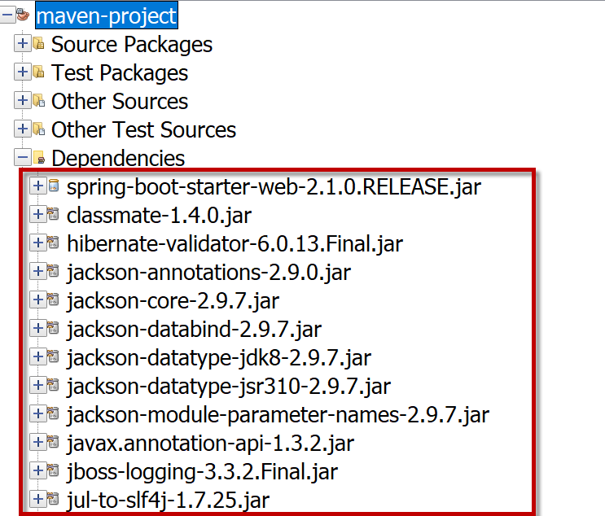

และเก็บ Dependencies นี้ไว้ใน Local Repository (.m2) ด้วย เพื่อ Cache ไว้ใช้งานในครั้งถัดไป

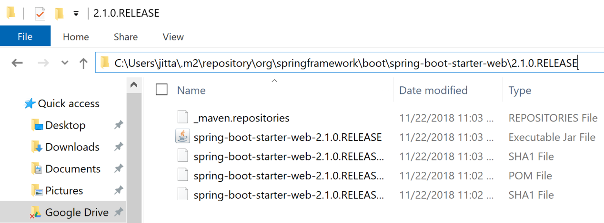

ในระหว่างการ Build Maven จะทำการ Compile Source Code (.java) ทั้งหมดที่อยู่ใน /src/main/java ไปเป็น .class ให้โดยอัตโนมัติ แล้วนำไปไว้ภายใต้ /target/classes
  
พร้อมทั้ง Copy Resources ที่อยู่ใน /src/main/resources ไปไว้ภายใต้ /target/classes ด้วย  

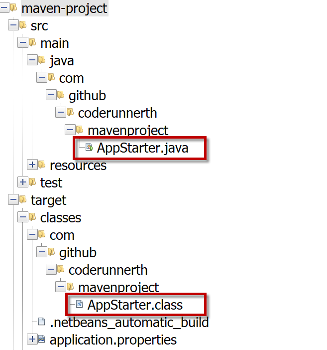

จากนั้นทำการ Run Code ทดสอบ (Test ต่าง ๆ) ตามที่เราเขียนไว้ โดยอัตโนมัติ

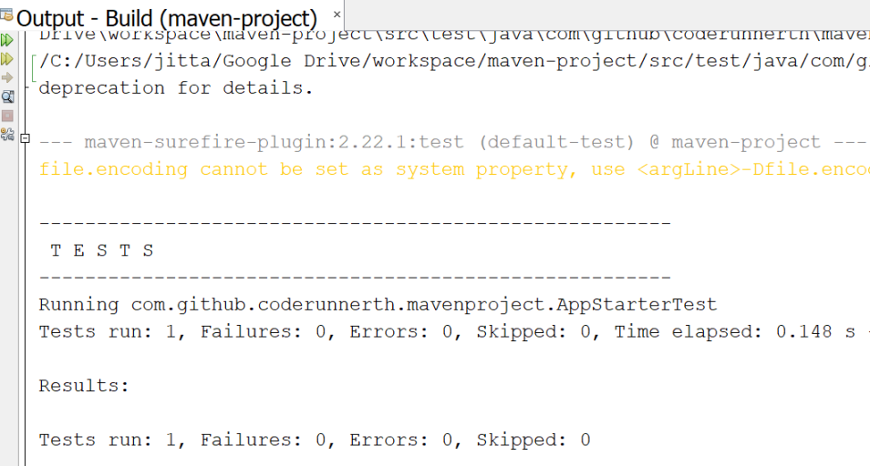

ต่อมาทำการ Pack โปรเจ็คให้อยู่ในรูปแบบของ Output Result ตามที่เราได้กำหนดไว้ใน pom.xml และเก็บ Output นั้นไว้ในโฟลเดอร์ /target

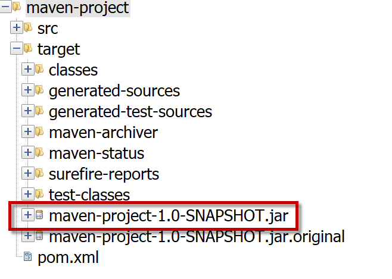

เมื่อต้องการนำโปรเจ็คไป Deploy ก็นำไปแค่ไฟล์ .jar ไปใช้งาน
  
และไฟล์ .jar นี้ยังสามารถเป็น Dependencies ให้กับโปรเจ็คอื่น ๆ เรียกใช้งานได้อีกต่อไปด้วย  

# Command Line

สามารถเรียนรู้ได้จากบทความ

- [พื้นฐานการใช้ Maven Command Line](/blog/basic-maven-command-line/)

# หมายเหตุ

เป็นบทความที่ถูกย้ายมาจาก [https://coderunnerth.co/2018/12/05/รู้จักกับ-apache-maven/](https://coderunnerth.co/2018/12/05/รู้จักกับ-apache-maven/) ซึ่งผู้เขียน เขียนไว้เมื่อ ธันวาคม 5, 2018