# Database Trigger คืออะไร ทำงานอย่างไร

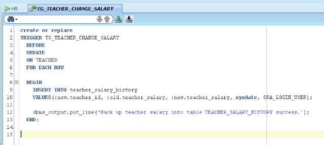

# ความหมาย

> Database Trigger หมายถึงโปรแกรม **PL/SQL** ที่อยู่ในลักษณะของ **Name Block** ที่ถูกสร้างและจัดเก็บไว้ในระบบฐานข้อมูล
โดยการทำงานของ Database Trigger นั้น`จะทำงานเองโดยอัตโนมัติเมื่อมี Trigger Events เกิดขึ้น`

# Trigger Events คืออะไร ?

Trigger Events หมายถึงการที่มี`เหตุการณ์บางอย่าง`เกิดขึ้นกับ table, schema, database หรือ system  เช่นมีการใช้คำสั่ง DML คือ insert, update, หรือ delete มากระทำต่อ table ที่เราได้เขียน database trigger ผูกเอาไว้  ก็จะทำให้ database trigger นั้นเกิดการทำงานโดยอัตโนมัติตามคำสั่ง PL/SQL ที่เราได้เขียนไว้นั่นเอง   หรือเช่นการ Login เข้าสู่ระบบ (Database server) ถ้าหากเราได้เขียน Database Trigger ที่เกี่ยวกับการ Login เอาไว้ในระบบ  มันก็จะทำงานเองโดยอัตโนมัติเมื่อมี User Login เข้าสู่ระบบ

### ตัวอย่างโจทย์

เช่น  หากมีการเปลี่ยนแปลงเงินเดือนให้กับพนักงานของบริษัท  เจ้าของบริษัทต้องการให้ back up ข้อมูลของพนักงาน  จำนวนของเงินเดือนก่อนเปลี่ยนแปลง  จำนวนเงินเดือนใหม่ที่เปลี่ยนแปลงแล้ว  วันเวลาที่ได้ทำการเปลี่ยนแปลงเงินเดือน และชื่อของ database user ที่ทำหน้าที่เปลี่ยนแปลงเงินเดือนเก็บไว้ในฐานข้อมูล
  
เราสมมติว่า table Employees ดังรูปข้างล่างนี้  เราได้เขียน Database Trigger สำหรับ back up ข้อมูลพนักงานและข้อมูลเงินเดือนผูกเอาไว้น่ะครับ 
   
จากนั้นทำการเพิ่มเงินเดือนให้กับพนักงานชื่อ peter จาก 20,000 เป็น 25,000   

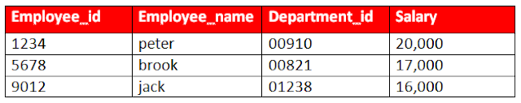

ในตอนนั้นเองก็ได้มี Trigger Events เกิดขึ้น  เนื่องจากว่าเรามีการใช้คำสั่ง update กับ table ที่เราได้เขียน database trigger ผูกเอาไว้  ตัวโปรแกรม database trigger ก็จะทำงานอยู่เบื้องหลังโดยอัตโนมัติ คือ มีการ back up ข้อมูลพนักงานและข้อมูลเงินเดือนเก็บไว้เรียบร้อยแล้ว

### ที่ table BackupSalary

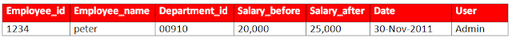

จะเห็นว่า  ได้มีการ back up ข้อมูลต่างๆเก็บไว้แล้วโดยอัตโนมัติ

# การทำงาน

ทฤษฎีผ่านไปแล้ว  เรามาดูการทำงานจริงๆกันดีกว่าครับ 

ผมใช้ Oracle Database 11g R2  น่ะครับ  
เริ่มแรกก็เปิด SQL Developer ขึ้นมา

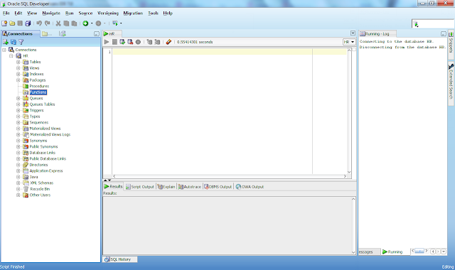

เดี๋ยวผมจะลองทดสอบในตาราง Employees ที่ผมมีอยู่แล้วน่ะครับ  โดยจะทำการทดสอบเพิ่มเงินเดือนให้กับพนักงานเหมือนตัวอย่างที่ได้กล่าวไปแล้ว
  
อันนี้คือตาราง Employees ครับ  field หรือ attribulte อาจจะเยอะกว่าตัวอย่างที่ได้กล่าวไป  แต่ก็ไม่เป็นไรครับ  

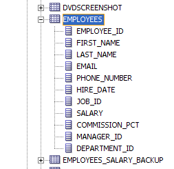

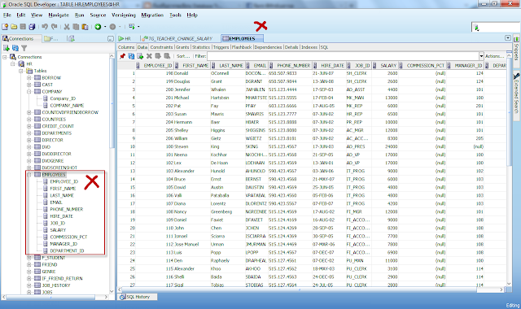

ตอนแรกผมทำการสร้าง table สำหรับ back up ข้อมูลของพนักงานและข้อมูลเงินเดือนขึ้นมาก่อน 
ชื่อ table ว่า Employees_Salary_Backup

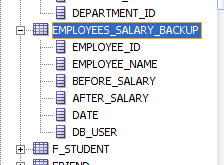

จากนั้นก็เขียนโค๊ด Database Trigger ผูกติดกับ table Employees 

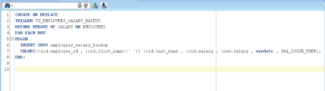

```sql
TRIGGER TG_EMPLOYEES_SALARY_BACKUP
BEFORE UPDATE OF SALARY ON EMPLOYEES  
```

บรรทัดนี้บอกว่า  สร้าง Trigger ชื่อว่า  TG_EMPLOYEES_SALARY_BACKUP 
และให้ Trigger ทำงานก่อนที่จะทำการ UPDATE เงินเดือนในตาราง EMPLOYEES 

```sql
BEGIN
    INSERT INTO employees_salary_backup
    VALUES(:old.employee_id , :old.first_name||' '|| :old.last_name , :old.salary , :new.salary , sysdate , ORA_LOGIN_USER);
END;
```

บรรทัดนี้คือส่วนหลักที่จะทำงานเมื่อมี Trigger Events เกิดขึ้น  ก็คือให้ Insert ข้อมูลลงในตาราง  employees_salary_backup  หรือเรียกว่าเป็นการ backup ข้อมูลนั่นเอง
  
เรามาลองทำการเปลี่ยนแปลงเงินเดือนกันดูครับ
ผมจะเพิ่มเงินเดือนในกับพนักงานซึ่งมี id = 200  จาก 4,400 เป็น 10,000  

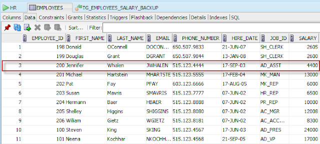

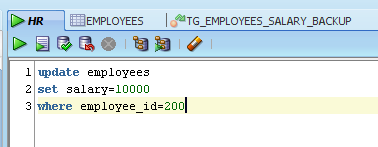

ดูผลลัพธ์การเปลี่ยนแปลง

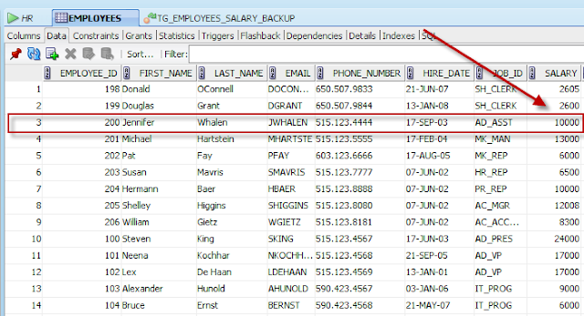

จากนั้นไปดูค่าในตาราง EMPLOYEES_SALARY_BACKUP

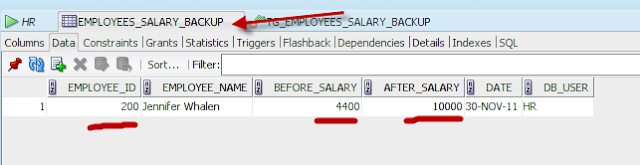

Trigger จะเกิดการทำงานเองโดยอัตโนมัติ  โดยทำการ back up ข้อมูลต่างๆ เก็บไว้  เมื่อเรามีการ Update เงินเดือนของพนักงานเกิดขึ้น

# หมายเหตุ
เป็นบทความที่ถูกย้ายมาจาก [https://na5cent.blogspot.com/2011/11/database-trigger.html](https://na5cent.blogspot.com/2011/11/database-trigger.html) ซึ่งผู้เขียน เขียนไว้เมื่อ วันจันทร์ที่ 28 พฤศจิกายน พ.ศ. 2554