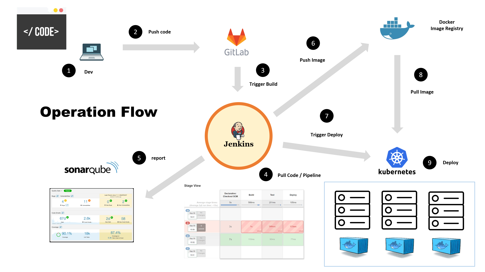

# ทำความรู้จักกับ DevOps 

 

# DevOps 

เป็น `แนวความคิดเชิงวัฒนธรรม` (Culture) และ `แนวทางปฏิบัติ` (Practice) ที่เกิดมาเพื่อส่งเสริมการทำงานของ **Dev**elopment Team และ **Op**eration**s** Team เพื่อให้สามารถผลิตและส่งมอบ Software ไปยังผู้ใช้ได้อย่างรวดเร็ว และมีประสิทธิภาพมากที่สุด  
  
โดยมีเป้าหมายคือ การลดตุ้นทุนของ `เวลา` (Time) และ `ค่าใช้จ่าย` (Cost) ที่ไม่จำเป็นออกไป โดยอาศัยเครื่องมือ (Tools) ต่าง ๆ ที่มีอยู่มาทำให้เกิดความราบรื่นในระหว่างกระบวนการพัฒนา ไปจนถึงการ Deploy ระบบขึ้น Production

# Development Team และ Operations Team หมายถึงใคร    

แต่ละองค์กรอาจจะมอง Development Team และ Operations Team ไม่เหมือนกัน ทั้งนี้ขึ้นอยู่กับบทบาท ความรับผิดชอบ และ Scope งาน ที่คน ๆ นั้นได้รับ  ว่ามีส่วนช่วยเหลือ หรือร่วมพัฒนาระบบมากแค่ไหน  

บางองค์กรอาจจะมองว่า  

### Development Team 

หมายถึง    
 - Developer
 - Designer 
 - Software Tester
 - QA (Quality Assurance)  
 - BA (Business Analyst)
 - PM (Project Manager)
 - PO (Product Owner)
 - หรือคนที่ร่วมกันพัฒนาระบบนั้น ๆ ขึ้นมาโดยตรง

### Operations Team 

อาจจะหมายถึง 
- System Administrator
- Database Administrator
- Network Engineer 
- Marketing
- ประชาสัมพันธ์ 
- Stakeholder (ผู้มีส่วนได้ส่วนเสีย)
- และคนอื่น ๆ ที่เกี่ยวข้องกับ Project นั้น (ที่ไม่ได้อยู่ใน Development Team)

# ต้นกำเนิดของ DevOps

มาจากการที่บริษัทต่าง ๆ เกิดปัญหาในการพัฒนา Software ซึ่งไม่สามารถที่จะพัฒนา และปล่อย (Launch) Product ได้เร็วเท่าที่ควรจะเป็น  
  
วิศวกรทั่วโลกจึงได้พยายามคิดค้นวิธีการ และแนวทางปฏิบัติต่าง ๆ ที่เห็นว่า `มันดี` เพื่อนำมาแก้ไขปัญหาที่เกิดขึ้น โดยมีวัตถุประสงค์เพื่อให้เราสามารถที่จะพัฒนาและส่งมอบ Software ได้เร็ว ลดต้นทุนเวลา ค่าใช้จ่าย และมีประสิทธิภาพในการทำงาน  
  
จนแนวความคิดและแนวทางปฏิบัตินั้น เกิดการบอกต่อ และทำกันจนกลายเป็นแนวทางปฏิบัติ (Practice) และ `วัฒนธรรม` (Culture) 
  
และเราก็เรียกและนิยามวัฒนธรรมนั้นกันว่า `DevOps` 

# รูปแบบการทำงาน และเครื่องมือที่ใช้

ในความเป็นจริง DevOps ไม่ได้มีรูปแบบ หรือเครื่องมือที่ใช้ในการทำงานตายตัว 
บางบริษัทอาจจะทำ DevOps ในอีกรูปแบบนึง บางบริษัทก็ใช้เครื่องมืออีกเครื่องมือนึง 
   
แต่สุดท้ายแล้วก็มีเป้าหมายในการทำ DevOps แบบเดียวกัน นั่นก็คือ การทำให้ Developer สามารถที่จะปล่อย Software ออกมาได้เร็ว และมีประสิทธิภาพมากที่สุด  พร้อมทั้งช่วยลดต้นทุนด้านเวลา และค่าใช้จ่าย ต่าง ๆ ที่จะเกิดขึ้นในระบบ 

# DevOps ด้วยระบบอัตโนมัติ (Automation)

แนวคิด Automation เป็นหนึ่งในแนวความคิด และแนวทางปฏิบัติที่ดี (Best Practice) ที่ถูกนำมาใช้กับ DevOps มากที่สุด โดยการ Setup ระบบทั้งหมดให้ทำงานแบบอัตโนมัติ ให้สามารถทำงานแทนคน เพื่อลดความซ้ำซ้อน และข้อผิดพลาดที่อาจจะเกิดจากคนได้  

จากภาพเมื่อเราเขียน Code เสร็จ `(1)`   
จากนั้น Save (Push) Code ขึ้นไปเก็บไว้บน Git Server (ที่ฝาก Source Code) `(2)`  
  
จะมีระบบอัตโนมัติ มาทำการดึง Source Code ที่เราเขียนไว้   
เพื่อนำไป `Build`, `Test`, `Release`, พร้อมทั้ง `Deploy` ขึ้น Server ให้เราเองโดยอัตโนมัติ `(3 - 9)` โดยไม่ต้องใช้คนทำเหมือนในอดีต 

# สิ่งที่ได้รับเมื่อเราทำ DevOps แบบ Automation

- Dev งานได้ไวขึ้น
- Deploy งานได้ไวขึ้น 
- Tracking ปัญหาได้ไวขึ้น
- แก้ BUG ได้ไวขึ้น
- ลดความซ้ำซ้อนของการทำงาน
- Software มีคุณภาพมากขึ้น
- ส่งงานลูกค้าได้ไวขึ้น 

เพราะเราไม่ต้องใช้คนทำ

# ตำแหน่งงาน DevOps

จากที่ได้เกริ่นไปในตอนแรกว่า DevOps คือ วัฒนธรรมการทำงาน ซึ่งในความเป็นจริงแล้ว Developer เองก็สามารถทำ DevOps ได้ โดยไม่จำเป็นต้องมีตำแหน่งงาน DevOps ในองค์กร

แต่บางองค์กรที่มีคนค่อนข้างเยอะ และมี Product จำนวนมากที่ต้องคอยดูแล องค์กรจึงมีความจำเป็นที่จะต้องแยกตำแหน่งนี้ออกมาเป็นอีก 1 ตำแหน่ง เพื่อคอยดูแล และให้ความช่วยเหลือ Development Team และ Operations Team 
ต่าง ๆ ในองค์กรโดยเฉพาะ  

# พื้นฐานจำเป็นสำหรับการทำ DevOps

การทำ DevOps เป็นศาสตร์ที่ต้องอาศัยความรู้หลายด้าน ไม่ว่าจะเป็น 

- พื้นฐาน Programming
- พื้นฐาน Operating System (OS) เช่น Windows, Linux, Mac etc.
- พื้นฐานการใช้ Command Line
- พื้นฐาน Software Container เช่น Docker, Kubernetes etc. 
- พื้นฐาน Networking เช่น IP Address, การ Setup DNS etc.
- พื้นฐาน Database
- พื้นฐานการทำ Aplication Server 
- พื้นฐานการทำ Cluster, Load Balancing, ..
- พื้นฐานการใช้ Cloud
- พื้นฐาน Security เช่น https etc.
- พื้นฐานความรู้เรื่องการทดสอบระบบ (Testing)
- อื่น ๆ

แทบจะต้องมีพื้นฐานสำหรับทุก ๆ เรื่อง  เพื่อให้สามารถ Setup และแก้ไขปัญหาต่าง ๆ ในระบบได้

# Google Slide

- [https://docs.google.com/presentation/d/18xx9nR1h5ybZKHsvqvf-MYnjdWcsU1a9ROPt_qMN8tY/edit?usp=sharing](https://docs.google.com/presentation/d/18xx9nR1h5ybZKHsvqvf-MYnjdWcsU1a9ROPt_qMN8tY/edit?usp=sharing)

# Rererence

- [https://www.wikiwand.com/en/DevOps](https://www.wikiwand.com/en/DevOps)
- [https://aws.amazon.com/th/devops/what-is-devops/](https://aws.amazon.com/th/devops/what-is-devops/)

