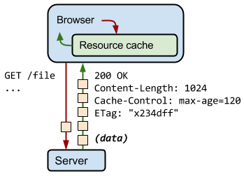
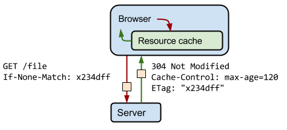

# รู้จักกับ ETag (Entity Tag)

# ความหมาย

**ETag** เป็น http response header รูปแบบประมาณนี้

> ETag : “xxxxx”

(อย่าลืมครอบด้วย “)
  
ค่า xxxxx ถูก generate โดยฝั่ง server  
แล้วแต่คนเขียนโปรแกรม หรือระบบจะ gen ให้  
  
เป็นค่าเฉพาะสำหรับ resource นั้น ๆ (ต้องได้ค่าเดิมตลอด จนกว่า resource จะมีการเปลี่ยนแปลง)  

อาจใช้วิธีการ hash ด้วย sha256 จาก last modified date ของ resource นั้น ๆ หรือ hash content ของ resource เอาก็ได้  

เพื่อเอาไว้ให้ client หรือ browser ใช้ส่งกลับไปหา server อีกครั้งด้วย http request header **If-None-Match**  

# การทำงาน

- request แรก — ระบบจะ generate Etag กลับไปให้ทาง http response header + response body (data)  

- request ถัด ๆ มา — browser ส่ง http request header If-None-Match มาตรวจสอบที่ฝั่ง server

เมื่อมี request เดิมเข้ามา (จาก url เดิม)
server จะ get ค่า **If-None-Match** จาก http request header มาเปรียบเทียบกับค่า eTag ของ resource นั้น ๆ ที่ตัวเองมี
   
> ซึ่งถ้าค่า **ETag** เท่ากับ **If-None-Match**
server จะ send http response กลับไปเป็น 304 Not Modified โดยจะไม่แนบ response body กลับไปด้วย   

ทำให้ response นั้นเบา เพราะแค่ส่ง header กลับไปบอก browser ว่า resource ไม่มีการเปลี่ยนแปลง ใช้ resource เดิมได้เลย (ไม่มี body ส่งไปด้วยน่ะ)
  
ทำให้ลด network bandwidth ลงไปได้เยอะมาก  
(กรณีที่ resource มีขนาดใหญ่จะค่อนข้างเห็นภาพชัดเจน)  

การใช้ **ETag** เป็นการทำ caching รูปแบบนึง ที่ server สามารถ control cache ได้เอง ซึ่งง่ายต่อการจัดการเรื่อง cache โดย server เอามาก ๆ
  
ปล. บาง client หรือ บาง browser **ETag** จะไม่ทำงาน
ถ้าไม่ทำการกำหนด http response header Cache-Control ให้มันด้วย ซึ่งอาจจะเป็น  

> Cache-Control : private, max-age=60  

ถ้าสนใจอยากอ่านเพิ่มเติมสามารถอ่านได้จาก

# Reference 

- [https://developer.mozilla.org/en-US/docs/Web/HTTP/Headers/ETag](https://developer.mozilla.org/en-US/docs/Web/HTTP/Headers/ETag)
- [https://developers.google.com/web/fundamentals/performance/optimizing-content-efficiency/http-caching](https://developers.google.com/web/fundamentals/performance/optimizing-content-efficiency/http-caching)

# หมายเหตุ

เป็นบทความที่ถูกย้ายมาจาก [https://medium.com/@jittagornp/รู้จักกับ-etag-entity-tag-5cb79732d302](https://medium.com/@jittagornp/รู้จักกับ-etag-entity-tag-5cb79732d302) ซึ่งผู้เขียน เขียนไว้เมื่อ Sep 21, 2019
