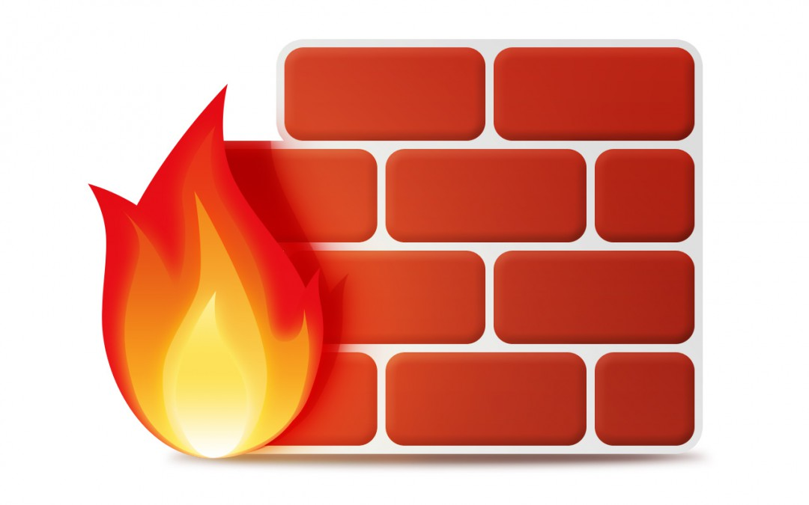
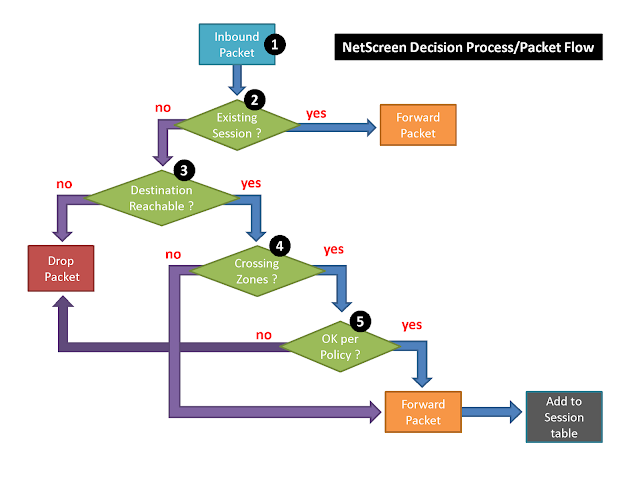
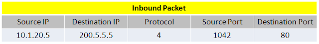
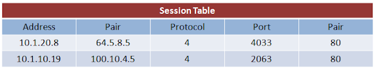
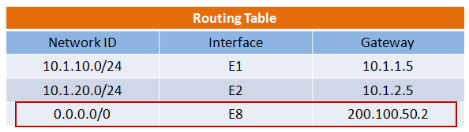
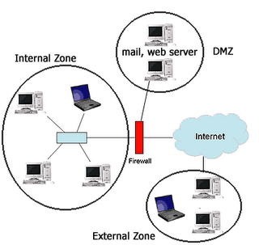
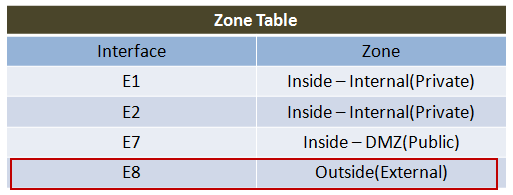
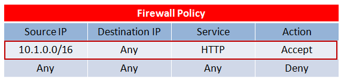
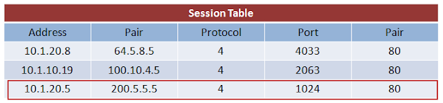

# Firewall คืออะไร ทำงานอย่างไร

> เป็นบทความเก่าที่เขียนไว้ตั้งแต่ปี 2555

# ความหมาย

`Firewall` เป็นอุปกรณ์ที่ใช้สำหรับ "ป้องกันผู้บุกรุกระบบ" ในเครือข่าย (Network)  โดยทำหน้าที่เป็นตัวคั่นกลางระหว่าง `Network ที่เราต้องการจะปกป้อง กับ Network ที่เราไม่ไว้ใจ` ตามกฎ (Rule) หรือนโยบาย (Policy) ที่ผู้ดูแลระบบ (Admin) ได้ตั้งไว้

# คุณสมบัติของ Firewall

- `Protect` Firewall เป็นเครื่องมือที่ใช้ในการป้องกัน โดยข้อมูลที่เข้า-ออก Network จะถูกกำหนดเป็น Rule หรือ Policy เพื่อใช้บังคับในการสื่อสารภายใน Network
- `Rule Base` หรือ Policy คือข้อกำหนดในการควบคุมการเข้า-ออกของข้อมูลภายใน Network
- `Access Control` คือการควบคุมระดับการเข้าถึงข้อมูลต่างๆใน Network 

# ผลได้ที่

### Firewall ไม่สามารถป้องกันระบบได้ 100 %  

เพราะขึ้นอยู่กับว่า Policy ที่ผู้ดูแลระบบตั้งไว้นั้นครอบคลุมช่องโหว่หรือปัญหาต่างๆได้มากน้อยแค่ไหน

### Firewall ไม่ได้ฉลาด 

มันไม่สามารถทำงานหรือวิเคราะห์ปัญหาต่างๆได้เองโดยอัติโนมัติ  มันเป็นแค่เครื่องมือที่คอยรับคำสั่งและปฏิบัติตาม Policy ที่ผู้ดูแลระบบได้ตั้งไว้อย่างเคร่งครัดเท่านั้น  ซึ่งหาก Policy นั้นมีข้อบกพร่อง หรือมีช่องโหว่  ก็อาจทำให้ระบบนั้นถูกโจมตีได้

### Firewall ไม่สามารถแจ้งเตือนจากการโจมตีได้  

เพราะมันมีหน้าที่แค่อนุญาตให้ Packet ผ่านไปได้หรือไม่ได้เท่านั้น เพราะถ้าให้ผ่านไปแล้ว Packet นั้นเป็นอันตรายต่อระบบ ก็จะถือว่าเป็นข้อผิดพลาดที่ Policy ของผู้ดูแลระบบเอง

# ตัวอย่างการทำงานและการตัดสินใจของ Firewall ยี่ห้อ NetScreen

1. เมื่อมี Packet เดินทางเข้ามายัง Firewall  ตัวอย่างเช่น Packet มีข้อมูลดังรูปต่อไปนี้

2. Firewall จะทำการตรวจสอบว่าเคยมี  Packet นี้เข้ามาในระบบก่อนหน้านี้หรือไม่  หรือ Packet นี้มีอยู่ใน Session Table หรือไม่  `ถ้ามีอยู่ใน Session Table` Firewall จะทำการ Forward Packet นั้นไปยังปลายทางทันที  แต่ถ้า`ไม่มี`อยูใน Session Table Friewall จะทำการตรวจสอบปลายทาง (Destination) ที่ Packet นั้นต้องการจะไป
  
### หมายเหุต

Session Table คือ Table ที่ใช้สำหรับเก็บข้อมูลสถานะการเชื่อมต่อของ Packet ไว้  `เพื่อ`เอาไว้ตรวจสอบว่า Packet นี้ ลักษณะข้อมูลแบบนี้  เคยได้รับอนุญาตให้ผ่านเข้ามาในระบบหรือไม่  ถ้า Packet นี้มีข้อมูลอยู่ใน Session Table แสดงว่าเคยได้รับอนุญาตให้ผ่านเข้ามาในระบบก่อนหน้านี้แล้ว  สามารถให้ผ่านไปได้เลย  โดยไม่จำเป็นต้องทำการตรวจสอบ Policy อีก  แต่ถ้าหากไม่มีอยู่ใน Session Table ต้องทำการตรวจสอบ Policy ก่อนว่าอนุญาตให้ผ่านไปได้หรือไม่  จากรูปข้างล่างนี้ Packet IP 10.1.20.5 ไม่มีข้อมูลอยู่ใน Session Table

3. กรณีที่ Packet นั้นไม่มีข้อมูลอยู่ใน Session Table  Firewall จะทำการตรวจสอบปลายทาง (Destination) ของ Packet ว่าต้องการจะไปไหน  และไปต่อได้หรือไม่ (ใน Routing Table) ถ้าไปต่อไม่ได้จะทำการ Drop Packet นั้นทิ้งไป `แต่ถ้าไปต่อได้`จะทำการตรวจสอบการข้ามโซน

จากรูป Network ID หมายถึง ปลายทางที่ Packet ต้องการจะไป ซึ่งจากตัวอย่าง Packet IP 10.1.20.5 ต้องการเดินทางไปยัง 200.5.5.5 จึงเข้ากรณีที่ 3 ของ Routing Table

### โซน (Zone) 

หมายถึง การแบ่ง Network ขององค์กรออกเป็นกลุ่มหรือโซนต่างๆ ได้แก่

- `External Zone` คือ กลุ่มของ Network `ภายนอก`องค์กร  หรืออาจจะหมายถึงกลุ่มผู้ใช้งาน Internet ทั่วๆไปนั่นเอง
Internal Zone คือ กลุ่มของ Network ภายในองค์กร  โดยที่ภายนอกไม่สามารถเข้าถึง Network ส่วนนี้ได้ Network ใน Internal Zone เช่นผู้ใช้งานหรือพนักงานทั่วๆไปในองค์กร  อาจเรียกได้ว่า Internal Zone เป็น Private Zone ก็ได้
Demilitarized Zone (DMZ) คือ กลุ่มของ Server ต่างๆที่คอยให้บริการกับทั้ง Internal Zone และ External Zone คือทั้ง 2 Zone นั้นสามารถใช้บริการจาก DMZ ได้  หรืออาจเรียกได้ว่า  DMZ เป็น Public Zone ก็ได้  ตัวอย่างของ Server ใน DMZ เช่น Web Server, Mail Server เป็นต้น

- `Internal Zone` คือ กลุ่มของ Network `ภายใน`องค์กร  โดยที่ภายนอกไม่สามารถเข้าถึง Network ส่วนนี้ได้ Network ใน Internal Zone เช่นผู้ใช้งานหรือพนักงานทั่วๆไปในองค์กร  อาจเรียกได้ว่า Internal Zone เป็น Private Zone ก็ได้

- `Demilitarized Zone (DMZ)` คือ กลุ่มของ Server ต่างๆที่คอยให้บริการกับทั้ง Internal Zone และ External Zone คือทั้ง 2 Zone นั้นสามารถใช้บริการจาก DMZ ได้  หรืออาจเรียกได้ว่า  DMZ เป็น Public Zone ก็ได้  ตัวอย่างของ Server ใน DMZ เช่น Web Server, Mail Server เป็นต้น

4. ถ้า Packet สามารถไปต่อได้ Firewall จะทำการตรวจสอบว่า Packet นั้นต้องเดินทางข้ามโซนหรือไม่ (Zone) ถ้า`ไม่`ต้องข้ามโซนจะทำการ `Forward Packet` นั้นไปยังปลายทางทันที และ `Add ข้อมูลลงใน Session Table` เพื่อที่จะได้ไม่ต้องทำการตรวจสอบ Policy ใหม่อีกครั้ง  `แต่`ถ้า Packet นั้น ต้องเดินทางข้ามโซน Firewall จะทำการตรวจสอบ Policy ก่อน

จากข้อ 3 Packet IP 10.1.20.5 เข้ากรณีที่ 3 ใน Routing Table ผ่าน Interface E8 และปรากฏว่าใน Zone Table  Packet ที่ออกทาง Interface E8 ต้องข้ามโซน(Outside) จึงต้องมีการตรวจสอบ Policy ต่อไป 

5. ถ้าหากว่า Packet นั้นต้องเดินทางข้ามโซน Firewall จะทำการตรวจสอบ Policy ที่ผู้ดูแลระบบได้ตั้งไว้ ว่าอนุญาตให้ Packet นั้นผ่านไปได้หรือไม่ ถ้า`ไม่ได้`จะทำการ Drop Packet นั้นทิ้งไป  `แต่ถ้าได้`จะทำการ `Forward Packet`  นั้นไปยังปลายทางทันที และ `Add ข้อมูลลงใน Session Table` (Service HTTP = Port 80)

# หมายเหตุ

เป็นบทความที่ถูกย้ายมาจาก [https://na5cent.blogspot.com/2012/04/firewall.html](https://na5cent.blogspot.com/2012/04/firewall.html) ซึ่งผู้เขียน เขียนไว้เมื่อ วันอาทิตย์ที่ 8 เมษายน พ.ศ. 2555