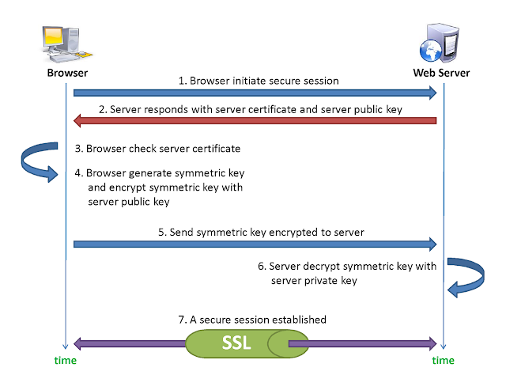

# HTTPS คืออะไร ทำงานอย่างไร

# รู้จักกับ HTTP ก่อน

HTTP ย่อมาจาก Hypertext Transfer Protocol เป็นโปรโตคอล (Protocol) สื่อสารที่ทำงานอยู่ในระดับ Application Layer บนโปรโตคอล TCP/IP  มีรูปแบบดังนี้

1. เป็นโปรโตคอลหลักที่ใช้ในการแลกเปลี่ยนข้อมูล (HTML) กันระหว่าง Web Server และ Web Client (Browser)
2. ใช้ URL (Uniform Resoure Locator) ในการเข้าถึงเว็ปไซต์ (Web Site)  ซึ่งจะขึ้นต้นด้วย http:// ตามด้วยชื่อของเว็ปไซต์  
3. ทำงานที่พอร์ต (port) `80` (มาตรฐาน ) 
4. ส่งข้อมูลเป็นแบบ Clear text คือ `ไม่มี`การเข้ารหัสข้อมูลในระหว่างการส่ง (None-Encryption) จึงสามารถถูกดักจับได้ และอ่านข้อมูลนั้นรู้เรื่อง   

# แล้ว HTTPS คืออะไร ?

HTTPS ย่อมาจาก Hypertext Transfer Protocol Secure หรือ Hypertext Transfer Protocol Over SSL (Secure Socket Layer) เป็นการทำงานเหมือนกับ HTTP ธรรมดาแต่ทำอยู่บน SSL เพื่อให้เกิดความปลอดภัยในการส่งข้อมูลมากยิ่งขึ้น  มีรูปแบบดังนี้

1.  การใช้งาน URL จะเข้าต้นด้วย `https`://  ตามด้วยชื่อของเว็ปไซต์  
2. ทำงานที่พอร์ต (port) `443` (มาตรฐาน)
3. ส่งข้อมูลเป็นแบบ Cipher text คือ มีการเข้ารหัสข้อมูลในระหว่างการส่ง (Encryption) สามารถถูกดักจับได้  แต่อ่านข้อมูลนั้นไม่รู้เรื่อง 
4. มีการทำ Authentication เพื่อตรวจสอบยืนยันระบุตัวตน

ที่บอกว่า HTTPS คือ HTTP ที่ทำงานอยู่บน SSL แล้ว SSL คืออะไร ?

# SSL (Secure Socket Layer)

### ความหมาย

SSL ย่อมาจาก Secure Socket Layer เป็นโปรโตคอลในการเพิ่มการรักษาความปลอดภัยในการรับส่งข้อมูลบนระบบเครือข่าย

### วัตถุประสงค์ของ SSL

1. เพื่อรักษาความลับของข้อมูล (Confidentiality) เพื่อให้การส่งข้อมูลมีความปลอดภัยมากยิ่งขึ้น
2. เพื่อให้เกิดความคงสภาพของข้อมูล (Integrity) คือ ข้อมูลต้นฉบับต้องไม่ถูกแก้ไขเปลี่ยนแปลง 
3. เพื่อให้การใช้งานระบบเครือข่าย (Network) นั้น ทำงานได้ตามปกติและเต็มประสิทธิภาพของการใช้งาน (Availability)

### การทำงานของ HTTPS หรือ HTTP Over SSL

1. Browser เริ่มต้นเพื่อใช้งาน HTTPS (สร้าง Secure Session) โดยการส่งคำร้องขอ (พิมพ์ URL https:// XXX.com) ไปยัง Web Server
2. Web Server ตอบกลับด้วย [Certificate](/blog/what-is-x509-certificate/?series=pki)  ซึ่งเป็นใบรับรองว่า Server นั้นเป็น Server จริง   และ Public Key ของ Server เพื่อเอาไว้เข้ารหัส Symmetric Key ที่ต้องส่งไปให้ Server
3. Browser ทำการตรวจสอบ Certificate ที่ได้จาก Web Server ว่าจริงหรือไม่
4. เมื่อตรวจสอบแล้ว  จะทำการสร้าง Symmetric Key ขึ้นมาหนึ่งชุด ไว้สำหรับการเข้ารหัส Data ที่ต้องส่งระหว่าง Client กับ Server
5. Browser ทำการเข้ารหัส Symmetric Key นั้น ด้วย Public Key (ที่ Server ส่งมาให้ในข้อที่ 2 ) ของ Web Server จากนั้นส่ง Symmetric Key ที่ได้เข้ารหัสแล้ว (Symmetric Key Encrypted) กลับไปยัง Web Server
6. Web Server ทำการถอดรหัส Symmetric Key นั้นด้วย Private Key ของ Web Server เอง
7. เริ่มกระบวนการเชื่อมต่อแบบ SSL  

หลังจากนี้การส่งข้อมูลจะเป็นการเข้ารหัสโดยใช้ Symmetric Key  ที่ทั้ง Client และ Server มี (ที่ Browser ส่งไปให้)

# เพิ่มเติม

**Certificate** ที่พูดถึงในบทความนี้คือ **X.509 Certificate** ซึ่งเป็น Digital Certificate รูปแบบหนึ่ง  สามารถอ่านและทำความเข้าใจเพิ่มเติมได้ที่ [ทำความรู้จักกับ X.509 Certificate พื้นฐานสำหรับการทำ Https และ Security อื่น ๆ](/blog/what-is-x509-certificate/?series=pki)

# หมายเหตุ

เป็นบทความที่ถูกย้ายมาจาก [https://na5cent.blogspot.com/2012/04/https.html](https://na5cent.blogspot.com/2012/04/https.html) ซึ่งผู้เขียน เขียนไว้เมื่อ วันเสาร์ที่ 7 เมษายน พ.ศ. 2555
