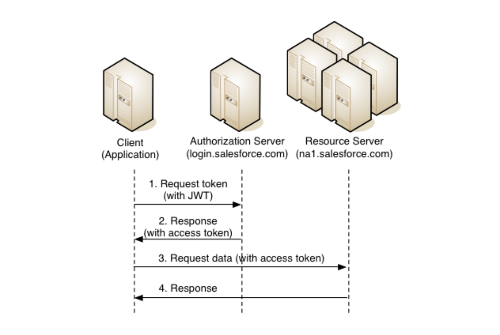

# ทำความรู้จักกับ JWT (Json Web Token)



ก่อนที่เราจะไปทำความรู้จักกับ JWT เรามาทำความรู้จักกับ 2 คำนี้ก่อนครับ
- Stateful
- Sateless

`Stateful` หมายถึง การจดจำสถานะ (state)  
`Stateless`  หมายถึง การไม่จดจำสถานะ (state)  

# ปัญหา

HTTP (HyperText Transfer Protocol) เป็น Protocol ที่ใช้ในการสื่อสาร / รับส่งข้อมูลทางด้าน Web Application การทำงานของ HTTP จะเป็นการสร้างแล้วส่ง Request ไปยัง Web Server เพื่อร้องขอ Resources
เมื่อ Web Server ได้รับ Request  ก็จะทำการตรวจสอบสิทธิ์ว่า Request นั้นมีสิทธิ์เข้าถึง Resource ดังกล่าวหรือไม่ หากมีสิทธิ์ Web Server ก็จะจัดสรร Resource ให้ตามที่ Request นั้นร้องขอมา
  
HTTP เป็น Protocol ที่ไม่มีการจดจำสถานะการทำงาน  ทุกครั้งที่ Request ไป จะเป็นการสร้าง Request ขึ้นมาใหม่  โดยไม่มีการจัดเก็บ / จดจำข้อมูลใดๆ ไว้ที่ Web Server  ทุก Request ที่ส่งไป จะถูก Web Server ตรวจสอบสิทธิ์ใหม่ทุกครั้ง  เราเรียกการทำงานของ HTTP ว่าเป็นการทำงานแบบ Stateless  
  
จากปัญหาดังกล่าว  เขาจึงได้คิดค้นวิธีการที่ทำให้ Web Server สามารถจดจำสถานะการทำงาน  หรือสถานะของ Client ได้โดยไม่จำเป็นต้องตรวจสอบสิทธิ์ใหม่ทุกครั้ง  วิธีการที่นำมาใช้เรียกว่า Session

Session เป็นวิธีการที่ Web Server ใช้สำหรับจดจำสถานะการทำงาน / ระบุตัวตนของ Client
เมื่อ Client ทำการ Log in เข้าสู่ระบบ Web Server จะสร้างรหัสชุดนึงขึ้นมา เรียกว่า Session Id  แล้วทำการส่ง Session Id กลับไปพร้อมกับ Request ของ Client
  
Client จะเก็บ Session Id ไว้ในรูปแบบที่เรียกว่า Cookies  เมื่อมีการส่ง HTTP Request ไปยัง Web Server อีกครั้ง  Client จะต้องส่ง Session Id กลับไปให้ Web Server ด้วย  เพื่อบอกกับ Web Server ว่า ตนเคย Log in เข้ามาในระบบแล้ว  (ด้วย Session Id ดังกล่าว) จะได้ไม่ต้องตรวจสอบสิทธิ์ใหม่อีกครั้ง  เราเรียกการทำงานแบบนี้ว่า Stateful
  
ปัจจุบัน  มี  Application ที่ทำงานทั้งที่เป็นแบบ Stateful และ Stateless
- Stateful คือ Application ที่ใช้ Session
- Stateless คือ Application ที่ไม่ใช้ Session  แต่จะใช้อย่างอื่นแทน  ที่เรียกว่า Token

# Token

เป็นรหัสชุดนึงที่เอามาแทน Session Id เอาไว้ระบุตัวตนของ Client  ว่า Client นั้นเป็นใคร
ไม่มีรูปแบบตายตัว  แล้วแต่กรรมวิธีที่นำมาใช้  มีทั้งที่เป็น Standard และบางคนก็คิดวิธีการสร้าง Token ขึ้นมาใช้งานเอง  แต่สำหรับบทความนี้  เราใช้ Standard Token ที่มีชื่อว่า JWT (Json Web Token) คือเอา Json data ของผู้ใช้มาสร้างเป็นรหัส (Token)

# ข้อดีข้อเสีย ของ Stateful และ Stateless

### Stateful

ข้อดี
- ง่าย  สะดวก เพราะสามารถจดจำสถานะของ Client ได้  โดยที่เราไม่ต้องตรวจสอบสิทธิ์ใหม่ทุกครั้ง
- เร็ว  เพราะไม่ต้องตรวจสอบสิทธิ์  และยังสามารถเก็บข้อมูลอื่นๆ ของ Client ไว้บน Memory ได้  โดยที่เราไม่ต้อง query ข้อมูลจาก Database ใหม่ทุกครั้ง

ข้อเสีย
- ไม่เหมาะกับระบบที่ต้องการขยายขนาด (scale) ในอนาคต  เพราะ Session มีไว้ใช้เฉพาะภายใน Cluster นั้นๆ เท่านั้น  ไม่สามารถเอาไปใช้กับระบบอื่นได้   และ Session Id ก็มีขนาดความยาวจำกัด นั่นหมายความว่า รองรับ Client ได้จำนวนจำกัด
- สิ้นเปลือง Memory ถ้าโปรแกรมเมอร์เขียนโปรแกรม ไม่ดี  อาจใช้ Session นั้นในการเก็บข้อมูล
- ไม่เหมาะกับการใช้งานร่วมกับ Native Mobile  เพราะ Native Mobile ไม่ใช่ browser จึงไม่ค่อยเหมาะกับการทำงานร่วมกับ Cookies
- การเขียนโปรแกรมมีความซ้ำซ้อน  รวม Service ไม่ได้ ในกรณีที่โปรเจ็คเรามีทั้ง Web App และ Mobile App เพราะเราไม่สามารถแยก Front end (html, css, js) ที่เป็นส่วนแสดงผล ออกจาก Back end (java, php, node.js, asp) ที่เป็น Business Logic ได้  
- เรื่อง Session Expire หรือ Session หมดอายุ ซึ่งเราจะต้องทำการ Log in ใหม่ทุกครั้ง 
- ฯลฯ

### Stateless

ข้อดี
- ในเรื่องของการขยายระบบ  เพราะมันไม่ต้องใช้ Session  ทำให้เราไม่ต้องทำ Cluster  ก็สามารถทำระบบ HA (High Ability System) ได้  ถึงแม้ว่า Server เครื่องใดเครื่องหนึ่งจะ down ไปและไม่ได้อยู่ใน Cluster เดียวกัน  เราก็สามารถใช้งาน Application นั้นได้ตามปกติ  โดยไม่ต้อง Log in ใหม่
- สามารถเขียน Front end และ Back end แยกออกจากกันได้
- ใช้ได้กับ Application ทุกรูปแบบไม่ว่าจะเป็น Web Desktop Mobile เพราะเราไม่ใช้ Session
- ฯลฯ

ข้อเสีย
- ต้องตรวจสอบสิทธิ์ทุกครั้ง  ทำให้ทำงานช้ากว่าแบบ Stateful
- เขียนโปรแกรม + วางระบบยุ่งยากกว่า

# JWT (Json Web Token)


เป็น Standard Token รูปแบบหนึ่งที่ใช้ Json data ของผู้ใช้มาสร้างเป็นรหัส Token หน้าตาจะประมาณนี้  

jwt
```js
eyJ0eXAiOiJKV1QiLCJhbGciOiJIUzUxMiJ9.eyJuYW1lIjoiaml0dGFnb3JucCIsImlhdCI6MTQy
MjgxMjY1MH0.0kTwVT481Kdx3j56H3GLpoBL3u93OlK5t4ht-hUQrNE1VquJTxXJBUez7oB75I7zo
xCh_U_h6OuvgO_UBySbvA
```

โครงสร้างจะเป็นรหัสรูปแบบ **XXXX**.**YYYY**.**ZZZZ**  (คั่นแต่ละส่วนด้วยเครื่องหมายจุด)

- XXXX = base64_encode(header)
- YYYY = base64_encode(payload)
- ZZZZ = base64_encode(sign(payload, header.algorithm, SECRET_KEY))

# โครงสร้าง JWT

`XXXX`  หรือ Header เป็น Json data ที่ถูกเข้ารหัส (encode) ด้วย Base64  มีรูปแบบดังนี้

```js
var header = {
    "typ":"JWT",
    "alg":"HS512"
};
 
var XXXX = base64_encode(header);
```

- type (require) คือ กรรมวิธีที่ใช้สร้าง token ซึ่งในที่นี้คือ jwt
- alg (require) คือ Algorithm ที่ใช้ในการเข้ารหัส/ถอดรหัส Signature (เดี๋ยวอธิบาย)  ในที่นี้คือ HS512

`YYYY` หรือ Payload (ใน spec เรียกว่า claim) เป็น Json data ของผู้ใช้ + Json data เฉพาะที่เอาไว้กำหนดพฤติกรรมของ token  แล้วเข้ารหัส (encode) ด้วย Base64  มีรูปแบบดังนี้

```js
var payload = {
    "iss": "f6fdaad2-f989-41f3-aece-8d7773bbbf54",
    "iat": 1300819370,
    "exp": 1300819380
};
 
var YYYY = base64_encode(payload);
```

- iss (Issuer)  เป็น unique id ที่เอาไว้ระบุตัว client
- iat (Issued-at time) เป็นเวลาสร้าง (create time) ของ token
- exp (Expiration time) เป็นเวลาหมดอายุของ token

`ZZZZ` หรือ Signature  เป็นการเอา Payload มาเข้ารหัส (Encrypt / Sign) ด้วย Algorithm (alg) ที่ระบุไว้ใน Header +  Secret Key  (Secret Key เราจะไม่เปิดเผยให้ใครรู้)

```js
var signature = sign(
    payload, 
    header.alg, 
    Secret_Key
);
 
var ZZZZ = base64_encode(signature);
```

# การทำงานของ JWT

ถ้าเรารู้จัก [Digital Signature](https://na5cent.blogspot.com/2012/04/digital-signature-methodology.html)  ผมมองว่า JWT ก็จะคล้ายๆ กันครับ คือใช้ signature ในการ verify token  ว่าถูกต้องหรือไม่
  
สมมติ  เรามีข้อมูลเป็น
```js
var payload = {
    /* data */
    "user_id" : 1234, 
    "name" : "jittagornp" ,
    "role" : ["ADMIN"], 
      
    /* token behavior */
    "iss": "f6fdaad2-f989-41f3-aece-8d7773bbbf54",
    "iat": 1300819370,
    "exp": 1300819380
};
```
และมี header เป็น
```js
var header = { 
    "type" : "JWT", 
    "alg" : "HS512"
};
```
เมื่อเราทำการ Log in เข้าสู่ระบบ
Web Server จะ Generate (Sign) JWT ให้  โดยนำเอาข้อมูลของ User มา gen  ตามโครงสร้างของ JWT ดังนี้
```js
var XXXX = base64_encode(header);
var YYYY = base64_encode(payload);
var signature = sign(payload, header.alg, SECRET_KEY);
var ZZZZ = base64_encode(signature);
 
var token = XXXX + "." + YYYY + "." + ZZZZ; 
```
การ gen Signature ขึ้นอยู่กับว่าเราเลือกใช้ Algorithm ใด บวกกับใช้ Secret Key ใดในการ Encrypt / Sign
  
จากนั้นส่ง token นี้กลับไปหา Client เพื่อให้ Client เก็บไว้  ซึ่งอาจเก็บไว้ในรูปแบบของ Local Storage หรือ Cookies

เมื่อ Client ทำการ Request มายัง Server อีกครั้ง  เพื่อร้องขอ Resources
Client จะต้องส่ง token นั้นกลับมาด้วย  เพื่อให้ Server ทำการ verify  ดังนี้

```js
var token = "XXXX.YYYY.ZZZZ";
 
var split = token.split(".");
 
var header = base64_decode(split[0]);
var payload = base64_decode(split[1]);
var signature = base64_decode(split[2]);  
 
varify(payload, header.alg, signature, SECRET_KEY);
```
Server จะทำการ verify token ด้วย payload + algorithm ใน header + signature ที่ถอดมาได้ + SECRET_KEY ตัวเดิมที่ใช้ในการ Sign
  
ถ้า verify ผ่าน ก็แสดงว่า token นั้นถูกต้อง Client สามารถเข้าถึง Resources ของระบบได้

แต่ถ้าไม่ผ่าน  อาจจะมาจาก มีการแก้ไขข้อมูล (payload) หรือ Signature ระหว่างทาง
ก็จะทำให้ไม่สามารถเข้าถึง Resources นั้นๆ ได้    

การ verify  เราสามารถเอา token นี้ไป verify ที่ Server ใดๆ ก็ได้ **ถ้า Server นั้นใช้ Secret Key เดียวกัน**
นี่จึงเป็นข้อได้เปรียบของระบบที่ใช้ token ในการ identify user
  
JWT จริงๆ เป็นเพียงแค่ **spec** ที่ออกมา  เพื่อให้คนอื่นนำไป Implement ใช้  ซึ่งก็มีเครื่องมือสำเร็จรูปเยอะแยะมามาย  ที่ให้เราสามารถนำไปใช้ได้เลย  เพราะคนอื่นทำไว้แล้ว  ลองค้นหาเครื่องมือที่เหมาะสม  สำหรับภาษาที่ตัวเองใช้  จากหน้านี้ดูครับ  [http://jwt.io/](http://jwt.io/) มีทั้ง Java, PHP, .Net, Javascript, Ruby, Python ....  
  
สำหรับผมเขียน Java เลยใช้เครื่องมือตัวนี้ในการ Sign และ Verify Token ครับ
[https://github.com/auth0/java-jwt ](https://github.com/auth0/java-jwt ) 
  
Maven dependency
```xml
...
<dependency>
    <groupId>com.auth0</groupId>
    <artifactId>java-jwt</artifactId>
    <version>2.0.1</version>
</dependency>
...
```
Test
```java
package me.jittagornp.learning.jwt;
 
import com.auth0.jwt.Algorithm;
import com.auth0.jwt.JWTSigner;
import com.auth0.jwt.JWTVerifier;
import java.util.HashMap;
import java.util.Map;
import org.testng.Assert;
import org.testng.annotations.Test;
 
/**
 * @author jittagornp
 */
public class JWTTest {
 
    @Test
    public void test() throws Exception {
        JWTSigner signer = new JWTSigner("MY_SECRET_KEY");
        JWTVerifier verifier = new JWTVerifier("MY_SECRET_KEY");
         
        Map<String, Object> payload = new HashMap<>();
        payload.put("name", "jittagornp");
        String token = signer.sign(payload, new JWTSigner.Options()
                .setAlgorithm(Algorithm.HS512));
 
        Map<String, Object> verify = verifier.verify(token);
        Assert.assertEquals(payload, verify);
    }
 
}
```

หวังว่าจะมีประโยชน์สำหรับ Developer ทุกคนน่ะครับ :)

# Reference 

- [http://jwt.io/](http://jwt.io/)
- [https://auth0.com/docs/server-apis/java](https://auth0.com/docs/server-apis/java)
- [http://angular-tips.com/blog/2014/05/json-web-tokens-introduction/](http://angular-tips.com/blog/2014/05/json-web-tokens-introduction/)
- [https://auth0.com/blog/2014/01/07/angularjs-authentication-with-cookies-vs-token/](https://auth0.com/blog/2014/01/07/angularjs-authentication-with-cookies-vs-token/)
- [https://developer.atlassian.com/static/connect/docs/concepts/understanding-jwt.html](https://developer.atlassian.com/static/connect/docs/concepts/understanding-jwt.html)

# หมายเหตุ
เป็นบทความที่ถูกย้ายมาจาก [https://na5cent.blogspot.com/2015/02/jwt-json-web-token.html](https://na5cent.blogspot.com/2015/02/jwt-json-web-token.html) ซึ่งผู้เขียน เขียนไว้เมื่อ วันอาทิตย์ที่ 1 กุมภาพันธ์ พ.ศ. 2558