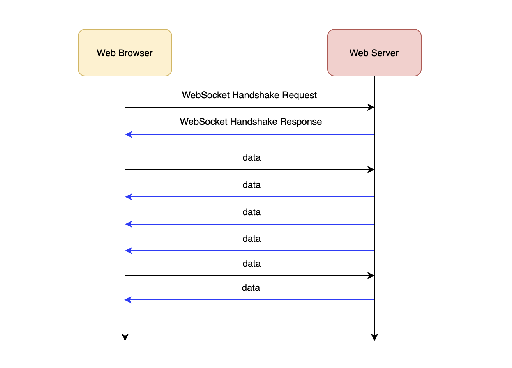
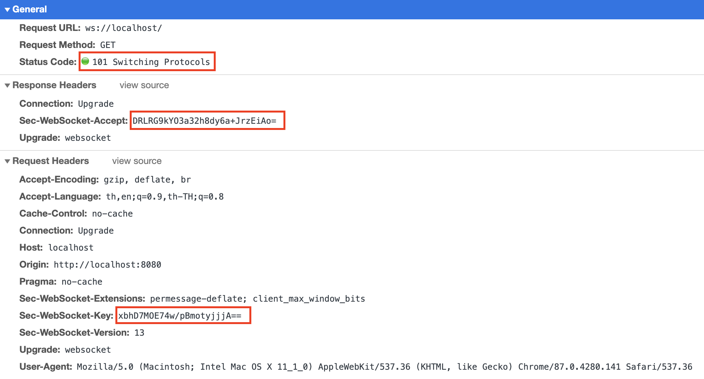
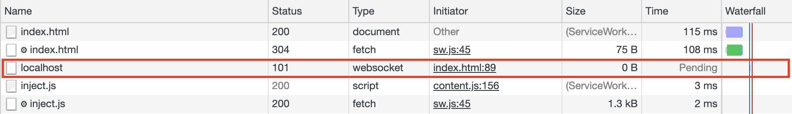
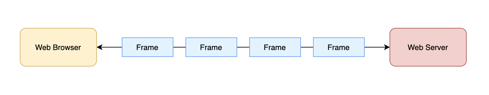
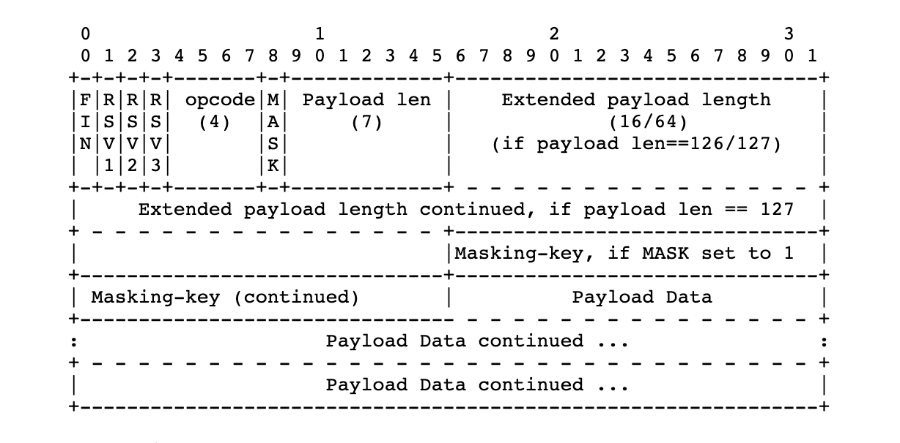
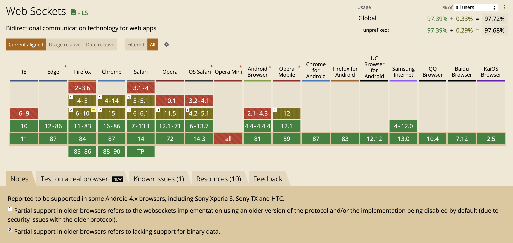

# WebSocket คืออะไร ทำงานยังไง (อธิบายแบบละเอียด)


# WebSocket

- เป็น `Protocol` ตัวนึง ***** (ขอย้ำว่ามันคือ Protocol) 
- ทำงานอยู่บน Socket ที่เป็น Connection แบบ TCP (Transmission Control Protocol) 
- รองรับ Full Duplex หรือ Bidirectional Communication (การสื่อสารแบบสองทิศทาง หมายถึง เป็นผู้รับและผู้ส่งได้ในเวลาเดียวกัน)
- เป็นมาตรฐานที่ถูกกำหนดโดย IETF (Internet Engineering Task Force) รหัส [RFC6455 (The WebSocket Protocol)](https://tools.ietf.org/html/rfc6455) 
- สร้างขึ้นในปี 2011 (ประมาณ 10 ปีที่แล้ว ณ ตอนที่เขียนบทความนี้)
- นิยมนำมาใช้กับระบบที่ต้องการการอัพเดทข้อมูลแบบ Realtime เช่น ระบบ Chat, ระบบ Notification, ระบบหุ้น, Game, Developer Tools และอื่น ๆ


**หมายเหตุ**

- Protocol คือ ข้อกำหนด หรือข้อตกลง ในการสื่อสารกันระหว่างคอมพิวเตอร์
- TCP (Transmission Control Protocol) เป็น Protocol ควบคุมการรับส่งข้อมูลระหว่าง Network เพื่อใช้แลกเปลี่ยนข้อมูลระหว่างกัน โดยจะรับประกันความถูกต้อง และลำดับของข้อมูลที่ถูกส่ง

# ต่างจาก Ajax ยังไง 

ในเมื่อมันก็ทำ Realtime ได้เหมือนกัน

### Ajax (Asynchronous JavaScript And XML)

เป็นเทคนิคนึงของ JavaScript ที่นิยมนำมาใช้ในการดึงข้อมูลจาก Web Server แล้วนำมาอัพเดทหน้าจอ โดยไม่ทำให้หน้าจอเกิดการ Refresh ซึ่งเบื้องหลังของ Ajax นั้นเป็น Http (Hypertext Transfer Protocol) ธรรมดา ๆ


จากภาพ 

1. ถ้า Web Browser (Client) ต้องการข้อมูลจาก Web Server 
2. Web Browser จะต้องทำการร้องขอเป็น Http Request (แบบ Ajax) ไปยัง Web Server 
3. จากนั้น Web Server จึงตอบกลับเป็น Http Response ที่มีข้อมูลแนบกลับมาด้วย 
4. ถ้า Web Browser ต้องการข้อมูลใหม่ จะต้องทำการร้องขอไปยัง Web Server อีกครั้ง ตามข้อ 2 - 3 วนแบบนี้ไปเรื่อย ๆ 

**ข้อจำกัดของ Http (Version 1.1)**

คือ Web Server ไม่สามารถ Push ข้อมูล (ส่งข้อมูลกลับ) มายัง Web Browser (Client) ได้เอง โดยไม่ต้องทำการร้องขอ (ยกเว้น Http 2)

**หมายเหตุ**

ถ้าเราต้องการใช้ Ajax ทำ Realtime Web Application เราจะต้องเขียน JavaScript ให้ไปดึงข้อมูลจาก Web Server มาอัพเดทข้อมูลที่ฝั่งหน้าจอเป็นระยะ ๆ ทุก ๆ x วินาที เราเรียกเทคนิคนี้ว่า การทำ `Polling` 
  
ซึ่งมีจุดด้อยและข้อที่ต้องพึงระวัง เช่น

- ความหน่วง คือ ไม่ Realtime เท่าที่ควร ทั้งนี้ขึ้นอยู่กับว่า ทำการ Polling ถี่แค่ไหน ยิ่งถี่ ยิ่ง (เข้าใกล้) Realtime แต่ก็ต้องแลกมากับปัญหาต่อไป
- คอขวด ที่อาจจะเกิดขึ้นที่ Server หรือ Database เนื่องจากมีการ Request ต่อเนื่องเป็นจำนวนมาก ยิ่งระบบมีผู้เข้าใช้งานพร้อมกันมาก ๆ ก็จะยิ่งเห็นผลชันเจน 
- ปริมาณการใช้ Network Bandwidth (มหาศาล) เพราะขนาด Package ที่ถูกส่งไปทุกรอบ ซึ่งบางครั้งอาจจะไม่ได้ข้อมูลอะไรกลับมาเลย
- จำนวน Request ที่อาจจะถูก Limit ไว้ สำหรับการใช้ Service Cloud บางประเภท 
- อื่น ๆ

เค้าก็เลยได้ทำการ Upgrade กรรมวิธี Polling ให้มันดียิ่งขึ้น เรียกว่า การทำ `Long Polling` แต่ขอไม่กล่าวถึงน่ะ!

---

### WebSocket



จากภาพ 

1. ถ้า Web Browser (Client) ต้องการข้อมูลจาก Web Server 
2. Web Browser จะต้องทำการร้องขอเป็น WebSocket Handshake Request ไปยัง Web Server 
3. Web Server ตอบกลับเป็น WebSocket Handshake Response (ไม่มีข้อมูลกลับมาด้วย)
4. จากนั้น จึงเริ่มกระบวนการแลกเปลี่ยนข้อมูลกันระหว่าง Web Browser และ Web Server 
5. สังเกตว่า การรับส่งข้อมูล สามารถทำได้ทั้ง 2 ทิศทาง และไม่ต้องรอให้ฝ่ายใดฝ่ายหนึ่ง ทำการร้องขอข้อมูลมาก่อน 
6. แต่ละฝ่าย สามารถส่ง (Push) ข้อมูลไปมาหากันได้เลย
7. วนแบบนี้ไปเรื่อย ๆ (ตั้งแต่ข้อ 4-6) จนกว่าจะยกเลิกการเชื่อมต่อ (Close Connection)

**หมายเหตุ**  
  
- **Ajax (Short) Polling** : หลังจากที่ Client ได้ Response กลับมาแล้ว Client จะทำการยกเลิกการเชื่อมต่อทันที   
- **WebSocket** : Client จะไม่มีการยกเลิกการเชื่อมต่อ การเชื่อมต่อจะถูกเปิดค้างไว้ จนกว่าการสื่อสารจะเสร็จสมบูรณ์ 

#  การเชื่อมต่อ


การเชื่อมต่อไปยัง WebSocket จะใช้ URI Scheme เป็น `ws` และ `wss`  
จะคล้าย ๆ กับ `http` และ `https`  

- `ws` เป็นการเชื่อมต่อแบบ Non-secure
- `wss` เป็นการเชื่อมต่อแบบ Secure คือ เป็น WebSocket ที่ทำงานอยู่บน TLS (Transport Layer Security)

**หมายเหตุ**

- TLS (Transport Layer Security) เป็นเทคโนโลยีการเข้ารหัสข้อมูล เพื่อเพิ่มความปลอดภัยในการสื่อสารหรือการส่งข้อมูผ่าน Network

ตัวอย่างการเชื่อมต่อ

```sh
ws://localhost/chat 

หรือ

wss://mydomain.com/chat
```

สามารถมี Query string ต่อท้าย path ได้ เช่น 

```sh
wss://mydomain.com/chat?groupId=1234
```

# WebSocket Handshake 


*[Image from https://www.morganmckinley.com/ie/article/let%E2%80%99s-shake-it-what%E2%80%99s-value-hand-shake](https://www.morganmckinley.com/ie/article/let%E2%80%99s-shake-it-what%E2%80%99s-value-hand-shake)*

เมื่อทำการ Connect แล้ว   
WebSocket จะส่ง **Request แรก** เป็น Http ไปยัง WebSocket Server 
  
Http ใช้ในการเริ่มต้น หรือ Handshake เพื่อ Upgrade Protocol จาก Http ไปเป็น WebSocket จากนั้นจึงเริ่มกระบวนการสื่อสารด้วย WebSocket อย่างเต็มรูปแบบ จนกว่าจะยกเลิกการเชื่อมต่อ (Close Connection)  

จากภาพนี้ 


ปรับมาเป็นภาพนี้


การ Handshake มี 2 ขั้นตอน คือ

1. Client ทำการส่ง Handshake Request มาที่ WebSocket Server
2. WebSocket Server ตรวจสอบข้อมูล และตอบ Handshake Response กลับไป

ถ้าการ Handshake ถูกต้อง สมบูรณ์ จึงค่อยเริ่มแลกเปลี่ยนข้อมูลกัน

### Client Handshake Request

เป็น Http Request ที่มีหน้าตาประมาณนี้ 

```sh
GET /chat HTTP/1.1
Host: localhost:8080
Upgrade: websocket
Connection: Upgrade
Sec-WebSocket-Key: dGhlIHNhbXBsZSBub25jZQ==
Sec-WebSocket-Version: 13
...
...
```

**ข้อกำหนด**
- ต้องเป็น Http `GET` แล้วตามด้วย Path ที่เปิด WebSocket ฝั่ง Server ไว้ 
- มีการแนบ Http Header ดังนี้ แนบไปด้วย (เป็นอย่างน้อย)   
  - `Upgrade: websocket` เป็น Header ที่ใช้บอกว่า ต้องการให้ Upgrade Protocol จาก Http ไปเป็น WebSocket 
  - `Connection: Upgrade` เป็นการ Upgrade Connection ไปเป็นแบบ `keep-alive` คือ จะไม่ทำการยกเลิกหรือปิด Connection จนกว่าจะมีสัญญาณ (Signal) ให้ยกเลิก
  - `Sec-WebSocket-Key : dGhlIHNhbXBsZSBub25jZQ==` เป็นค่า Random แบบใช้ครั้งเดียว (One-Time random) ขนาด 16 Bytes แล้ว encode เป็น Base64 ฝั่ง Client เป็นคน Generate ขึ้นมา เพื่อเอามาใช้สำหรับเปิด Handshake
  - `Sec-WebSocket-Version: 13` เป็น Version ปัจจุบันของ WebSocket (ซึ่งเป็น version 13)  

**หมายเหตุ**

- สามารถแนบ Http Header อื่น ๆ เพิ่มเติมไปด้วย ได้ปกติ 
- เรื่อง Sec-WebSocket-Key สามารถดูเพิ่มเติมได้ที่ RFC6455 หัวข้อ 
    - [1.3.  Opening Handshake](https://tools.ietf.org/html/rfc6455#section-1.3)
    - [4.2.1.  Reading the Client's Opening Handshake](https://tools.ietf.org/html/rfc6455#section-4.2.1)

---

### Server Handshake Response 

 เป็น Http Response ที่มีหน้าตาประมาณนี้ 

```sh
HTTP/1.1 101 Switching Protocols
Upgrade: websocket
Connection: Upgrade
Sec-WebSocket-Accept: s3pPLMBiTxaQ9kYGzzhZRbK+xOo=
...
...
```

โดย Server จะ Response Status เป็น Http `101 Switching Protocols`    
เพื่อให้ Client ทำการ Upgrade Connection และ Protocol ไปเป็น WebSocket 
  
ถ้าการ Handshake สำเร็จ Web Browser (Client) จะแสดงผลเป็นแบบนี้ 





สังเกตว่าใน Column Time `Status` จะเป็น Pending (รอข้อมูล ไม่ตัดการเชื่อมต่อ)
  
การส่ง Handshake Request มาที่ Server     
Server จะอ่านข้อมูลและทำการ check Headers ต่าง ๆ โดย Headers สำคัญ ๆ ที่จะนำมา check คือ Header ที่ขึ้นต้นด้วย `Sec-WebSocket-*` เช่น

- `Sec-WebSocket-Version` ต้องมีค่าเท่ากับ 13 
- `Sec-WebSocket-Key` เพื่อนำไป Build Handshake Response ต่อไป
- `Sec-WebSocket-*` อื่น ๆ ถ้ามี 

แล้วตอบกลับด้วย `Sec-WebSocket-Accept` 

**Sec-WebSocket-Accept**

ได้มาจาก

```js
var secWebSocketKey = ...;

var concatKey = secWebSocketKey + RFC6455_CONSTANT;
var hashed = sha1.hash(concatKey);
var secWebSocketAccept = base64.encode(hashed);
```
อธิบาย 

1. นำ `Sec-WebSocket-Key` มาต่อกับ `RFC6455_CONSTANT`
2. จากนั้นนำมา hash ด้วย `SHA1` algorithm 
3. แล้วนำไป encode ด้วย Base64 ก็จะได้เป็น `Sec-WebSocket-Accept`

**RFC6455_CONSTANT** 

เป็นค่าเฉพาะที่ RFC6455 กำหนดขึ้นมา มีค่าเท่ากับ `258EAFA5-E914-47DA-95CA-C5AB0DC85B1` 
ให้ดูที่ RFC6455 หัวข้อ [1.3. Opening Handshake](https://tools.ietf.org/html/rfc6455#section-1.3) 

# การแลกเปลี่ยนข้อมูล

หลังจากที่ทำการ Handshake กันเสร็จเรียบร้อยแล้ว ก็จะเริ่มกระบวนการแปลกเปลี่ยนข้อมูลกัน ซึ่งข้อมูลที่ส่งไปมาระหว่างกัน เราจะเรียกมันว่า `Frame` 
   
ในบางครั้งการส่งข้อมูล 1 ชุด (ที่มีขนาดค่อนข้างใหญ่) อาจจะไม่ได้จบที่ Frame เดียว แต่จะเป็นการแบ่งข้อมูลที่มีอยู่ออกเป็นหลาย ๆ Frame แล้วส่งต่อเนื่องกันไปเรื่อย ๆ แบบนี้ 



### Frame ข้อมูล

โครงสร้างของ Frame ข้อมูล ถูกกำหนดไว้ใน RFC6455 หัวข้อ [5.2. Base Framing Protocol](https://tools.ietf.org/html/rfc6455#section-5.2) มีโครงสร้างดังนี้



Frame ข้อมูล เป็นการนำ Byte ข้อมูล (8 bits) มาเรียงต่อ ๆ กัน ซึ่งมีทั้ง 
- Byte ข้อมูล ที่เป็นตัวข้อมูลจริง ๆ เราจะเรียกมันว่า Payload Data และ 
- Byte ข้อมูลอื่น ๆ ที่เป็นข้อมูลประกอบ เราจะเรียกมันว่า Header  

**คำอธิบาย**

โครงสร้าง Frame ข้อมูล 

- `FIN` : (1 bit) เป็น bit ที่เอาไว้บอกว่า Frame ข้อมูลชุดนี้ เป็น Frame สุดท้ายหรือไม่
- `RSV1, RSV2, RSV3` : (อย่างละ 1 bit) เป็น bit ที่เอาไว้อธิบายเกี่ยวกับ Extensions 
- `Opcode` (4 bits) เอาไว้ระบุประเภท (Type) ของ Frame ข้อมูล ดังนี้
  - *0000* ถ้าเป็น 0 จะเป็น Continuation Frame
  - *0001* ถ้าเป็น 1 จะเป็น Text Frame
  - *0010* ถ้าเป็น 2 จะเป็น Binary Frame 
  - *0011 - 0111* (จองไว้ใช้ในอนาคต)
  - *1000* ถ้าเป็น 8 จะเป็น Connection Close Frame 
  - *1001* ถ้าเป็น 9 จะเป็น Ping Frame
  - *1010* ถ้าเป็น 10 จะเป็น Pong Frame 
  - *1011 - 1111* (จองไว้ใช้ในอนาคต)
- `Mask` : (1 bit) เป็น bit ที่เอาไว้บอกว่า จะให้ทำ Masking หรือ encode Payload Data หรือไม่
- `Payload Length`:  (7 bits, 7 + 16 bits, หรือ 7 + 64 bits) เป็นส่วนที่เอาไว้บอกว่า Payload Data มีขนาดทั้งหมดกี่ Bytes ซึ่งถ้า Payload Data มีขนาด 
  - *0 - 125 Bytes* ให้ใช้เฉพาะ 7 bits แรกเท่านั้น   
  - *126 - 65,535 Bytes* ให้ใช้ 7 + 16 bits โดยให้ Set 7 bit แรกเป็น 126 (Fixed ค่าไปเลย) และให้อีก 16 bits ต่อมา (Extended) เก็บข้อมูล Payload Length จริง ๆ 
  - *มากกว่า 65,535 Bytes* ให้ใช้ 7 + 64 bits ในการเก็บข้อมูล Payload Length โดยให้ Set 7 bit แรกเป็น 127 (Fixed ค่าไปเลย) และให้อีก 64 bits ต่อมา (Extended) เก็บข้อมูล Payload Length จริง ๆ
- `Masking-key`: 0 หรือ 4 Bytes ถ้า bit `Mask` ถูก set เป็น 1 จะมีการเก็บ Masking key (Random key) เพิ่มอีก 4 Bytes ซึ่งจะเอาไว้สำหรับ encode Payload Data 
- `Payload Data` คือ Data จริง ๆ ที่ส่งหากัน ซึ่งอาจจะถูก encode ไว้ด้วย Masking key ถ้า bit `Mask` ถูก set เป็น 1

**หมายเหตุ**

Frame ข้อมูลจะถูกแบ่งออกเป็น 2 ประเภทใหญ่ ๆ คือ 
- Control Frame (Opcode == 8 ถึง 15) และ 
- Non-Control Frame (Opcode == 0 ถึง 7) 

### Encode/Decode Payload data 

ถ้า bit `Mask` ถูก set เป็น 1 จะมีการทำ Masking (Encode/Decode) Payload Data เกิดขึ้น โดยใช้การดำเนินการ XOR (ระบบ bit ข้อมูล) ดังนี้  

**Masking** (Pseudocode)

```js
function masking(data, key){
    var output = [];
    for (var i = 0; i < data.length; i++) {
        //XOR
        var masked = data[i] ^ key[i % 4];
        output.push(masked);
    }
    return output;
}
```

การ Encode Payload Data 

```js
var frame = ...;
if (isMask) {
    var key = randomMaskingKey();
    frame.push(key);
    frame.push(masking(payloadData, key));
} else {
    frame.push(payloadData);
}
```

การ Decode Payload Data จาก Frame

```js
var frame = ...;
var payloadData;
if (isMask) {
    var key = getMaskingKey(frame);
    payloadData = masking(frame.remaining(), key);
} else {
    payloadData = frame.remaining();
}
```

**หมายเหตุ**  

การทำ Masking นี้ เราจะเรียกมันว่า `XOR Cipher` ซึ่งจะช่วยป้องกันเกี่ยวกับ

- Proxy Cache 
- Tools ที่ไว้ดักจับ Pattern ข้อมูล 
- ทำให้คาดเดาข้อมูล (ทำ Reverse Engineering) ยาก 

สามารถอ่านรายละเอียดเพิ่มเติมได้จาก 

- [https://www.wikiwand.com/en/XOR_cipher](https://www.wikiwand.com/en/XOR_cipher)

# การยกเลิก/ปิดการเชื่อมต่อ 

การยกเลิกหรือปิดการเชื่อมต่อ จะเกิดขึ้นจากหลาย ๆ กรณี เช่น

- การปิด (Close Connection) แบบปกติ คือ มีการส่ง Connection Close Frame (Opcode == 8) มาสั่งปิด connection 
- WebSocket Server มีปัญหา เช่น เครื่องดับ หรือ Restart 
- Client ขาดการเชื่อมต่อ
- Protocol error
- TLS มีปัญหา
- อื่น ๆ 

ถ้าเป็น Case ที่สามารถ Handle ได้  
เวลา Close Connection จะมีการส่ง Close Connection Frame ที่มี Status code ไปบอกอีกฝ่ายด้วย เช่น

- *1000* เป็น Normal close - Close connection แบบปกติ
- *1001* เป็น Going away - WebSocket Server มีปัญหา หรือ Client ขาดการเชื่อมต่อ
- *1002* เป็น Protocol error
- *1003* เป็น Refuse - Server ไม่รองรับ Opcode (Frame type) นี้ 
- *1005* เป็น No status code - ส่ง Status code มาไม่ถูกต้อง 
- *1006* เป็น Abnormal close - การปิด Connection แบบไม่ปกติ (ไม่ส่ง Connection Close Frame มา)
- *1007* เป็น Non UTF-8 - ข้อมูลที่ส่งมา encode UTF-8 ไม่ถูกต้อง 
- อื่น ๆ 

สามารถอ่านเพิ่มเติมได้จาก RFC6455 หัวข้อ 

- [7.  Closing the Connection](https://tools.ietf.org/html/rfc6455#section-7)
- [7.4.1.  Defined Status Codes](https://tools.ietf.org/html/rfc6455#section-7.4.1)

# เพิ่มเติม

นอกจากที่อธิบายมาทั้งหมด ยังมีเรื่องอื่น ๆ ที่ต้องทำความเข้าใจเพิ่มเติมอีก เช่น 

- Extensions สามารถอ่านเพิ่มเติมได้ที่ RFC6455 หัวข้อ [9.  Extensions](https://tools.ietf.org/html/rfc6455#section-9) และ 
- Sub Protocols สามารถอ่านเพิ่มเติมได้ที่ RFC6455 หัวข้อ [1.9.  Subprotocols Using the WebSocket Protocol](https://tools.ietf.org/html/rfc6455#section-1.9)

แต่ขอไม่พูดถึงน่ะ!

# Security และการทำ Authentication 

### Security 

โดยธรรมชาติของ WebSocket เป็น Cross Origin by default  
ใน Spec ไม่ได้มีการพูดถึง CORS (Cross-Origin Resource Sharing)   
  
ถ้าจะป้องกันการใช้งาน WebSocket จาก Site อื่น ๆ ใน Spec แนะนำว่าให้ทำการ check Http header `Origin` ในตอนที่ทำการ Hanshake ถ้าไม่มีสิทธิ์เข้าถึงก็ให้ตอบ Http `403 Forbidden` กลับไป 
  
อ่านเพิ่มเติมได้ที่ RFC6455 หัวข้อ 

- [10.  Security Considerations](https://tools.ietf.org/html/rfc6455#section-10)

### Authentication

ใน Spec ไม่ได้ Focus เรื่อง Client Authentication   
แต่ก็มีแนะนำว่า สามารถทำ Authen ได้ตอนทำ Handshake ด้วยวิธีการที่ใช้กับ Http ทั่ว ๆ ไป เช่น การใช้ Cookie เป็นต้น 
  
อ้างอิง RFC6455 หัวข้อ 

- [10.5.  WebSocket Client Authentication](https://tools.ietf.org/html/rfc6455#section-10.5)

**เพิ่มเติม**

บทความเกี่ยวกับ WebSocket Security 

- [WebSocket Security: Top 7 WebSocket Vulnerabilities](https://www.neuralegion.com/blog/websocket-security-top-vulnerabilities/)
- [WebSocket Security](https://devcenter.heroku.com/articles/websocket-security)
- [WebSockets Security: Main Attacks and Risks](https://www.vaadata.com/blog/websockets-security-attacks-risks/)
- [WebSocket Security Issues](https://resources.infosecinstitute.com/topic/websocket-security-issues/)


# ตัวอย่างการเขียน WebSocket Server 

จากการเรียนรู้การทำงานของ WebSocket อย่าง (ค่อนข้าง) ละเอียด ผมได้พยายามลองเขียน WebSocket Server ง่าย ๆ เป็นตัวอย่างภาษา Java ไว้ใน GitHub นี้ 

- [https://github.com/jittagornp/java-native-websocket-server-example](https://github.com/jittagornp/java-native-websocket-server-example)

ถ้าใครสนใจ ก็ลองเข้าไปอ่าน Code ดูได้น่ะ

# การเขียน JavaScript เพื่อเชื่อมต่อ WebSocket Server

ใน JavaScript จะมี class `WebSocket` ให้เราใช้งาน เพื่อเชื่อมต่อไปยัง WebSocket Server ปลายทาง ดังนี้  

```js
const input = ...; // <input/>
const output = ...; // <div/>
const sendButton = ...; // <button/>
const closeButton = ...; // <button/>

//URL WebSocket Server ที่ต้องการเชื่อมต่อ 
const socket = new WebSocket("wss://mydomain.com/chat");

//ถ้าเชื่อมต่อไปยัง WebSocket Server สำเร็จ จะมี event open เกิดขึ้น 
socket.addEventListener("open", function (event) {
    console.log("On open => ", event);
});

//ถ้ามีการปิดการเชื่อมต่อ (Close Connection) จะมี event close เกิดขึ้น 
socket.addEventListener("close", function (event) {
    console.log("On close => ", event);
});

//ถ้า Error จะมี event error เกิดขึ้น 
socket.addEventListener("error", function (event) {
    console.log("On error => ", event);
});

//ถ้า WebSocket Server ส่งข้อมูลกลับมา จะมี event message เกิดขึ้น 
socket.addEventListener("message", function (event) {
    console.log("Received data from server => ", event);

    //เอาไปต่อท้ายข้อมูลเดิม
    output.innerHTML = output.innerHTML + "<br/>" + event.data;
});

//ถ้าต้องการส่งข้อมูลไปยัง WebSocket Server จะ call socket.send(...)
sendButton.addEventListener("click", function () {
    console.log("Send data to server => ", input.value);

    socket.send(input.value);
    input.value = "";
});

//ถ้าต้องการปิดการเชื่อมต่อ จะ call socket.close(...)
closeButton.addEventListener("click", function () {
    console.log("Close connection");

    //จริง ๆ สามารถส่ง Status code + Reason เพิ่มไปได้น่ะ 
    //แต่อันนี้เป็นการ Close Connection แบบปกติ 
    socket.close();
});
```

Code เต็ม ๆ สามารถดูได้จาก [index.html](https://github.com/jittagornp/java-native-websocket-server-example/blob/master/index.html)    
ถ้าต้องการเรียนรู้ JavaScript WebSocket แบบละเอียด สามารถอ่านเพิ่มเติมได้จาก 

- [https://javascript.info/websocket](https://javascript.info/websocket)
 

# ข้อจำกัดของ WebSocket

### เทคโนโลยยีที่รองรับ 

**Browser ที่รองรับ** 

ต้องเป็น Browser version ใหม่ ๆ แต่ในปัจจุบันก็รองรับแทบจะทุก Browser แล้ว



- สีเขียวเข้ม คือ รองรับ 
- สีแดง คือ ไม่รองรับ 
- สีเขียวอ่อน คือ รองรับบางส่วน (ไม่เต็มรูปแบบ)

อ้างอิง [https://caniuse.com/websockets](https://caniuse.com/websockets)
  
**Proxy / Middleware ที่รองรับ**

- Proxy / Middleware บางตัวอาจจะไม่รองรับ WebSocket

### Connection Lost

แล้วข้อมูลสูญหาย   
อาจจะเป็นเพราะ Connection ถูกตัด เพราะ Timeout เนื่องจาก Connect นานเกินไป   
ซึ่งอาจเป็นปัญหาที่ตัว Proxy หรือ Middleware ที่ใช้อยู่ 
  
การ Reconnect แล้วได้ข้อมูลส่วนที่หายไปกลับมา ต้อง Handle เพิ่มเติมเอง 

### ทำงานแบบ Single TCP Connection

เนื่องจาก WebSocket เป็น Protocol ที่ทำงานแบบ Single TCP Connection คือ   
ถ้า Client เชื่อมต่ออยู่ที่ WebSocket Server เครื่องไหน จะต้องเชื่อมต่ออยู่กับเครื่องนั้นตลอด จนกว่าจะยกเลิกการเชื่อมต่อไป 
ไม่สามารถเชื่อมต่อไปที่เครื่องใดเครื่องหนึ่ง แล้ววนไปมา (กระจาย Load แบบ Round Robin) ได้เหมือนกับการใช้ Http 

ทางแก้ไข คือ  
ตรง Load Balancer ให้กำหนดการทำงานสำหรับ WebSocket เป็นแบบ Sticky Session

###  การ Scale 

จากข้อจำกัดด้านบน (Single TCP Connection) ทำให้การ Scale ทำได้ยาก 
จึงต้องมีการใช้เทคนิคและเทคโนโลยีอื่น ๆ เข้ามาช่วย ซึ่งสามารถอ่านได้ในหัวข้อ **การ Scale WebSocket**   

# การ Scale WebSocket 

แนะนำให้ลองอ่านบทความเหล่านี้ดูครับ

- [Horizontal scaling with WebSocket – tutorial](https://tsh.io/blog/how-to-scale-websocket/)
- [Scaling WebSocket in Go and beyond](https://centrifugal.github.io/centrifugo/blog/scaling_websocket/)
- [Building Hyper Scaling WebSockets based Web Application](https://medium.com/dataorc/building-hyper-scaling-websockets-based-web-application-348734d5308)
- [Scaling Websockets in the Cloud (Part 1). From Socket.io and Redis to a distributed architecture with Docker and Kubernetes](https://dev.to/sw360cab/scaling-websockets-in-the-cloud-part-1-from-socket-io-and-redis-to-a-distributed-architecture-with-docker-and-kubernetes-17n3)
- [The Road to 2 Million Websocket Connections in Phoenix](https://www.phoenixframework.org/blog/the-road-to-2-million-websocket-connections)
- [10M Concurrent Websockets](https://goroutines.com/10m)

# WebSocket Performance 

มีคนเขียนบทความทดสอบ Performance ของ Http กับ WebSocket ไว้  
โดยส่วนตัวคิดว่า เราเอาเรื่องนี้มาอ้างเพื่อใช้งาน WebSocket สำหรับทุก ๆ Case ไม่ได้ 
เพราะทั้ง Http และ WebSocket ถูกสร้างขึ้นมาเพื่อใช้งานในวัตถุประสงค์ที่แตกต่างกัน   
บาง Case ยังไงก็ยังต้องเป็น Http อยู่ 
  
ลองอ่านบทความกันดูน่ะ

- [HTTP vs Websockets: A performance comparison](https://blog.feathersjs.com/http-vs-websockets-a-performance-comparison-da2533f13a77)


# Reference

- [https://tools.ietf.org/html/rfc6455](https://tools.ietf.org/html/rfc6455)
- [https://www.wikiwand.com/en/WebSocket](https://www.wikiwand.com/en/WebSocket)
- [https://developer.mozilla.org/en-US/docs/Web/API/WebSockets_API/Writing_WebSocket_servers](https://developer.mozilla.org/en-US/docs/Web/API/WebSockets_API/Writing_WebSocket_servers)