# ทำความรู้จักกับ X.509 Certificate พื้นฐานสำหรับการทำ Https และ Security อื่น ๆ

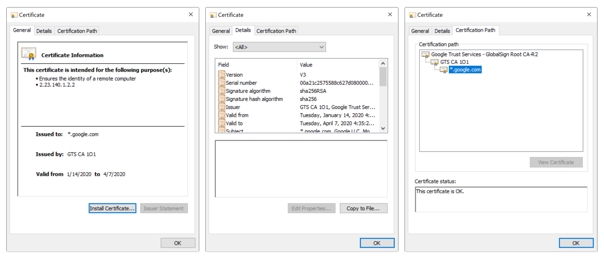

# ความหมาย

> X.509 Certificate ([RFC5280](https://tools.ietf.org/html/rfc5280)) เป็น Digital Certificate รูปแบบหนึ่ง ใช้สำหรับรับรองความถูกต้องของข้อมูล และ กุญแจสาธารณะ (Public Key) ของเจ้าของ Certificate ตามมาตรฐาน X.509 ปัจจุบันเป็น version 3

### หมายเหตุ
- X.509 Certificate มีชื่อเต็ม ๆ ว่า **Internet X.509 Public Key Infrastructure Certificate**
- มาตรฐาน [X.509](https://www.wikiwand.com/th/X.509) เป็นมาตรฐานที่ใช้สำหรับโครงสร้างพื้นฐานกุญแจสาธารณะ (PKI : Public Key Infrastructure)

ถ้าใครยังไม่รู้ว่า Public Key คืออะไร สามารถอ่านได้จากบทความนี้

- [Public Key / Private Key คืออะไร สร้างยังไง แล้วเอาไปใช้ทำอะไรได้บ้าง (ตัวอย่าง Code ภาษา Java)](/blog/what-is-public-key-private-key/)

# ทำไมต้องใช้ Certificate ในการรับรองความถูกต้องของข้อมูล 

จากกระบวนการ [PKI (Public Key Infrastructure)](/blog/public-key-infrastructure/?series=pki) ที่มีการใช้ `Public Key ของผู้รับ` ในการเข้ารหัส `Symmetric Key` ก่อนส่ง Symmetric Key กลับไปหาผู้รับนั้น 


เราจะเชื่อได้ยังไงว่า Public Key ที่เอามาใช้เข้ารหัส เป็นของผู้รับคนที่เราต้องการส่งข้อมูลกลับไปหาจริง ๆ 

### จากภาพ

เราไม่มีทางรู้เลยว่า ระหว่างที่มีการส่ง Public Key (ของนางสาว B) มาให้ (นาย A) นั้น จะมีการสับเปลี่ยน Public Key (ของนางสาว B) กลางทางรึเปล่า 

นาย A ได้แต่เชื่อและคาดหวังว่า Public Key ที่ระบบส่งมาให้ หรือมาจากนางสาว B จะเป็นของนางสาว B จริง ๆ

> จากปัญหาดังกล่าว เราสามารถแก้ได้ด้วยการใช้ X.509 Certificate มารับรองความถูกต้องของข้อมูล + Public Key ของนางสาว B 

### หมายเหตุ

ถ้าใครยังไม่แม่นเรื่อง Public Key Infrastructure สามารถทำความเข้าใจจากบทความนี้ได้ครับ 

- [โครงสร้างการเข้ารหัสข้อมูลแบบกุญแจสาธารณะ (Public Key Infrastructure)](/blog/public-key-infrastructure/?series=pki)

# X.509 Certificate รับรองความถูกต้องของข้อมูลได้ยังไง

โครงสร้างพื้นฐานของ X.509 Certificate มีหน้าตาประมาณนี้


ข้อมูลเบื้องต้น ประกอบไปด้วย

- ข้อมูลเจ้าของ Certificate (Subject)  
- ข้อมูลผู้ออก (รับรอง) Certificate (Issuer) 
- Public Key ของเจ้าของ Certificate
- ลายเซ็นต์ดิจิตอล (Signature) ของ Certificate ที่ถูก Sign โดยผู้ออก Certificate (Issuer)
- Algorithm ที่ใช้ในการ Sign Signature และ
- ข้อมูลอื่น ๆ ของ Certificate

X.509 Certificate ใช้วิธีการรับรองความถูกต้องของข้อมูล และ Public Key ของเจ้าของ Certificate โดยการตรวจสอบค่า `ลายเซ็นต์ดิจิตอล (Digital Signature)` ที่แปะอยู่ใน Certificate ว่ามีความถูกต้องหรือไม่ 
  
พร้อมทั้งมีการเช็คข้อมูลของผู้ออก Certificate (Issuer) ด้วยว่า ผู้ออก Certificate ใบนี้มีความน่าเชื่อถือ และได้รับการรับรองถูกต้องจริง ๆ  


### หมายเหตุ

ถ้าใครยังไม่เข้าใจกระบวนการทำงานของ Digital Signature สามารถอ่านได้จากบทความนี้ครับ  

- [กระบวนการทำลายเซ็นต์ดิจิตอล (Digital Signature Methodology)](/blog/digital-signature-methodology/)  

# X.509 Certificate Chain

อย่างที่อธิบายไว้ข้างต้นว่า การเช็คความถูกต้องของ X.509 Certificate เกิดจากการเช็คข้อมูลลายเซ็นต์ดิจิตอล (Digital Signature) บน Certificate บวกกับข้อมูลผู้ออก Certificate (Issuer)
   
ผู้ออก Certificate (Issuer) หรือเรียกอีกอย่างหนึ่งว่า **CA (Certification Authority)** ก็มี X.509 Certificate ของตัวเอง
   
การเช็คความถูกต้องของ CA (Issuer) ก็คือการเช็คความถูกต้องของ X.509 Certificate ที่ CA ถืออยู่ เหมือนกับการเช็ค X.509 Certificate ของเรา
   
และ X.509 Certificate ของ CA เองก็มี CA อีกชั้นนึงลงลายเซ็นต์ดิจิตอลให้อีก เป็นลำดับชั้นแบบนี้ไปเรื่อย ๆ ในลักษณะของลูกโซ่ หรือ Chaining

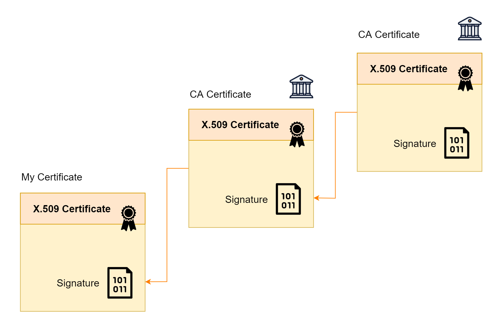

ตัวอย่าง X.509 Certificate ของ Google

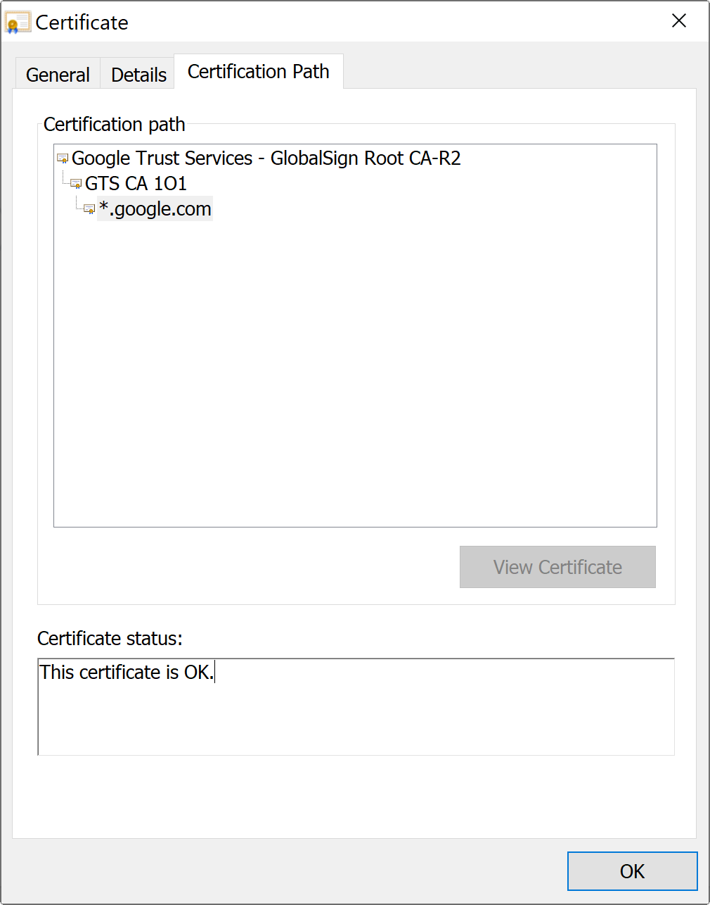

เราจะเห็นว่า X.509 Certificate ของ Google **(*.google.com)** ถูกรับรองโดย CA ชื่อ **GTS CA 1O1** และ CA **GTS CA 1O1** ก็ถูกรับรองอีกทีโดย CA ที่ชื่อว่า **Google Trust Services - GlobalSign Root CA-R2**
   
ถ้า X.509 Certificate ของ CA ที่ลงลายเซ็นต์ดิจิตอลให้เรา ได้รับการรับรองที่ถูกต้อง หรือ Trust   
X.509 Certificate ที่เราถืออยู่ ก็จะ Trust ตามไปด้วย 
  
แต่ถ้า X.509 Certificate ของ CA ที่ลงลายเซ็นต์ดิจิตอลให้เรา ยังไม่ Trust ก็จะทำการเช็ค X.509 Certificate ของ CA ที่อยู่เหนือขึ้นไป จนกว่าจะถึง X.509 Certificate ของ CA ชั้นบนสุด หรือ **Root CA**
   
ถ้า X.509 Certificate ของ Root CA Trust แล้ว X.509 Certificate ชั้นด้านล่าง ก็จะ Trust ตามไปด้วย

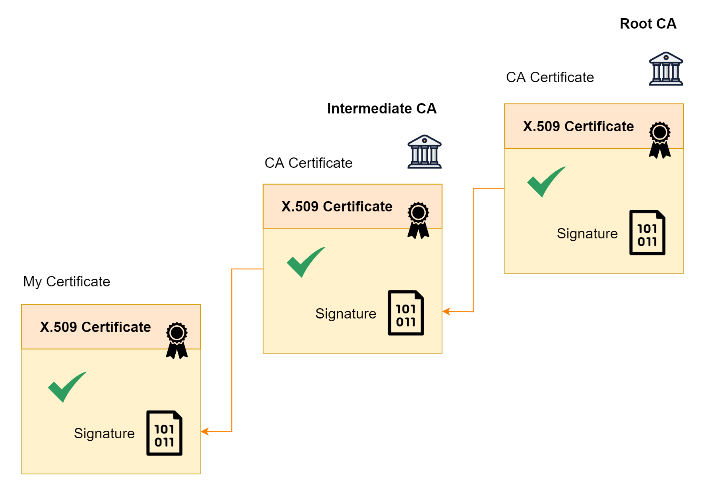

ในอุปกรณ์อิเล็กทรอนิกส์ต่าง ๆ หรือเครื่องคอมพิวเตอร์ที่เราใช้งานอยู่ มักจะมี X.509 Certificate ของ Root CA ต่าง ๆ Install อยู่   
  
ถ้าผู้ออก Certificate ให้เรา (Issuer) ได้รับการรับรองจาก Root CA นี้ X.509 Certificate ของเราก็จะได้รับความน่าเชื่อถือตามไปด้วย  

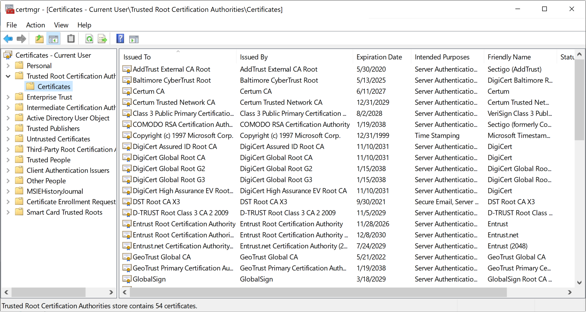

### การดูข้อมูล Trusted Root Certification Authorities

- **ระบบปฏิบัติการ Windows** ให้ Search ด้วย keyword `mmc` ที่ Windows Taskbar จากนั้นเลือกเมนู File > Add or Remove Snap-ins > Certificates > Add > My user account > Finish > OK

# X.509 Certificate นำไปใช้กับอะไรบ้าง

ทุกคนน่าจะคุ้นเคยกับ `https` ซึ่งเป็น Protocol ที่ใช้ในการแลกเปลี่ยนข้อมูลสำหรับ Website ซึ่งมีความปลอดภัยกว่าการใช้ http ธรรมดา ๆ 
  
X.509 Certificate คือ Certificate ที่ใช้สำหรับการทำ `https`  

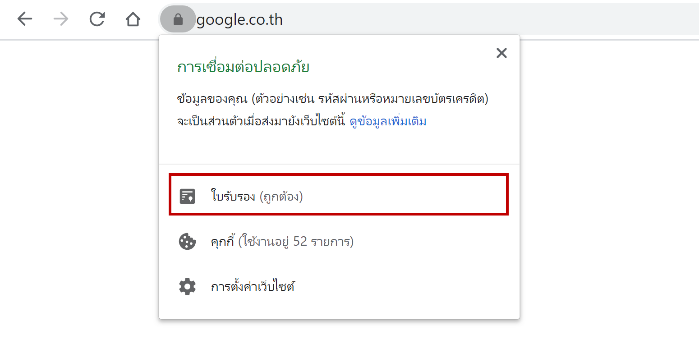

ใช้สำหรับ `รับรองความถูกต้องของ Server ปลายทาง` ที่ Browser หรือ Application ต้องการที่จะแลกเปลี่ยนข้อมูลด้วย ว่ามีความถูกต้อง เชื่อถือได้  
  
บางครั้งเราจะเรียก Certificate ที่ใช้งานในลักษณะนี้ว่า **SSL Certificate**  

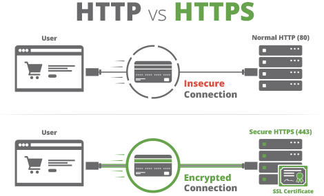

### หมายเหตุ

สามารถอ่านบทความเกี่ยวกับ https ได้จาก

- [HTTPS คืออะไร ทำงานอย่างไร](/blog/what-is-https/)
- [อธิบายการทำงานของ HTTPS และเทคโนโลยีที่เกี่ยวข้อง แบบพยายามไม่ให้งง](https://rath.asia/2017/02/https-and-related-technology-explained/)

นอกจากจะใช้ทำ https แล้ว เรายังสามารถนำ X.509 Certificate ไปใช้ทำอย่างอื่นได้อีก เช่น 
- การรับรองความถูกต้องข้อมูล ของบุคคลธรรมดา 
- การรับรองความถูกต้องข้อมูล ของนิติบุคคล
- การทำลายเซ็นต์ดิจิตอล (Digital Signature) บนเอกสารอิเล็กทรอนิกส์ต่าง ๆ 
- และ อื่น ๆ  
  
ตัวอย่างการใช้ X.509 Certificate ในการทำลายเซ็นต์ดิจิตอลบน pdf เพื่อรับรองข้อมูลผู้ลงลายเซ็นต์ (Sign) ใน pdf ฉบับนี้

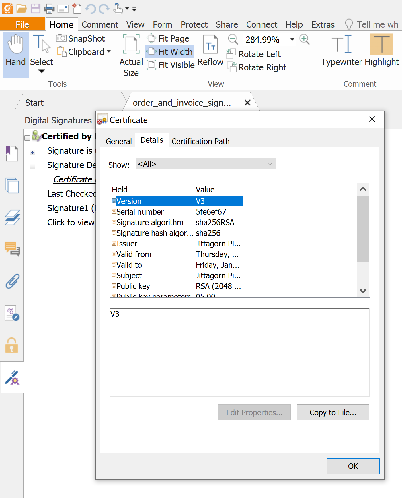

# X.509 Certificate ได้มายังไง

X.509 Certificate ถูกออกโดยหน่วยงานที่เรียกว่า **CA  (Certification Authority)** หรือ เรียกเป็นภาษาไทยว่า `ผู้ให้บริการออกใบรับรองอิเล็กทรอนิกส์` เป็นหน่วยงานที่ได้รับการรับรอง และมีความน่าชื่อถือ ทำหน้าที่เกี่ยวกับเรื่อง Digital Certificate โดยเฉพาะ ทั้ง
- การออก Certificate
- การต่ออายุ Certificate
- การสั่งเพิกถอน Certificate
- การให้บริการข้อมูลต่าง ๆ ของ Certificate เช่น 
    - การให้บริการตรวจสอบสถานะของ Certificate ด้วย **Online Certificate Status Protocol (OCSP)**
    - การให้บริการข้อมูลการเพิกถอน Certificate ด้วย **Certificate Revocation List (CRL)**
    - อื่น ๆ 

ซึ่งเราสามารถที่จะไปขอ X.509 Certificate จาก CA ต่าง ๆ ที่มีอยู่ได้

# X.509 Self-Signed Certificate

นอกจากการไปขอ X.509 Certificate จาก CA แล้ว เราสามารถที่จะสร้าง X.509 Certificate ขึ้นมาใช้งานเองได้ โดยการใช้เครื่องมือต่าง ๆ ที่มีอยู่ช่วย Gen ขึ้นมา เช่น [OpenSSL](https://wiki.openssl.org/index.php/Command_Line_Utilities) หรือ [Java Keytool](https://en.wikipedia.org/wiki/Java_KeyStore) เป็นต้น

> เราเรียก Certificate ที่ Gen ขึ้นมาเอง และรับรองเองแบบนี้ว่า **Self-Signed Certificate**

### หมายเหตุ

สามารถเรียนรู้การใช้ Java Keytool ในการ Gen X.509 Certificate ได้จากบทความนี้ 

- [ทำความรู้จักกับ Java Keytool](/blog/java-keytool/?series=java-security)
  
### เรื่องที่ต้องเข้าใจเกี่ยวกับ Self-Signed Certificate

การใช้งาน Self-Signed Certificate มีเรื่องที่ต้องทำความเข้าใจ คือ เมื่อเรานำ Self-Signed Certificate ไปใช้งานกับธุรกรรมต่าง ๆ บนอินเตอร์เน็ต Certificate ที่เรา Gen ขึ้นมาเองนั้น จะไม่ได้รับความน่าเชื่อถือ เหมือนกับการไปขอจาก CA ดังรูป 
   
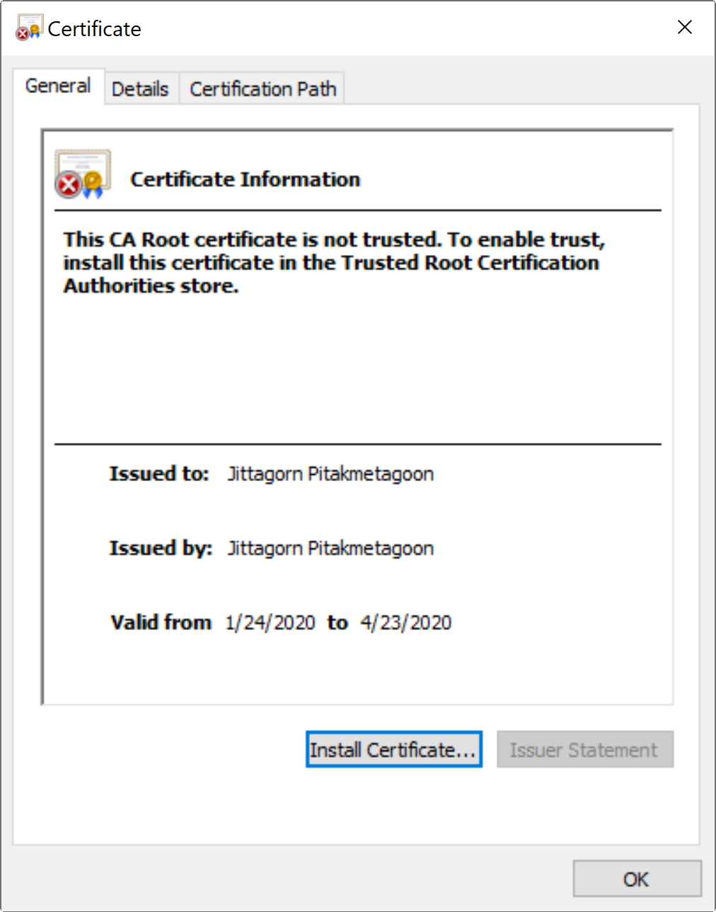

มีข้อความแจ้งเตือนว่า  

> This CA Root certificate not trusted. To enable trust, install this certificate in the Trusted Root Certification Authorities store.

สมมติ ว่าเรานำ Self-Signed Certificate ไปใช้งานกับ Web Server   
Browser จะมีการแจ้งเตือนว่า การเชื่อมต่ออาจไม่ปลอดภัย ดังรูป  

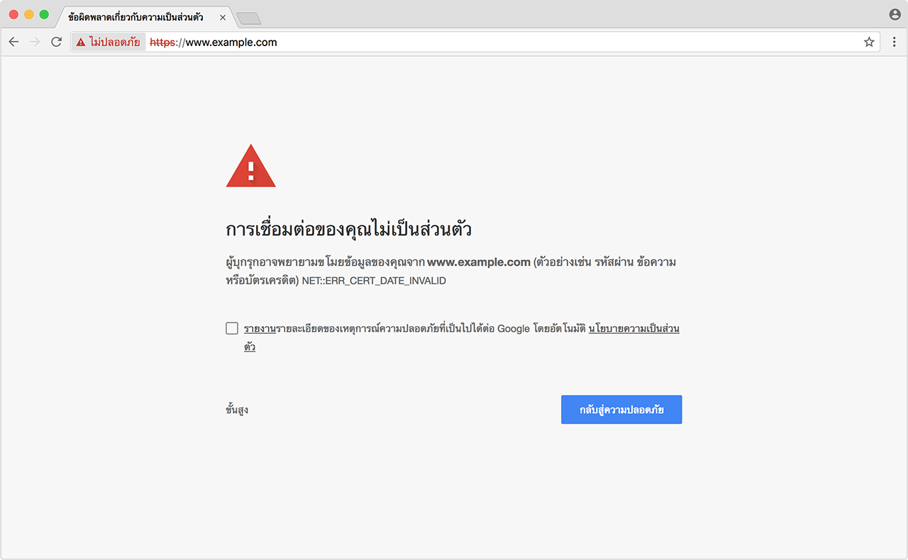

เราต้องยอมรับ/ไว้วางใจ (Trust) Certificate นั้นด้วยตัวเอง 

# โครงสร้าง หรือ Field ข้อมูลของ X.509 Certificate

ประกอบไปด้วย 

- **Type** คือ ประเภทของ Certificate เป็น X.509
- **Version** คือ เวอร์ชันของ Certificate ปัจจุบันเป็น V3  
- **Serial Number** คือ หมายเลขที่ใช้สำหรับระบุ Certificate ที่ CA (Certification Authority) นั้น ๆ ออกให้ มีค่าไม่ซ้ำกัน (คล้าย ๆ กับ Primary Key ของ Database Table)
- **Not Before** คือ วันเวลาเริ่มต้นที่ Certificate นั้นมีผล
- **Not After** คือ วันเวลาสิ้นสุดที่ Certificate นั้นมีผล
- **Public key** คือ กุญแจสาธารณะของเจ้าของ Certificate
- **Signature** คือ ลายเซ็นต์ดิจิตอลของ Certificate ที่ถูก Sign โดย CA (Issuer) ผู้ออก Certificate ใบนั้น
- **Algorithm** คือ Algorithm ที่ใช้ในการ Sign Signature ลงบน Certificate 
- **Issuer** คือ ข้อมูลผู้ออก Certificate หรือข้อมูล CA ว่า CA ไหนเป็นคนออกให้
   - **Distinguished Name (DN)** คือ ชื่อที่ใช้แสดงบน Certificate
   - อื่น ๆ
- **Subject** คือ ข้อมูลผู้ถือ Certificate หรือข้อมูลเจ้าของ Certificate ใบนั้น   
   - **Distinguished Name (DN)** คือ ชื่อที่ใช้แสดงบน Certificate
   - อื่น ๆ
- อื่น ๆ   

### Distinguished Name (DN) 

ประกอบไปด้วย

- **CN** (Common Name)
- **OU** (Organizational Unit)
- **O** (organization)
- **L** (City or Locality)
- **S** หรือ **ST** (State or Province) และ
- **C** (Two-Letter Country Code)

ตอนที่เราทำการ Gen Certificate หรือ Gen Certificate Signing Request (CSR) เพื่อเอาไปขอ Certificate จาก CA ต่อ มันจะให้เรากรอกข้อมูลพวกนี้เพื่อเอาไปแปะบน Certificate


ตัวอย่างข้อมูล DN

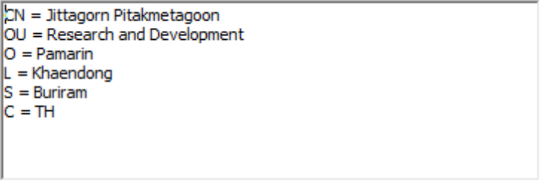  
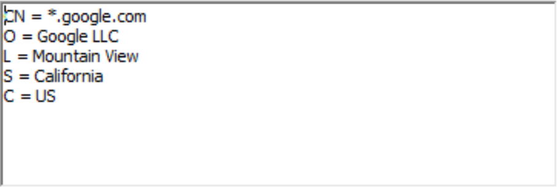  
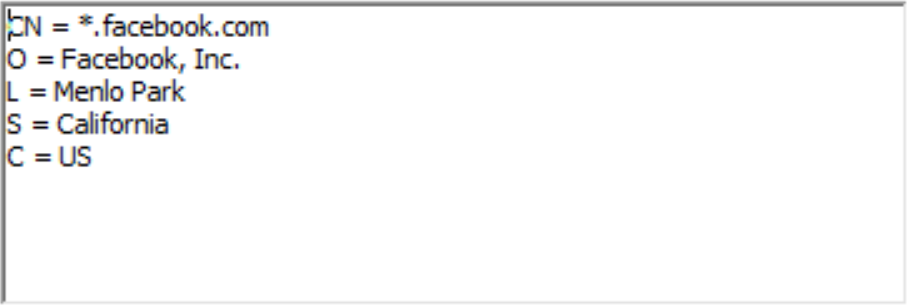  

# รูปแบบการจัดเก็บ X.509 Certificate

X.509 Certificate สามารถจัดเก็บไว้ได้หลายวิธี เช่น
- เก็บลงฐานข้อมูล (Database) เป็น Binary Data
- เก็บเป็นไฟล์ นามสกุล 
   - `.pem` ([Privacy-enhanced Electronic Mail](https://www.wikiwand.com/en/Privacy-enhanced_Electronic_Mail))
   - `.der` ([Distinguished Encoding Rules](https://www.wikiwand.com/en/X.690#/DER_encoding))
   - `.cer` ([Canonical Encoding Rules](https://www.wikiwand.com/en/X.690#/CER_encoding)) หรือ 
   - `.crt`  
- เก็บลง KeyStore (.ps12, .jks, etc.)
- อื่น ๆ

ตัวอย่างไฟล์ .cer ของ X.509 Certificate

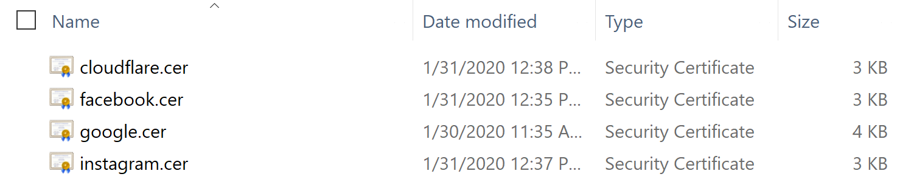

ถ้าเราลองเอาไฟล์ .cer มาเปิดดู จะพบว่าข้างในเป็น Base64 ที่เก็บข้อมูล Certificate ไว้ดังนี้

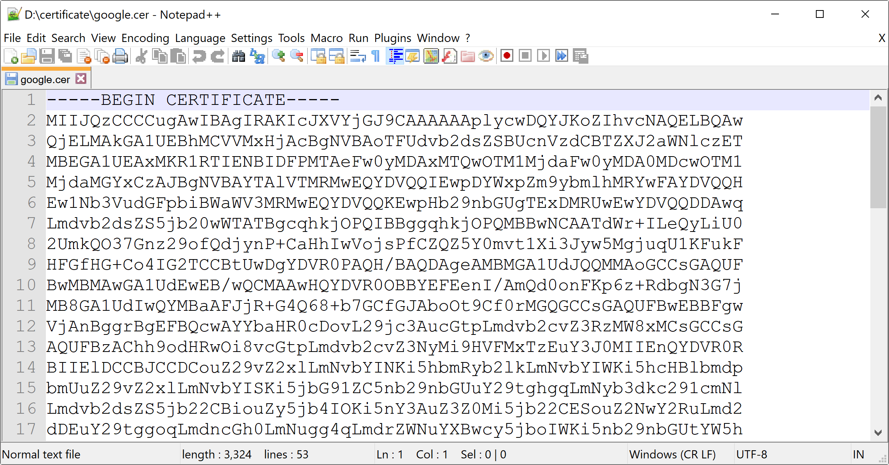

รูปแบบ Content File จะเป็น

```plaintext
-----BEGIN CERTIFICATE-----
MIIJQzCCCCugAwIBAgIRAKIcJXVYjGJ9CAAAAAAplycwDQYJKoZIhvcNAQELBQAw
QjELMAkGA1UEBhMCVVMxHjAcBgNVBAoTFUdvb2dsZSBUcnVzdCBTZXJ2aWNlczET
....
...
MVu83sJV3ww6XiSs4LL/31e+jKZ78Cc=
-----END CERTIFICATE-----
```

ถ้าเราลองเอา Base64 นี้ไป Decode ดู จะได้ค่าเป็นข้อมูล Certificate ประมาณนี้

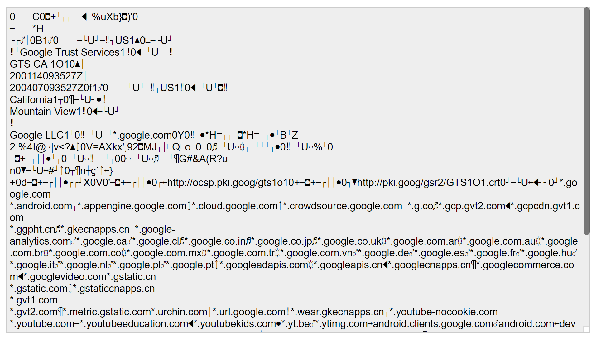

# ตัวอย่าง X.509 Certificate

- [google.cer](./google.cer)
- [faceook.cer](./faceook.cer)
- [instagram.cer](./instagram.cer)
- [cloudflare.cer](./cloudflare.cer)

สามารถกดดู และ Download Certificate ได้จาก Address Bar ของ Browser ตรงรูปกุญแจ


# ตัวอย่างการดึงข้อมูล ต่าง ๆ จาก X.509 Certificate ด้วยภาษา Java

```java
/*
 * Copyright 2020-Current jittagornp.me
 */
package me.jittagornp.learning.java.certificate;

import java.io.IOException;
import java.io.InputStream;
import java.math.BigInteger;
import java.security.Principal;
import java.security.PublicKey;
import java.security.cert.CertificateException;
import java.security.cert.CertificateFactory;
import java.security.cert.X509Certificate;
import java.util.Collection;
import java.util.Date;
import java.util.List;
import java.util.Set;
import javax.security.auth.x500.X500Principal;

/**
 * @author jittagornp
 */
public class X509CertificateLearning {

    public static void main(String[] args) throws CertificateException, IOException {

        try ( InputStream certificateInputStream = X509CertificateLearning.class.getResourceAsStream("/google.cer")) {
            
            final CertificateFactory certificateFactory = CertificateFactory.getInstance("X.509");
            final X509Certificate certificate = (X509Certificate) certificateFactory.generateCertificate(certificateInputStream);

            //basic info
            final String type = certificate.getType();
            final int version = certificate.getVersion();
            final BigInteger serialNumber = certificate.getSerialNumber();
            final Date notBefore = certificate.getNotBefore();
            final Date notAfter = certificate.getNotAfter();
            final byte[] encoded = certificate.getEncoded();
            final byte[] tbsCertificate = certificate.getTBSCertificate();

            //public key
            final PublicKey publicKey = certificate.getPublicKey();
            final String publicKeyAlgorithm = publicKey.getAlgorithm();
            final String publicKeyFormat = publicKey.getFormat();
            final byte[] publicKeyEncoded = publicKey.getEncoded();

            //signature
            final String sigAlgName = certificate.getSigAlgName();
            final String sigAlgOID = certificate.getSigAlgOID();
            final byte[] sigAlgParams = certificate.getSigAlgParams();
            final byte[] signature = certificate.getSignature();

            //issuer
            final Principal issuerDN = certificate.getIssuerDN();
            final boolean[] issuerUniqueID = certificate.getIssuerUniqueID();
            final X500Principal issuerX500Principal = certificate.getIssuerX500Principal();
            final byte[] issuerX500PrincipalEncoded = issuerX500Principal.getEncoded();
            final Collection<List<?>> issuerAlternativeNames = certificate.getIssuerAlternativeNames();

            //subject
            final Principal subjectDN = certificate.getSubjectDN();
            final boolean[] subjectUniqueID = certificate.getSubjectUniqueID();
            final X500Principal subjectX500Principal = certificate.getSubjectX500Principal();
            final Collection<List<?>> subjectAlternativeNames = certificate.getSubjectAlternativeNames();

            //key usage
            final boolean[] keyUsage = certificate.getKeyUsage();
            final List<String> extendedKeyUsage = certificate.getExtendedKeyUsage();

            //others
            final int basicConstraints = certificate.getBasicConstraints();
            final Set<String> criticalExtensionOIDs = certificate.getCriticalExtensionOIDs();
            final Set<String> nonCriticalExtensionOIDs = certificate.getNonCriticalExtensionOIDs();

            System.out.println("Basic");
            System.out.println("----------------------------------------------------");
            System.out.println("String type => " + type);
            System.out.println("int version => " + version);
            System.out.println("BigInteger serialNumber => " + serialNumber);
            System.out.println("Date notBefore => " + notBefore);
            System.out.println("Date notAfter => " + notAfter);
            System.out.println("byte[] encoded length => " + encoded.length);
            System.out.println("byte[] tbsCertificate length => " + tbsCertificate.length);
            System.out.println("");

            System.out.println("Public Key");
            System.out.println("----------------------------------------------------");
            System.out.println("String publicKey.algorithm => " + publicKeyAlgorithm);
            System.out.println("String publicKey.format => " + publicKeyFormat);
            System.out.println("byte[] publicKey.encoded length => " + publicKeyEncoded.length);
            System.out.println("");

            System.out.println("Signature");
            System.out.println("----------------------------------------------------");
            System.out.println("String sigAlgName => " + sigAlgName);
            System.out.println("String sigAlgOID => " + sigAlgOID);
            System.out.println("byte[] sigAlgParams => " + sigAlgParams);
            System.out.println("byte[] signature length => " + signature.length);
            System.out.println("");

            System.out.println("Issuer");
            System.out.println("----------------------------------------------------");
            System.out.println("Principal issuerDN => " + issuerDN);
            System.out.println("boolean[] issuerUniqueID => " + issuerUniqueID);
            System.out.println("X500Principal issuerX500Principal => " + issuerX500Principal);
            System.out.println("byte[] issuerX500Principal.encoded length => " + issuerX500PrincipalEncoded.length);
            System.out.println("Collection<List<?>> issuerAlternativeNames => " + issuerAlternativeNames);
            System.out.println("");

            System.out.println("Subject");
            System.out.println("----------------------------------------------------");
            System.out.println("Principal subjectDN => " + subjectDN);
            System.out.println("boolean[] subjectUniqueID => " + subjectUniqueID);
            System.out.println("X500Principal subjectX500Principal => " + subjectX500Principal);
            System.out.println("Collection<List<?>> subjectAlternativeNames => " + subjectAlternativeNames);
            System.out.println("");

            System.out.println("Key Usage");
            System.out.println("----------------------------------------------------");
            System.out.println("boolean[] keyUsage length => " + keyUsage.length);
            System.out.println("List<String> extendedKeyUsage => " + extendedKeyUsage);
            System.out.println("");

            System.out.println("Others");
            System.out.println("----------------------------------------------------");
            System.out.println("int basicConstraints => " + basicConstraints);
            System.out.println("Set<String> criticalExtensionOIDs => " + criticalExtensionOIDs);
            System.out.println("Set<String> nonCriticalExtensionOIDs => " + nonCriticalExtensionOIDs);

        }
    }

}
```
output
```plaintext
Basic
----------------------------------------------------
String type => X.509
int version => 3
BigInteger serialNumber => 215481079375450091442107987479044396839
Date notBefore => Tue Jan 14 16:35:27 ICT 2020
Date notAfter => Tue Apr 07 16:35:27 ICT 2020
byte[] encoded length => 2375
byte[] tbsCertificate length => 2095

Public Key
----------------------------------------------------
String publicKey.algorithm => EC
String publicKey.format => X.509
byte[] publicKey.encoded length => 91

Signature
----------------------------------------------------
String sigAlgName => SHA256withRSA
String sigAlgOID => 1.2.840.113549.1.1.11
byte[] sigAlgParams => null
byte[] signature length => 256

Issuer
----------------------------------------------------
Principal issuerDN => CN=GTS CA 1O1, O=Google Trust Services, C=US
boolean[] issuerUniqueID => null
X500Principal issuerX500Principal => CN=GTS CA 1O1, O=Google Trust Services, C=US
byte[] issuerX500Principal.encoded length => 68
Collection<List<?>> issuerAlternativeNames => null

Subject
----------------------------------------------------
Principal subjectDN => CN=*.google.com, O=Google LLC, L=Mountain View, ST=California, C=US
boolean[] subjectUniqueID => null
X500Principal subjectX500Principal => CN=*.google.com, O=Google LLC, L=Mountain View, ST=California, C=US
Collection<List<?>> subjectAlternativeNames => [[2, *.google.com], [2, *.android.com], [2, *.appengine.google.com], [2, *.cloud.google.com], [2, *.crowdsource.google.com], [2, *.g.co], [2, *.gcp.gvt2.com], [2, *.gcpcdn.gvt1.com], [2, *.ggpht.cn], [2, *.gkecnapps.cn], [2, *.google-analytics.com], [2, *.google.ca], [2, *.google.cl], [2, *.google.co.in], [2, *.google.co.jp], [2, *.google.co.uk], [2, *.google.com.ar], [2, *.google.com.au], [2, *.google.com.br], [2, *.google.com.co], [2, *.google.com.mx], [2, *.google.com.tr], [2, *.google.com.vn], [2, *.google.de], [2, *.google.es], [2, *.google.fr], [2, *.google.hu], [2, *.google.it], [2, *.google.nl], [2, *.google.pl], [2, *.google.pt], [2, *.googleadapis.com], [2, *.googleapis.cn], [2, *.googlecnapps.cn], [2, *.googlecommerce.com], [2, *.googlevideo.com], [2, *.gstatic.cn], [2, *.gstatic.com], [2, *.gstaticcnapps.cn], [2, *.gvt1.com], [2, *.gvt2.com], [2, *.metric.gstatic.com], [2, *.urchin.com], [2, *.url.google.com], [2, *.wear.gkecnapps.cn], [2, *.youtube-nocookie.com], [2, *.youtube.com], [2, *.youtubeeducation.com], [2, *.youtubekids.com], [2, *.yt.be], [2, *.ytimg.com], [2, android.clients.google.com], [2, android.com], [2, developer.android.google.cn], [2, developers.android.google.cn], [2, g.co], [2, ggpht.cn], [2, gkecnapps.cn], [2, goo.gl], [2, google-analytics.com], [2, google.com], [2, googlecnapps.cn], [2, googlecommerce.com], [2, source.android.google.cn], [2, urchin.com], [2, www.goo.gl], [2, youtu.be], [2, youtube.com], [2, youtubeeducation.com], [2, youtubekids.com], [2, yt.be]]

Key Usage
----------------------------------------------------
boolean[] keyUsage length => 9
List<String> extendedKeyUsage => [1.3.6.1.5.5.7.3.1]

Others
----------------------------------------------------
int basicConstraints => -1
Set<String> criticalExtensionOIDs => [2.5.29.15, 2.5.29.19]
Set<String> nonCriticalExtensionOIDs => [1.3.6.1.4.1.11129.2.4.2, 1.3.6.1.5.5.7.1.1, 2.5.29.14, 2.5.29.17, 2.5.29.31, 2.5.29.32, 2.5.29.35, 2.5.29.37]
```

# บทความอื่น ๆ

อันนี้เป็นบทความที่อธิบาย X.509 Certificate Chain ได้ดีมากครับ

- [Illustrated X.509 Certificate](https://medium.com/@darutk/illustrated-x-509-certificate-84aece2c5c2e)

# Reference

- [https://tools.ietf.org/html/rfc5280](https://tools.ietf.org/html/rfc5280)
- [https://www.wikiwand.com/en/X.509](https://www.wikiwand.com/en/X.509)
- [https://docs.oracle.com/javase/10/docs/api/javax/security/cert/X509Certificate.html](https://docs.oracle.com/javase/10/docs/api/javax/security/cert/X509Certificate.html)
